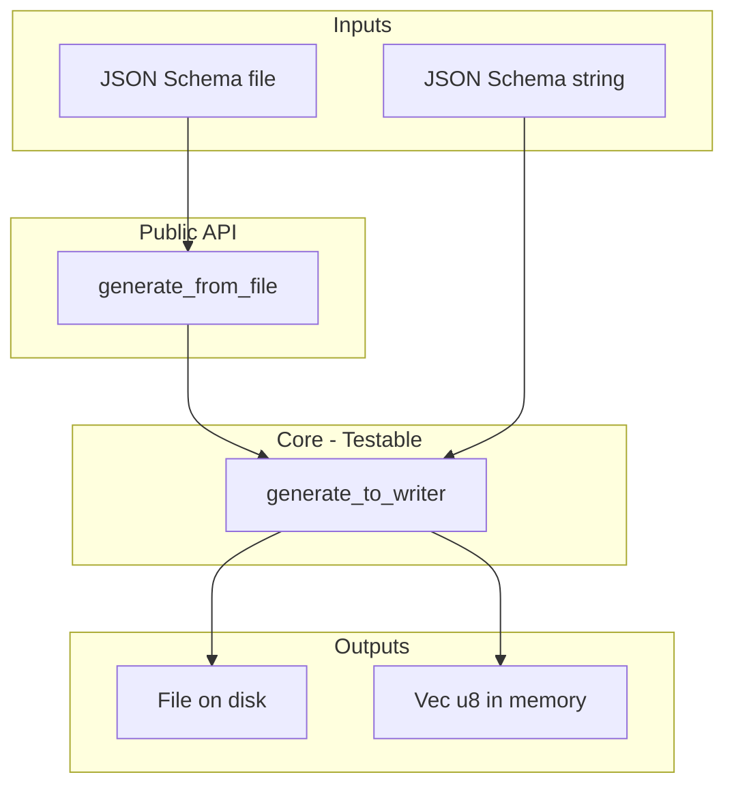

# json-schema-rs (contribution guide)

Supported and unsupported features are documented in the
[README](json-schema-rs/README.md). This skill focuses on **how to contribute**
to the crate.

## Purpose and Philosophy

The json-schema-rs crate has two goals:

1. **Generate Rust structs** from JSON Schema files (current)
2. **Validate data** against a JSON Schema file (future)

### Design Principles

- **Testability-first**: `generate_to_writer<W: Write>` is the core API. Tests
  use `Vec<u8>` or `Cursor<Vec<u8>>` without file I/O.
- **Deterministic output**: Uses `BTreeMap` for alphabetical struct and field
  ordering. Same input always produces same output.
- **Custom JSON Schema structs**: Only model fields needed for the PoC. Use
  serde deserialization with `#[serde(default)]` for optional fields.
- **Custom error enum**: `JsonSchemaGenError` with manual `Debug`, `Display`,
  `Error`, and `From` impls. Do not use thiserror.

## Architecture

For public API and feature set, see the [README](json-schema-rs/README.md).



- **`generate_to_writer`** is the single source of truth. `generate_from_file`
  is a thin wrapper that reads the schema file and calls `generate_to_writer`
  with a `File`.
- **schema.rs**: `JsonSchema` struct with `BTreeMap<String, Box<JsonSchema>>`
  for recursive properties, `r#enum: Option<Vec<serde_json::Value>>` for enum
  support.
- **codegen.rs**: `collect_structs` (recursive traversal), `emission_order`
  (topological sort for nested-first output), `emit_struct` (writes Rust code),
  `emit_enum` (writes Rust enums). Enums emitted first (alphabetically), then
  structs.
- **Naming**: Struct name from `title` if present and non-empty, else PascalCase
  of property key. Field sanitization: replace `-` with `_`. Add
  `#[serde(rename = "...")]` when Rust field name differs from JSON key.

### Code organization

| Module       | Responsibility                                                                                                                                  |
| ------------ | ----------------------------------------------------------------------------------------------------------------------------------------------- |
| `lib.rs`     | Public API: `generate_to_writer`, `generate_from_file`. Re-exports `JsonSchemaGenError`, `JsonSchema`.                                          |
| `schema.rs`  | Serde-deserializable JSON Schema types. Add new schema keywords here when extending support.                                                    |
| `codegen.rs` | Struct/enum collection, emission order (topological sort), and Rust code emission. Extend `collect_structs` and `emit_*` when adding new types. |
| `error.rs`   | `JsonSchemaGenError` enum and `From` impls. No thiserror.                                                                                       |
| `main.rs`    | CLI binary (`json-schema-gen`); reads input path, writes output path.                                                                           |

### Where to add new support

To support a new JSON Schema keyword or type:

1. **schema.rs**: Add fields to `JsonSchema` if the new keyword must be parsed.
   Use `#[serde(default)]` and `Option` so extra keys are ignored.
2. **codegen.rs**: In `collect_structs` (and helpers), handle the new
   type/keyword—e.g. match on the new `type` value or read the new field. If the
   new type produces new structs or enums, ensure they are collected and
   included in emission order. Extend `emit_struct` / `emit_enum` or add new
   `emit_*` functions if you introduce new output shapes.
3. **Tests**: Add or extend tests in `tests/integration-tests.rs` (inlined
   schema + expected output). **Always update**
   `tests/schemas/complex-schema.json` and
   `tests/schemas/complex-schema-expected.rs` so the file-based test covers the
   new behavior. Use full `assert_eq!(expected, actual)`; no partial checks.
4. **README example and examples directory**: Keep the README’s example (the
   JSON Schema and "Generated Rust" blocks) and the examples directory in sync.
   When adding a new feature, update **both** the README example and
   `examples/readme_example_schema.json` / `examples/readme_example.rs` to
   demonstrate it. The README example and the examples directory should stay
   consistent with each other and with supported features.

## Contribution Guidelines

### Testing

- **Inlined tests**: Most tests have input and expected output inlined in the
  test method (no file loading).
- **File-based test**: One test (complex schema) reads schema and expected
  output from files; generates actual output in memory; compares expected vs
  actual. **When implementing new features, always update the complex schema and
  its expected output** so the file-based test exercises the new behavior.
- **Unit tests**: Add `#[cfg(test)]` tests in codegen.rs (or other modules) for
  feature-specific logic where it makes sense.
- **Assertions**: Always compare full expected output against full actual
  output. Never use partial checks like `actual.contains(...)` or
  `!actual.contains(...)`—use `assert_eq!(expected, actual)` with complete
  expected strings.
- **Integration tests**: Tests live in `tests/integration-tests.rs` and use the
  public API.

### Code Conventions

- Run `make lint test` before completing any changes.
- Use `#[expect]` not `#[allow]` for Clippy overrides.
- Never fail silently; log errors internally (customer-facing message can
  differ).
- Follow existing patterns: custom Error enum, BTreeMap for ordering, explicit
  type annotations on all variables.

### Adding New JSON Schema Support

- Add fields to `JsonSchema` in schema.rs only when needed for the PoC.
- Use `#[serde(default)]` and `Option` so extra keys in the JSON are ignored.
- For unsupported types, ignore rather than fail (PoC behavior; future versions
  will hard-fail).

### Reference implementations

When implementing a new feature, **always check** how the **json_schema**,
**schemafy**, and **typify** Rust crates implement it (docs and/or source). Compare
our approach to theirs to see if our idea is better or worse; document the
choice in the skill (e.g. under a "learned" subsection) or in the PR. This
reduces duplicated design work and keeps the crate aligned with ecosystem
conventions where appropriate.

- **json_schema**: Schema representation and validation (not codegen). Use for
  how schema concepts are modeled (e.g. `SimpleTypes::Integer` vs `Number`).
- **schemafy**: JSON Schema → Rust codegen; simple fixed type mappings.
- **typify**: JSON Schema → Rust codegen; uses `minimum`/`maximum` for
  constraint-based integer type selection (u8, i32, etc.).

### Post-Feature Knowledge Capture

At the end of development for a new feature, add any knowledge learned during
that work session back to this skill. Examples: edge cases, design decisions,
pitfalls, or conventions that would help future contributors. This keeps the
skill up to date and reduces repeated discovery.

### Required vs Optional (learned)

- **`required`** is an array of property names at each object schema level. When
  absent, all properties are optional per JSON Schema spec. When `required: []`,
  all properties are optional.
- **File-based expected output**: `complex-schema-expected.rs` must end with a
  trailing newline to match `generate_to_writer` output (each struct ends with
  `writeln!(writer)?`).
- **Field ordering**: BTreeMap yields alphabetical order by property key (e.g.,
  `optional_field` before `required_field`).

### Enum support (learned)

- **`enum`** in JSON Schema: array of allowed values. Only string enums
  supported; non-string values fall back to `String`.
- **Variant naming**: `to_rust_variant_name` produces PascalCase (first char
  uppercase, rest lowercase per word). Invalid identifiers (e.g., `"123"`) get
  `E` prefix.
- **Collision handling**: When multiple JSON values map to same Rust variant
  name (e.g., `"PENDING"`, `"pending"`, `"Pending"` all -> `Pending`), append
  `_0`, `_1`, `_2` to **all** colliding variants.
- **Determinism**: Sort enum values alphabetically before processing. Ensures
  `["markdown", "plain"]` and `["plain", "markdown"]` produce identical output.
- **Deduplication**: Duplicate JSON values (e.g., `["a", "a"]`) deduplicated to
  one variant.
- **Raw string literals in tests**: Use `r#"..."#` not `r"..."` when expected
  output contains `]"` (e.g., `#[serde(rename = "x")]`) to avoid Rust parsing
  the `]"` as end of string.

### Numbers (learned)

- **Mapping**: We use fixed `integer` → `i64`, `number` → `f64` (like schemafy).
  Typify uses `minimum`/`maximum` to choose smaller integral types (u8, i32,
  etc.); we do not parse number constraints for this PoC.
- **Arrays**: `resolve_array_item_type` returns `"i64"` / `"f64"` for
  `items.type` of `integer` / `number`.

### Default support (learned)

- **Schema model**: Use `DefaultKeyword` (Absent | Present(Value)) in schema.rs
  to preserve JSON `null`. Serde deserializes `Option<Value>` with null as
  `None`, losing the distinction between absent key and `"default": null`.
- **Two strategies**: `UseTypeDefault` → `#[serde(default)]` when the schema
  value equals the type's Default (false, 0, 0.0, "", [], null for optional).
  `Custom { fn_name, rust_expr }` → generated function + `#[serde(default =
  "fn")]` for literal defaults.
- **Optional + null**: For optional fields with `default: null`, use
  `#[serde(default)]` so missing key yields `None`.
- **Emission order**: Enums first, then default functions (they may reference
  enums), then structs.
- **Custom default function**: Returns `Some(expr)` for optional fields,
  `expr` for required. Must be emitted before the struct that uses it.
- **Out of scope**: Object defaults, non-empty array defaults.

### Description support (learned)

- **Normalization**: Empty or whitespace-only `description` is treated as
  absent; use `normalize_description()` so we do not emit blank `///` lines.
- **Multi-line**: Emit one `///` line per line of text via
  `description.trim().lines()`. Field doc comments use a 4-space prefix
  (`emit_doc_comment(..., "    ")`) so they align with the field line.
- **Placement**: Object schema `description` → struct doc; enum schema
  `description` → enum doc; property schema `description` → field doc (same
  schema used for the property, including nested object descriptions on the
  field that references that object).

## CLI and Makefile (for contributors)

Use these to run the generator locally when testing changes.

### Binary

- **Name**: `json-schema-gen`
- **Usage**: `./target/release/json-schema-gen <input_path> <output_path>`
- **Args**: Input path to JSON Schema file, output path for generated Rust file.

### Makefile Target

```bash
make json_schema_gen input=<path-to-json-schema> output=<path-to-rust-output>
```

- Requires both `input` and `output` variables. Fails with usage help if either
  is missing.
- Builds in release mode.
- Runs the binary with the provided paths after building.

**Example:**

```bash
make json_schema_gen input=json-schema-rs/tests/schemas/complex-schema.json output=output.rs
```

## Key Files

| File                                                      | Purpose                                                                   |
| --------------------------------------------------------- | ------------------------------------------------------------------------- |
| `json-schema-rs/src/lib.rs`                               | Public API: `generate_to_writer`, `generate_from_file`                    |
| `json-schema-rs/src/codegen.rs`                           | Struct collection, emission order, code generation                        |
| `json-schema-rs/src/schema.rs`                            | Custom JSON Schema structs (serde-deserializable)                         |
| `json-schema-rs/src/error.rs`                             | `JsonSchemaGenError` enum                                                 |
| `json-schema-rs/src/main.rs`                              | CLI binary                                                                |
| `json-schema-rs/tests/integration-tests.rs`               | Integration tests                                                         |
| `json-schema-rs/tests/schemas/complex-schema.json`        | File-based test input; update when adding features                        |
| `json-schema-rs/tests/schemas/complex-schema-expected.rs` | File-based test expected output; update when adding features              |
| `json-schema-rs/examples/readme_example_schema.json`      | Example schema; keep in sync with README example and readme_example.rs    |
| `json-schema-rs/examples/readme_example.rs`               | Example binary (inlined schema); keep in sync with README and schema file |
