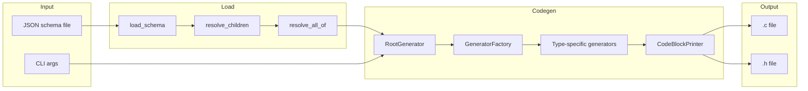
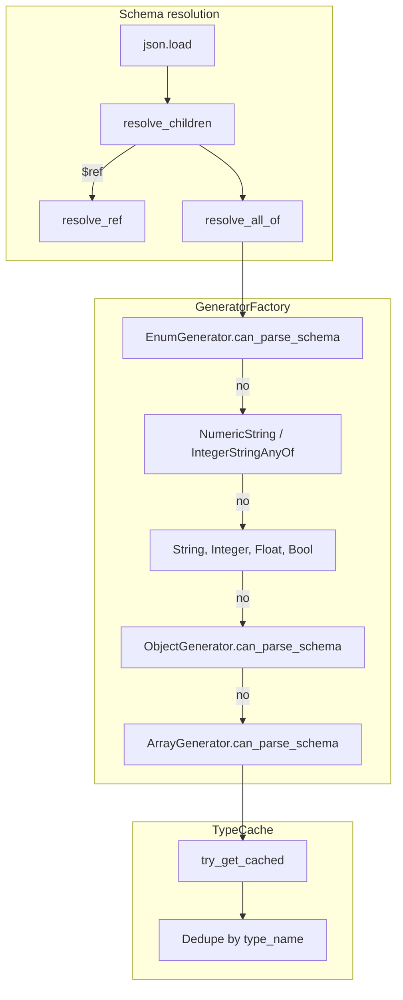

# json_schema_to_c — Research report

## Metadata

- **Library name**: json_schema_to_c
- **Repo URL**: https://github.com/badicsalex/json_schema_to_c
- **Clone path**: `research/repos/c/badicsalex-json_schema_to_c/`
- **Language**: C (output); generator implemented in Python
- **License**: MIT

## Summary

json_schema_to_c is a JSON Schema to C code generator. It takes a JSON Schema and emits a single self-contained .c file and .h interface file. The generated code parses JSON at runtime into C structs and arrays, with no dynamic allocations and no external dependencies beyond a vendored JSMN tokenizer. It targets embedded systems and small platforms. The generator is a Python CLI (`json_schema_to_c.py`). Supported schema features include: types (`integer`, `number`, `boolean`, `string`, `array`, `object`), min/max length and value constraints, in-document `$ref`, `allOf` merge, `required`, `additionalProperties: true`, and default values. Key limitations: strings and arrays must have `maxLength`/`maxItems`; all object fields must be required or have defaults; `null` and tuple-style arrays are not supported; only path-like `$ref` (e.g. `#/definitions/...`) is supported.

## JSON Schema support

- **Drafts**: README and CLI help state "Schema version 7 is supported." Example and test schemas use `$schema: "http://json-schema.org/draft-07/schema#"`. No explicit support for draft-04, 2019-09, or 2020-12.
- **Scope**: Partial subset focused on structure and bounded types. Core types, `properties`, `required`, `items` (single schema), `$ref`, `allOf`, `definitions`, `additionalProperties`, `default`, validation keywords (`minLength`, `maxLength`, `minItems`, `maxItems`, `minimum`, `maximum`, etc.) are used for structure and runtime checks. Not supported: `null`, `oneOf`, `anyOf` (except a special `integer|string` case), `not`, `if`/`then`/`else`, `patternProperties`, `prefixItems`, `format`, external `$ref`, and most advanced applicator/validation keywords.

## Keyword support table

Keyword list derived from vendored draft 2020-12 meta-schemas under `specs/json-schema.org/draft/2020-12/meta/`. The library targets draft-07; notes reflect actual implementation in `js2c/` and `js2c/schema.py`.

| Keyword | Implemented | Notes |
|---------|-------------|-------|
| $anchor | no | Not used. |
| $comment | no | Ignored. |
| $defs | partial | Uses `definitions` (draft-07) as `$ref` targets; resolved before codegen. |
| $dynamicAnchor | no | Not used. |
| $dynamicRef | no | Not used. |
| $id | yes | Required on root schema; used for root type name and `$ref` base. |
| $ref | yes | In-document path-like only (`#/definitions/...`); resolved inline by `resolve_ref`. |
| $schema | no | Parsed but not used for codegen. |
| $vocabulary | no | Not used. |
| additionalProperties | yes | `true` allowed with `--allow-additional-properties`; `false` denies unknown keys. |
| allOf | yes | Merged via `resolve_all_of` before codegen; combined with `$ref`. |
| anyOf | partial | Special case: `anyOf` with `integer` and `string` for numeric strings. |
| const | no | Not used. |
| contains | no | Not used. |
| contentEncoding | no | Not used. |
| contentMediaType | no | Not used. |
| contentSchema | no | Not used. |
| default | yes | Supported for integer, number, boolean, string, enum; implicit for object (all defaults) and array (`minItems: 0`). |
| dependentRequired | no | Not used. |
| dependentSchemas | no | Not used. |
| deprecated | no | Not used. |
| description | yes | Emitted as docstrings in generated C. |
| else | no | Not used. |
| enum | yes | String enums only; C enum with sanitized labels. |
| examples | no | Not used. |
| exclusiveMaximum | yes | Enforced in integer/float parser. |
| exclusiveMinimum | yes | Enforced in integer/float parser. |
| format | no | Not used. |
| if | no | Not used. |
| items | yes | Single schema only; tuple (array of schemas) rejected. |
| maxContains | no | Not used. |
| maximum | yes | Integer/float; enforced at parse time; used for unsigned choice. |
| maxItems | yes | Required for arrays; drives fixed-size C array. |
| maxLength | yes | Required for strings; drives char array size. |
| maxProperties | no | Not used. |
| minContains | no | Not used. |
| minimum | yes | Integer/float; enforced at parse time; used for unsigned choice. |
| minItems | yes | Enforced at parse time; `0` gives implicit default (empty array). |
| minLength | yes | Enforced for strings. |
| minProperties | no | Not used. |
| multipleOf | no | Not used. |
| not | no | Not used. |
| oneOf | no | Not used. |
| pattern | partial | Used only for numeric-string variant (specific patterns for radix). |
| patternProperties | no | Not used. |
| prefixItems | no | Not used. |
| properties | yes | Required for objects; drives struct fields. |
| propertyNames | no | Not used. |
| readOnly | no | Not used. |
| required | yes | Drives which fields must be present; non-required must have default. |
| then | no | Not used. |
| title | no | Not used for codegen (only `$id` / description). |
| type | yes | `object`, `array`, `string`, `integer`, `number`, `boolean`; drives generator choice. |
| unevaluatedItems | no | Not used. |
| unevaluatedProperties | no | Not used. |
| uniqueItems | no | Not used. |
| writeOnly | no | Not used. |

## Constraints

Validation keywords are enforced in the generated C parser at runtime. `minLength`, `maxLength` for strings and `minItems`, `maxItems` for arrays produce parse errors when violated. `minimum`, `maximum`, `exclusiveMinimum`, `exclusiveMaximum` for integer and number trigger range checks during parsing; on failure, the parser returns an error. Structural keywords (`properties`, `required`, `items`) drive the generated struct layout and parsing logic. The generated code does not use a separate validation step; parsing and constraint checking are combined.

## High-level architecture

Pipeline: **JSON Schema file** → **Load and resolve** → **Generator factory** → **Type-specific generators** → **CodeBlockPrinter** → **.c and .h files**.

- **Input**: JSON schema file path; optional CLI args (prefix/postfix files, `allow_additional_properties`, etc.).
- **Load**: `load_schema` reads JSON, `resolve_children` inlines `$ref` nodes, `resolve_all_of` merges `allOf` schemas.
- **Root generator**: `RootGenerator` gets a generator from `GeneratorFactory.get_generator_for` for the root schema. `GeneratorFactory` tries `EnumGenerator`, `NumericStringGenerator`, `IntegerStringAnyOfGenerator`, `StringGenerator`, `IntegerGenerator`, `FloatGenerator`, `BoolGenerator`, `ObjectGenerator`, `ArrayGenerator` in order.
- **Code emission**: Each generator produces type declarations and parser bodies; `RootGenerator` assembles header and implementation, including JSMN and builtins.
- **Output**: Single .c file and .h file; caller specifies paths.

## Medium-level architecture

- **Modules**: `js2c/schema.py` (load, `$ref`, `allOf`), `js2c/settings.py` (CLI/schema settings), `js2c/codegen/` (generators, type cache, printer). Entry point: `json_schema_to_c.py`.
- **Schema resolution**: `resolve_ref` handles only `#/...`-style refs. It splits the path (e.g. `definitions/object_type`), walks the root schema, and returns the target schema. The caller replaces the `$ref` node in-place. `resolve_children` recurses and replaces every `$ref` before codegen. `definitions` (draft-07) is used as the container; `$defs` (2020-12) is not explicitly supported.
- **allOf merge**: `resolve_all_of` recursively merges `allOf` entries into a single schema via `all_of_merge_dict`; object keys are merged, scalar conflicts raise.
- **Generator dispatch**: `GeneratorFactory.get_generator_for` iterates over generator classes; the first whose `can_parse_schema(schema)` returns true is used. Type-specific generators (Object, Array, etc.) recursively call `get_generator_for` for nested schemas.
- **Type cache**: `TypeCache` deduplicates `CType` by `type_name`; identical shapes sharing a name reuse the same declaration.
- **Writer model**: `CodeBlockPrinter` wraps a file handle and provides `print`, `code_block`, `if_block`, etc., for structured C output.

## Low-level details

- **JSMN**: Vendored in `jsmn/`; tokenizer-only, no dynamic allocation. Generated code parses token-by-token.
- **Builtins**: `js2c_builtins.h` provides `builtin_parse_json_string`, `builtin_parse_string`, `builtin_parse_double`, `builtin_parse_bool`, `builtin_parse_signed`/`builtin_parse_unsigned`, `builtin_skip`, etc. Inlined into generated .c unless `include_external_builtins_file` is set.
- **Extensions**: `js2cDefault` (C expression for default), `js2cType` and `js2cParseFunction` (custom string parsing), `js2cSettings` (schema-level CLI overrides), `convertLabelsToSnakeCase` (enum label conversion).
- **C identifier sanitization**: Enum labels sanitized via `SANITIZE_RE`; property names must be valid C tokens (README).

## Output and integration

- **Vendored vs build-dir**: Output files are written to paths specified by the user (CLI args). No built-in vendoring; typical use is to generate into a build directory or commit generated files.
- **API vs CLI**: CLI only. `json_schema_to_c.py schema.json parser.c parser.h`; no library API for embedding in other tools.
- **Writer model**: File-only. `argparse.FileType('w')` for output files; `CodeBlockPrinter` wraps the file object. No generic `Write` or string buffer abstraction.

## Configuration

- **CLI**: `--h-prefix-file`, `--h-postfix-file`, `--c-prefix-file`, `--c-postfix-file` (include user code); `--allow-additional-properties` (token count for extra keys); `--include-external-builtins-file` (path to builtins instead of inlining).
- **Schema**: `js2cSettings` at root accepts same options in snake_case or camelCase; schema settings override CLI. `js2cDefault`, `js2cType`, `js2cParseFunction`, `convertLabelsToSnakeCase` on fields.
- **Naming**: Root type from `$id`; nested types from `$id` if present, else derived (e.g. `type_name_fieldname_t`). Enum labels: prefix from type name, optional snake_case conversion.

## Pros/cons

- **Pros**: Zero runtime dependencies; no dynamic allocation; single-file output; embedded-friendly; supports `$ref`, `allOf`, defaults, bounded arrays/strings; validation constraints enforced at parse time; extensible via prefix/postfix and custom parsers.
- **Cons**: Strict schema requirements (maxLength/maxItems mandatory, all fields required or defaulted); no `null`, tuples, or external `$ref`; limited `anyOf`; property names must be C identifiers; Python 3 required for generator.

## Testability

- **Tests**: `make check` runs `make -C tests all`. Tests live under `tests/`; each `*.schema.json` is compiled to `*.parser.c` and `*.parser.h`, then linked with `*.c` and run. Schema error tests (`schema_error/*.json`) expect generation to fail with a specific error message.
- **Fixtures**: Test schemas cover types (object, array, string, integer, float, bool, enum), refs, allOf, defaults, additionalProperties, custom parsers, prefix/postfix, C++ compilation. No JSON Schema Test Suite integration.
- **Quality**: `pylint_check` and `pep8_check` run before tests.

## Performance

No built-in benchmarks. The generator is a Python script; run time is dominated by schema parsing and string output. Generated C parsers use JSMN; performance depends on input size and schema complexity. Entry points: `json_schema_to_c.py schema.json out.c out.h` for generation; compiled binary for parsing.

## Determinism and idempotency

The generator walks schema structures in deterministic order (`OrderedDict` for JSON, `GeneratorFactory` order for dispatch). Type declarations and parser bodies are emitted in a fixed traversal order. No randomization or timestamps in output. Repeated runs with the same schema and settings should produce identical .c and .h files. Property iteration order follows `schema['properties']` (JSON object order preserved by `object_pairs_hook=OrderedDict`).

## Enum handling

- **Duplicate entries**: Enum values are iterated as-is. Duplicates (e.g. `["a", "a"]`) would produce duplicate C enum identifiers after `convert_enum_label`, leading to a C compilation error. No deduplication.
- **Namespace/case collisions**: With `convertLabelsToSnakeCase` (default), labels are uppercased and snake-cased. Values `"a"` and `"A"` would both map to the same identifier (e.g. `THE_ENUM_A`), causing a collision. With `convertLabelsToSnakeCase: false`, original casing is preserved after sanitization, so `"a"` and `"A"` can remain distinct if the sanitizer produces different tokens. The library does not explicitly handle case collisions.

## Reverse generation (Schema from types)

No. The tool generates C code from JSON Schema only. There is no facility to produce JSON Schema from C structs or types.

## Multi-language output

C only. The generated code is C (compatible with C++ via `extern "C"` when compiled as .cpp). The tests include a `cpp` target that compiles the same generated code with a C++ compiler; the output language is still C. No TypeScript, Go, or other targets.

## Model deduplication and $ref/$defs

- **$ref/$defs**: `$ref` nodes are resolved inline before codegen; the schema tree is mutated so that references are replaced by the target schema. `definitions` (draft-07) holds the targets. Each unique type shape produces a `CType`; `TypeCache` deduplicates by `type_name`.
- **Deduplication**: `TypeCache.try_get_cached` uses `type_name` as the key. Two structurally identical types with the same name (e.g. from `$ref` to the same definition) share one declaration. Structurally identical types with different names (e.g. two inline objects) produce separate types; there is no structural deduplication. `$ref` to the same definition yields one generated type reused at each reference site.

## Validation (schema + JSON → errors)

The generated C code parses JSON and reports errors when constraints are violated (wrong type, range, length, missing required field, unknown field when `additionalProperties: false`, etc.). Errors are logged via `LOG_ERROR` (macros/configurable in prefix). The tool does not provide a separate validation API; parsing and validation are fused. Success is indicated by the parse function returning `false` (no error); errors cause `true` (error) and an early return. The generator itself does not validate JSON instances; it only generates parsers that validate at runtime.
