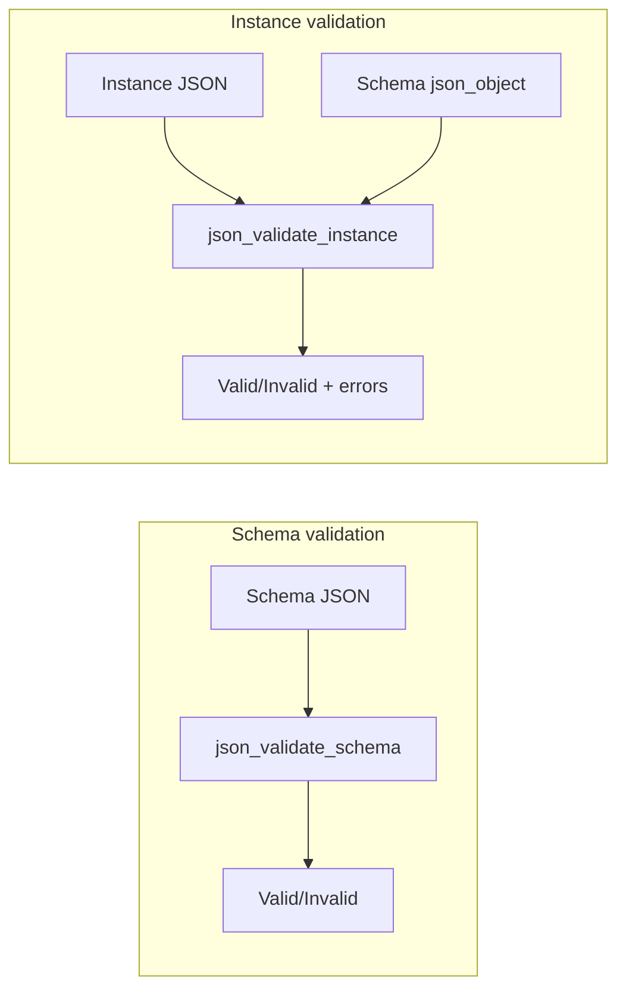
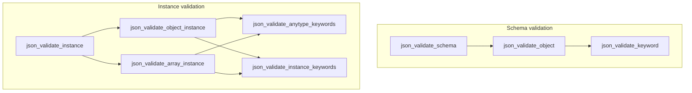

# jsonschema-c — Research report

## Metadata

- **Library name**: jsonschema-c
- **Repo URL**: https://github.com/helmut-jacob/jsonschema-c
- **Clone path**: `research/repos/c/helmut-jacob-jsonschema-c/`
- **Language**: C
- **License**: MIT (copyright 2015 Amine Aouled Hamed, Ocedo GmbH)

## Summary

jsonschema-c is a JSON Schema validation library for C. It does not generate code; it validates JSON at runtime. It has two components: (1) a schema validator that checks whether a schema conforms to the JSON Schema V4 (draft-04) specification, and (2) an instance validator that validates a JSON instance against a given schema. The library is built on json-c and uses standard C with autotools. It supports most draft-04 validation keywords (numeric, string, array, object, applicator keywords) and format validation for schema structure. Format annotation is not enforced on instance values. The library is in testing phase per the README.

## JSON Schema support

- **Drafts**: JSON Schema V4 (draft-04) only. README and example schemas reference `$schema: "http://json-schema.org/draft-04/schema#"`.
- **Scope**: Validation only — schema validation and instance validation. No code generation. No `$ref` resolution for instance validation; definitions are validated as schema structure but not used for reference resolution.

## Keyword support table

Keyword list derived from vendored draft-04 meta-schema (`specs/json-schema.org/draft-04/schema.json`). The library targets draft-04; implementation evidence from `schema_validator.c`, `instance_validator.c`, and `schema_rules.txt`.

| Keyword | Implemented | Notes |
|---------|-------------|-------|
| $schema | yes | Schema validator accepts; not used for validation logic. |
| additionalItems | yes | Instance validation when `items` is array; rejects extra items when `additionalItems: false`. |
| additionalProperties | yes | Instance validation; rejects unknown properties when `false`; considers `properties` and `patternProperties`. |
| allOf | yes | Instance validation; instance must satisfy all sub-schemas. |
| anyOf | yes | Instance validation; instance must satisfy at least one sub-schema. |
| default | yes | Schema validation only; no restrictions on value. |
| definitions | partial | Schema validation: object with valid schemas. Instance validator does not resolve `$ref` to definitions. |
| dependencies | yes | Instance validation; property and schema dependencies supported. |
| description | yes | Schema validation; string type. |
| enum | yes | Instance validation; value must match one enum entry (JSON string comparison). |
| exclusiveMaximum | yes | Instance validation; requires `maximum`; strict comparison. |
| exclusiveMinimum | yes | Instance validation; requires `minimum`; strict comparison. |
| format | partial | Schema validation: known formats (date-time, email, hostname, ipv4, ipv6, uri). Instance validation: not enforced (utils.c: "TO BE DONE"). |
| id | yes | Schema validation; string type. |
| items | partial | Instance validation for single-schema `items` only; validates array elements. Tuple-style `items` (array of schemas): only `additionalItems` enforced, not per-index validation. |
| maximum | yes | Instance validation for numeric types. |
| maxItems | yes | Instance validation. |
| maxLength | yes | Instance validation for strings. |
| maxProperties | yes | Instance validation for objects. |
| minimum | yes | Instance validation for numeric types. |
| minItems | yes | Instance validation. |
| minLength | yes | Instance validation for strings. |
| minProperties | yes | Instance validation for objects. |
| multipleOf | yes | Instance validation for numeric types. |
| not | yes | Instance validation; instance must not satisfy the sub-schema. |
| oneOf | yes | Instance validation; instance must satisfy exactly one sub-schema. |
| pattern | yes | Instance validation; regex match via `regcomp`/`regexec`. |
| patternProperties | yes | Instance validation; property names matched by regex; used with `additionalProperties`. |
| properties | yes | Instance validation; property schemas looked up for each instance key. |
| required | yes | Instance validation; all listed properties must be present. |
| title | yes | Schema validation; string type. |
| type | yes | Schema and instance validation; seven primitive types; single type or array. |
| uniqueItems | yes | Instance validation when `uniqueItems: true`. |
| $ref | no | Not implemented; no reference resolution in instance validation. Defined in draft-04 hyper-schema. |

## Constraints

Validation keywords are enforced in the instance validator at runtime. Each keyword has a dedicated handler (e.g. `json_handle_multipleOf_keyword`, `json_handle_maximum_keyword`) or is processed in type-specific validators (`json_validate_numeric_keywords`, `json_validate_string_keywords`, `json_validate_array_keywords`, `json_validate_object_keywords`). Violations produce error codes (e.g. `json_multipleOf_error`, `json_maxLength_error`) stored via `json_add_error` and reported with key, object position, and message. Schema validator enforces keyword structure (type, parent type, dependencies, allowed values) per `json_keywords_constraints`.

## High-level architecture

Pipeline: **Schema JSON** → **Schema validator** (valid/invalid); **Instance JSON + Schema JSON** → **Instance validator** (valid/invalid + error list).

- **Schema validator**: Loads schema (file or `json_object`), walks schema object recursively, validates each keyword via `json_validate_keyword`. No intermediate representation; validation is direct.
- **Instance validator**: Validates schema first, then validates instance. Dispatches by root type (object or array), then by property/element type. Uses `jsonschema_object` (key, instance, instance_schema, object_pos) to pass context through recursion.

## Medium-level architecture

- **Modules**: `schema_validator.c` / `schema_validator.h` (schema validation, keyword enum, constraints), `instance_validator.c` / `instance_validator.h` (instance validation), `utils.c` / `utils.h` (error reporting, colored output, sort helper).
- **Schema validation**: `json_validate_schema` → `json_validate_object` → `json_validate_keyword` for each key. `json_validate_keyword` checks keyword identity (`json_is_keyword`), parent type, value type, dependencies (`json_check_dependencies`), and allowed values (`json_check_allowed_values`). Keywords defined in `json_keywords_char` and `json_keywords_constraints`.
- **Instance validation**: `json_validate_instance` validates schema, then dispatches by root type. For objects: `json_validate_object_instance` → `json_validate_object_keywords` (required, additionalProperties, etc.) and recursive validation of each property. For arrays: `json_validate_array_instance` → `json_validate_array_keywords` (additionalItems, minItems, maxItems, uniqueItems) and element validation when `items` is object. Type-specific keyword validation via `json_validate_instance_keywords` (numeric, string, array, object). Applicator keywords (allOf, anyOf, oneOf, not) use `json_get_instance_schema_from_Of_keywords` to temporarily substitute sub-schema and revalidate.
- **$ref / definitions**: Not implemented. Schema validator accepts `definitions` as an object of schemas. Instance validator does not resolve `$ref`; schemas with `$ref` would not work for instance validation.

## Low-level details

- **Keyword constraints**: `json_keywords_constraints[keyword][0..5]` encodes keyword name, allowed types, parent types, dependencies, allowed values, children allowed values. Used by `json_validate_keyword`.
- **Error reporting**: `json_add_error` stores errors in a static array; `json_error_messages` maps error codes to messages. Errors include key, object position, and message. `json_printf_colored` for terminal output.
- **Format regexes**: `json_format_regex` in schema_validator.c for date-time, email, hostname, ipv4, ipv6, uri. Used for schema validation of `format` keyword; not applied to instance values.

## Output and integration

- **N/A for codegen** — this is a validation-only library.
- **API**: Library API. Primary entry points: `json_validate_schema`, `json_validate_schema_from_file`, `json_validate_instance`, `json_validate_instance_from_file`. Schema and instance can be `json_object` or loaded from file paths.
- **Build**: Autotools (configure.ac, Makefile.am); dependency on json-c. Produces libtool library and test binaries.

## Configuration

Build configuration via autoconf; checks for json-c, regex, string.h. No runtime configuration for validation behavior. No codegen settings.

## Pros/cons

- **Pros**: Pure C; uses json-c; supports draft-04 schema and instance validation; supports most validation keywords including allOf, anyOf, oneOf, not, dependencies, patternProperties; format validation for schema structure; error reporting with key and position; buildable with autotools.
- **Cons**: Draft-04 only; no `$ref` resolution; format not enforced on instances; tuple-style `items` not fully supported; library in testing phase; minProperties error message uses maxProperties message (line 405); potential NULL dereference when `items` missing for array schema.

## Testability

- **Tests**: `make check` runs tests in `tests/`. Test binaries: `jsonschema-test` (uses example_instance.txt, example_schema.txt or argv), `basic_schema_tests` (schema validation: minimal schema, unknown keywords, type object, invalid type), `basic_object_tests` (instance validation: empty object, type mismatch).
- **Fixtures**: `tests/example_schema.txt`, `tests/example_instance.txt` — complex schema with patternProperties, dependencies, allOf, anyOf, oneOf, not, etc.
- **Quality**: No visible CI config; manual `make check` per README.

## Performance

No built-in benchmarks. Validation is recursive over schema and instance; performance depends on schema/instance size and complexity. Entry points for benchmarking: `json_validate_instance`, `json_validate_instance_from_file`.

## Determinism and idempotency

Validation is deterministic: same schema and instance produce the same result. No randomization or timestamps. Error list order follows validation traversal. N/A for codegen.

## Enum handling

- **Duplicate entries**: Schema validator requires `uniqueItems: true` for enum arrays per schema rules; `json_validate_array_items_uniqueness` enforces uniqueness. Instance validation compares instance to each enum value via `json_object_to_json_string`; duplicates in schema would allow multiple identical matches (first match wins) — schema validator would reject non-unique enum arrays.
- **Namespace/case collisions**: Enum comparison uses `strcmp(json_object_to_json_string(...), ...)`. Values `"a"` and `"A"` are distinct; both can appear and both are matchable. No collision handling needed for validation.

## Reverse generation (Schema from types)

No. Validation-only library; no facility to generate JSON Schema from C types or structs.

## Multi-language output

N/A. No code generation.

## Model deduplication and $ref/$defs

N/A for codegen. For validation: `$ref` is not implemented. `definitions` is accepted by schema validator as an object of schemas; instance validator does not resolve references into definitions. Schemas that rely on `$ref` for instance validation will not work.

## Validation (schema + JSON → errors)

**Primary purpose.** The library validates both schemas and instances.

- **Schema validation**: `json_validate_schema(schema)` / `json_validate_schema_from_file(path)` returns 1 if valid, 0 if invalid. Walks schema, validates each keyword; prints colored messages; no structured error list for schema (only instance validation collects errors).
- **Instance validation**: `json_validate_instance(instance, schema)` / `json_validate_instance_from_file(instance_path, schema_path)` returns 1 if valid, 0 if invalid. Validates schema first; if invalid, returns 0. Then validates instance; collects errors via `json_add_error`; retrieves with `json_add_error(0, NULL, -1, &num_errors)`; prints each error (key, object #, message).
- **Error codes**: Defined in `utils.h` (`json_error_values`); messages in `utils.c` (`json_error_messages`). Covers multipleOf, maximum, minimum, exclusiveMin/Max, maxLength, minLength, pattern, additionalItems, items, minItems, maxItems, uniqueItems, maxProperties, minProperties, required, properties, patternProperties, additionalProperties, dependencies, enum, type, allOf, anyOf, oneOf, not. Format and dependencies marked "TO BE DONE" for instance validation.
