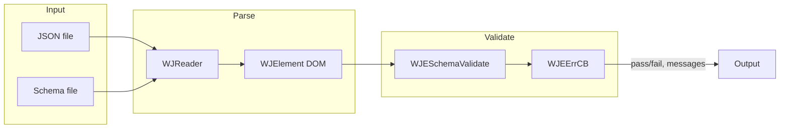
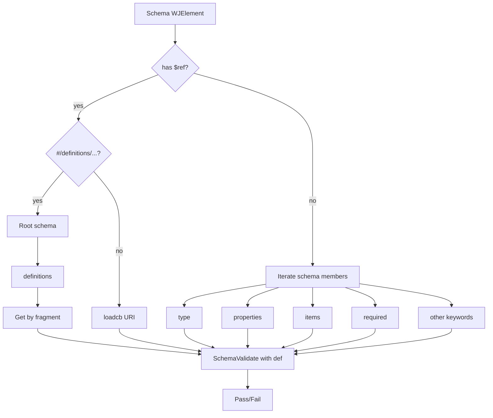

# WJElement (netmail-open/wjelement) — Research report

## Metadata

- **Library name**: WJElement
- **Repo URL**: https://github.com/netmail-open/wjelement
- **Clone path**: `research/repos/c/netmail-open-wjelement/`
- **Language**: C
- **License**: GNU LGPL v3 (COPYING.LESSER); COPYING and COPYING.MIT also present in repo

## Summary

WJElement is a JSON manipulation library for C, built on WJReader and WJWriter (included in the repo). It provides an in-memory JSON DOM with path-based access and is capable of JSON Schema validation. It does not generate C code from JSON Schema; it validates a JSON instance (as a WJElement tree) against a schema (also a WJElement tree) at runtime via `WJESchemaValidate`. Validation errors are reported via a printf-style callback. The library supports draft-03 and draft-04 style schemas (with draft-04 only partially supported per code comments), `$ref` (including inline `#/definitions/` and external via load callback), and a wide set of validation keywords including type, properties, items, required, numeric and string constraints, pattern, enum, format, and combinators (allOf, anyOf, oneOf).

## JSON Schema support

- **Drafts**: Code in `src/wjelement/schema.c` detects `$schema` and sets version 3 or 4 for `http://json-schema.org/draft-03/` and `http://json-schema.org/draft-04/` respectively. Comments state that draft-04 is "barely supported, mostly where it overlaps with draft 3" and that "Draft 4 patches are most welcome." Example schema `example/layout.schema` does not set `$schema`; it uses draft-3/4 style (e.g. `required` as array on properties and at object level).
- **Scope**: Subset aligned with draft-03 and partial draft-04. No support for 2019-09 or 2020-12 (e.g. no `$defs`, `prefixItems`, `if`/`then`/`else`, `dependentRequired`). Uses `definitions` for inline `$ref` and supports `extends` (draft-3 and MA extension). Validation is runtime-only; no codegen.

## Keyword support table

Keyword list derived from vendored draft 2020-12 meta-schemas under `specs/json-schema.org/draft/2020-12/meta/`. The library targets draft-03/draft-04; notes reflect implementation in `src/wjelement/schema.c`.

| Keyword | Implemented | Notes |
|---------|-------------|-------|
| $anchor | no | Not used. |
| $comment | no | Not used. |
| $defs | partial | Inline refs use `#/definitions/` (draft-04 style); resolved in schema.c. No `$defs` key; uses `definitions`. |
| $dynamicAnchor | no | Not used. |
| $dynamicRef | no | Not used. |
| $id | no | Not used for resolution. |
| $ref | yes | In-document `#/definitions/...` resolved from root; external refs via WJESchemaLoadCB. |
| $schema | yes | Parsed to set version (3 or 4) for required/enum behavior. |
| $vocabulary | no | Not used. |
| additionalProperties | yes | Boolean false or schema object; enforced at runtime. |
| allOf | yes | All subschemas must pass. |
| anyOf | yes | At least one subschema must pass. |
| const | no | Not used. |
| contains | no | Not used. |
| contentEncoding | no | Not used. |
| contentMediaType | no | Not used. |
| contentSchema | no | Not used. |
| default | no | Ignored (no-op in schema.c). |
| dependentRequired | no | Not used; draft-3 `dependencies` (object/array) supported. |
| dependentSchemas | no | Not used. |
| deprecated | no | Not used. |
| description | no | Ignored. |
| else | no | Not used. |
| enum | yes | Value must match one element; comparison via CompareJson. |
| examples | no | Not used. |
| exclusiveMaximum | yes | Handled inside maximum check when present. |
| exclusiveMinimum | yes | Handled inside minimum check when present. |
| format | partial | Validated when HAVE_REGEX_H; date-time, date, time, uri, email, regex, etc. |
| if | no | Not used. |
| items | yes | Single schema or array (tuple typing); validated for each array element. |
| maxContains | no | Not used. |
| maximum | yes | Enforced at runtime. |
| maxItems | yes | Enforced at runtime. |
| maxLength | yes | Enforced at runtime. |
| maxProperties | yes | Enforced at runtime. |
| minContains | no | Not used. |
| minimum | yes | Enforced at runtime. |
| minItems | yes | Enforced at runtime. |
| minLength | yes | Enforced at runtime. |
| minProperties | yes | Enforced at runtime. |
| multipleOf | partial | Draft-3 `divisibleBy` supported; keyword name `multipleOf` not checked. |
| not | no | Not used. |
| oneOf | yes | Exactly one subschema must pass. |
| pattern | partial | Only when HAVE_REGEX_H; REG_EXTENDED \| REG_NOSUB. |
| patternProperties | partial | Only when HAVE_REGEX_H. |
| prefixItems | no | Not used. |
| properties | yes | Each property validated against its schema. |
| propertyNames | no | Not used. |
| readOnly | no | Not used. |
| required | yes | Draft-3 (required: true) and draft-4 (required: [names]). |
| then | no | Not used. |
| title | no | Ignored. |
| type | yes | string, number, integer, boolean, object, array, null, any; array of types and disallow (draft-3). |
| unevaluatedItems | no | Not used. |
| unevaluatedProperties | no | Not used. |
| uniqueItems | yes | Enforced via CompareJson pairwise. |
| writeOnly | no | Not used. |

## Constraints

Validation keywords are enforced at runtime by `WJESchemaValidate`. Type, properties, items, required, additionalProperties, and combinators (allOf, anyOf, oneOf) drive structure checks. Numeric and string constraints (minimum, maximum, exclusiveMinimum, exclusiveMaximum, minLength, maxLength, minItems, maxItems, minProperties, maxProperties) and pattern, enum, format, uniqueItems, and divisibleBy are all checked during validation; failures are reported via the WJEErrCB callback. There is no generated code; all constraint checking is in schema.c.

## High-level architecture

Components: **WJReader** (streaming JSON parser), **WJWriter** (JSON writer), **WJElement** (in-memory DOM with path selectors), and **schema validation** (schema.c). Pipeline: JSON and schema are parsed into WJElement trees (via WJReader + WJEOpenDocument); the application calls `WJESchemaValidate(schema, document, err, loadcb, freecb, client)`; validation walks the schema and document, resolves `$ref` via loadcb or inline `#/definitions/`, and reports pass/fail plus errors via the callback. No code generation step.

## Medium-level architecture

Key modules: **wjreader** (src/wjreader), **wjwriter** (src/wjwriter), **wjelement** (src/wjelement: element.c, types.c, search.c, schema.c, hash.c), **cli** (src/cli: wje binary). Data structure: WJElement is a tree of WJElementPublic nodes (name, type, child/sibling/parent, count, length). **$ref resolution**: If schema has `["$ref"]`, first try inline: strip `#/definitions/` prefix, walk to root schema, get `definitions` object, look up by fragment name; if not inline, call loadcb(name, client, ...) to load external schema. Validator then recurses with the resolved schema. No schema caching in the core; loadcb/freecb are caller-provided.

## Low-level details

- **pattern / patternProperties / format**: Only compiled when `HAVE_REGEX_H` is defined (CMake checks for regex.h). Without it, CMake warns that pattern, patternProperties, and format are unsupported.
- **required**: Draft-3 uses `"required": true` (presence of node); draft-4 uses `"required": [ "prop1", "prop2" ]`. layout.schema uses per-property `"required": true` (common convention); schema.c treats top-level `required` as array of names (draft-4) or boolean (draft-3).
- **Integer vs number**: Option `DISTINGUISH_INTEGERS` (CMake) enables WJE_DISTINGUISH_INTEGER_TYPE so integer type is distinguished from number in ValidateType.

## Output and integration

- **Vendored vs build-dir**: N/A; no code generation. Validation is runtime only.
- **API vs CLI**: Library API in wjelement.h: `WJESchemaValidate`, `WJESchemaIsType`, `WJESchemaNameIsType`, `WJESchemaGetSelectors`, `WJESchemaGetAllSelectors`, `WJESchemaFindBacklink`, `WJESchemaNameFindBacklink`, `WJESchemaFreeBacklink`. CLI: `wje` binary (src/cli) with a `validate` command that takes a schema file and optional pattern for loading additional schemas; it calls `WJESchemaValidate(e, *doc, schema_error, schema_load, NULL, pat)`.
- **Writer model**: N/A for codegen. Validation errors are reported via `WJEErrCB` (varargs callback); the CLI prints them to stderr.

## Configuration

Build-time: **STATIC_LIB** (static vs shared libraries), **DISTINGUISH_INTEGERS** (integer vs number type in validation), **HAVE_REGEX_H** (enables pattern, patternProperties, format). No model/serialization or codegen options. Install prefix and paths set via CMake; pkg-config file generated.

## Pros/cons

**Pros**: Single C stack (reader, writer, element, schema) in one repo; path-based DOM access with wildcards and conditions; schema validation with draft-3/4 style and many keywords; $ref with inline and external loading; optional regex-based pattern/format; LGPL licensing. **Cons**: No codegen; draft-04 only partially supported; pattern/format depend on system regex; no support for 2019-09/2020-12 keywords (if/then/else, $defs, prefixItems, etc.); validation and selector logic are intertwined in schema.c.

## Testability

Tests live in `src/wjelement/wjeunit.c`: a fixed JSON document is parsed and a list of test functions (SelfTest, NamesTest, SchemaTest, etc.) run. Schema tests use inline schema strings and `WJESchemaValidate` to assert pass/fail for type+pattern. CMake adds tests via `add_test(WJElement:Schema ${EXECUTABLE_OUTPUT_PATH}/wjeunit schema)` and similar. Run: build with CMake, then `ctest` or `make test`, or run `wjeunit schema` (and other test names) manually. Entry point for running the validator on shared fixtures: `WJESchemaValidate(schema, document, err, loadcb, freecb, client)` or CLI `wje` with document loaded and `validate <schema-file> [pattern]`.

## Performance

No dedicated benchmark suite. `wjeunit.c` has BigDocTest, RealBigDocTest, LargeDoc2Test that build large JSON strings (e.g. 100k and 1M elements) and exercise parsing/DOM; they are functional tests, not timed benchmarks. Useful entry points for future benchmarking: `WJESchemaValidate()` for validation; CLI `wje load <file> validate <schema>` for end-to-end.

## Determinism and idempotency

**Codegen**: Not applicable (no code generation). **Validation**: Same schema and document produce the same result; validation is deterministic. Schema iteration order follows the WJElement tree; no explicit sorting of keywords. Unknown whether error message order or selector enumeration is stable across runs.

## Enum handling

Enum is validated by iterating the schema's enum array and comparing the instance value with `CompareJson(document, arr)`; first match passes. Duplicate enum entries are not deduped; if the array has `["a", "a"]`, both are checked and either match would satisfy. Case/namespace collisions: comparison is type and value based (CompareJson); string comparison is strcmp, so "a" and "A" are distinct and both can appear in the enum and be matched correctly. Unknown whether duplicate enum values are documented or tested.

## Reverse generation (Schema from types)

No. The library does not generate JSON Schema from C types or any other code.

## Multi-language output

No. Validation only; no generated code and no multi-language output.

## Model deduplication and $ref/$defs

N/A for codegen. For validation: multiple `$ref` to the same `#/definitions/Name` or same external URI resolve to the same schema object each time (inline from root definitions, or via loadcb). No deduplication of generated types; the validator simply recurses with the resolved schema. `$defs` (2020-12) is not used; the code uses `definitions` (draft-04 style).

## Validation (schema + JSON → errors)

Yes. **API**: `WJESchemaValidate(WJElement schema, WJElement document, WJEErrCB err, WJESchemaLoadCB loadcb, WJESchemaFreeCB freecb, void *client)`. Inputs: schema and document as WJElement trees (typically from WJROpenDocument + WJEOpenDocument). Output: XplBool (TRUE = valid, FALSE = invalid); validation errors are reported via the `err` callback (printf-style). Optional loadcb loads externally referenced schemas; freecb frees them. **Example**: `example/validate.c` reads JSON and schema from files, builds WJElement trees, and calls `WJESchemaValidate(schema, json, schema_error, schema_load, schema_free, format)`. **CLI**: After loading a document, `validate <schema-file> [<schema-pattern>]` runs validation and prints "Schema validation: PASS" or failures to stderr.
