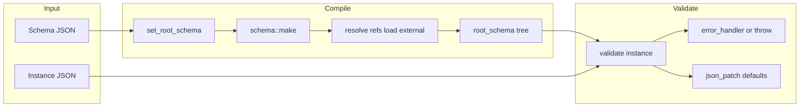

# json-schema-validator (pboettch) — Research report

## Metadata

- **Library name**: JSON schema validator for JSON for Modern C++
- **Repo URL**: https://github.com/pboettch/json-schema-validator
- **Clone path**: `research/repos/cpp/pboettch-json-schema-validator/`
- **Language**: C++
- **License**: MIT (Copyright (c) 2016 Patrick Boettcher)

## Summary

This is a C++ library that validates JSON documents against a JSON Schema. It does not generate code; it performs runtime validation only. The library targets draft-7 of JSON Schema Validation and is built on top of [nlohmann/json](https://github.com/nlohmann/json) (JSON for Modern C++). Schemas are parsed into compiled C++ objects at setup time and then used repeatedly for validation; the README states that validation speed improved by a factor of 100 or more in version 2 compared to the previous approach of reusing the schema as a JSON document. Validation can report errors either by throwing exceptions (default) or via a custom `basic_error_handler` callback. The library supports external schema loading via a loader callback, optional format checking, and content (contentEncoding/contentMediaType) checking. It can return a JSON Patch of default values applied during validation.

## JSON Schema support

- **Draft**: JSON Schema draft-7 only. README and built-in meta-schema reference `$schema: "http://json-schema.org/draft-07/schema#"`. Version 1 supported draft-4; version 2 is a complete rewrite for draft-7.
- **Scope**: Validation only. Schema is parsed into an internal graph of C++ schema objects; `$ref` and `$id` are resolved with support for external schemas when a schema loader is provided. Both `definitions` and `$defs` are recognized. No code generation.

## Keyword support table

Keyword list derived from vendored draft-07 meta-schema `specs/json-schema.org/draft-07/schema.json` (properties and schema keywords). Implementation evidence from `src/json-validator.cpp`, `src/nlohmann/json-schema.hpp`, and tests.

| Keyword | Implemented | Notes |
|---------|-------------|-------|
| $id | yes | Used for URI resolution; additional URIs pushed for reference resolution (schema::make). |
| $schema | yes | Accepted; erased after parsing, not used for validation logic. |
| $ref | yes | Resolved via root_schema::get_or_create_ref; supports fragment and external refs with loader. |
| $comment | no | Erased with title/description; not used. |
| title | no | Erased after parsing; not used for validation. |
| description | no | Erased after parsing; not used for validation. |
| default | yes | Stored and applied; validate() returns a JSON Patch with default values. |
| readOnly | no | Not used in validator; in meta-schema only. |
| writeOnly | no | Not used in validator; in meta-schema only. |
| examples | no | Not used in validator; in meta-schema only. |
| multipleOf | yes | Enforced for number/integer via numeric validator (remainder check). |
| maximum | yes | Enforced; numeric validator. |
| exclusiveMaximum | yes | Enforced (value must be strictly less than); numeric validator. |
| minimum | yes | Enforced; numeric validator. |
| exclusiveMinimum | yes | Enforced (value must be strictly greater than); numeric validator. |
| maxLength | yes | Enforced for strings. |
| minLength | yes | Enforced for strings. |
| pattern | yes | Enforced via std::regex (or boost); can be disabled with JSON_SCHEMA_NO_REGEX. |
| additionalItems | yes | When items is array; subschema for extra items. |
| items | yes | Single schema or array of schemas (tuple-style); both supported. |
| maxItems | yes | Enforced on array size. |
| minItems | yes | Enforced on array size. |
| uniqueItems | yes | Enforced when true (equality check over array elements). |
| contains | yes | At least one array element must match subschema. |
| maxProperties | yes | Enforced on object size. |
| minProperties | yes | Enforced on object size. |
| required | yes | Listed properties must be present. |
| additionalProperties | yes | false or schema; unknown properties validated or rejected. |
| definitions | yes | findDefinitions("definitions") and findDefinitions("$defs"); subschemas registered by pointer. |
| properties | yes | Property names mapped to subschemas. |
| patternProperties | yes | Regex → schema; property names matched by regex, validated by subschema. |
| dependencies | yes | Property or schema dependencies; subschemas created per key. |
| propertyNames | yes | Schema applied to each property name. |
| const | yes | Instance must equal const value (JSON equality). |
| enum | yes | Instance must equal one of the enum values (iteration, instance == v). |
| type | yes | Single type or array of types; null, object, array, string, boolean, integer, number. |
| format | yes | Optional; format_checker callback; default_string_format_check supports date-time, date, time, email, hostname, ipv4, ipv6, uuid, regex. |
| contentMediaType | yes | With contentEncoding; requires content_checker callback. |
| contentEncoding | yes | With contentMediaType; e.g. base64; binary type accepted when encoding is "binary". |
| if | yes | Conditional; then/else applied based on if validation. |
| then | yes | Used when if validates. |
| else | yes | Used when if fails. |
| allOf | yes | Instance must satisfy all subschemas. |
| anyOf | yes | Instance must satisfy at least one subschema. |
| oneOf | yes | Instance must satisfy exactly one subschema. |
| not | yes | Instance must not satisfy subschema. |

## Constraints

All validation keywords listed above are enforced at runtime during instance validation. The validator compiles the schema into a tree of C++ schema objects (type_schema, string, numeric, object, array, logical_combination, schema_ref, etc.); each node performs the relevant checks (e.g. minLength, maximum, required, pattern) and calls the error_handler on failure. No constraints are generated into user code; validation is entirely library-driven.

## High-level architecture

- **Input**: Root schema as nlohmann::json (or set later via set_root_schema). Optional schema_loader for external $refs; optional format_checker and content_checker.
- **Compile**: set_root_schema (or constructor with schema) calls schema::make(), which builds a shared_ptr<schema> tree (type_schema, object, array, logical_combination, schema_ref, etc.). References are recorded in root_schema::files_[location].unresolved; definitions and $defs are processed via findDefinitions; external files are loaded by the loader until no new files are needed; unresolved refs after that throw.
- **Validate**: json_validator::validate(instance) or validate(instance, error_handler, initial_uri) runs root_->validate(ptr, instance, patch, err, initial_uri). The root schema’s validate() is invoked; it dispatches by instance type and keyword (type, enum, const, allOf/anyOf/oneOf, if/then/else, etc.). Errors are reported via error_handler (default: throwing_error_handler). Return value is a json_patch of applied default values.



## Medium-level architecture

- **Key types**: `nlohmann::json_schema::json_validator` (public API; holds unique_ptr<root_schema>). `root_schema` holds schema_loader, format_checker, content_checker, and a map `files_` from location string to schema_file (schemas map fragment → shared_ptr<schema>, unresolved map fragment → schema_ref, unknown_keywords json). `schema` is the abstract base; implementations include type_schema (type, enum, const, if/then/else, default), object (properties, additionalProperties, patternProperties, dependencies, propertyNames, required, max/minProperties), array (items, additionalItems, contains, max/minItems, uniqueItems), string (min/maxLength, pattern, format, contentEncoding/contentMediaType), numeric (min/max, exclusiveMin/Max, multipleOf), logical_combination<allOf|anyOf|oneOf>, logical_not, schema_ref, boolean.
- **$ref resolution**: When schema::make() sees a $ref, it computes the resolved URI with uris.back().derive(ref_value), then calls root->get_or_create_ref(id). get_or_create_ref looks up the file by location and fragment: if a schema already exists, it returns it; if the fragment points into unknown_keywords, that value is turned into a schema and inserted; otherwise an unresolved schema_ref is created and stored in file.unresolved. When a schema is later inserted via root->insert(uri, sch), any unresolved ref with that fragment is resolved (set_target). set_root_schema() repeatedly loads external files (via loader_) for any location that has no schemas yet, then throws if any unresolved refs remain.
- **Definitions**: findDefinitions("$defs") then findDefinitions("definitions") in schema::make(); each definition is created with schema::make(def.value(), root, {defs, def.key()}, uris), which registers it under the appended pointer so $ref to that fragment can resolve.

```mermaid
flowchart TB
  subgraph refResolution [Ref resolution]
    Make[schema::make]
    FindRef[find "$ref"]
    DeriveUri[uris.back.derive ref_value]
    GetOrCreate[root->get_or_create_ref]
    Insert[root->insert uri sch]
    Unresolved[unresolved schema_ref]
    Make --> FindRef
    FindRef --> DeriveUri
    DeriveUri --> GetOrCreate
    GetOrCreate --> Insert
    GetOrCreate --> Unresolved
  end
  subgraph files [Per-file state]
    Schemas[schemas fragment to schema]
    UnresolvedMap[unresolved fragment to schema_ref]
    Unknown[unknown_keywords]
  end
  Insert --> Schemas
  Unresolved --> UnresolvedMap
```

## Low-level details

- **Pattern**: std::regex (or boost with JSON_SCHEMA_BOOST_REGEX); ECMAScript flavor. Disabled if NO_STD_REGEX (pattern not enforced).
- **Format**: Optional. If schema has "format" and no format_checker was provided, schema compilation throws. At validation time, format_check() is called; default_string_format_check supports date-time, date, time, email, hostname, ipv4, ipv6, uuid, regex (see string-format-check.cpp).
- **Default value patch**: validate() returns a json_patch; type_schema adds default_value to the patch when instance is null. README notes that default in a $ref can be overridden by the referencing location (draft-7 break for compatibility with newer drafts).
- **Thread-safety**: validate() is const; multiple threads can call validate on the same validator. Validator construction/set_root_schema is not thread-safe.

## Output and integration

- **N/A for codegen** — validation-only library.
- **API**: Library only. Public API in `include` (header shipped as src/nlohmann/json-schema.hpp): `json_validator` constructor (optional schema_loader, format_checker, content_checker), set_root_schema(), validate(instance), validate(instance, error_handler, initial_uri). Return value of validate is nlohmann::json (a JSON Patch of defaults). No standalone CLI; example app in example/ (e.g. readme.cpp, format.cpp).
- **Build**: CMake; builds static library by default; BUILD_SHARED_LIBS or JSON_VALIDATOR_SHARED_LIBS for shared. ctest runs unit and JSON-Schema-Test-Suite tests when JSON_SCHEMA_TEST_SUITE_PATH is set.

## Configuration

- **Constructor**: schema_loader (for external $ref), format_checker (for "format" keyword), content_checker (for contentEncoding/contentMediaType). Any can be nullptr; format/content require non-null if schema uses them.
- **Default format checker**: nlohmann::json_schema::default_string_format_check can be passed; supports date-time, date, time, email, hostname, ipv4, ipv6, uuid, regex.
- **Initial URI**: validate(instance, err, initial_uri) defaults to json_uri("#") for root.
- **Build options**: JSON_VALIDATOR_BUILD_TESTS, JSON_VALIDATOR_BUILD_EXAMPLES, JSON_VALIDATOR_TEST_COVERAGE (e.g. --coverage, -fprofile-instr-generate). Optional regex: JSON_SCHEMA_BOOST_REGEX or JSON_SCHEMA_NO_REGEX.

## Pros/cons

- **Pros**: Draft-7 support; rich keyword set including if/then/else, dependencies, patternProperties, contentEncoding/contentMediaType; compiled schema for fast repeated validation; human-readable error messages (design goal); optional error handler for non-throwing use; JSON Patch of defaults; external refs via loader; optional format and content checkers; uses widespread nlohmann/json; MIT license; JSON-Schema-Test-Suite compliance (all required tests OK per README).
- **Cons**: Bignum not supported (README “Weaknesses”); numerical validation uses nlohmann number types. Pattern requires std::regex (or boost) unless disabled. Work in progress; external documentation is minimal.

## Testability

- **Build and run**: Out-of-source build with cmake, make, then ctest. Tests enabled by default when project is top-level (JSON_VALIDATOR_BUILD_TESTS). JSON Schema Test Suite runs when JSON_SCHEMA_TEST_SUITE_PATH is set to the test-suite repo root (test/JSON-Schema-Test-Suite/json-schema-test.cpp uses remotes from that path and draft-07 builtin schema).
- **Test files**: test/ contains unit/regression tests (errors.cpp, id-ref.cpp, uri.cpp, string-format-check-test.cpp, issue-*.cpp, binary-validation.cpp, json-patch.cpp, etc.) and test/JSON-Schema-Test-Suite/ for the official suite. CMakeLists.txt adds test targets and optionally fetches nlohmann/json.
- **Entry point for benchmarking**: json_validator::validate(const json &) or validate(const json &, error_handler &, const json_uri &). No built-in benchmark binary; one could time validate() on fixed schema + instance.

## Performance

- No dedicated benchmark suite in the repo. README states that in version 2, parsing the schema into compiled C++ objects and reusing them improved validation speed by a factor of 100 or more compared to version 1 (which re-validated using the schema as a JSON document each time).
- **Entry points for future benchmarking**: json_validator::set_root_schema(schema) once, then json_validator::validate(instance) in a loop; or validate(instance, error_handler) to avoid exception cost. Build with Release and link the static library.

## Determinism and idempotency

Not applicable for codegen. Validation is deterministic: same root schema and instance produce the same validation result and same default patch (error_handler may be stateful; the library’s logic is deterministic).

## Enum handling

- **Duplicate entries**: Draft-07 meta-schema requires enum array to have uniqueItems: true. The validator does not explicitly dedupe enum values; it iterates the schema’s enum array and checks instance == v. If the schema contained duplicates, both would match the same value; validation behavior is unchanged. No separate “duplicate enum entry” error.
- **Namespace/case collisions**: Enum comparison uses JSON equality (nlohmann::json operator==). Values "a" and "A" are distinct; both can appear in the enum and both are matched correctly. No special collision handling.

## Reverse generation (Schema from types)

No. Validation-only library; no facility to generate JSON Schema from C++ types.

## Multi-language output

No. C++ library only; no code generation.

## Model deduplication and $ref/$defs

N/A for codegen. For validation: $ref is fully resolved. Each distinct $ref target (by URI + fragment) gets one shared schema object; multiple $refs to the same definition reuse the same compiled schema. definitions and $defs are processed so that each key is a fragment under the current URI; when a $ref is resolved, get_or_create_ref returns the same shared_ptr for that fragment. So referenced definitions are deduplicated by design (single schema node per URI+fragment).

## Validation (schema + JSON → errors)

**Primary purpose of the library.**

- **API**: `json_validator validator(schema_loader, format_checker, content_checker)` or constructor with schema json; `validator.set_root_schema(schema)`; then `validator.validate(instance)` returns a json_patch (and throws on first error with default handler), or `validator.validate(instance, error_handler, initial_uri)` returns the patch and reports all errors via error_handler::error(ptr, instance, message).
- **Schema compilation**: set_root_schema() parses the root schema into a tree of schema objects, resolves all $ref (including loading external schemas via the loader), and throws if any ref remains unresolved.
- **Instance validation**: validate() walks the instance against the compiled schema, enforcing type, enum, const, and all applicator/validation keywords. Errors report json_pointer, instance (or excerpt), and a string message. Default behavior uses throwing_error_handler (std::invalid_argument with "At <ptr> of <instance> - <message>").
- **Default values**: The returned json_patch contains operations that apply schema default values (e.g. for missing properties). The user can patch the instance with this to get the validated document with defaults filled in.
