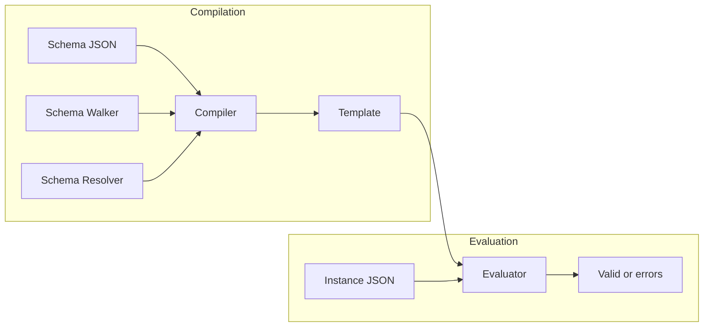

# Blaze — Research report

## Metadata

- **Library name**: Blaze
- **Repo URL**: https://github.com/sourcemeta/blaze
- **Clone path**: `research/repos/cpp/sourcemeta-blaze/`
- **Language**: C++
- **License**: Unknown (no LICENSE file in repository root)

## Summary

Blaze is an ultra high-performance JSON Schema evaluator (validator) for C++. It does not generate code from schemas. It compiles a JSON Schema document into an internal template (a sequence of low-level instructions) and then evaluates JSON instances against that template to produce a boolean result or structured validation output. It supports multiple JSON Schema drafts (draft-04, draft-06, draft-07, 2019-09, 2020-12) and OpenAPI base vocabularies. The pipeline is: schema JSON → compiler (with walker and resolver) → template; instance JSON + template → evaluator → valid/invalid and optional output (simple, trace, or standard format). It depends on Sourcemeta Core for JSON, JSON Pointer, URI, and JSON Schema utilities.

## JSON Schema support

- **Drafts**: Draft-04, Draft-06, Draft-07, 2019-09, 2020-12. Evidence: `default_compiler.cc` lists `Known::JSON_Schema_Draft_4`, `JSON_Schema_Draft_6`, `JSON_Schema_Draft_7`, `JSON_Schema_2019_09_*`, `JSON_Schema_2020_12_*` in `SUPPORTED_VOCABULARIES`. OpenAPI 3.1 and 3.2 base vocabularies are also supported (no-op handlers for discriminator, xml, externalDocs, example).
- **Scope**: Full validation for the listed drafts within the compiled vocabulary set. Schema structure ($id, $schema, $defs, $ref, $dynamicRef, etc.) is handled by the Core schema walker and resolver; Blaze compiles only keywords that have a compiler handler. Unknown keywords in 2019-09/2020-12 are compiled as annotations in Exhaustive mode.

## Keyword support table

Keyword list derived from vendored draft 2020-12 meta-schemas (`specs/json-schema.org/draft/2020-12/meta/*.json`). Implementation evidence from `src/compiler/default_compiler.cc`, `default_compiler_2020_12.h`, `default_compiler_2019_09.h`, `default_compiler_draft7.h`, `default_compiler_draft6.h`, `default_compiler_draft4.h`.

| Keyword | Implemented | Notes |
|---------|-------------|-------|
| $anchor | yes | Schema structure; used by core for resolution. |
| $comment | partial | Compiled as AnnotationEmit in Exhaustive mode only; no validation effect. |
| $defs | yes | Container for definitions; $ref resolves into it via schema resolver. |
| $dynamicAnchor | yes | Schema structure for $dynamicRef resolution. |
| $dynamicRef | yes | 2020-12; compiler_2020_12_core_dynamicref. |
| $id | yes | Used by schema resolver for base URI and resolution. |
| $ref | yes | compiler_draft4_core_ref; static reference resolution via frame. |
| $schema | yes | Used for dialect and vocabulary selection. |
| $vocabulary | yes | Schema structure; vocabularies drive compiler dispatch. |
| additionalProperties | yes | All drafts; compiler_draft4/2019_09 applicator. |
| allOf | yes | compiler_draft4_applicator_allof. |
| anyOf | yes | compiler_draft4_applicator_anyof. |
| const | yes | compiler_draft6_validation_const. |
| contains | yes | Draft 6+; 2020-12 uses compiler_2020_12_applicator_contains. |
| contentEncoding | yes | 2019-09/2020-12 content vocabulary. |
| contentMediaType | yes | 2019-09/2020-12 content vocabulary. |
| contentSchema | yes | 2019-09/2020-12 content vocabulary. |
| default | partial | Annotation only (compiler_2019_09_core_annotation in Exhaustive mode). |
| dependentRequired | yes | 2019-09/2020-12. |
| dependentSchemas | yes | 2019-09/2020-12. |
| deprecated | partial | Annotation only in Exhaustive mode. |
| description | partial | Annotation only in Exhaustive mode. |
| else | yes | if-then-else; compiler_draft7_applicator_else. |
| enum | yes | compiler_draft4_validation_enum. |
| examples | partial | Annotation only in Exhaustive mode. |
| exclusiveMaximum | yes | Draft 6+; standalone (no dependency on maximum). |
| exclusiveMinimum | yes | Draft 6+; standalone. |
| format | yes | compiler_2019_09_format_format; format annotation/assertion. |
| if | yes | compiler_draft7_applicator_if. |
| items | yes | Draft 4–7 and 2019-09/2020-12; prefixItems in 2020-12 for tuple prefix. |
| maxContains | yes | Handled as part of contains (2019-09/2020-12). |
| maximum | yes | compiler_draft4_validation_maximum. |
| maxItems | yes | compiler_draft4_validation_maxitems. |
| maxLength | yes | compiler_draft4_validation_maxlength. |
| maxProperties | yes | compiler_draft4_validation_maxproperties. |
| minContains | yes | Handled as part of contains (2019-09/2020-12). |
| minimum | yes | compiler_draft4_validation_minimum. |
| minItems | yes | compiler_draft4_validation_minitems. |
| minLength | yes | compiler_draft4_validation_minlength. |
| minProperties | yes | compiler_draft4_validation_minproperties. |
| multipleOf | yes | compiler_draft4_validation_multipleof. |
| not | yes | compiler_draft4_applicator_not. |
| oneOf | yes | compiler_draft4_applicator_oneof. |
| pattern | yes | compiler_draft4_validation_pattern. |
| patternProperties | yes | compiler_draft4/2019_09 applicator. |
| prefixItems | yes | 2020-12; compiler_2020_12_applicator_prefixitems. |
| properties | yes | compiler_draft4/2019_09 applicator. |
| propertyNames | yes | Draft 6+; compiler_draft6_validation_propertynames. |
| readOnly | partial | Annotation only in Exhaustive mode. |
| required | yes | compiler_draft4_validation_required. |
| then | yes | compiler_draft7_applicator_then. |
| title | partial | Annotation only in Exhaustive mode. |
| type | yes | compiler_draft6_validation_type. |
| unevaluatedItems | yes | 2019-09/2020-12 unevaluated vocabulary. |
| unevaluatedProperties | yes | 2019-09/2020-12 unevaluated vocabulary. |
| uniqueItems | yes | compiler_draft4_validation_uniqueitems. |
| writeOnly | partial | Annotation only in Exhaustive mode. |

Note: Draft-04 also supports `dependencies` (property and schema dependencies) and `additionalItems`; 2020-12 supports `dependencies` for compatibility (optional test). `$recursiveRef` is supported for 2019-09.

## Constraints

All validation keywords are enforced at evaluation time by the evaluator. The compiler turns each keyword into instructions (e.g. AssertionTypeStrict, AssertionEqual, AssertionRegex); the evaluator runs these against the instance. There is no generated code that enforces constraints; everything is interpreted from the compiled template. Numeric, string, array, and object constraints (minLength, maxItems, etc.) are therefore enforced in the C++ evaluator at runtime.

## High-level architecture

Pipeline: **Schema JSON** is passed to **compile()** with a schema walker, resolver, and compiler function (e.g. `default_schema_compiler`). The compiler iterates over schema keywords (via Core’s `SchemaKeywordIterator`), dispatches per keyword and vocabulary to draft-specific handlers, and produces a **Template** (list of instruction targets, labels, and a dynamic/track flag). The **Template** is an intermediate representation (bytecode-like). At runtime, **Instance JSON** and the **Template** are passed to the **Evaluator**; **validate()** runs the instructions and returns a boolean, or **validate(..., callback)** runs with a callback for each step. Optional **output** modules (simple, trace, standard) format validation results for the standard output structure.

## Medium-level architecture

- **Modules**: `src/compiler` (compile.cc, compile_json.cc, default_compiler.cc, default_compiler_*.h), `src/evaluator` (evaluator.cc, dispatch.inc.h, evaluator_*.cc), `src/output` (output_simple, output_trace, output_standard), `src/configuration` (parse, json, configuration, lock, fetch), `src/linter`, `src/test` (test runner for JSON Schema test suite).
- **Compiler**: `compile(schema, walker, resolver, compiler, mode, ...)` builds a `Context` (frame, targets, unevaluated dependencies, mode, tweaks), then compiles the entrypoint subschema. Each keyword is compiled via the provided `Compiler` function; `default_schema_compiler` dispatches by vocabulary and keyword to internal handlers (e.g. `compiler_2020_12_core_dynamicref`, `compiler_draft4_core_ref`, `compiler_draft4_applicator_allof`). Instructions are post-processed (e.g. inlining, reordering).
- **$ref resolution**: `$ref` is compiled to a `ControlJump` to a precomputed target index. The schema frame (from Core) is populated before compilation; `compiler_draft4_core_ref` looks up the static frame entry and emits a jump to the corresponding target. Remote references are resolved by the resolver; the frame holds all static and dynamic reference destinations.
- **$dynamicRef**: In 2020-12, `compiler_2020_12_core_dynamicref` emits `ControlDynamicAnchorJump` (with optional base resource for non-fragment-only URIs). The evaluator resolves the dynamic anchor at runtime.
- **Evaluator**: Dispatches on `InstructionIndex` (e.g. AssertionFail, AssertionEqual, LogicalAnd, LoopProperties). Fast path avoids annotation tracking; Exhaustive mode supports annotations and unevaluated tracking. Template can be serialized to/from JSON via `to_json` / `from_json`.

```mermaid
flowchart TB
  subgraph compilerMod [Compiler]
    CompileEntry[compile schema walker resolver]
    Context[Context frame targets unevaluated]
    KeywordIter[SchemaKeywordIterator]
    Dispatch[default_schema_compiler dispatch]
    Handlers[draft4 draft6 draft7 2019_09 2020_12]
    PostProcess[postprocess]
    CompileEntry --> Context
    Context --> KeywordIter
    KeywordIter --> Dispatch
    Dispatch --> Handlers
    Handlers --> PostProcess
  end
  subgraph refFlow [Ref resolution]
    RefKeyword["$ref"]
    FrameLookup[frame.reference static]
    ControlJump[ControlJump to target]
    RefKeyword --> FrameLookup
    FrameLookup --> ControlJump
  end
```

## Low-level details

- **Mode**: `Mode::FastValidation` (boolean result as fast as possible) vs `Mode::Exhaustive` (annotations and full unevaluated tracking). Affects which instructions are emitted (e.g. some type+enum optimizations skip instructions in Fast mode) and whether unknown keywords become AnnotationEmit.
- **Tweaks**: `Tweaks` in compiler.h: `properties_always_unroll`, `properties_reorder`, `target_inline_threshold` for tuning compilation.
- **Instruction set**: Defined in `evaluator_instruction.h` (AssertionFail, AssertionEqual, AssertionRegex, LogicalAnd, LogicalOr, ControlJump, ControlDynamicAnchorJump, LoopProperties, etc.). Values are variant types (ValueNone, ValueBoolean, value types for strings, numbers, etc.).
- **Unevaluated**: Unevaluated dependencies are computed in the compiler (unevaluated.cc) for unevaluatedProperties/unevaluatedItems; the evaluator tracks evaluated locations and applies unevaluated schemas when required.

## Output and integration

- **Vendored vs build-dir**: No generated source or vendored validation output. The template is produced in memory (or serialized to JSON by the application). Build output is standard CMake (libraries and optional executables).
- **API vs CLI**: Library API only for the main flow. Entry points: `sourcemeta::blaze::compile(schema, walker, resolver, compiler, mode, ...)` → `Template`; `Evaluator::validate(template, instance)` → bool, or `validate(template, instance, callback)` for step-by-step output. Optional **contrib** executables when `BLAZE_CONTRIB` is ON: `contrib_compile`, `contrib_validate`, `contrib_trace` (and on Linux `contrib_perf`), providing CLI-style usage.
- **Writer model**: N/A for codegen. Validation output (simple, trace, standard) is produced via callback or output library APIs that write to the caller-provided sink (e.g. standard output structure as JSON).

## Configuration

- **Compiler**: `Tweaks` (properties_always_unroll, properties_reorder, target_inline_threshold); `Mode` (FastValidation, Exhaustive); default_dialect, default_id, entrypoint for compilation.
- **Configuration library**: `src/configuration` provides parsing and fetching of configuration (e.g. JSON config files, lock files); used for tooling that reads external config rather than for schema compilation itself.
- **Build options**: CMake options include `BLAZE_COMPILER`, `BLAZE_EVALUATOR`, `BLAZE_OUTPUT`, `BLAZE_LINTER`, `BLAZE_TEST`, `BLAZE_CONFIGURATION`, `BLAZE_TESTS`, `BLAZE_BENCHMARK`, `BLAZE_CONTRIB`, `BLAZE_DOCS`, `BLAZE_INSTALL`, and sanitizer flags.

## Pros/cons

- **Pros**: Multi-draft support (draft-04 through 2020-12); high-performance design (compiled template, SIMD option, fast path); clear separation of compiler and evaluator; pluggable compiler (custom keyword handlers); standard output format support; optional contrib CLI tools; test suite integration; benchmarks for compiler and evaluator.
- **Cons**: No schema-to-code generation; depends on Sourcemeta Core (large vendor tree); C++ only; license not clearly stated in repo root.

## Testability

- **Tests**: CMake option `BLAZE_TESTS` enables tests. Subdirs: `test/compiler`, `test/evaluator`, `test/output`, `test/linter`, `test/configuration`, `test/packaging`. Test runner in `src/test` supports the JSON Schema Test Suite format (target, test cases with schema and instances, expected valid flag).
- **Fixtures**: Vendored `vendor/jsonschema-test-suite` (tests for draft7, draft2019-09, draft2020-12/v1). Test runner loads suite JSON (target schema, cases with description, schema, instances, valid).
- **Running**: Configure with `-DBLAZE_TESTS=ON`, build, then run CTest. For packaging tests, `test/packaging` is added when top-level and sanitizers are off.
- **Running Blaze against shared fixtures**: Use `compile()` + `Evaluator::validate()` with schema and instance from files; or run `contrib_validate` / `contrib_trace` if contrib is built, passing schema and instance inputs.

## Performance

- **Benchmarks**: In `benchmark/` when `BLAZE_BENCHMARK=ON`. Google Benchmark is used. `benchmark/e2e/runner.cc` registers E2E compiler and evaluator benchmarks per fixture directory (e.g. adaptivecard, ansible-meta, draft_04, geojson): compile schema from `e2e/<name>/schema.json`; evaluate instances from `e2e/<name>/instances.jsonl`. Micro benchmarks per draft in `benchmark/micro/` (draft4.cc, draft6.cc, draft7.cc, 2019_09.cc, 2020_12.cc).
- **Measurement**: Wall time via Google Benchmark; no built-in instruction-count reporting in the report.
- **Entry points**: For external benchmarking: `sourcemeta::blaze::compile(...)` and `Evaluator::validate(template, instance)`; or the `sourcemeta_blaze_benchmark` binary. Contrib: `contrib_validate`, `contrib_perf` (Linux).

## Determinism and idempotency

Compilation is deterministic: same schema, walker, resolver, compiler, and options produce the same template (no randomness or timestamps in the compiler). Evaluation is deterministic: same template and instance produce the same boolean and annotation results. Instruction order is fixed by the compiler and postprocess. Template serialization (to_json/from_json) is deterministic. Not applicable to codegen (no generated source).

## Enum handling

- **Duplicate entries**: The compiler emits enum validation instructions (e.g. AssertionEqualsAny) from the schema’s `enum` array. The evaluator checks the instance against the compiled enum values. Duplicate entries in the schema (e.g. `["a", "a"]`) are both present in the compiled form; the instance need only match one. No deduplication or error for duplicate enum values; both would match the same instance value.
- **Namespace/case collisions**: Enum comparison is by JSON value equality. Distinct values such as `"a"` and `"A"` are distinct in the enum array and both are matched correctly; no name mangling or namespace. No collision issue for validation.

## Reverse generation (Schema from types)

No. Blaze is a validator only; it does not generate JSON Schema from C++ types or any other code.

## Multi-language output

N/A. Blaze does not generate code; it only evaluates instances against a compiled schema. Output is validation result (boolean or structured output format), not source code in any language.

## Model deduplication and $ref/$defs

N/A for codegen (no generated types). For validation: `$ref` and `$defs` are used for reference resolution. The schema resolver (Core) resolves `$ref` to the referenced schema (e.g. in `$defs`); the compiler then compiles each referenced subschema once and emits ControlJump to the same target for every `$ref` to that destination. Thus one logical definition is compiled once and shared by all references; no duplicate instruction blocks for the same definition. `$dynamicRef` and dynamic anchors allow runtime resolution to the correct schema resource.

## Validation (schema + JSON → errors)

**Primary purpose.** Blaze validates a JSON instance against a JSON Schema.

- **Flow**: (1) Compile the schema with `compile(schema, schema_walker, schema_resolver, default_schema_compiler, ...)` to obtain a `Template`. (2) Run `Evaluator::validate(template, instance)` to get a boolean, or use the overload with a callback for step-wise results. (3) For standard error output, use the output library (e.g. output_standard) with the evaluator callback to produce the standard output structure (annotations, errors).
- **Inputs**: Schema (as Core JSON) and instance (as Core JSON). Schema can be loaded from file; resolver and walker handle $ref, $id, and remote references.
- **Output**: Boolean (valid/invalid) from `validate()`, or structured output (trace, standard format) when using the output modules or a custom callback. No separate “schema validation” step in the API—invalid schema structure is expected to be handled by the walker/resolver or to cause compile-time errors.
- **Contrib**: `contrib_validate` and `contrib_trace` provide CLI-style validation and trace output against schema and instance inputs.
