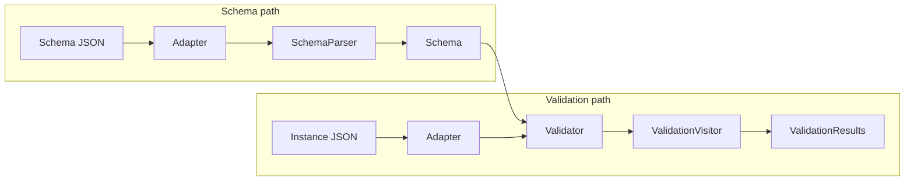
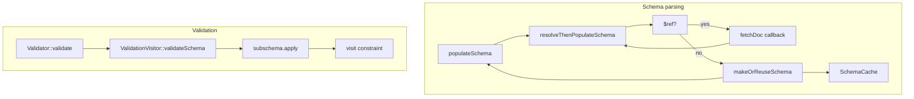

# Valijson — Research report

## Metadata

- **Library name**: Valijson
- **Repo URL**: https://github.com/tristanpenman/valijson
- **Clone path**: `research/repos/cpp/tristanpenman-valijson/`
- **Language**: C++
- **License**: Simplified BSD License (see LICENSE in repo)

## Summary

Valijson is a header-only JSON Schema **validation** library for modern C++. It does **not** generate code. It loads a JSON Schema (via an adapter over a JSON parser), parses it into an internal `Schema` representation (subschemas and constraints), then validates JSON documents against that schema. Supported JSON Schema drafts are draft-03 (deprecated), draft-04, and draft-07; the default parser version is draft-07. Validation is adapter-based: the same schema can be used with multiple JSON parser back ends (RapidJSON, nlohmann/json, Boost.JSON, jsoncpp, PicoJSON, Qt, Poco, etc.). A C++17-capable compiler is required for the current master branch; legacy v1.0.x targets C++14.

## JSON Schema support

- **Drafts**: Draft-03 (deprecated), draft-04, draft-07. The `SchemaParser` constructor accepts a `Version` enum: `kDraft3`, `kDraft4`, `kDraft7` (default).
- **Scope**: Validation only (schema + instance → valid/invalid + error list). No code generation.
- **Subset**: README states that Valijson supports "most of the constraints defined in Draft 7"; main exceptions are **default** (not enforced on instance) and **format** (optional; only date, time, date-time are validated when present; unrecognised formats are treated as valid). Support for JSON References is documented as "mostly working," with some JSON Schema Test Suite v6/v7 ref cases still failing.

## Keyword support table

Keyword list derived from vendored draft-07 meta-schema (`specs/json-schema.org/draft-07/schema.json`). Implementation evidence from `include/valijson/schema_parser.hpp`, `include/valijson/constraints/concrete_constraints.hpp`, `include/valijson/validation_visitor.hpp`, and `tests/test_validator.cpp`.

| Keyword | Implemented | Notes |
|---------|-------------|-------|
| $id | partial | Draft-07 keyword; parser only handles draft-04 `id` (see id). Sets subschema id and scope for ref resolution. |
| id | yes | Draft-04; parsed and stored; used for scope in $ref resolution. |
| $schema | yes | Accepted in schema; not used to drive validation logic. |
| $ref | yes | Resolved during parse; chain of $ref followed; schema cache and optional fetch callback for remote refs. |
| $comment | no | Not parsed or stored. |
| title | yes | Stored on subschema via setSubschemaTitle; not used for validation. |
| description | yes | Stored on subschema via setSubschemaDescription; not used for validation. |
| default | partial | Parsed (schema structure); README states default is not enforced on instance. |
| readOnly | no | Not implemented. |
| writeOnly | no | Not implemented. |
| examples | no | Not implemented. |
| multipleOf | yes | Instance validation; MultipleOfDoubleConstraint / MultipleOfIntConstraint. Draft-03 uses divisibleBy (parsed, mapped to multipleOf). |
| maximum | yes | Instance validation; draft-03/04 boolean exclusiveMaximum; draft-07 exclusiveMaximum as number. |
| exclusiveMaximum | yes | Draft-03/04: boolean; draft-07: number (always exclusive). |
| minimum | yes | Instance validation; draft-03/04 boolean exclusiveMinimum; draft-07 exclusiveMinimum as number. |
| exclusiveMinimum | yes | Draft-03/04: boolean; draft-07: number (always exclusive). |
| maxLength | yes | Instance validation; UTF-8 length via utils::u8_strlen. |
| minLength | yes | Instance validation; UTF-8 length. |
| pattern | yes | Instance validation; regex engine (default std::regex; optionally Boost or custom). |
| additionalItems | yes | Instance validation; boolean or schema; LinearItemsConstraint. |
| items | yes | Instance validation; single schema (SingularItemsConstraint) or array of schemas (LinearItemsConstraint); draft-07 boolean schema supported. |
| maxItems | yes | Instance validation. |
| minItems | yes | Instance validation. |
| uniqueItems | yes | Instance validation. |
| contains | yes | Instance validation; at least one array element must match subschema; draft-07 boolean schema supported. |
| maxProperties | yes | Instance validation. |
| minProperties | yes | Instance validation. |
| required | yes | Instance validation; draft-03 required at parent level when root. |
| additionalProperties | yes | Instance validation; boolean or schema; PropertiesConstraint. |
| definitions | yes | Parsed; subschemas under definitions are populated and cached; used for $ref resolution. |
| properties | yes | Instance validation; property name to subschema mapping. |
| patternProperties | yes | Instance validation; combined with properties and additionalProperties. |
| dependencies | yes | Instance validation; property and schema dependencies; draft-03 string dependency supported. |
| propertyNames | yes | Instance validation (draft-07); schema applied to each property name. |
| const | yes | Instance validation; value must equal const (FrozenValue equality). |
| enum | yes | Instance validation; value must match one of the enum values (equality). |
| type | yes | Instance validation; single type or array; draft-07 boolean schema; draft-04 no "any" type. |
| format | partial | Optional; only date, time, date-time validated (regex + date range). Unrecognised formats pass (FormatConstraint comment). |
| contentMediaType | no | Not implemented. |
| contentEncoding | no | Not implemented. |
| if | yes | Instance validation; ConditionalConstraint (if/then/else). |
| then | yes | Instance validation; ConditionalConstraint. |
| else | yes | Instance validation; ConditionalConstraint. |
| allOf | yes | Instance validation; all subschemas must pass. |
| anyOf | yes | Instance validation; at least one subschema must pass. |
| oneOf | yes | Instance validation; exactly one subschema must pass. |
| not | yes | Instance validation; value must not satisfy subschema. |

## Constraints

Validation keywords are enforced at **runtime** by the `ValidationVisitor`. Each constraint type (e.g. `TypeConstraint`, `EnumConstraint`, `MaximumConstraint`) is applied when the visitor visits the corresponding constraint object attached to a `Subschema`. Constraints are not used for "structure only"—they directly enforce instance validation (e.g. minLength, minItems, pattern, required). Schema parsing only builds the constraint graph; it does not validate the schema document itself against a meta-schema. Type checking can be strong (default) or weak (attempts to cast values to satisfy type); date/time format can be strict (RFC 3339 with timezone) or permissive.

## High-level architecture

Pipeline: **Schema JSON** (via adapter) → **SchemaParser::populateSchema** → **Schema** (root Subschema, constraint objects, optional schema cache) → **Validator::validate(schema, target, results)** → **ValidationVisitor** visits constraints on the root subschema and recursively on child subschemas → **ValidationResults** (FIFO queue of errors with path and description). Instance JSON is provided via the same adapter abstraction, so any supported JSON library can be used for both schema and instance.

## Medium-level architecture

- **Schema parsing**: `SchemaParser` (version: draft-03/04/07) holds optional `FetchDoc`/`FreeDoc` callbacks. Entry point `populateSchema(node, schema, fetchDoc, freeDoc)` sets up document cache and schema cache, then calls `resolveThenPopulateSchema`. If the current node has a `$ref`, the reference is resolved (possibly fetching a remote document), then the referenced node is populated; otherwise `populateSchema(rootSchema, rootNode, node, subschema, ...)` runs. That recursive function iterates over object keys and dispatches to constraint-building helpers (e.g. `makeTypeConstraint`, `makeAllOfConstraint`). Subschema creation is via `makeOrReuseSchema`, which consults a **SchemaCache** (map from cache key to `const Subschema *`) to reuse already-populated subschemas and avoid duplicate work or cycles.
- **$ref resolution**: `extractJsonReference` detects an object with a single `$ref` string. `resolveThenPopulateSchema` follows the ref: parses URI and JSON Pointer (`internal::json_reference::getJsonReferenceUri`, `getJsonReferencePointer`). If the URI is a different document, `fetchDoc` is called and the result is stored in a document cache; the pointer is applied to the fetched document. In-document refs use the current root node and pointer. The resolved node is then populated via `resolveThenPopulateSchema` again. Schema cache keys are built from scope and node path so that the same logical schema is reused.
- **Validation**: `ValidatorT<RegexEngine>::validate(schema, target, results)` constructs a `ValidationVisitor<AdapterType, RegexEngine>` with the target, path, strictTypes, strictDateTime, results pointer, and regex cache. It calls `v.validateSchema(schema)` (root subschema). The visitor implements `ConstraintVisitor`; the subschema’s constraints are applied via `subschema.apply(fn)` or `applyStrict(fn)`, which invoke the visitor’s `visit(constraint)` for each constraint. Each `visit` implementation checks the target against the constraint (e.g. type check, enum equality, numeric bounds) and optionally pushes an error onto `ValidationResults` with path and description.
- **Key types**: `Schema`, `Subschema`, `SchemaCache`, `Constraint` (and concrete constraint classes), `ConstraintVisitor`, `ValidationVisitor`, `Validator`, `ValidationResults`, `adapters::Adapter`, `internal::json_reference`, `internal::json_pointer`.

## Low-level details

- **Adapter**: `adapters::Adapter` is an abstract interface over a JSON value (asBool, asDouble, asString, asArray, asObject, getArraySize, getObjectKeys, etc.). Adapter-specific code lives in `include/valijson/adapters/` (e.g. RapidJsonAdapter, nlohmann_json_adapter). Schema and instance can use different adapter types as long as the validator is instantiated with the instance adapter type.
- **Custom allocator**: Constraints and subschemas can use custom alloc/free (CustomAlloc, CustomFree) for embedded environments.
- **Regex**: Pattern constraints use a configurable regex engine (template parameter); default is std::regex. Optional Boost regex or custom engine to avoid catastrophic backtracking.
- **Errors**: `ValidationResults::Error` has legacy `context`, `description`, and JSON Pointer (`jsonPointer`). Errors are pushed in traversal order; order is deterministic for a given schema and instance.

## Output and integration

- **Vendored vs build-dir**: N/A (validation only; no generated code output).
- **API vs CLI**: Library API only for validation (header-only). Optional Qt-based **JSON Inspector** app (separate CMake project under `inspector/`) for loading schemas and documents and viewing validation results. No codegen API.
- **Writer model**: N/A (validation only).

## Configuration

- **Schema version**: Pass `SchemaParser::Version` (kDraft3, kDraft4, kDraft7) to `SchemaParser` constructor; default kDraft7.
- **Remote refs**: Provide `SchemaParser::FunctionPtrs<AdapterType>::FetchDoc` and `FreeDoc` when calling `populateSchema` to resolve remote JSON References.
- **Type checking**: `ValidatorT(Validator::kStrongTypes)` (default) or `Validator::kWeakTypes` (attempts to cast, e.g. for Boost property_tree string-backed values).
- **Date/time**: `ValidatorT(..., Validator::kStrictDateTime)` (default) or `Validator::kPermissiveDateTime` for format "date", "time", "date-time".
- **Regex engine**: Template `ValidatorT<RegexEngine>`; default uses std::regex. CMake option `valijson_USE_BOOST_REGEX` or define `VALIJSON_USE_BOOST_REGEX` for Boost.Regex.
- **Exceptions**: By default schema parse failures do not throw; define `VALIJSON_USE_EXCEPTIONS` to enable exceptions.
- **Bundled header**: `bundle.sh` can generate a single-header build (e.g. `valijson_nlohmann_bundled.hpp`) for one adapter.

## Pros/cons

- **Pros**: Header-only; supports draft-07 (and 03/04); many JSON parser adapters; $ref resolution with optional remote fetch; schema cache for reuse and cycles; strong/weak typing and strict/permissive date-time; custom regex engine; optional exceptions; JSON Schema Test Suite used for draft3/draft4/draft7; benchmark example; Qt Inspector and community WASM demo.
- **Cons**: No code generation; default and format only partially supported; some ref test cases still failing; draft-07 $id not parsed (only draft-04 id); no contentMediaType/contentEncoding/readOnly/writeOnly/examples/$comment; std::regex default can be unsafe (catastrophic backtracking); C++17 required for master.

## Testability

- **Build**: CMake; `-Dvalijson_BUILD_TESTS=ON -Dvalijson_BUILD_EXAMPLES=ON`; build then run `./test_suite` from build directory.
- **Test suite**: Hand-crafted tests plus JSON Schema Test Suite. Tests expect the suite at `../thirdparty/JSON-Schema-Test-Suite/tests/` (TEST_SUITE_DIR); draft3, draft4, and draft7 test files are processed (e.g. ref.json, refRemote.json, definitions.json, if-then-else.json, optional/format/date-time.json).
- **Fuzzing**: `tests/fuzzing/` contains an OSS-Fuzz build script and fuzzer entry point.
- **Other tests**: test_validator.cpp, test_validation_errors.cpp, test_json_pointer.cpp, adapter-specific tests (e.g. test_rapidjson_adapter.cpp), test_fetch_absolute_uri_document_callback.cpp, test_fetch_urn_document_callback.cpp.

## Performance

- **Benchmark**: `examples/valijson_benchmark.cpp`; built with `-Dvalijson_BUILD_EXAMPLES=ON`. Usage: `./valijson_benchmark <iterations> <schema> <document|directory> [document|directory]...`. Uses nlohmann/json; measures wall time over many validation runs. Example: `./valijson_benchmark 1000000 ../etc/hello-world.schema.json ../etc/hello-world.document.*`.
- **Entry point for external benchmarking**: Same binary and API—load schema once, then call `Validator::validate(schema, targetAdapter, &results)` in a loop; or use the benchmark program with custom schema and documents.

## Determinism and idempotency

- **Generated output**: N/A (validation only).
- **Validation result**: For a given schema and instance, the boolean result (valid/invalid) is deterministic. When `ValidationResults` is provided, errors are appended in traversal order; order is thus deterministic. No evidence of intentional sorting of errors; FIFO queue order reflects the order constraints are applied and failed.

## Enum handling

- **Implementation**: `EnumConstraint` holds a list of `FrozenValue` (cloned from adapter values). Validation (ValidationVisitor::visit(EnumConstraint)) checks the instance value for equality against each enum value via a `ValidateEquality` functor; if `numValidated > 0` (at least one match), validation passes.
- **Duplicate entries**: Schema parser adds each enum array element via `addValue`; there is no deduplication. Duplicate entries (e.g. `["a", "a"]`) are stored as multiple values; instance "a" would still match and pass. Not explicitly documented.
- **Case / namespace**: Equality is value-based (adapter comparison). Distinct values "a" and "A" are both stored and both match the corresponding instance value; no special handling for case or naming documented.

## Reverse generation (Schema from types)

No. Valijson is a validation-only library; it does not generate JSON Schema from C++ types.

## Multi-language output

N/A (validation only; no code generation).

## Model deduplication and $ref/$defs

- **Validation context**: There is no "model" or generated type; the question is how $ref and definitions are resolved for validation.
- **$ref**: Resolved during schema parsing. A chain of $ref is followed until a concrete schema node (or a node already in the schema cache). The resolved subschema is populated once and reused via **SchemaCache** (keyed by scope + path). So multiple $refs to the same definition resolve to the same in-memory Subschema.
- **definitions**: The "definitions" (draft-04/07) object is parsed; each key maps to a subschema that is populated and cached. $ref to "#/definitions/foo" is resolved by resolving the URI and pointer against the root document and then populating or reusing the subschema. Remote refs use the fetch callback and document cache. Same logical definition is thus represented once per cache key and shared across refs.

## Validation (schema + JSON → errors)

Yes. This is the library’s main purpose.

- **Inputs**: (1) A JSON Schema document, loaded into an adapter and parsed with `SchemaParser::populateSchema` into a `Schema`. (2) A JSON instance document, exposed via an adapter (same or different parser).
- **API**: `Validator::validate(const Subschema &schema, const AdapterType &target, ValidationResults *results)`. The root subschema is typically `schema.root()`. If `results` is non-null, all constraints are evaluated and failures are recorded; if null, validation stops on first failure.
- **Output**: Boolean return (true = valid, false = invalid). When `results` is provided, `ValidationResults` holds a deque of `Error` (legacy context, description, jsonPointer). User can iterate with `begin()`/`end()` or `popError()`.
- **Format**: Optional; only "date", "time", "date-time" are enforced when the format keyword is present; controlled by Validator’s DateTimeMode (strict vs permissive).
- **Remote refs**: Supported when fetch/free callbacks are supplied to `populateSchema`; some JSON Schema Test Suite ref cases still fail per README.
