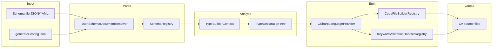
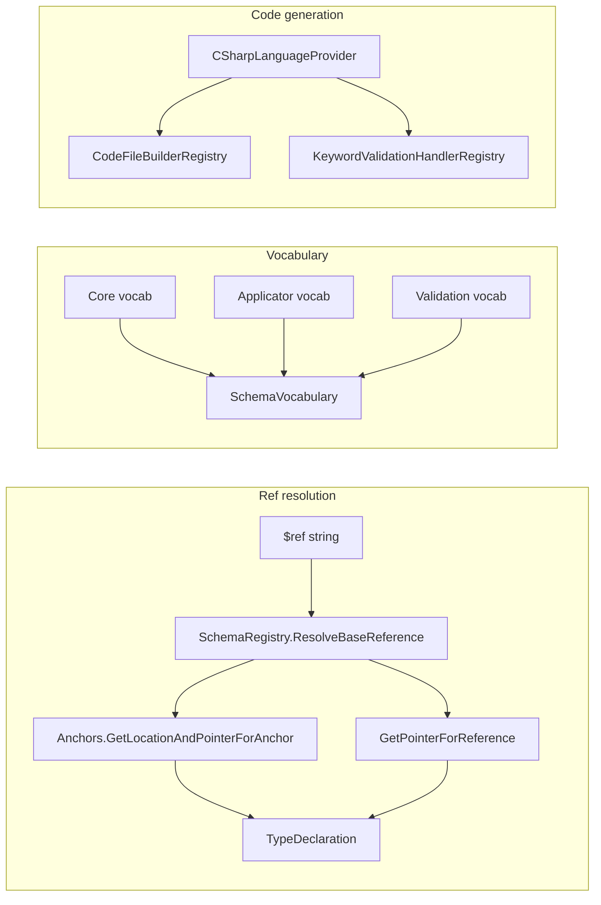

# Corvus.JsonSchema — Research report

## Metadata

- **Library name**: Corvus.JsonSchema
- **Repo URL**: https://github.com/corvus-dotnet/Corvus.JsonSchema
- **Clone path**: `research/repos/csharp/corvus-dotnet-Corvus.JsonSchema/`
- **Language**: C#
- **License**: Apache-2.0

## Summary

Corvus.JsonSchema compiles JSON Schema documents into idiomatic C# types via build-time code generation, and supports ultra-fast, low-allocation validation of JSON data against those schemas. The generated code builds on System.Text.Json and Corvus.Json.ExtendedTypes to provide a rich object model over JSON with strongly typed properties and pattern matching. The library supports drafts 4, 6, 7, 2019-09, 2020-12, and OpenAPI 3.0/3.1. Code generation is available via the `generatejsonschematypes` global tool (CLI) or the Corvus.Json.SourceGenerator package (compile-time). A separate Corvus.Json.Validator assembly provides dynamic validation of JSON against a schema at runtime without code generation.

## JSON Schema support

- **Drafts**: Draft 4, OpenAPI 3.0, Draft 6, Draft 7, 2019-09, 2020-12 (including OpenAPI 3.1).
- **Scope**: Full support across dialects. README states it supports "every feature of JSON schema" from draft4 to draft2020-12. Schema dialects are organized into vocabularies (Core, Applicator, Content, FormatAnnotation, FormatAssertion, MetaData, Unevaluated, Validation) with dialect-specific projects (Corvus.Json.CodeGeneration.4, 6, 7, 201909, 202012, OpenApi30, OpenApi31). Cross-vocabulary references are supported (e.g. draft6 schema referencing draft2020-12).

## Keyword support table

Keyword list derived from vendored draft 2020-12 meta-schemas under `specs/json-schema.org/draft/2020-12/meta/`. Implementation evidence from `Solutions/Corvus.Json.CodeGeneration.202012/`, `Corvus.Json.CodeGeneration/Keywords/`, and `Corvus.Json.CodeGeneration.CSharp/ValidationHandlers/`.

| Keyword | Implemented | Notes |
|---------|-------------|-------|
| $anchor | yes | DollarAnchorKeyword; used for anchor resolution in References.ResolveStandardReference. |
| $comment | yes | DollarCommentKeyword; meta-data, not used for codegen/validation. |
| $defs | yes | DollarDefsKeyword; definitions registered in SchemaRegistry; used for $ref resolution. |
| $dynamicAnchor | yes | DollarDynamicAnchorKeyword; vocabulary keyword. |
| $dynamicRef | yes | DollarDynamicRefKeyword; References.ResolveDynamicReference; feature tests in Draft2020212/dynamicRef.feature. |
| $id | yes | DollarIdKeyword; used for base URI and reference resolution. |
| $ref | yes | DollarRefKeyword; ResolveStandardReference via SchemaRegistry.ResolveBaseReference, Anchors, GetPointerForReference. |
| $schema | yes | DollarSchemaKeyword; vocabulary detection. |
| $vocabulary | yes | DollarVocabularyKeyword; vocabulary selection. |
| additionalProperties | yes | AdditionalPropertiesKeyword; ValidationCodeGeneratorExtensions.Object, PropertiesValidationHandler. |
| allOf | yes | AllOfKeyword; CompositionAllOfValidationHandler. |
| anyOf | yes | AnyOfKeyword; CompositionAnyOfValidationHandler. |
| const | yes | ConstKeyword; ConstValidationHandler, IAnyOfConstantValidationKeyword. |
| contains | yes | ContainsKeyword; ContainsValidationHandler. |
| contentEncoding | yes | ContentEncodingKeyword; Content vocabulary. |
| contentMediaType | yes | ContentMediaTypeKeyword; Content vocabulary. |
| contentSchema | yes | ContentSchemaKeyword; Content vocabulary. |
| default | yes | DefaultKeyword; property accessors return default when ValueKind.Undefined (V4.4). |
| dependentRequired | yes | DependentRequiredKeyword; Validation vocabulary. |
| dependentSchemas | yes | DependentSchemasKeyword; applicator vocabulary. |
| deprecated | yes | DeprecatedKeyword; meta-data vocabulary. |
| description | yes | DescriptionKeyword; emitted as doc comments. |
| else | yes | ElseKeyword; TernaryIfValidationHandler. |
| enum | yes | EnumKeyword; IAnyOfConstantValidationKeyword; validation constants; typed/untyped constant validation. |
| examples | yes | ExamplesKeyword; meta-data vocabulary. |
| exclusiveMaximum | yes | ExclusiveMaximumKeyword; NumberValidationHandler. |
| exclusiveMinimum | yes | ExclusiveMinimumKeyword; NumberValidationHandler. |
| format | yes | FormatWithAnnotationKeyword, FormatWithAssertionKeyword; FormatValidationHandler, WellKnownStringFormatHandler, WellKnownNumericFormatHandler. |
| if | yes | TernaryIfKeyword; TernaryIfValidationHandler. |
| items | yes | ItemsWithSchemaKeyword; array/tuple codegen. |
| maxContains | yes | MaxContainsKeyword; Validation vocabulary. |
| maximum | yes | MaximumKeyword; NumberValidationHandler. |
| maxItems | yes | MaxItemsKeyword; ArrayValidationHandler. |
| maxLength | yes | MaxLengthKeyword; StringValidationHandler. |
| maxProperties | yes | MaxPropertiesKeyword; ObjectValidationHandler. |
| minContains | yes | MinContainsKeyword; Validation vocabulary. |
| minimum | yes | MinimumKeyword; NumberValidationHandler. |
| minItems | yes | MinItemsKeyword; ArrayValidationHandler. |
| minLength | yes | MinLengthKeyword; StringValidationHandler. |
| minProperties | yes | MinPropertiesKeyword; ObjectValidationHandler. |
| multipleOf | yes | MultipleOfKeyword; NumberValidationHandler. |
| not | yes | NotKeyword; CompositionNotValidationHandler. |
| oneOf | yes | OneOfKeyword; CompositionOneOfValidationHandler. |
| pattern | yes | PatternKeyword; regex validation in StringValidationHandler. |
| patternProperties | yes | PatternPropertiesKeyword; applicator vocabulary. |
| prefixItems | yes | PrefixItemsKeyword; tuple-style arrays; TupleValidationHandler. |
| properties | yes | PropertiesKeyword; object codegen, PropertiesValidationHandler. |
| propertyNames | yes | PropertyNamesKeyword; applicator vocabulary. |
| readOnly | yes | ReadOnlyKeyword; meta-data vocabulary. |
| required | yes | RequiredKeyword; object property validation. |
| then | yes | ThenKeyword; TernaryIfValidationHandler. |
| title | yes | TitleKeyword; type naming, doc comments. |
| type | yes | TypeKeyword; TypeValidationHandler; instance type selection. |
| unevaluatedItems | yes | UnevaluatedItemsKeyword; Unevaluated vocabulary; feature tests. |
| unevaluatedProperties | yes | UnevaluatedPropertiesKeyword; Unevaluated vocabulary; feature tests. |
| uniqueItems | yes | UniqueItemsKeyword; UniqueItemsValidationHandler. |
| writeOnly | yes | WriteOnlyKeyword; meta-data vocabulary. |

## Constraints

Validation keywords are enforced in the generated code. Each generated type has `IsValid()` and `Validate(ValidationContext, ValidationLevel)` methods. Validation handlers (TypeValidationHandler, ObjectValidationHandler, ArrayValidationHandler, NumberValidationHandler, StringValidationHandler, FormatValidationHandler, ConstValidationHandler, CompositionAllOf/AnyOf/OneOf/NotValidationHandler, etc.) emit validation logic that checks minLength, maxLength, pattern, minimum, maximum, exclusiveMinimum, exclusiveMaximum, multipleOf, minItems, maxItems, uniqueItems, minProperties, maxProperties, required, format assertions, const, enum, and composition keywords. The `--assertFormat` CLI option (default true) controls format assertion. Constraints are not used only for structure; they are enforced at runtime in the generated validation code.

## High-level architecture

- **Input**: JSON (or YAML) schema file(s), config file (generator-config.json), or source-generator attribute with schema path.
- **Parse**: Schema loaded via `IJsonSchemaDocumentResolver`; JSON parsed into `JsonElement`; dialect inferred from `$schema` or `--useSchema`.
- **Analyse**: `TypeBuilderContext` and `SchemaRegistry` resolve references; vocabularies provide keywords; `TypeDeclaration` tree built from schema.
- **Emit**: `CSharpLanguageProvider.GenerateCodeFor` iterates `TypeDeclaration`s; `CodeFileBuilderRegistry` emits partial classes; `KeywordValidationHandlerRegistry` appends validation methods.
- **Output**: C# source files (one per type or consolidated), written to `--outputPath` or build output.

Main projects: **Corvus.Json.CodeGenerator** (CLI), **Corvus.Json.SourceGenerator** (MSBuild source generator), **Corvus.Json.CodeGeneration** (common analyser engine), **Corvus.Json.CodeGeneration.CSharp** (C# ILanguageProvider), **Corvus.Json.CodeGeneration.202012** (and 201909, 7, 6, 4, OpenApi30, OpenApi31) (dialect vocabularies), **Corvus.Json.ExtendedTypes** (JSON model + validation base), **Corvus.Json.Validator** (dynamic validation).

## Medium-level architecture

- **Schema representation**: Schemas parsed as `JsonElement`; `LocatedSchema` pairs location (`JsonReference`) with schema; `TypeDeclaration` holds keyword results, properties, subschemas, and validation handlers.
- **$ref / $defs resolution**: `References.ResolveStandardReference` decodes the ref, calls `SchemaRegistry.ResolveBaseReference` for the base schema, then `Anchors.GetLocationAndPointerForAnchor` (if fragment is anchor) or `References.GetPointerForReference` (if pointer). `$defs` and `definitions` registered via `DollarDefsKeyword` / `DefinitionsKeyword`. External refs supported via `IJsonSchemaDocumentResolver` (e.g. `HttpClientDocumentResolver`).
- **Vocabulary / keyword dispatch**: Each dialect (202012, 201909, 7, 6, 4, OpenApi30) defines an `IVocabulary` with `IKeyword` instances. `SchemaVocabulary` composes Core, Applicator, Content, FormatAnnotation, FormatAssertion, MetaData, Unevaluated, Validation. Keywords implement `IKeyword`, `IValidationKeyword`, `IPropertyProviderKeyword`, etc. C# provider registers validation handlers per keyword via `KeywordValidationHandlerRegistry`.

- **Code emission**: `CodeFileBuilderRegistry` holds `ICodeFileBuilder` instances (e.g. ObjectPartial, ArrayPartial); each builder emits partial class files. `CodeGenerator` appends to in-memory chunks; `GetGeneratedCodeFiles` returns `GeneratedCodeFile` collection. Validation methods appended via `ValidationCodeGeneratorExtensions.*` and handlers (e.g. `AppendConstValidation`, `AppendFormatValidation`).

## Low-level details

- **Format handlers**: `WellKnownStringFormatHandler` and `WellKnownNumericFormatHandler` map format strings (date, date-time, uuid, uri, etc.) to `JsonDate`, `JsonUri`, etc. Format assertion can be forced with `--assertFormat` or `CorvusJsonSchemaAlwaysAssertFormat`.
- **Naming**: `NameHeuristicRegistry` and built-in heuristics (BuiltInStringTypeNameHeuristic, BuiltInObjectTypeNameHeuristic, etc.) derive type names from `title`, `$corvusTypeName`, document structure. V4.2.0 fixed parameter naming for `JsonObject.Create()` when properties differ only by case.
- **Optional naming heuristics**: Disabled via `--disableOptionalNamingHeuristics` or `CorvusJsonSchemaDisableOptionalNamingHeuristics`; specific heuristics disabled with `--disableNamingHeuristic` / `CorvusJsonSchemaDisabledNamingHeuristics`.

## Output and integration

- **Vendored vs build-dir**: Output path configurable via `--outputPath` or `generator-config.json`; default is adjacent to schema. Source generator emits into obj (compiler-generated). No fixed vendored layout.
- **API vs CLI**: (1) **CLI** `generatejsonschematypes` (Corvus.Json.JsonSchema.TypeGeneratorTool): `generatejsonschematypes <schemaFile> [OPTIONS]`, `config`, `validateDocument`, `listNameHeuristics`. (2) **Source generator**: `[JsonSchemaTypeGenerator("path/to/schema.json")]` on partial struct; schema as AdditionalFiles. (3) **Library**: `CSharpLanguageProvider.GenerateCodeFor(typeDeclarations)` for custom pipelines.
- **Writer model**: `CodeGenerator` builds in-memory chunks; output written to files by CLI or build. No generic `Stream`/`TextWriter` abstraction in public API.

## Configuration

- **CLI options**: `--rootNamespace`, `--rootPath`, `--useSchema`, `--outputPath`, `--outputMapFile`, `--outputRootTypeName`, `--rebaseToRootPath`, `--assertFormat`, `--disableOptionalNamingHeuristics`, `--optionalAsNullable`, `--yaml`, `--addExplicitUsings`, `--useImplicitOperatorString` (legacy).
- **MSBuild properties**: `CorvusJsonSchemaOptionalAsNullable`, `CorvusJsonSchemaDisableOptionalNamingHeuristics`, `CorvusJsonSchemaDisabledNamingHeuristics`, `CorvusJsonSchemaAlwaysAssertFormat`, `CorvusJsonSchemaDefaultAccessibility`, `CorvusJsonSchemaUseImplicitOperatorString`, `CorvusJsonSchemaFallbackVocabulary`, `CorvusJsonSchemaUseSchema`.
- **generator-config.json**: Schema for multi-schema generation; namespace mappings, type names, dependency pre-loading.
- **Naming**: `$corvusTypeName` keyword for explicit type name hint. Optional naming heuristics configurable.

## Pros/cons

- **Pros**: Full draft 4–2020-12 and OpenAPI 3.0/3.1 support; codegen + validation in one; source generator and CLI; cross-dialect refs; YAML support; low-allocation validation; pattern matching; Bowtie-tested; Apache-2.0.
- **Cons**: C# only; no reverse generation; dynamic validator has cold-start cost (Roslyn JIT); netstandard2.0 requires net80 consumer for full features.

## Testability

- **Testing**: SpecFlow feature files in `Corvus.Json.Specs` driven by JSON-Schema-Test-Suite submodule (`./JSON-Schema-Test-Suite`). Features under `Features/JsonSchema/` per draft (Draft4, Draft6, Draft7, Draft201909, Draft2020212, OpenApi30) and `Features/AdditionalSchema/`. `Corvus.JsonSchema.SpecGenerator` generates feature files from the test suite.
- **Running tests**: From clone root, `git submodule update --init --recursive` (for JSON-Schema-Test-Suite), then `dotnet test Solutions/Corvus.JsonSchema.sln`. Driver: `JsonSchemaBuilderDriver`.
- **Fixtures**: JSON-Schema-Test-Suite provides shared fixtures. Corvus sandbox and example projects under `Solutions/Sandbox*`, `docs/ExampleRecipes/`.

## Performance

- **Benchmarks**: `Corvus.Json.Benchmarking` uses BenchmarkDotNet. Benchmarks include `ValidateSmallDocument`, `ValidateLargeDocumentWithFullAnnotationCollection`. Measures validation wall time.
- **Entry points for benchmarking**: (1) CLI `generatejsonschematypes schema.json --outputPath out/`. (2) `CSharpLanguageProvider.Default.GenerateCodeFor(typeDeclarations)`. (3) Generated type `Person.Parse(jsonText)` then `person.Validate(...)` or `person.IsValid()`. (4) Dynamic validator: `CorvusValidator.JsonSchema.FromFile("schema.json")` then `schema.Validate(element)`.

## Determinism and idempotency

Generated output is deterministic. `TypeDeclaration.PropertyDeclarations` returns `properties.Values.OrderBy(p => p.JsonPropertyName)`. Validation constant and regex iteration use `OrderBy(k => k.Key.Keyword)` for stable ordering. Type declarations are iterated in a consistent order from the schema registry. Repeated runs with the same schema and options produce identical output. Small schema changes yield localized diffs (per-type files).

## Enum handling

`EnumKeyword` implements `IAnyOfConstantValidationKeyword`; `TryGetValidationConstants` returns all array elements (no deduplication). Validation checks the instance against each constant. Duplicate enum values (e.g. `["a", "a"]`) are both present in the constants array; validation passes if the instance equals any. For case collisions (e.g. `["a", "A"]`): both are distinct JSON values and both are valid; the generated type wraps `JsonAny` and validates by equality, so both "a" and "A" are accepted. There is no C# enum with named variants; the type is a value wrapper that must match one of the constants. No explicit deduplication or distinct-variant naming for case collisions; both values remain valid.

## Reverse generation (Schema from types)

No. The library generates C# code from JSON Schema only. There is no API to produce a JSON Schema from C# types. The Corvus.Json.JsonSchema.* packages provide object models for reading/writing JSON Schema documents but do not extract schema from arbitrary .NET types.

## Multi-language output

C# only. The `ILanguageProvider` abstraction allows other providers (e.g. another language), but the repository contains only `CSharpLanguageProvider`. All generated code is C#.

## Model deduplication and $ref/$defs

**$ref / $defs**: Each `$ref` resolves to a single `TypeDeclaration`; refs to the same definition reuse that type. `SchemaRegistry` and `TypeBuilderContext` ensure one type per schema location. `$defs` and `definitions` register subschemas; refs resolve to them and emit a single generated type.

**Inline object schemas**: Inline object definitions in different branches receive type names from context (parent + path). If two inline shapes are structurally identical but in different locations, they may get different generated types (different context-derived names). Deduplication is by schema location/ref, not by structural equivalence. Using `$ref` and `$defs` is the supported way to share a single type.

## Validation (schema + JSON → errors)

Yes. Two modes:

1. **Generated-code validation**: Each generated type has `IsValid()` and `Validate(ValidationContext context, ValidationLevel level)`. `Validate` returns `ValidationResult` with `Results` (list of `ValidationResult` items) and `IsValid`. Output format includes JSON Schema output format location information.

2. **Dynamic validation**: `Corvus.Json.Validator` provides `CorvusValidator.JsonSchema.FromFile(path)` (or equivalent) returning a schema object; `schema.Validate(JsonElement)` validates without codegen. Uses Roslyn under the hood; cold-start cost on first use. Also: CLI `generatejsonschematypes validateDocument schema.json document.json` prints validation errors to console.
