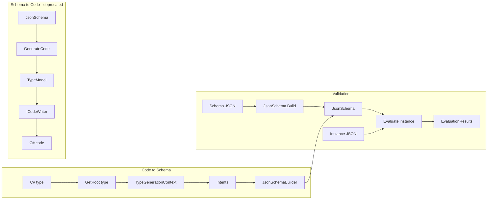
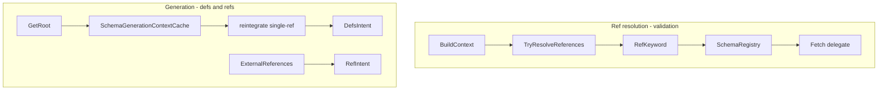

# json-everything — Research report

## Metadata

- **Library name**: json-everything (JsonSchema.Net and related packages)
- **Repo URL**: https://github.com/json-everything/json-everything
- **Clone path**: `research/repos/csharp/json-everything-json-everything/`
- **Language**: C#
- **License**: MIT (Copyright (c) .NET Foundation and Contributors)

## Summary

json-everything is a C# ecosystem of libraries for JSON handling built on System.Text.Json. Its JSON Schema components include: (1) **JsonSchema.Net** — full validation of JSON against JSON Schema (drafts 6, 7, 2019-09, 2020-12); (2) **JsonSchema.Net.Generation** — code → schema (generates JSON Schema from C# types via intents and refiners, with optional source generation at compile time); (3) **JsonSchema.Net.CodeGeneration** — schema → C# code, **deprecated** and source-removed from the repo, superseded by Corvus.JsonSchema. The active schema→code capability is no longer maintained; the validation and code→schema generation remain active and in development.

## JSON Schema support

- **Drafts**: Draft-06, Draft-07, Draft 2019-09, Draft 2020-12. Evidence: `src/JsonSchema/README.md`; `VocabularyRegistry.cs` and `Vocabulary.202012.cs` register vocabularies for 2019-09 and 2020-12; draft-06 and draft-07 via legacy handlers (e.g. `Keywords/Draft06/`, `Meta-Schemas/schema06.json`, `schema07.json`).
- **Scope**: Full validation for the listed drafts. Vocabulary-based architecture; each draft exposes core, applicator, validation, meta-data, format, content, and (for 2020-12) unevaluated vocabularies. Schema → code (CodeGeneration) is deprecated; code → schema (Generation) is active.

## Keyword support table

Keyword list derived from vendored draft 2020-12 meta-schemas (`specs/json-schema.org/draft/2020-12/meta/*.json`). Implementation evidence from `src/JsonSchema/Keywords/`, `Vocabulary.202012.cs`, `Vocabulary.201909.cs`, and draft-specific keyword handlers.

| Keyword | Implemented | Notes |
|---------|-------------|-------|
| $anchor | yes | Core; AnchorKeyword; used for resolution. |
| $comment | yes | Core; CommentKeyword; annotation only. |
| $defs | yes | Core; DefsKeyword; container for definitions. |
| $dynamicAnchor | yes | Core; DynamicAnchorKeyword; for $dynamicRef. |
| $dynamicRef | yes | Core; Draft202012.DynamicRefKeyword; 2020-12 dynamic references. |
| $id | yes | Core; IdKeyword; base URI and resolution. |
| $ref | yes | Core; RefKeyword; static reference resolution. |
| $schema | yes | Core; SchemaKeyword; dialect selection. |
| $vocabulary | yes | Draft201909.VocabularyKeyword; vocabulary declarations. |
| additionalProperties | yes | Applicator; AdditionalPropertiesKeyword. |
| allOf | yes | Applicator; AllOfKeyword. |
| anyOf | yes | Applicator; AnyOfKeyword. |
| const | yes | Validation; ConstKeyword. |
| contains | yes | Applicator; ContainsKeyword. |
| contentEncoding | yes | Content; ContentEncodingKeyword. |
| contentMediaType | yes | Content; ContentMediaTypeKeyword. |
| contentSchema | yes | Content; ContentSchemaKeyword. |
| default | yes | Meta-data; DefaultKeyword; annotation. |
| dependentRequired | yes | Validation; DependentRequiredKeyword. |
| dependentSchemas | yes | Applicator; DependentSchemasKeyword. |
| deprecated | yes | Meta-data; DeprecatedKeyword; annotation. |
| description | yes | Meta-data; DescriptionKeyword; annotation. |
| else | yes | Applicator; ElseKeyword; if-then-else. |
| enum | yes | Validation; EnumKeyword. |
| examples | yes | Meta-data; ExamplesKeyword; annotation. |
| exclusiveMaximum | yes | Validation; ExclusiveMaximumKeyword. |
| exclusiveMinimum | yes | Validation; ExclusiveMinimumKeyword. |
| format | yes | Format-annotation and format-assertion; FormatKeyword. |
| if | yes | Applicator; IfKeyword. |
| items | yes | Applicator; ItemsKeyword; Draft06 has additionalItems. |
| maxContains | yes | Validation; MaxContainsKeyword. |
| maximum | yes | Validation; MaximumKeyword. |
| maxItems | yes | Validation; MaxItemsKeyword. |
| maxLength | yes | Validation; MaxLengthKeyword. |
| maxProperties | yes | Validation; MaxPropertiesKeyword. |
| minContains | yes | Validation; MinContainsKeyword. |
| minimum | yes | Validation; MinimumKeyword. |
| minItems | yes | Validation; MinItemsKeyword. |
| minLength | yes | Validation; MinLengthKeyword. |
| minProperties | yes | Validation; MinPropertiesKeyword. |
| multipleOf | yes | Validation; MultipleOfKeyword. |
| not | yes | Applicator; NotKeyword. |
| oneOf | yes | Applicator; OneOfKeyword. |
| pattern | yes | Validation; PatternKeyword. |
| patternProperties | yes | Applicator; PatternPropertiesKeyword. |
| prefixItems | yes | Applicator; PrefixItemsKeyword; 2020-12. |
| properties | yes | Applicator; PropertiesKeyword. |
| propertyNames | yes | Applicator; PropertyNamesKeyword. |
| readOnly | yes | Meta-data; ReadOnlyKeyword; annotation. |
| required | yes | Validation; RequiredKeyword. |
| then | yes | Applicator; ThenKeyword. |
| title | yes | Meta-data; TitleKeyword; annotation. |
| type | yes | Validation; TypeKeyword. |
| unevaluatedItems | yes | Unevaluated; UnevaluatedItemsKeyword. |
| unevaluatedProperties | yes | Unevaluated; UnevaluatedPropertiesKeyword. |
| uniqueItems | yes | Validation; UniqueItemsKeyword. |
| writeOnly | yes | Meta-data; WriteOnlyKeyword; annotation. |

Note: Draft-06 also supports `definitions`, `additionalItems`, `dependencies`; draft-2019-09 supports `$recursiveRef` and `$recursiveAnchor`.

## Constraints

- **Validation (JsonSchema.Net)**: All validation keywords are enforced at runtime during `Evaluate()`. Schema is built into an internal graph of `JsonSchemaNode` objects; each keyword has an `IKeywordHandler` that performs validation. Constraints (minLength, maxItems, pattern, etc.) are library-driven, not generated into user code.
- **Code→Schema (Generation)**: Validation keywords are emitted into the schema as intents (e.g. MinLengthIntent, MaxItemsIntent); the generated schema can later be used for runtime validation. No constraint enforcement in generated C# types.
- **Schema→Code (CodeGeneration, deprecated)**: Release notes indicate `additionalProperties: false` generated sealed classes; `readOnly`/`writeOnly` generated getter/setter-only properties. Constraint keywords inform structure, not runtime checks in generated code. Unknown for minLength, pattern, etc.

## High-level architecture

- **Validation**: Schema JSON or `JsonSchemaBuilder` → `JsonSchema.Build()` / `FromText()` / `FromFile()` → `JsonSchema` (Root node, keyword handlers). `Evaluate(instance)` walks the schema graph, dispatches to keyword handlers, returns `EvaluationResults`.
- **Code→Schema (Generation)**: C# type → `SchemaGenerationContextCache.GetRoot(type)` → `TypeGenerationContext` with `GenerateIntents()` → Intents applied to `JsonSchemaBuilder` → `JsonSchema`. Optional source generator: `[GenerateJsonSchema]` on types → `JsonSchemaSourceGenerator` → compile-time schema emission.
- **Schema→Code (CodeGeneration, deprecated)**: `CodeGenExtensions.GenerateCode(schema, ICodeWriter, EvaluationOptions)` → schema parsed → TypeModel(s) → `ICodeWriter.Write(StringBuilder, TypeModel)` → C# text. Only API and XML docs available; source not in clone.

## Medium-level architecture

- **Validation**: `VocabularyRegistry` holds vocabularies (2019-09, 2020-12 core, applicator, validation, meta-data, format, content, unevaluated). `SchemaRegistry` stores schemas by URI and anchors; `Fetch` delegate loads external schemas. `JsonSchema.Build()` parses JSON into `JsonSchemaNode` graph with `KeywordData` per keyword; `TryResolveReferences()` resolves `$ref` and `$dynamicRef`; `DetectCycles()` prevents reference cycles. `Evaluate()` invokes each keyword's `Evaluate(KeywordData, EvaluationContext)`.
- **Generation**: `SchemaGenerationContextCache` caches `TypeGenerationContext` by type. `TypeGenerationContext.GenerateIntents()` uses `GeneratorRegistry.Get(Type)` or custom generators, then `AttributeHandler`, then refiners (e.g. `ArrayItemsRefiner`, `ObjectValuesRefiner`). Intents (`PropertiesIntent`, `RequiredIntent`, `RefIntent`, `DefsIntent`, etc.) apply to `JsonSchemaBuilder`. `GetRoot()` reintegrates single-reference contexts and collects `$defs` for types referenced more than once. `ExternalReferences` maps types to external `$id` URIs for `$ref` emission.
- **$ref resolution (validation)**: `RefKeyword.Evaluate()` resolves via `SchemaRegistry`; `Build()` registers embedded resources and anchors; `TryResolveReferences` walks nodes and resolves refs. External schemas loaded via `Fetch` when referenced.

## Low-level details

- **Format**: Format-annotation (annotations only) and format-assertion (validation) vocabularies; FormatKeyword has `Annotate` and `Validate` variants.
- **Source generator**: `JsonSchemaSourceGenerator` (IIncrementalGenerator) finds types with `[GenerateJsonSchema]`, analyzes via `TypeAnalyzer`, emits via `SchemaCodeEmitter.EmitGeneratedClass()`. Generates `*.g.cs` per namespace. Disable via `build_property.DisableJsonSchemaSourceGeneration=true`.

## Output and integration

- **Vendored vs build-dir**: Validation and Generation produce in-memory `JsonSchema`; no vendored output. Source generator emits `.g.cs` files into build output (typically obj/).
- **API vs CLI**: Library API only. No standalone CLI for schema generation or code generation. `JsonSchema.FromText()`, `JsonSchema.Evaluate()`, `JsonSchemaBuilder.FromType()`, `CodeGenExtensions.GenerateCode()` (deprecated).
- **Writer model**: CodeGeneration (deprecated) uses `ICodeWriter.Write(StringBuilder, TypeModel)`; output is string/builder. Generation applies intents to `JsonSchemaBuilder`, which produces `JsonSchema`.

## Configuration

- **Generation**: `SchemaGeneratorConfiguration` — `PropertyOrder`, `PropertyNameResolver`, `TypeNameGenerator`, `Refiners`, `Generators`, `ExternalReferences`, `StrictConditionals`, XML comment registration. `[GenerateJsonSchema]` attribute: `PropertyNaming`, `PropertyOrder`, `StrictConditionals`.
- **Validation**: `EvaluationOptions` — `OutputFormat`, `ValidateAs`, `RequireFormatValidation`, etc. `BuildOptions` for schema parsing. `SchemaRegistry.Fetch` for external schema loading.

## Pros/cons

- **Pros**: Multi-draft support (6, 7, 2019-09, 2020-12); vocabulary-based extensibility; full validation keyword set; code→schema with intents/refiners; source generator for compile-time schemas; System.Text.Json integration; ASP.NET API integration (JsonSchema.Net.Api); DataAnnotations support (JsonSchema.Net.Generation.DataAnnotations); MIT license; .NET Foundation support; JSON Schema Test Suite on Bowtie.
- **Cons**: Schema→code (CodeGeneration) deprecated and source removed; users directed to Corvus.JsonSchema for schema→code; maintenance fee/EULA for binary releases (per README).

## Testability

- **Build and run**: `dotnet test` from repo root runs all tests. `json-everything.sln` includes JsonSchema.Tests, JsonSchema.Generation.Tests, JsonSchema.Generation.DataAnnotations.Tests, etc.
- **Test files**: `src/JsonSchema.Tests/` (validation), `src/JsonSchema.Generation.Tests/` (schema generation, source generation). Tests use fixtures and assertions on evaluation results and generated schemas.
- **Entry point for benchmarking**: `tools/Benchmarks/` — `SingleSchemaRunner` for validation (`JsonSchemaNetEvaluateOnly`), `TestSuiteRunner` for schema suite; BenchmarkDotNet with `[MemoryDiagnoser]`, `[EventPipeProfiler]`.

## Performance

- Benchmarks in `tools/Benchmarks/`: SchemaSuite (validation), Pointer, LogicSuite. `SingleSchemaRunner` benchmarks `schema.Evaluate(instance)` with a fixed order schema. BenchmarkDotNet, `SimpleJob(RuntimeMoniker.Net10_0)` in source. Run with `dotnet run -c Release` in tools/Benchmarks.
- **Entry points**: `JsonSchema.Evaluate(JsonElement, EvaluationOptions)` for validation; schema built once, evaluate in loop for throughput.

## Determinism and idempotency

- **Validation**: Deterministic; same schema and instance produce same `EvaluationResults`.
- **Generation**: `SchemaGenerationContextCache` and intent application order; property order configurable (`PropertyOrder.AsDeclared`, etc.). Unknown if output is fully idempotent across runs.
- **CodeGeneration (deprecated)**: Unknown.

## Enum handling

- **Validation**: `EnumKeyword.Evaluate()` checks instance against enum array (JSON equality). No explicit dedupe; duplicates would both match.
- **Generation**: `EnumIntent` with `Names` or `JsonNode` values; `Apply()` calls `builder.Enum()`. Enum values from C# enums or attributes.
- **CodeGeneration (deprecated)**: Unknown for duplicate entries or case collisions.

## Reverse generation (Schema from types)

**Yes.** JsonSchema.Net.Generation is the primary mechanism.

- **API**: `new JsonSchemaBuilder().FromType<T>(configuration).Build()` or `FromType(typeof(T), configuration)`. `SchemaGenerationContextCache.GetRoot(type)` builds context, applies intents to builder.
- **Source generator**: `[GenerateJsonSchema]` on class/interface/struct; compile-time generation of static schema property; used by `GenerativeValidatingJsonConverter` for validation during deserialization.
- **Scope**: Object, array, enum, primitives; `$defs` for nested types; `$ref` via `ExternalReferences`; DataAnnotations via JsonSchema.Net.Generation.DataAnnotations.

## Multi-language output

- **CodeGeneration (deprecated)**: `ICodeWriter` abstraction; `CodeWriters.CSharp` provides C#. XML docs mention "writer for the output language" but only C# writer documented. Unknown if other languages exist.
- **Generation**: Produces JSON Schema (schema document), not code in other languages. Single output format.

## Model deduplication and $ref/$defs

- **Validation**: `$ref` and `$defs` fully resolved. Each definition in `$defs` is a distinct schema; `$ref` points to it. SchemaRegistry deduplicates by URI.
- **Generation**: `SchemaGenerationContextCache` caches `TypeGenerationContext` per type. Types referenced more than once (and meeting `CanBeReferenced()`) go into `DefsIntent` with `DefinitionName` as key. `ExternalReferences` maps types to external URIs → `RefIntent` instead of inline schema. Reintegration inlines single-use nested types when safe.
- **CodeGeneration (deprecated)**: TypeModel has `Name` from `title`; `Equals`/`GetHashCode` for deduplication. Unknown how $defs/$ref map to generated types.

## Validation (schema + JSON → errors)

**Primary purpose of JsonSchema.Net.**

- **API**: `JsonSchema schema = JsonSchema.FromText(content)` or `FromFile(filename)` or `JsonSerializer.Deserialize<JsonSchema>(content)`; `EvaluationResults results = schema.Evaluate(instance, options)`. Results include `IsValid`, `Details`, annotations, errors.
- **Schema compilation**: `Build()` parses schema into `JsonSchemaNode` graph, resolves `$ref` via SchemaRegistry, detects cycles.
- **Instance validation**: `Evaluate()` walks instance against schema; each keyword handler runs; errors accumulated in `EvaluationResults`. `OutputFormat` controls output structure (Flag, Basic, Detailed).
- **Integration**: `ValidatingJsonConverter` for serialization; `GenerativeValidatingJsonConverter` for compile-time schema. JsonSchema.Net.Api for ASP.NET endpoint validation.
