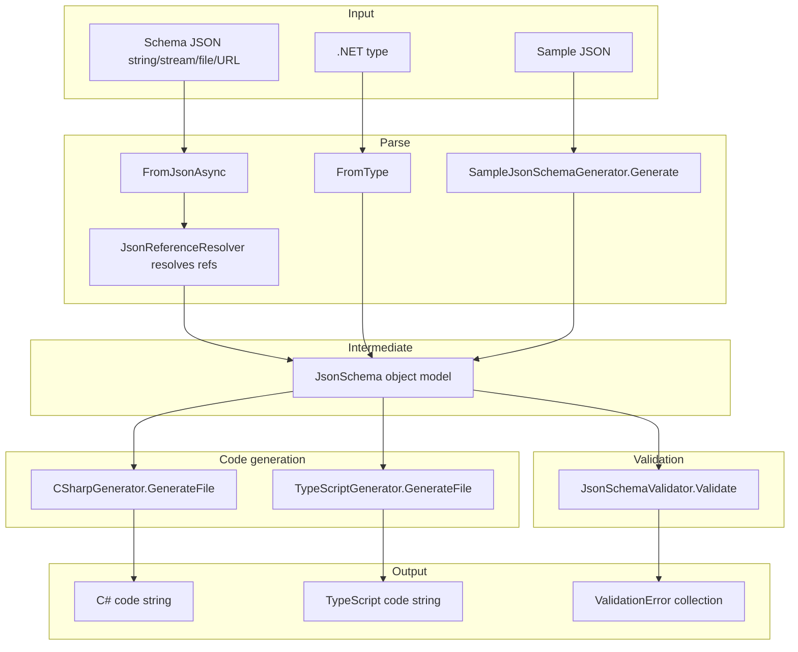
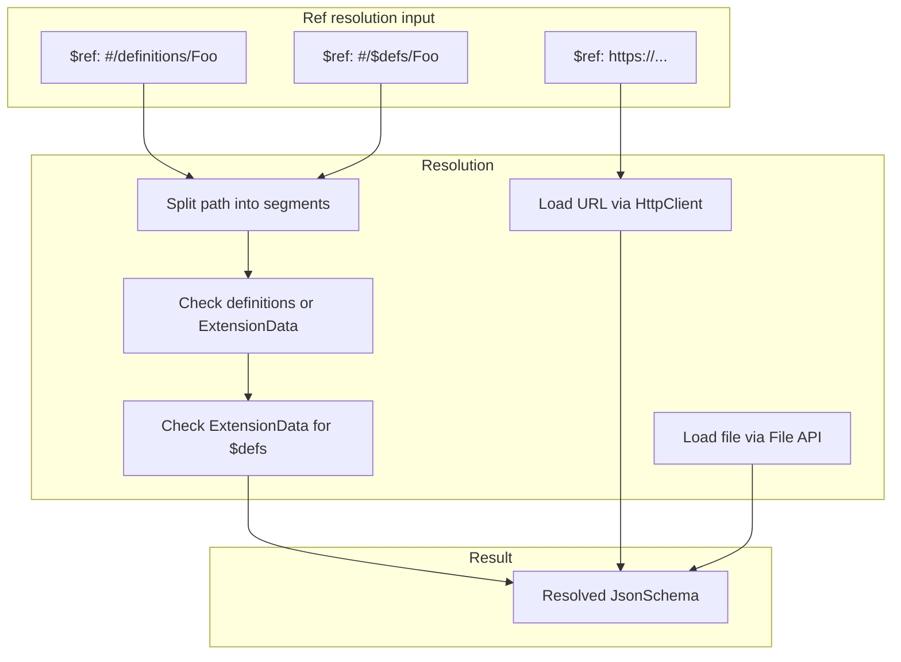

# NJsonSchema (Rico Suter) — Research report

## Metadata

- **Library name**: NJsonSchema for .NET
- **Repo URL**: https://github.com/RicoSuter/NJsonSchema
- **Clone path**: `research/repos/csharp/RicoSuter-NJsonSchema/`
- **Language**: C#
- **License**: MIT (https://github.com/RicoSuter/NJsonSchema/blob/master/LICENSE.md)

## Summary

NJsonSchema is a .NET library that reads, generates, and validates JSON Schema draft v4+ schemas. It supports schema-to-code generation (C# classes and TypeScript interfaces/classes), reverse generation (JSON Schema from .NET types via reflection or from sample JSON), and runtime validation of JSON data against a schema. The library uses Json.NET and Namotion.Reflection. It is widely used by NSwag for Swagger/OpenAPI tooling. Output languages for codegen are C# and TypeScript.

## JSON Schema support

- **Drafts**: JSON Schema draft-04, draft-06, and draft-07. README states "draft v4+"; the default serialization target is draft-04 (`SchemaVersion = "http://json-schema.org/draft-04/schema#"` in `JsonSchema.cs`). Tests reference draft-04, draft-06, and draft-07.
- **Scope**: Full schema parsing and serialization; runtime validation; code generation from schema; reverse generation (type → schema, sample JSON → schema). Supports Swagger/OpenAPI DTO schemas in addition to pure JSON Schema.

## Keyword support table

Keyword list derived from vendored draft-04 and draft-07 meta-schemas. Implementation evidence from `JsonSchema.cs`, `JsonSchema.Serialization.cs`, `JsonSchemaValidator.cs`, and codegen modules.

| Keyword | Implemented | Notes |
|---------|-------------|-------|
| $id | yes | Stored as `Id`; also supports draft-04 `id` via `[JsonProperty("id")]`. |
| $schema | yes | Stored as `SchemaVersion`; default draft-04. |
| $ref | yes | Resolved via `JsonReferenceResolver` (document, URL, file); `#/definitions/X` and `#/$defs/X` (via ExtensionData) supported. |
| $comment | no | Not present in JsonSchema model; would fall to ExtensionData if present. |
| $defs | yes | Resolved via ExtensionData and document reference path; `#/$defs/X` works (NullableReferenceTypesTests). |
| id | yes | Draft-04; mapped to `Id` property. |
| title | yes | Serialized and used as type name hint when valid identifier. |
| description | yes | Stored on schema and property. |
| default | yes | Stored; used by `SampleJsonDataGenerator`. |
| readOnly | yes | JsonSchemaProperty; OpenApi/Swagger support. |
| writeOnly | yes | JsonSchemaProperty; OpenApi support. |
| examples | no | Not in model; OpenApi has `x-example`. |
| multipleOf | yes | Validated; stored on schema. |
| maximum | yes | Validated; stored; codegen emits `[Range]` when GenerateDataAnnotations. |
| exclusiveMaximum | yes | Draft-04 boolean and draft-06+ number; both supported. |
| minimum | yes | Validated; stored; codegen emits `[Range]`. |
| exclusiveMinimum | yes | Draft-04 boolean and draft-06+ number; both supported. |
| maxLength | yes | Validated; codegen emits `[MaxLength]` / `[StringLength]`. |
| minLength | yes | Validated; codegen emits `[MinLength]` / `[StringLength]`. |
| pattern | yes | Validated via Regex; codegen emits `[RegularExpression]`. |
| additionalItems | yes | Boolean or schema; validated. |
| items | yes | Single schema or array (tuple-style). |
| maxItems | yes | Validated. |
| minItems | yes | Validated. |
| uniqueItems | yes | Validated. |
| contains | no | Not in JsonSchema model; not validated. |
| maxProperties | yes | Validated. |
| minProperties | yes | Validated. |
| required | yes | Stored; validated; codegen emits `[Required]`. |
| additionalProperties | yes | Boolean or schema; validated. |
| definitions | yes | Stored in `Definitions`; serialized; referenced by $ref. |
| properties | yes | Full support. |
| patternProperties | yes | Full support; codegen emits dictionary types. |
| dependencies | no | Not in JsonSchema model; not validated. |
| propertyNames | no | Not in JsonSchema model; not validated. |
| const | no | Not in JsonSchema model; use enum with single value. |
| enum | yes | Stored in `Enumeration`; validated; codegen emits C#/TS enums. |
| type | yes | `JsonObjectType` flags; supports all primitives. |
| format | yes | Stored; validated via `IFormatValidator` (date-time, date, time, email, hostname, ipv4, ipv6, uuid, uri, base64, byte, duration, guid). |
| contentMediaType | no | Not validated. |
| contentEncoding | no | Not validated. |
| if | no | Not in model; not validated. |
| then | no | Not in model; not validated. |
| else | no | Not in model; not validated. |
| allOf | yes | Stored; validated; codegen uses for inheritance. |
| anyOf | yes | Stored; validated. |
| oneOf | yes | Stored; validated; used for nullable refs. |
| not | yes | Stored; validated. |

## Constraints

- **Validation**: All supported validation keywords (type, enum, pattern, min/max length, min/max items/properties, required, multipleOf, etc.) are enforced at runtime by `JsonSchemaValidator`.
- **Codegen**: The C# generator emits DataAnnotations when `GenerateDataAnnotations` is true: `[Required]`, `[Range]`, `[StringLength]`, `[MinLength]`, `[MaxLength]`, `[RegularExpression]`. These provide compile-time and runtime (e.g. ASP.NET) validation in generated code. TypeScript generator does not emit validation logic into generated code.

## High-level architecture

- **Input**: JSON Schema (string, stream, file, URL) or .NET type.
- **Parse**: `JsonSchema.FromJsonAsync()` / `FromFileAsync()` / `FromUrlAsync()` deserializes via Json.NET; `JsonSchemaReferenceUtilities.UpdateSchemaReferencesAsync()` resolves $ref (document, URL, file) using `JsonReferenceResolver`.
- **Intermediate**: `JsonSchema` object model with `Definitions`, `Properties`, `Enumeration`, `AllOf`/`AnyOf`/`OneOf`, etc.
- **Codegen**: `CSharpGenerator` or `TypeScriptGenerator` takes root schema, uses `TypeResolverBase` to gather types from definitions and references, generates `CodeArtifact`s per type, concatenates into file string.
- **Reverse**: `JsonSchema.FromType<T>()` uses `JsonSchemaGenerator` (reflection); `SampleJsonSchemaGenerator.Generate()` infers schema from sample JSON.

## Medium-level architecture

- **Key types**: `JsonSchema` (root model, extends `JsonReferenceBase`), `JsonSchemaProperty`, `JsonReferenceResolver` (resolves #/definitions, #/$defs, URLs, files), `JsonSchemaAppender` (appends external schemas into root), `CSharpTypeResolver` / `TypeScriptTypeResolver` (map schema → type name), `GeneratorBase` (orchestrates `GenerateTypes()`).
- **$ref resolution**: For `#/` paths, `ResolveDocumentReference` walks object graph by JSON Pointer segments; checks `ExtensionData` for `$defs` etc. For http(s) and file paths, `ResolveUrlReferenceAsync` / `ResolveFileReferenceAsync` load and append schema. References stored in `_resolvedObjects` by document path.
- **Definitions vs $defs**: Serialization uses `definitions`; deserialization maps `definitions` to `Definitions`. `$defs` is not a JsonProperty—it lands in `ExtensionData`; `ResolveDocumentReference` resolves `#/$defs/X` by reading `ExtensionData["$defs"]`.

## Low-level details

- **DictionaryKey**: Custom extension `x-dictionaryKey` (propertyNames-like) for dictionary key schema; used by codegen for `Dictionary<TKey, TValue>`.
- **Nullable representation**: Draft-04 style uses `oneOf` with null schema; `SchemaType.SchemaType` controls nullability handling (e.g. OpenApi `nullable`).
- **Format validators**: Pluggable `IFormatValidator`; built-in for date-time, date, time, email, hostname, ipv4, ipv6, uuid, uri, base64, byte, duration, guid.

## Output and integration

- **Vendored vs build-dir**: Generated code is typically emitted to a build output directory or in-memory; not vendored by default. Caller controls where to write `generator.GenerateFile()` output.
- **API vs CLI**: Library API is primary. NSwag provides CLI (`types2swagger` and others) that use NJsonSchema; no standalone NJsonSchema CLI in this repo.
- **Writer model**: In-memory only. `GenerateFile()` returns a string; caller writes to file or stream.

## Configuration

- **CSharpGeneratorSettings**: `Namespace`, `DateType`, `DateTimeType`, `TimeType`, `TimeSpanType`, `NumberType`, `ArrayType`, `DictionaryType`, `ClassStyle` (Poco/Record/etc.), `JsonLibrary` (Newtonsoft/SystemTextJson), `GenerateDataAnnotations`, `GenerateNullableReferenceTypes`, `SortConstructorParameters`, `EnumNameGenerator`, `TypeNameGenerator`, `ExcludedTypeNames`, `TemplateFactory`.
- **TypeScriptGeneratorSettings**: `TypeStyle` (Interface/Class), `TypeScriptVersion`, `GenerateConstructorInterface`, `ConvertConstructorInterfaceData`, `EnumStyle`, etc.
- **JsonSchemaGeneratorSettings**: `SchemaType` (JsonSchema/Swagger2/OpenApi3), `DefaultReferenceTypeNullHandling`, `GenerateXmlObjects`, `FlattenInheritanceHierarchy`, schema processors.

## Pros/cons

- **Pros**: Mature, widely used (NSwag); supports C# and TypeScript; reflection-based schema generation; validation with format checking; Swagger/OpenAPI integration; DataAnnotations for C#; configurable templates (Liquid).
- **Cons**: Default draft-04; no `contains`, `if`/`then`/`else`, `const`, `dependencies`, `propertyNames`, `contentMediaType`/`contentEncoding`; no 2019-09/2020-12; generated code is string-only (no streaming).

## Testability

- **Test layout**: `NJsonSchema.Tests`, `NJsonSchema.CodeGeneration.CSharp.Tests`, `NJsonSchema.CodeGeneration.TypeScript.Tests`, `NJsonSchema.Yaml.Tests`, `NJsonSchema.NewtonsoftJson.Tests`.
- **How to run**: `dotnet test` from repo root or solution.
- **Fixtures**: Inline JSON schemas in tests; `References/LocalReferencesTests/` with external schema files; verified snapshots (Verify.Xunit) for generated output.

## Performance

- **Benchmarks**: `NJsonSchema.Benchmark` project. `CsharpGeneratorBenchmark` measures `CSharpGenerator.GenerateFile()` against `Schema.json` and `LargeSchema.json`.
- **Entry points**: `CSharpGenerator(_schema).GenerateFile()`, `JsonSchema.FromJsonAsync()`, `schema.Validate(json)`.
- **Measurement**: BenchmarkDotNet with `[MemoryDiagnoser]`.

## Determinism and idempotency

- **Determinism**: `SortConstructorParameters` (default true) sorts constructor parameters alphabetically. `OrderByBaseDependency()` orders generated types by inheritance. `_generatedTypeNames` is a dictionary keyed by `JsonSchema`; iteration order can vary. No explicit sort of types or properties by name in the main generator.
- **Idempotency**: Repeated generation with same schema and settings should produce similar output; no explicit guarantee in docs. Constructor parameter order is deterministic when `SortConstructorParameters` is true.

## Enum handling

- **Duplicate entries**: `Enumeration` is a collection; duplicates are not deduplicated. Validation uses `schema.Enumeration.All(v => v?.ToString() != token?.ToString())`—duplicate values both match. Codegen iterates by index; `EnumerationNames` supplies display names. Duplicate values could produce duplicate enum members in C# (compile error) if names differ; if names are derived from values and values duplicate, behavior is undefined.
- **Case collisions**: C# enums cannot have two members with the same name (case-insensitive). If schema has `["a", "A"]`, `EnumerationNames` or `EnumNameGenerator` would need to disambiguate; `DefaultEnumNameGenerator` uses value-based names. No explicit handling for `"a"` vs `"A"` collisions—likely to cause C# compile errors. TypeScript string enums can have distinct values; names may collide.

## Reverse generation (Schema from types)

- **Yes**: `JsonSchema.FromType<T>()` and `JsonSchema.FromType(Type)` use `JsonSchemaGenerator` (or `SystemTextJsonSchemaGenerator`) to reflect over .NET types and produce JSON Schema. Supports DataAnnotations (Required, Range, MinLength, MaxLength, StringLength, RegularExpression, etc.), inheritance, enums, collections, dictionaries.
- **Sample JSON**: `SampleJsonSchemaGenerator.Generate()` infers schema from sample JSON; supports JsonSchema and OpenApi3 output.
- **Scope**: Full type graph; `$ref` to definitions for nested/reusable types.

## Multi-language output

- **Supported output languages**: C# and TypeScript. No other languages.
- **Implementation**: Separate packages `NJsonSchema.CodeGeneration.CSharp` and `NJsonSchema.CodeGeneration.TypeScript`; each has its own `*Generator` and `*TypeResolver`.

## Model deduplication and $ref/$defs

- **$ref/$defs**: Schemas referenced by `$ref` (e.g. `#/definitions/Foo`, `#/$defs/Foo`) resolve to a single `JsonSchema` instance. `TypeResolverBase._generatedTypeNames` uses `JsonSchema` as key—reference equality. So each unique referenced schema produces one generated type.
- **Identical inline shapes**: Two identical inline object definitions at different locations are separate `JsonSchema` instances; the resolver assigns each a distinct generated type name (no structural deduplication). Deduplication happens only via explicit `$ref`/definitions.
- **definitions vs $defs**: Both supported; `definitions` is the primary serialized form; `$defs` is resolved from ExtensionData.

## Validation (schema + JSON → errors)

- **Yes**: `schema.Validate(jsonData)` and `validator.Validate(token, schema)` return `ICollection<ValidationError>`.
- **Inputs**: Schema (as `JsonSchema`) and JSON (string or `JToken`).
- **Output**: List of `ValidationError` with `Path`, `Kind` (e.g. `PropertyRequired`, `PatternMismatch`, `NotInEnumeration`), `Schema`, token.
- **Optional**: `JsonSchemaValidatorSettings` for `FormatValidators`, `PropertyStringComparer`.
