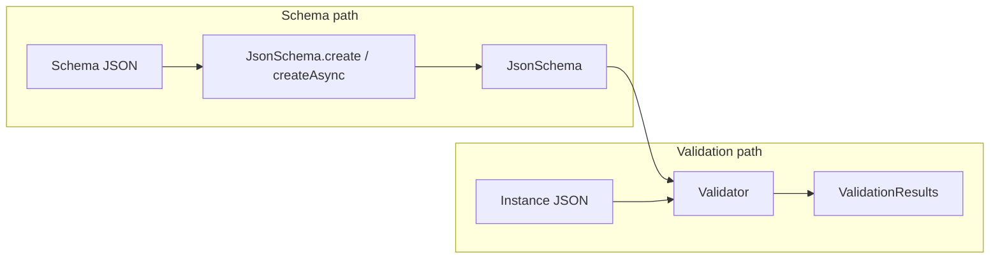
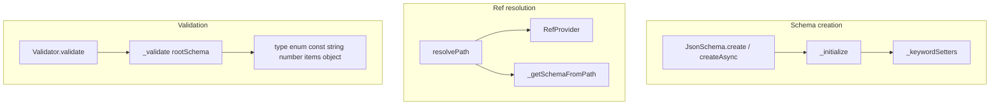

# json_schema (Workiva) — Research report

## Metadata

- **Library name**: json_schema
- **Repo URL**: https://github.com/Workiva/json_schema
- **Clone path**: `research/repos/dart/Workiva-json_schema/`
- **Language**: Dart
- **License**: Boost Software License 1.0 (see LICENSE in repo)

## Summary

Workiva json_schema is a platform-agnostic (web, Flutter, VM) Dart library for **validating** JSON instances against JSON Schemas. It does **not** generate code. It loads a JSON Schema (via `JsonSchema.create` or `JsonSchema.createAsync`), parses it into an internal `JsonSchema` representation, then validates JSON documents against that schema with `schema.validate(instance)`. Supported drafts are draft-04, draft-06, draft-07, draft-2019-09, and draft-2020-12; the default is draft-07. Sync creation requires all `$ref`s within the root schema; async creation supports remote HTTP refs and custom `RefProvider`s. Validation returns `ValidationResults` with errors and warnings (instance path, schema path, message).

## JSON Schema support

- **Drafts**: Draft-04, draft-06, draft-07, draft-2019-09, draft-2020-12. `SchemaVersion` enum and `_getSchemaVersion` detect draft from `$schema` or default to draft-07.
- **Scope**: Validation only (schema + instance → valid/invalid + error list). No code generation.
- **Subset**: Supports the full set of draft-07 keywords for validation. For draft-2019-09 and draft-2020-12, supports vocabularies (core, applicator, validation, metadata, format, content; 2020-12 adds unevaluated). Format validation is optional: by default enabled for draft-04 through draft-07, disabled for 2019-09 and 2020-12 per spec; `validateFormats` can override.

## Keyword support table

Keyword list derived from vendored draft-07 meta-schema (`specs/json-schema.org/draft-07/schema.json`). Implementation evidence from `lib/src/json_schema/validator.dart`, `lib/src/json_schema/json_schema.dart`, `lib/src/json_schema/formats/validators.dart`, and tests.

| Keyword | Implemented | Notes |
|---------|-------------|-------|
| $id | yes | Parsed and stored; used for scope in $ref resolution. |
| $schema | yes | Accepted; drives schema version detection. |
| $ref | yes | Resolved via `resolvePath`; sync `RefProvider` or async fetch; cycle detection via `InstanceRefPair`. |
| $comment | yes | Parsed and stored; not used for validation (metadata). |
| title | yes | Parsed and stored; accessor provided; not used for validation. |
| description | yes | Parsed and stored; accessor provided; not used for validation. |
| default | partial | Parsed and stored; not enforced on instance (metadata). |
| readOnly | yes | Parsed and stored; not enforced on instance (metadata). |
| writeOnly | yes | Parsed and stored; not enforced on instance (metadata). |
| examples | yes | Parsed and stored; accessor provided; not used for validation. |
| multipleOf | yes | Instance validation in `_numberValidation`. |
| maximum | yes | Instance validation. |
| exclusiveMaximum | yes | Draft-07 number semantics. |
| minimum | yes | Instance validation. |
| exclusiveMinimum | yes | Draft-07 number semantics. |
| maxLength | yes | Instance validation; Unicode runes (character) length. |
| minLength | yes | Instance validation. |
| pattern | yes | Instance validation; Dart regex. |
| additionalItems | yes | Instance validation; boolean or schema; `_itemsValidation`. |
| items | yes | Instance validation; single schema or array; draft-2020-12 prefixItems supported. |
| maxItems | yes | Instance validation. |
| minItems | yes | Instance validation. |
| uniqueItems | yes | Instance validation; `DeepCollectionEquality`. |
| contains | yes | Instance validation; minContains/maxContains supported for 2019-09/2020-12. |
| maxProperties | yes | Instance validation. |
| minProperties | yes | Instance validation. |
| required | yes | Instance validation. |
| additionalProperties | yes | Instance validation; boolean or schema. |
| definitions | yes | Parsed; subschemas used for $ref resolution. |
| properties | yes | Instance validation. |
| patternProperties | yes | Instance validation; regex keys. |
| dependencies | yes | Instance validation; property and schema dependencies. |
| propertyNames | yes | Instance validation; schema applied to each property name. |
| const | yes | Instance validation; `DeepCollectionEquality`. |
| enum | yes | Instance validation; `singleWhere` equality check. |
| type | yes | Instance validation; single type or array; integer allows num with remainder 0 for draft-06+. |
| format | partial | Optional; 22 formats (date-time, date, time, email, uri, hostname, etc.); configurable via `validateFormats` and `customFormats`; unknown formats pass. |
| contentMediaType | partial | Parsed and stored; not used for validation (metadata). |
| contentEncoding | partial | Parsed and stored; not used for validation (metadata). |
| if | yes | Instance validation; `_ifThenElseValidation`. |
| then | yes | Instance validation. |
| else | yes | Instance validation. |
| allOf | yes | Instance validation; evaluated items/properties tracked for unevaluated. |
| anyOf | yes | Instance validation. |
| oneOf | yes | Instance validation; exactly one must match. |
| not | yes | Instance validation. |

## Constraints

Validation keywords are enforced at **runtime** by the `Validator` class. Each constraint (type, enum, const, numeric bounds, string length/pattern, array items, object properties, etc.) is applied when the validator visits the corresponding subschema. Constraints are enforced directly on the instance. Format validation can be enabled or disabled per `validateFormats`; for draft-2019-09 and draft-2020-12, formats are annotation-only by default. Custom formats can be registered via `customFormats` in `createAsync`/`create`.

## High-level architecture

Pipeline: **Schema JSON** (String or Map) → **JsonSchema.create** / **JsonSchema.createAsync** (with optional RefProvider, customFormats, customVocabularies) → **JsonSchema** (internal schema graph, ref resolution) → **schema.validate(instance)** → **Validator.validate** → **ValidationResults** (errors, warnings with instancePath, schemaPath, message). Instance can be pre-parsed JSON or a String with `parseJson: true`.

## Medium-level architecture

- **Schema creation**: `JsonSchema._fromRootMap` / `_fromRootBool` parse the schema, detect version from `$schema`, and initialize via `_initialize`. Keywords are dispatched via `_keywordSetters` (draft-specific). Boolean schemas supported (draft-06+).
- **$ref resolution**: `resolvePath(Uri path)` uses `_getSchemaFromPath` to resolve in-document refs via JSON Pointer (rfc_6901). Remote refs use `RefProvider` (sync or async) or `SchemaUrlClient` (HTTP). Recursive refs (`$recursiveRef`, `$dynamicRef`), `$recursiveAnchor`, `$dynamicAnchor` supported for 2019-09/2020-12. Cycle detection via `InstanceRefPair` and `_refsEncountered`.
- **Validation**: `Validator(_rootSchema)` holds the root JsonSchema. `validate(instance)` constructs instance as `Instance`, sets `_validateFormats`, and calls `_validate(rootSchema, data)`. Recursive `_validate` handles ref resolution, then type/const/enum, string/number/array/object validation, allOf/anyOf/oneOf/not, format, and custom validators. Errors collected in `_errors`; first failure throws `FormatException` unless `reportMultipleErrors: true`.
- **Key types**: `JsonSchema`, `Validator`, `ValidationResults`, `ValidationError` (instancePath, schemaPath, message), `RefProvider`, `Instance`, `SchemaPathPair`, `InstanceRefPair`.

## Low-level details

- **Custom vocabularies**: `CustomVocabulary` and `customVocabMap` allow extending schema parsing; custom keywords can register validators via `customAttributeValidators`.
- **Format validators**: 22 built-in format validators in `lib/src/json_schema/formats/` (date_time, date, time, email, uri, hostname, ipv4, ipv6, uuid, etc.); `customFormats` map allows user-defined format validation.
- **Evaluated items/properties**: For unevaluatedItems/unevaluatedProperties (2019-09/2020-12), `_evaluatedItemsContext` and `_evaluatedPropertiesContext` track which array indices and object properties were evaluated.

## Output and integration

- **Vendored vs build-dir**: N/A (validation only; no generated code output).
- **API vs CLI**: Library API only. `JsonSchema.create`, `JsonSchema.createAsync`, `JsonSchema.createFromUrl`; `schema.validate(instance, {reportMultipleErrors, parseJson, validateFormats})`. No CLI.
- **Writer model**: N/A (validation only).

## Configuration

- **Schema version**: `schemaVersion` parameter in create/createAsync; auto-detected from `$schema` if not provided; default draft-07.
- **Ref resolution**: Sync `RefProvider.sync((ref) => Map?)` or async `RefProvider.async((ref) => Future<Map?>)`; default async fetches from HTTP via `SchemaUrlClient`.
- **Format validation**: `validateFormats` in `validate()` overrides default (on for draft4–7, off for 2019-09/2020-12).
- **Custom formats**: `customFormats: {'format-name': (context, instanceData) => context}` in create/createAsync.
- **Custom vocabularies**: `customVocabularies` for extending parsing.

## Pros/cons

- **Pros**: Platform-agnostic (web, Flutter, VM); multi-draft support (04–2020-12); sync and async creation; flexible ref resolution (RefProvider); custom formats and vocabularies; JSON Schema Test Suite fixtures; accessors for all keywords (useful for forms, diagrams); evaluated/unevaluated tracking for 2019-09/2020-12.
- **Cons**: No code generation; readOnly, writeOnly, contentMediaType, contentEncoding parsed but not enforced; default not enforced; remote ref tests require `make serve-remotes`; no built-in benchmarks.

## Testability

- **Run tests**: `make pubget` then `make test` or `dart test`. For tests with remote refs: `make serve-remotes` (separate terminal) then `make test`, or `make test-with-serve-remotes` (starts server, runs tests, stops server).
- **Fixtures**: `make gen-fixtures` generates Dart source from JSON-Schema-Test-Suite for cross-platform testing without `dart:io` file reads. CI runs `make gen-fixtures --check`.
- **Test layout**: `test/unit/json_schema/` (validation_error_test, specification_test, custom_formats_test, configurable_format_validation_test, nested_refs_in_root_schema_test, etc.); `test/JSON-Schema-Test-Suite/` (vendored suite).

## Performance

- No built-in benchmarks in the repo. JSON-Schema-Test-Suite README references external [json-schema-benchmark](https://github.com/Muscula/json-schema-benchmark).
- **Entry points for benchmarking**: `JsonSchema.create`/`createAsync` (schema load); `schema.validate(instance)` (validation). Load schema once, then call `validate` in a loop.

## Determinism and idempotency

- **Generated output**: N/A (validation only).
- **Validation result**: For a given schema and instance, the result (valid/invalid) is deterministic. Errors are appended in traversal order; order is deterministic. No explicit sorting of errors.

## Enum handling

- **Implementation**: `_enumValidation` uses `enumValues!.singleWhere((v) => DeepCollectionEquality().equals(instance.data, v))`; passes if instance equals one enum value.
- **Duplicate entries**: Draft-07 meta-schema requires `uniqueItems: true` on enum; schemas with duplicates are invalid. If a schema bypassed that, the library would store duplicates and `singleWhere` would match the first; behavior not explicitly documented.
- **Case / namespace**: Equality is value-based. Distinct values "a" and "A" are both valid if both appear in the enum; no special handling.

## Reverse generation (Schema from types)

No. Validation-only library; does not generate JSON Schema from Dart types.

## Multi-language output

N/A (validation only; no code generation).

## Model deduplication and $ref/$defs

- **Validation context**: No generated types; question is how $ref and definitions are resolved.
- **$ref**: Resolved via `resolvePath`; in-document refs use JSON Pointer against root; remote refs use RefProvider or HTTP client. Same logical definition is resolved once per path and shared; JsonSchema nodes are reused when the same ref is followed again.
- **definitions / $defs**: Parsed; subschemas under definitions/$defs are populated and used for $ref resolution. Multiple $refs to the same definition resolve to the same JsonSchema node.

## Validation (schema + JSON → errors)

Yes. This is the library's main purpose.

- **Inputs**: (1) JSON Schema (Map, String, or fetched from URL/file). (2) JSON instance (Map/List/primitive or String with `parseJson: true`).
- **API**: `schema.validate(instance, {reportMultipleErrors: false, parseJson: false, validateFormats})` returns `ValidationResults`.
- **Output**: `ValidationResults.errors` (list of `ValidationError` with instancePath, schemaPath, message), `ValidationResults.warnings`, `ValidationResults.isValid`.
- **Error format**: `ValidationError.toString()` yields `# (root): message` or `path: message` for instance path.
