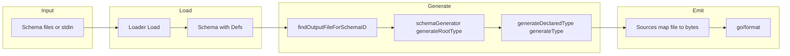
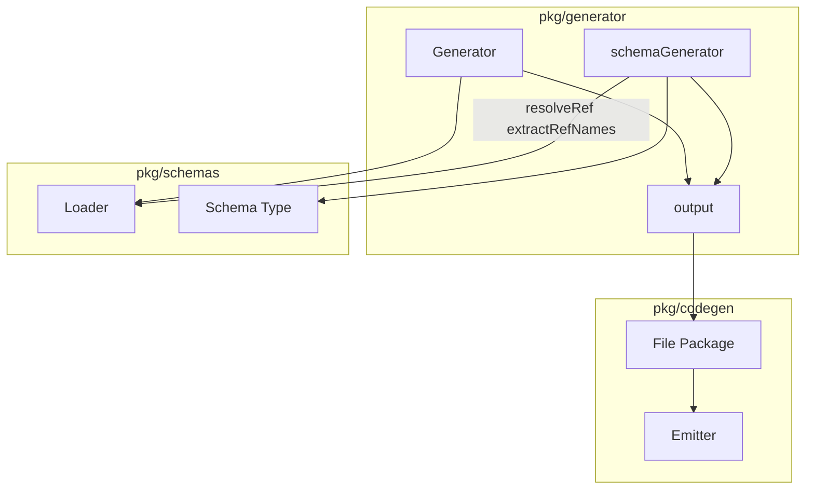

# go-jsonschema (omissis) — Research report

## Metadata

- **Library name**: go-jsonschema
- **Repo URL**: https://github.com/omissis/go-jsonschema
- **Clone path**: `research/repos/go/omissis-go-jsonschema/`
- **Language**: Go
- **License**: MIT

## Summary

go-jsonschema is a tool that generates Go data types and structs from JSON Schema definitions. It produces Go source files containing type declarations and unmarshalling code that validates input JSON according to the schema’s validation rules (e.g. required fields, string length, numeric bounds, pattern, enum). The tool is used primarily via a CLI (`go-jsonschema`); the core logic is in a library (`pkg/generator`, `pkg/codegen`, `pkg/schemas`) so it can be driven programmatically. It supports multiple schema files in one run with per-schema package and output mapping, YAML schemas, and external `$ref` resolution. Generated code uses standard library `encoding/json` and optional `encoding/json` + YAML/mapstructure tags.

## JSON Schema support

- **Drafts**: The schema model and README refer to draft-wright and draft-handrews (e.g. `definitions` and `$defs`, `id` and `$id`). Test fixtures use draft-04 `$schema` (e.g. `tests/data/validation/enum/enum.json`). The implementation does not enforce a single draft; it accepts draft-04–style and draft 2019-09/2020-12–style keywords where they overlap (e.g. `$defs` and `definitions`, `$id` and `id`).
- **Scope**: Structure-oriented subset with validation. Parsed schema drives type generation (`type`, `properties`, `items`, `$ref`, `$defs`/`definitions`, `allOf`, `anyOf`, `enum`, `additionalProperties`, `required`, `format`, etc.). Many validation keywords are enforced in generated unmarshal code (e.g. numeric bounds, string length/pattern, array min/max items, required, read-only, default, const). Not supported: nested `$defs` (only top-level names in `#/$defs/someName` and `file.json#/$defs/someName`), `oneOf`, conditional `if`/`then`/`else`, `patternProperties`, `uniqueItems`, `dependentRequired`/`dependentSchemas`, `contentEncoding`/`contentMediaType`/`contentSchema`, `unevaluatedProperties`/`unevaluatedItems`, `$anchor`/`$dynamicRef`/`$dynamicAnchor`.

## Keyword support table

Keyword list derived from vendored draft 2020-12 meta-schemas under `specs/json-schema.org/draft/2020-12/meta/` (core, applicator, validation, meta-data, unevaluated, format-annotation, format-assertion, content). The library accepts draft-04 and later-style schemas; support is per-keyword below.

| Keyword | Implemented | Notes |
|---------|-------------|-------|
| $anchor | no | Not used. |
| $comment | no | Not used in codegen. |
| $defs | yes | Parsed as `Schema.Definitions` and legacy `definitions`; used for `#/$defs/name` and `file#/$defs/name`. Top-level only; nested $defs not supported (TODO in code). |
| $dynamicAnchor | no | Not used. |
| $dynamicRef | no | Not used. |
| $id | yes | Parsed as `Schema.ID` (and legacy `id`); used for output/schema mapping and loader resolution. |
| $ref | yes | Fragment and file refs: `#`, `#/$defs/name`, `file.json#/$defs/name`. Resolved via loader and `extractRefNames`; nested definitions in ref path not supported. |
| $schema | no | Parsed in schema model but not used for codegen. |
| $vocabulary | no | Not used. |
| additionalProperties | yes | Schema or `false`; `false`/absent with `.Not == nil` allows typed map; otherwise map value type from schema. |
| allOf | yes | Merged via `schemas.AllOf` then generated as single type. |
| anyOf | yes | Merged after resolving refs; generated as struct with optional fields and anyOf validator. |
| const | partial | String and boolean const emitted as validation in generated code; non-string/non-bool const triggers warning and is ignored. |
| contains | no | Not used in codegen. |
| contentEncoding | no | Not used. |
| contentMediaType | no | Not used. |
| contentSchema | no | Not used. |
| default | yes | Emitted for struct fields; default validator in unmarshal; default value used in generated code. |
| dependentRequired | no | Parsed in model but not used in codegen. |
| dependentSchemas | no | Parsed in model (and legacy `dependencies`) but not used in codegen. |
| deprecated | no | Not used in codegen. |
| description | yes | Emitted as struct/field comments. |
| else | no | Not used. |
| enum | yes | Go type with constants and custom unmarshal; string, number, boolean, null, mixed; multiple types may wrap in struct. |
| examples | no | Not used. |
| exclusiveMaximum | yes | Parsed; used for numeric type selection and validation in generated code (integer and float). |
| exclusiveMinimum | yes | Parsed; used for numeric type selection and validation in generated code. |
| format | partial | date, date-time, time, duration → custom types (SerializableDate, SerializableTime, time.Time, duration); ipv4, ipv6 → net/netip.Addr. Other format values not mapped. |
| if | no | Not used. |
| items | yes | Single schema → slice element type; tuple-style (array of schemas) not implemented. |
| maxContains | no | Not used. |
| maximum | yes | Used for int sizing and validation in generated code. |
| maxItems | yes | Validation in generated unmarshal. |
| maxLength | yes | Validation in generated unmarshal (utf8 rune count). |
| maxProperties | no | Parsed but not used in codegen. |
| minContains | no | Not used. |
| minimum | yes | Used for int sizing and validation in generated code. |
| minItems | yes | Validation in generated unmarshal. |
| minLength | yes | Validation in generated unmarshal. |
| minProperties | no | Parsed but not used in codegen. |
| multipleOf | yes | Validation in generated unmarshal (integer and float). |
| not | partial | Only for additionalProperties: `additionalProperties: false` unmarshals as `.Not = Type{}`; used to disallow extra properties. Not used as general subschema. |
| oneOf | no | Parsed in model but no codegen branch; only anyOf and allOf are handled. |
| pattern | yes | Validation in generated unmarshal (regexp.MatchString). |
| patternProperties | no | Parsed in model but struct generation only uses `properties`; not used in codegen. |
| prefixItems | no | Not used; items handled as single schema only. |
| properties | yes | Drives struct fields; naming and required/optional. |
| propertyNames | no | Not used. |
| readOnly | yes | Parsed; optional read-only validation in unmarshal (field must not be present in input); can be disabled via config. |
| required | yes | Required fields; non-required get pointer or omitempty; required validator in unmarshal. |
| then | no | Not used. |
| title | yes | Used for type naming when StructNameFromTitle is set. |
| type | yes | Single and multiple types; null with another type → pointer; drives Go type and format. |
| unevaluatedItems | no | Not used. |
| unevaluatedProperties | no | Not used. |
| uniqueItems | no | Parsed in model but array generation does not use it; always slice. |
| writeOnly | no | Parsed in meta-data but not used in codegen. |

## Constraints

Validation keywords are enforced in the generated unmarshal code, not only used for structure. The generator emits validators (required, readOnly, default, array min/max items, string min/max length and pattern, numeric bounds and multipleOf, const, anyOf) that run during `UnmarshalJSON`/`UnmarshalYAML`. So constraints like `minLength`, `maxLength`, `pattern`, `minimum`, `maximum`, `exclusiveMinimum`, `exclusiveMaximum`, `multipleOf`, `minItems`, `maxItems`, `required`, and `readOnly` produce runtime checks. Integer sizing can use `minimum`/`maximum` to choose smaller int types when MinSizedInts is enabled.

## High-level architecture

- **Input**: One or more schema files (JSON or YAML), paths from CLI or API; optional stdin (`-`).
- **Load**: `Loader` (default: cached multi-loader with file and HTTP) loads and parses schema; `Schema` has `$id`, `$defs`/definitions, root type.
- **Generate**: For each file, `Generator.DoFile` / `AddFile` finds or creates an output (package + file name from config or `$id`). A `schemaGenerator` generates root type and all definitions: `generateRootType` iterates definitions (sorted by name), then root; each type goes through `generateDeclaredType` → `generateType` / `generateTypeInline` (with ref resolution, enum, struct, array, allOf/anyOf, primitives with format).
- **Emit**: `Generator.Sources()` builds `map[string][]byte` (filename → Go source); each output file’s `codegen.File` is rendered via `Emitter`; output is `go/format`-ted.
- **Write**: CLI writes each entry in `Sources()` to disk (or stdout for single `-`).

## Medium-level architecture

- **Packages**: `pkg/schemas` (schema model, loaders, parsing), `pkg/generator` (Generator, Config, schemaGenerator, output, formatters, validators), `pkg/codegen` (File, Package, TypeDecl, types, Emitter).
- **Generator**: Holds config, caser (identifier/capitalization), outputs keyed by schema ID, formatters (JSON, optional YAML), loader. `DoFile` loads schema; `AddFile` registers output and runs `schemaGenerator.generateRootType()`.
- **schemaGenerator**: Per-schema state: schema, filename, output (file, declsByName, declsBySchema), schemaTypesByRef cache. `generateDeclaredType` deduplicates by schema identity, then generates type (enum, ref, struct, array, primitive); for structs attaches validators and generates unmarshal methods. `generateType` dispatches on enum, `$ref`, type name (array, object, null, primitive with format). `$ref` resolution: `extractRefNames` parses `#/$defs/name` or `file#/$defs/name`; if file, loader loads schema and `AddFile` is called; definition is taken from that schema’s Definitions or root; result cached in schemaTypesByRef.
- **Ref resolution**: Refs point to top-level definitions only. Nested refs (e.g. `#/$defs/A/$defs/B`) are rejected. Same-file refs resolve to existing declsByName; cross-file refs load the other schema, generate the referenced type in that schema’s output, then return a NamedType that may reference another package.

## Low-level details

- **Identifier naming**: `text.Caser` produces Go identifiers; capitalizations config can override (e.g. ID, URL). Enum constant names: `makeEnumConstantName(typeName, value)` (e.g. typeName + identifierized value); collisions get numeric suffix in type names via `uniqueTypeName`.
- **Type deduplication**: Same schema (by pointer or structural equality via go-cmp) reuses existing `TypeDecl` (declsBySchema, getDeclByEqualSchema); name collisions for different schemas get a numeric suffix.

## Output and integration

- **Vendored vs build-dir**: Generated files are not vendored by the tool; the CLI writes to paths specified by `--output` / `--schema-output` or to stdout. Tests use golden files next to schema (e.g. `schema.json` + `schema.go` in same dir); overwrite with `OVERWRITE_EXPECTED_GO_FILE=true make test`.
- **API vs CLI**: Both. CLI in `main.go` (cobra): flags for package, output, schema-package, schema-output, schema-root-type, tags, capitalizations, resolve-extension, yaml-extension, struct-name-from-title, only-models, min-sized-ints, minimal-names, disable-readonly-validation, disable-custom-types-for-maps. Library: `generator.New(config)`, `DoFile`/`AddFile`, `Sources()` returns `map[string][]byte`.
- **Writer model**: In-memory: `Sources()` returns `map[string][]byte` (filename → formatted Go source). CLI writes each to disk or stdout. No generic `io.Writer` API; caller writes bytes from `Sources()`.

## Configuration

- **Config** (generator.Config): SchemaMappings (schema ID → package, output name, root type), DefaultPackageName, DefaultOutputName, ExtraImports (adds YAML formatter), Capitalizations, ResolveExtensions, YAMLExtensions, StructNameFromTitle, Warner, Tags (e.g. json, yaml, mapstructure), OnlyModels (no unmarshal/validation), MinSizedInts, MinimalNames, Loader, DisableOmitempty, DisableReadOnlyValidation, DisableCustomTypesForMaps.
- **Schema mapping**: For multi-schema runs, `--schema-package=URI=PACKAGE`, `--schema-output=URI=FILENAME`, `--schema-root-type=URI=NAME` map by schema `$id`.
- **Extensions**: `goJSONSchema` schema extension for custom Go type, identifier, nillable, imports, extraTags. Resolve extensions (e.g. `.json`) used when resolving `$ref` file names.

## Pros/cons

- **Pros**: Validation in generated code (required, lengths, pattern, numeric bounds, enums, etc.); configurable packages and outputs for multi-schema; YAML and JSON; external refs and cross-package types; format-based types (date, date-time, time, duration, ipv4/ipv6); optional read-only validation; struct name from title; capitalizations; only-models mode; go workspaces used in repo to test generated code.
- **Cons**: Nested `$defs` and oneOf not supported; patternProperties, uniqueItems, dependent*, if/then/else, unevaluated* not implemented; README status shows many validation items still unchecked; const only string/bool in validation; multiple types for a property fall back to interface{} with warning; name collisions get numeric suffix and warning.

## Testability

- **Unit/integration**: Tests in `tests/`: `generation_test.go` runs generator on schema fixtures and compares output to golden `.go` files; `validation_test.go` unmarshals JSON into generated types and asserts on expected errors (required, length, pattern, numeric, etc.). Helpers in `tests/helpers`; some tests use generated packages (e.g. cross-package).
- **Running tests**: From repo root, `make test` or `go test ./tests/...`. Golden update: `OVERWRITE_EXPECTED_GO_FILE=true make test`.
- **Fixtures**: `tests/data/` (core, validation, validationDisabled, nameFromTitle, refWithOverridesPath, regressions, schemaExtensions, miscWithDefaults, yaml, etc.). Each example typically has a `.json` (or `.yaml`) schema and a `.go` golden file; validation tests import generated packages and run Unmarshal with expected error messages.
- **Entry points for shared fixtures**: `generator.New(cfg)`, `generator.DoFile(path)` or `AddFile(path, schema)`, `generator.Sources()`; CLI `go-jsonschema -p <pkg> -o <out> <schema.json>`.

## Performance

- No benchmarks found in the clone. Entry points for future benchmarking: CLI `go-jsonschema -p pkg -o out schema.json`; or programmatic `generator.New(cfg)`, `DoFile(fileName)`, `Sources()` (wall time of Sources() and format.Source would be the main cost).

## Determinism and idempotency

- **Ordering**: Definitions are iterated in sorted order (`sortDefinitionsByName`). Struct properties are iterated in sorted key order (`sortedKeys`). Package declarations are sorted by name before emit (`Package.Generate` uses `sort.Slice` with `CleanNameForSorting(GetName())`). Imports are sorted by qualified name (`slices.SortStableFunc`). So repeated runs with the same input produce the same declaration and field order.
- **Deduplication**: Types are deduplicated by schema identity (pointer and structural equality); same shape can reuse the same TypeDecl. Name collisions get a numeric suffix (e.g. `Name_2`), which is deterministic for the same schema set. No evidence of non-deterministic maps or random naming; output is deterministic and idempotent for the same inputs and config.

## Enum handling

- **Duplicate entries**: No explicit deduplication of enum values in code; `t.Enum` is used as-is. If schema has `["a","a"]`, both would be emitted (e.g. two constants with same value); no dedupe or error observed in generator code. Unknown whether tests cover duplicate enum values.
- **Namespace/case collisions**: Enum constant names are `makeEnumConstantName(enumDecl.Name, s)` (e.g. type name + identifierized value). Go identifiers are case-sensitive; "a" and "A" would produce different constant names only if Identifierize preserves case (e.g. `MyEnuma` vs `MyEnumA`); if it normalizes case, they could collide. No explicit handling for case collision documented; treat as partial/unknown without test evidence.

## Reverse generation (Schema from types)

- No. The tool only generates Go from JSON Schema. There is no code or docs for generating JSON Schema from Go structs.

## Multi-language output

- Go only. The generator emits Go source only (codegen.File with Package, Decls). No option or code for other target languages.

## Model deduplication and $ref/$defs

- **Same shape in multiple places**: The generator deduplicates by schema identity. `generateDeclaredType` checks `declsBySchema[t]` and `getDeclByEqualSchema(scope.string(), t)` (structural equality via go-cmp). So the same inline object shape in two branches can map to the same generated type if processed with the same scope/name and equal schema.
- **$defs / $ref**: Each `$defs` entry is generated once (in definition order); `$ref` to `#/$defs/name` or `file#/$defs/name` resolves to that declaration (same file) or to the type in the referenced file’s output (cross-file). Referenced definitions are generated in their schema’s output; no inlining of refs. Nested `$defs` (e.g. `#/$defs/A/$defs/B`) are not supported; extractRefNames only handles top-level definition name after `/$defs/` or `/definitions/`.

## Validation (schema + JSON → errors)

- **Mechanism**: Validation is embedded in the generated unmarshal code. The generator emits `UnmarshalJSON` (and optionally YAML) methods that decode into structs and then run validators (required, readOnly, default, array min/max items, string length/pattern, numeric bounds/multipleOf, const, anyOf). So the “validation” is: parse JSON into generated types; if a validator fails, it returns an error (e.g. `fmt.Errorf("field X in Y: required")`). There is no separate standalone API that takes a schema + JSON and returns a list of errors without code generation; the schema is compiled into Go types and methods first.
- **Entry point**: User unmarshals JSON into the generated struct; the generated `UnmarshalJSON` returns an error if validation fails. Tests in `validation_test.go` demonstrate this (e.g. `json.Unmarshal([]byte(tC.data), &model)` then compare err to wantErr).
