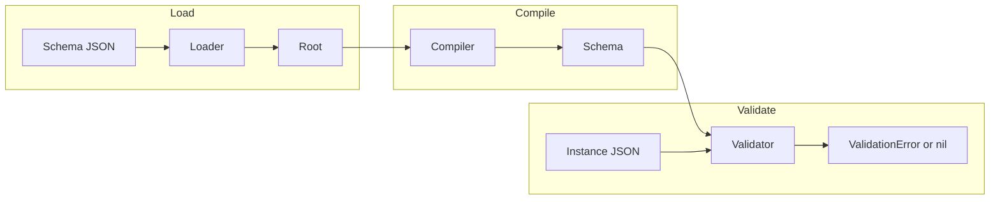
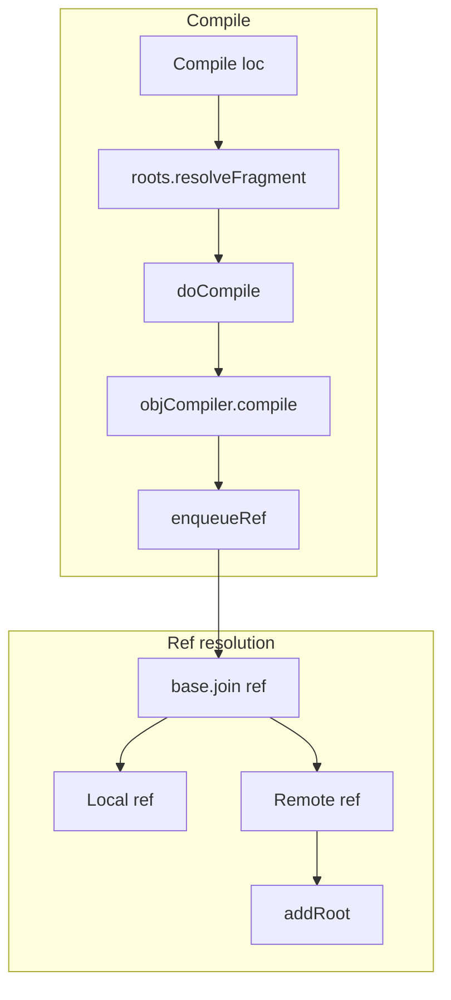

# jsonschema (santhosh-tekuri) — Research report

## Metadata

- **Library name**: jsonschema
- **Repo URL**: https://github.com/santhosh-tekuri/jsonschema
- **Clone path**: `research/repos/go/santhosh-tekuri-jsonschema/`
- **Language**: Go
- **License**: Apache-2.0

## Summary

jsonschema (santhosh-tekuri) is a JSON Schema **validation** library for Go. It does not generate code. It compiles JSON Schema documents into an internal `*Schema` representation and validates JSON instances against them at runtime. The library supports drafts 4, 6, 7, 2019-09, and 2020-12; passes the JSON-Schema-Test-Suite (excluding optional tests for ECMAScript regex, zero-terminated floats, IDN formats); and is validated against Bowtie. It offers a Go API (`Compiler`, `Schema.Validate`) and a CLI (`jv`) for schema and instance validation. Features include vocabulary-based validation, custom regex engine, format assertions (opt-in for draft >= 2019), content assertions (opt-in), introspectable error output (flag, basic, detailed), and custom vocabulary registration.

## JSON Schema support

- **Drafts**: draft-04, draft-06, draft-07, draft/2019-09, draft/2020-12. The draft is inferred from `$schema`; when `$schema` is missing, `Compiler.DefaultDraft` (or CLI `-d`) selects the draft (default 2020).
- **Scope**: Validation only. No code generation.
- **Subset**: Full support per JSON-Schema-Test-Suite for all drafts; optional tests skipped (ecmascript-regex, zeroTerminatedFloats, idn-email, idn-hostname). Custom `$schema` URLs, mixed dialect support, and infinite-loop detection for `$schema` cycles and validation cycles.

## Keyword support table

Keyword list derived from vendored draft 2020-12 meta-schemas (`specs/json-schema.org/draft/2020-12/meta/*.json`). Implementation evidence from `objcompiler.go`, `validator.go`, `schema.go`, `draft.go`, `format.go`, `content.go`, and `roots.go`.

| Keyword | Implemented | Notes |
|---------|-------------|-------|
| $anchor | yes | Parsed in objcompiler; draft < 2019 from `id` fragment; draft >= 2019 from `$anchor`. Used in reference resolution. |
| $comment | yes | Parsed in compileDraft7; annotation only, stored in `Schema.Comment`. |
| $defs | yes | Collected as subschemas in roots (Draft2019/2020); used for `$ref` resolution. Draft-04 uses `definitions` instead. |
| $dynamicAnchor | yes | Parsed in compileDraft2020; used for `$dynamicRef` resolution. |
| $dynamicRef | yes | Parsed and validated; resolves via dynamic scope and `$dynamicAnchor`. |
| $id | yes | Draft-06+; parsed via `draft.getID`; sets base URI for resources. Draft-04 uses `id`. |
| $ref | yes | Resolved during compile; `enqueueRef` follows local and remote refs. Validation delegates to referenced schema. |
| $schema | yes | Parsed in loader/roots; selects draft and vocabulary. Custom URLs supported. |
| $vocabulary | yes | Parsed in `draft.getVocabs`; controls active vocabularies for draft >= 2019. |
| additionalProperties | yes | Instance validation; boolean or schema. |
| allOf | yes | Instance validation; all subschemas must pass. |
| anyOf | yes | Instance validation; at least one subschema must pass. |
| const | yes | Instance validation; value must equal const via `equals`. |
| contains | yes | Instance validation; at least one array element must match. |
| contentEncoding | yes | Optional (assertContent); built-in base64; custom via `RegisterContentEncoding`. |
| contentMediaType | yes | Optional (assertContent); built-in application/json; custom via `RegisterContentMediaType`. |
| contentSchema | yes | Optional (assertContent); schema applied to decoded content when ContentMediaType.UnmarshalJSON set. |
| default | yes | Parsed and stored; annotation only; not enforced on instance. |
| dependentRequired | yes | Instance validation; draft >= 2019. |
| dependentSchemas | yes | Instance validation; draft >= 2019. |
| deprecated | yes | Parsed in compileDraft2019; annotation only. |
| description | yes | Parsed; annotation only. |
| else | yes | Instance validation; conditional (if/then/else). |
| enum | yes | Instance validation; value must match one entry via type check and `equals`. |
| examples | yes | Parsed in compileDraft7; annotation only. |
| exclusiveMaximum | yes | Instance validation; draft-04 boolean or draft-06+ number. |
| exclusiveMinimum | yes | Instance validation; draft-04 boolean or draft-06+ number. |
| format | partial | Optional for draft >= 2019 (AssertFormat or metaschema); built-in formats (regex, uuid, ipv4, ipv6, hostname, email, date, time, date-time, duration, json-pointer, relative-json-pointer, uri, uri-reference, uri-template, iri, iri-reference, period, semver); custom via RegisterFormat. |
| if | yes | Instance validation; conditional. |
| items | yes | Instance validation; single schema or array (draft < 2020); draft 2020: prefixItems + items for additional. |
| maxContains | yes | Instance validation; draft >= 2019. |
| maximum | yes | Instance validation. |
| maxItems | yes | Instance validation. |
| maxLength | yes | Instance validation. |
| maxProperties | yes | Instance validation. |
| minContains | yes | Instance validation; draft >= 2019. |
| minimum | yes | Instance validation. |
| minItems | yes | Instance validation. |
| minLength | yes | Instance validation. |
| minProperties | yes | Instance validation. |
| multipleOf | yes | Instance validation; uses `big.Rat` for precision. |
| not | yes | Instance validation. |
| oneOf | yes | Instance validation; exactly one subschema must pass. |
| pattern | yes | Instance validation; custom regex engine via `UseRegexpEngine`. |
| patternProperties | yes | Instance validation; map from pattern to schema. |
| prefixItems | yes | Instance validation; draft 2020. |
| properties | yes | Instance validation. |
| propertyNames | yes | Instance validation; draft >= 6. |
| readOnly | yes | Parsed; annotation only. |
| required | yes | Instance validation. |
| then | yes | Instance validation; conditional. |
| title | yes | Parsed; annotation only. |
| type | yes | Instance validation; single type or array; integer/number coercion. |
| unevaluatedItems | yes | Instance validation; draft >= 2019. |
| unevaluatedProperties | yes | Instance validation; draft >= 2019. |
| uniqueItems | yes | Instance validation. |
| writeOnly | yes | Parsed; annotation only. |

## Constraints

Validation keywords are enforced at **runtime** by the `validator`. Each keyword (type, const, enum, format, numeric bounds, string length/pattern, array/object constraints, applicators) is applied when the validator visits the corresponding field on the compiled `Schema`. Constraints are not used for structure only—they directly enforce instance validation. Format and content assertions are optional and enabled via `Compiler.AssertFormat()` and `Compiler.AssertContent()` for draft >= 2019 and >= 7 respectively.

## High-level architecture

Pipeline: **Schema JSON** (file/URL/stdin) → **Loader** (FileLoader, SchemeURLLoader, HTTP) → **Compiler** (parse, resolve refs, compile) → **Schema** (internal representation) → **Validator** (Schema.Validate(instance)) → **ValidationError** (hierarchical, introspectable) or nil.

## Medium-level architecture

- **Modules**: `compiler.go` (Compiler, Compile, queue), `objcompiler.go` (keyword parsing per draft), `schema.go` (Schema struct), `validator.go` (validate, validateRef, objValidate, arrValidate, strValidate, numValidate), `loader.go` (URLLoader, FileLoader, SchemeURLLoader, defaultLoader), `roots.go` (roots, root, resource, collectResources, resolveFragment), `draft.go` (Draft, dialect, vocabularies), `format.go` (Format, built-in formats), `content.go` (Decoder, MediaType), `output.go` (ValidationError, FlagOutput, BasicOutput, DetailedOutput).

- **$ref resolution**: `objcompiler.enqueueRef` resolves `$ref` by joining base URL (resource id) with ref string, then `roots.resolveFragment` or `r.resolve`. Local refs resolve to JSON pointer within current document; remote refs load via loader, add root, resolve fragment. Schema cache (`Compiler.schemas`) keyed by `urlPtr` avoids recompiling. `$dynamicRef` resolved at validation time via `resolveDynamicAnchor` walking scope for matching `$dynamicAnchor`.

- **$defs / definitions**: Collected as subschemas in `roots._collectResources` via `draft.subschemas` (e.g. `schemaPath("$defs/*")` for draft 2019/2020, `schemaPath("definitions/*")` for draft 4). Each subschema gets a resource; `$ref` to `#/$defs/foo` resolves to that resource.

- **Vocabulary**: Draft >= 2019 uses `$vocabulary` to select active vocabs; `draft.getVocabs` parses it. Keywords are compiled only when the corresponding vocab is active (`hasVocab`). Custom vocabs via `RegisterVocabulary`.

## Low-level details

- **Regex engine**: Default Go `regexp`; swappable via `Compiler.UseRegexpEngine`. Must be set before compile.
- **Format "regex"**: Cannot be overridden; uses regexp engine to validate pattern strings.
- **Content**: `contentEncoding` decodes string to bytes; `contentMediaType` validates bytes; `contentSchema` applies when `UnmarshalJSON` is set (e.g. application/json).
- **Big rationals**: Numeric keywords (multipleOf, maximum, minimum, etc.) use `math/big.Rat` for precision.

## Output and integration

- **Vendored vs build-dir**: Not applicable; validation-only, no generated output.
- **API vs CLI**: (1) **Library**: `c := jsonschema.NewCompiler()`, `c.Compile(loc)`, `sch.Validate(instance)`. (2) **CLI** `jv`: `jv [OPTIONS] SCHEMA [INSTANCE...]`; validates schema and instances; supports `-` for stdin; JSON and YAML files; http(s) URLs.
- **Writer model**: Errors returned as `*ValidationError`; CLI prints to stdout/stderr. Error formats: simple, alt, flag, basic, detailed via `ValidationError.FlagOutput()`, `BasicOutput()`, `DetailedOutput()`.

## Configuration

- **Draft**: `Compiler.DefaultDraft(draft)` or CLI `-d` (4, 6, 7, 2019, 2020).
- **Format assertions**: `Compiler.AssertFormat()` or CLI `-f`; enables format validation for draft >= 2019.
- **Content assertions**: `Compiler.AssertContent()` or CLI `-c`; enables contentEncoding, contentMediaType, contentSchema.
- **Custom format**: `Compiler.RegisterFormat(&Format{Name, Validate})`.
- **Custom content**: `RegisterContentEncoding`, `RegisterContentMediaType`.
- **Custom vocabulary**: `RegisterVocabulary`.
- **Regex engine**: `UseRegexpEngine`.
- **Loader**: `UseLoader(URLLoader)`; default FileLoader.
- **TLS**: CLI `--cacert`, `-k` (insecure).

## Pros/cons

**Pros**: Full draft 4–2020-12 support; passes JSON-Schema-Test-Suite and Bowtie; vocabulary-based validation; custom regex engine; format and content assertions opt-in; introspectable errors; CLI and library; custom vocabularies; infinite-loop detection.

**Cons**: Validation-only; no code generation; format/content assertions off by default for draft >= 2019; optional tests (ECMAScript regex, IDN) skipped.

## Testability

- **Tests**: `go test` in repo root. Unit tests in `*_test.go` (compiler_test, validator logic, draft_test, loader_test, output_test, etc.).
- **Fixtures**: JSON-Schema-Test-Suite and Extra-Test-Suite under `testdata/JSON-Schema-Test-Suite`, `testdata/Extra-Test-Suite`; `suite_test.go` drives `testSuite` over draft4, draft6, draft7, draft2019-09, draft2020-12.
- **Skip**: `ecmascript-regex.json`, `zeroTerminatedFloats.json`, `idn-email.json`, `idn-hostname.json`.
- **Remotes**: Suite remotes from `remotes/` via `http://localhost:1234/`.
- **Bowtie**: Compliance badges for all drafts.

## Performance

No built-in benchmarks found in the cloned repo. Entry points for future benchmarking: (1) `c.Compile(schemaLoc)` then `sch.Validate(instance)`; (2) CLI `jv schema.json instance.json`.

## Determinism and idempotency

**Compilation**: Deterministic; schema cache keyed by `urlPtr`; repeated Compile of same loc returns same Schema. **Validation**: Error collection order follows validation traversal; ValidationError structure is deterministic for same schema and instance. Error output formats (FlagOutput, BasicOutput, DetailedOutput) produce stable JSON. Not applicable to generated output (validation-only).

## Enum handling

- **Validation**: `validator` checks instance type against `s.Enum.types`; iterates `s.Enum.Values` and uses `equals(v, item)` for match. First match succeeds.
- **Duplicate entries**: Not deduped. `["a","a"]` is accepted; both entries are checked; instance "a" matches either. No error on duplicate enum values in schema.
- **Namespace/case collisions**: Values are compared by JSON equality (`equals`); "a" and "A" are distinct. Both can appear in enum; instance must match one exactly.

## Reverse generation (Schema from types)

No. Validation-only library; cannot generate JSON Schema from Go structs.

## Multi-language output

No. Validation-only; output is validation result (errors), not generated code.

## Model deduplication and $ref/$defs

Not applicable to generated models (validation-only). For schema resolution: `$ref` and `$defs` are resolved by roots/loader; each distinct schema location (urlPtr) is compiled once and cached in `Compiler.schemas`. Identical inline object shapes at different locations are separate Schema nodes; no deduplication of schema structure—each is compiled independently. `$ref` allows reuse by reference.

## Validation (schema + JSON → errors)

Yes. Primary feature.

- **API**: `compiler := jsonschema.NewCompiler()`; `sch, err := compiler.Compile(loc)`; `err = sch.Validate(instance)`. Returns `*ValidationError` with `SchemaURL`, `InstanceLocation`, `ErrorKind`, `Causes`; or nil if valid.
- **CLI**: `jv SCHEMA [INSTANCE...]`; exit 1 for validation errors, 2 for usage. Output formats: simple, alt, flag, basic, detailed.
- **Inputs**: Schema from file, URL, or stdin; instance from file, URL, or stdin.
- **Error output**: FlagOutput (valid bool), BasicOutput (JSON Schema output format), DetailedOutput (verbose); LocalizedError, LocalizedGoString for human-readable messages.
