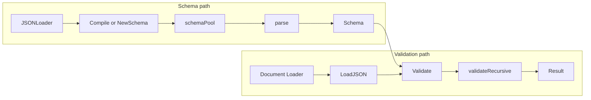

# gojsonschema — Research report

## Metadata

- **Library name**: gojsonschema
- **Repo URL**: https://github.com/xeipuuv/gojsonschema
- **Clone path**: `research/repos/go/xeipuuv-gojsonschema/`
- **Language**: Go
- **License**: Apache License 2.0 (see LICENSE-APACHE-2.0.txt in repo)

## Summary

gojsonschema is a JSON Schema **validation** library for Go. It does **not** generate code. It loads a JSON Schema (via reference, string, or Go value loaders), parses it into an internal schema representation (root schema and subSchemas), and validates JSON documents against that schema. Supported drafts are draft-04, draft-06, and draft-07; the default mode is Hybrid (auto-detect from `$schema`; draft-07 schemas can reference draft-04 schemas when autodetect is on). Validation is the only concern: schema + document loaders → `Validate` → `Result` (valid flag and list of errors with type, context, and details). Optional meta-schema validation and custom format checkers are supported.

## JSON Schema support

- **Drafts**: Draft-04, draft-06, draft-07. The `SchemaLoader` has a `Draft` field (`Draft4`, `Draft6`, `Draft7`, or `Hybrid`). With `AutoDetect` (default), the draft is taken from the `$schema` keyword; otherwise the configured draft is used. Hybrid allows mixing draft-07 and draft-04 schemas when `$schema` is specified in all of them.
- **Scope**: Validation only (schema + instance → valid/invalid + error list). No code generation.
- **Subset**: README states support for draft-04, draft-06, and draft-07. Meta-schemas for these drafts are embedded in `draft.go`. Not all draft-07 meta-schema keywords are implemented: `$comment`, `default`, `readOnly`, `writeOnly`, `examples`, `contentMediaType`, and `contentEncoding` are not parsed or enforced. Format validation is optional and extensible (see Format checkers in README).

## Keyword support table

Keyword list derived from vendored draft-07 meta-schema (`specs/json-schema.org/draft-07/schema.json`) and draft-04 `id`. Implementation evidence from `subSchema.go` (key constants), `schema.go` (parseSchema), `validation.go` (validateRecursive, validateSchema, validateCommon, validateArray, validateObject, validateString, validateNumber), `draft.go`, and README (formats).

| Keyword | Implemented | Notes |
|---------|-------------|-------|
| $id | yes | Draft-06+; parsed and used for scope in $ref resolution (KEY_ID_NEW in schema.go, schemaPool). |
| id | yes | Draft-04; parsed when draft is Draft4 or Hybrid with key present (KEY_ID). |
| $schema | yes | Accepted; used for draft detection and optional meta-schema validation. |
| $ref | yes | Resolved during parse; referencePool caches resolved subSchemas; gojsonreference for URI/pointer. |
| $comment | no | Not parsed or stored. |
| title | yes | Parsed and stored on subSchema; not used for validation. |
| description | yes | Parsed and stored on subSchema; not used for validation. |
| default | no | Not parsed or enforced on instance. |
| readOnly | no | Not implemented. |
| writeOnly | no | Not implemented. |
| examples | no | Not implemented. |
| multipleOf | yes | Instance validation via validateNumber; big.Rat for precision. |
| maximum | yes | Instance validation. |
| exclusiveMaximum | yes | Draft-04/06: boolean; draft-07: number; both handled in schema.go and validation.go. |
| minimum | yes | Instance validation. |
| exclusiveMinimum | yes | Draft-04/06: boolean; draft-07: number; both handled. |
| maxLength | yes | Instance validation; UTF-8 rune count. |
| minLength | yes | Instance validation. |
| pattern | yes | Instance validation; compiled regexp (Go regexp, RE2). |
| additionalItems | yes | Boolean or schema; validated in validateArray. |
| items | yes | Single schema or array of schemas; draft-06/07 boolean schema via pass. |
| maxItems | yes | Instance validation. |
| minItems | yes | Instance validation. |
| uniqueItems | yes | Instance validation; marshalWithoutNumber for equality. |
| contains | yes | Draft-06+; at least one array element must match; best-match error merging. |
| maxProperties | yes | Instance validation. |
| minProperties | yes | Instance validation. |
| required | yes | Instance validation. |
| additionalProperties | yes | Boolean or schema; validated in validateObject. |
| definitions | yes | Parsed; subschemas under definitions used for $ref resolution. |
| properties | yes | Instance validation; property name to subschema. |
| patternProperties | yes | Instance validation; regex match on keys. |
| dependencies | yes | Property and schema dependencies. |
| propertyNames | yes | Draft-06+; schema applied to each property name. |
| const | yes | Draft-06+; value must equal const (marshalWithoutNumber comparison). |
| enum | yes | Value must match one of enum values (string slice comparison). |
| type | yes | Single type or array; draft-06/07 boolean schema via pass. |
| format | yes | Optional; FormatCheckers chain (built-in + custom Add/Remove); README lists date, time, date-time, hostname, email, idn-email, ipv4, ipv6, uri, uri-reference, iri, iri-reference, uri-template, uuid, regex, json-pointer, relative-json-pointer. |
| contentMediaType | no | Not implemented. |
| contentEncoding | no | Not implemented. |
| if | yes | Draft-07; conditional; then/else applied when if passes/fails. |
| then | yes | Draft-07; validated when if passes. |
| else | yes | Draft-07; validated when if fails. |
| allOf | yes | All subschemas must pass; errors merged. |
| anyOf | yes | At least one must pass; best-match error when none pass. |
| oneOf | yes | Exactly one must pass. |
| not | yes | Instance must not satisfy subschema. |

## Constraints

Validation keywords are enforced at **runtime** by the recursive validator. Each subSchema holds parsed constraints (types, numeric bounds, pattern, format, enum, const, etc.). `validateRecursive` dispatches on refSchema, pass (boolean schema), type, then calls `validateSchema` (anyOf, oneOf, allOf, not, dependencies, if/then/else), then type-specific validators (validateNumber, validateString, validateArray, validateObject) and `validateCommon` (const, enum, format). Constraints are not used for structure-only—they directly enforce instance validation (e.g. minLength, minItems, pattern, required). Schema parsing only builds the subSchema graph; optional meta-schema validation (SchemaLoader.Validate) validates the schema document against the draft meta-schema before use.

## High-level architecture

Pipeline: **Schema** (ReferenceLoader / StringLoader / GoLoader) → **NewSchema** or **SchemaLoader.Compile** → load document and parse references (schemaPool), then **Schema.parse** → **Schema** (rootSchema, pool, referencePool) → **Schema.Validate(documentLoader)** → load document → **validateDocument** → **validateRecursive** on rootSchema → **Result** (Valid(), Errors()). No code generation step.

## Medium-level architecture

- **Schema parsing**: `SchemaLoader.Compile(rootSchema)` obtains or loads the root document (from pool if reference, else LoadJSON and parseReferences). If `Validate` is true, document is validated against the draft meta-schema (embedded in draft.go). `Schema.parse(doc, draft)` creates root subSchema and calls `parseSchema` recursively. `parseSchema` handles $id/id, definitions, $ref (and resolve via referencePool or parseReference), then type, properties, items, numeric/string/array/object keywords, allOf/anyOf/oneOf/not, if/then/else (draft-07). Draft is per-subSchema (inherited from parent or root). Boolean schemas (draft-06+) set `pass` and return early.
- **$ref resolution**: When a subSchema has a single `$ref` key, `parseReference` resolves the reference. `schemaReferencePool` caches resolved subSchemas by ref string. Resolution uses `gojsonreference` (URI + JSON Pointer). Remote refs are loaded via the loader factory (file or HTTP). In-document refs use the current document and pointer. schemaPool.parseReferencesRecursive rewrites $ref values to absolute refs and registers documents by $id for the pool.
- **Validation**: `validateRecursive(currentSubSchema, currentNode, result, context)` first handles boolean schema (pass), then refSchema (recurse into referenced schema), then null/type check, then `validateSchema` (anyOf, oneOf, allOf, not, dependencies, if/then/else), then type-specific validators and property recursion for objects. Errors are added to Result with context and details; Result.mergeErrors used for composite schemas.
- **Key types**: `Schema`, `subSchema`, `schemaPool`, `schemaReferencePool`, `SchemaLoader`, `Result`, `JsonContext`, `JSONLoader`, `FormatCheckerChain`, `Draft`.

```mermaid
flowchart TB
  subgraph parse [Schema parsing]
    Compile[Compile]
    ParseRefs[parseReferences]
    ParseSchema[parseSchema]
    RefCheck["$ref?"]
    RefPool[referencePool.Get]
    ParseRef[parseReference]
    Compile --> ParseRefs
    ParseRefs --> ParseSchema
    ParseSchema --> RefCheck
    RefCheck -->|yes| RefPool
    RefPool -->|miss| ParseRef
    RefCheck -->|no| ParseSchema
  end
  subgraph validate [Validation]
    validateRecursive[validateRecursive]
    PassCheck["pass?"]
    RefSchemaCheck["refSchema?"]
    validateSchema[validateSchema]
    validateCommon[validateCommon]
    validateRecursive --> PassCheck
    PassCheck --> RefSchemaCheck
    RefSchemaCheck --> validateSchema
    validateSchema --> validateCommon
  end
```

## Low-level details

- **Loaders**: `JSONLoader` interface (LoadJSON, JsonReference, LoaderFactory). Implementations: `ReferenceLoader` (file or HTTP URI), `StringLoader`, `GoLoader`, `NewRawLoader` (for tests). SchemaLoader can preload schemas with `AddSchema(url, loader)` or `AddSchemas(loader...)` (schemas must have $id for AddSchemas).
- **Regex**: Pattern uses Go `regexp` (RE2); README notes it is not ECMA262-compatible.
- **Numbers**: `big.Rat` for multipleOf, minimum, maximum, exclusiveMinimum, exclusiveMaximum to avoid float issues.
- **Errors**: Result holds a slice of errors; each implements ResultError (Type, Value, Context, Field, Description, DescriptionFormat, Details). Locale and ErrorTemplateFuncs allow custom messages; AddError allows adding custom errors to Result.

## Output and integration

- **Vendored vs build-dir**: N/A (validation only; no generated code output).
- **API vs CLI**: Library API only. No CLI. Entry points: `gojsonschema.Validate(schemaLoader, documentLoader)` or `schema, _ := gojsonschema.NewSchema(schemaLoader); schema.Validate(documentLoader)`. For reusable schema: `sl := gojsonschema.NewSchemaLoader(); sl.Compile(loader)` then `schema.Validate(docLoader)` per document.
- **Writer model**: N/A (validation only).

## Configuration

- **Draft**: `SchemaLoader.Draft` (Draft4, Draft6, Draft7, Hybrid). Default Hybrid.
- **AutoDetect**: `SchemaLoader.AutoDetect` (default true) uses `$schema` to detect draft; when false, Draft is used.
- **Validate**: `SchemaLoader.Validate` (default false) validates added/compiled schemas against their meta-schema before use.
- **Format checkers**: Global `FormatCheckers` (FormatCheckerChain); `Add(name, checker)`, `Remove(name)`. Custom format checkers implement `FormatChecker` (IsFormat(input) bool).
- **Locale**: Global `gojsonschema.Locale` for error message templates; custom type implementing `locale` interface.
- **ErrorTemplateFuncs**: Global `ErrorTemplateFuncs` (template.FuncMap) for custom template functions in locale strings.

## Pros/cons

- **Pros**: Pure validation; supports draft-04/06/07 and Hybrid; optional meta-schema validation; flexible loaders (file, HTTP, string, Go values); preload schemas for $ref; many built-in format checkers and custom format API; configurable locale and error templates; Result.AddError for custom errors; uses JSON Schema Test Suite (testdata/draft4, draft6, draft7).
- **Cons**: No code generation; $comment, default, readOnly, writeOnly, examples, contentMediaType, contentEncoding not implemented; regex is RE2 not ECMA262; no built-in benchmarks documented in repo.

## Testability

- **How to run tests**: From repo root, `go test ./...`. Tests use Go testing package.
- **Test suite**: `jsonschema_test.go` runs the JSON Schema Test Suite: discovers test files under testdata matching `draft\d+`, maps directory to Draft (draft4, draft6, draft7), compiles each test schema with SchemaLoader (Draft set, Validate true), runs each test case and checks result.Valid() matches expected.
- **Testdata**: `testdata/draft4/`, `testdata/draft6/`, `testdata/draft7/` (and optional subdirs e.g. optional/format), plus `testdata/remotes/` for remote ref tests, `testdata/extra/` for extra cases.
- **Other tests**: Unit tests in schema_test.go, schemaLoader_test.go, format_checkers_test.go, utils_test.go, etc.

## Performance

- No built-in benchmarks or profiling hooks were found in the cloned repo. Entry point for external benchmarking: load schema once with `NewSchema(loader)` or `SchemaLoader.Compile(loader)`, then call `schema.Validate(documentLoader)` in a loop; measure wall time or use Go benchmarking (e.g. `go test -bench` with a small harness).

## Determinism and idempotency

- **Generated output**: N/A (validation only).
- **Validation result**: For a given schema and document, the validation outcome is deterministic. Errors are appended during traversal; order depends on recursive validation order (schema structure and instance shape). No explicit sorting of errors; Result exposes errors in the order they were added.

## Enum handling

- **Implementation**: Enum is parsed as an array of values; each value is marshalled to a string (marshalWithoutNumber) and stored in subSchema.enum ([]string). Validation in validateCommon: instance value is marshalled and compared via isStringInSlice against the enum slice.
- **Duplicate entries**: No deduplication in parseSchema; duplicate enum values (e.g. `["a", "a"]`) are stored as multiple entries. Instance "a" would still match. Not explicitly documented.
- **Case / namespace**: Comparison is string equality after marshalling. Distinct values "a" and "A" are both stored and both match the corresponding instance; no special handling for case or naming.

## Reverse generation (Schema from types)

No. gojsonschema is a validation-only library; it does not generate JSON Schema from Go types.

## Multi-language output

N/A (validation only; no code generation).

## Model deduplication and $ref/$defs

- **Validation context**: There is no generated model; the question is how $ref and definitions are resolved for validation.
- **$ref**: Resolved during schema parse. When a subSchema has only $ref, parseReference loads or resolves the reference; the resolved subSchema is stored in referencePool and attached as refSchema. Multiple $refs to the same URI resolve to the same cached subSchema (referencePool.Get/Add). So one in-memory subSchema per distinct resolved ref.
- **definitions**: The "definitions" object is parsed; each value is a subSchema under the same document. $ref to "#/definitions/foo" is resolved by resolving the document and pointer; the resulting subSchema is cached in the referencePool. Same definition is thus represented once per ref string and shared across all $refs to it.

## Validation (schema + JSON → errors)

Yes. This is the library's main purpose.

- **Inputs**: (1) A JSON Schema document, provided via a JSONLoader (e.g. ReferenceLoader for file/URL, StringLoader, GoLoader). (2) A JSON document to validate, provided via a JSONLoader.
- **API**: `gojsonschema.Validate(schemaLoader, documentLoader)` or `schema.Validate(documentLoader)` where schema is from `NewSchema(schemaLoader)` or `SchemaLoader.Compile(loader)`. Returns `(*Result, error)`.
- **Output**: `Result.Valid()` is true if valid, false otherwise. `Result.Errors()` returns the list of errors. Each error supports Type(), Value(), Context(), Field(), Description(), DescriptionFormat(), Details(). Custom errors can be added with `Result.AddError(...)`.
- **Meta-schema validation**: Optional; set SchemaLoader.Validate = true so schemas are validated against their draft meta-schema when added or compiled.
- **Format**: Optional; when the schema has a "format" keyword, FormatCheckers.IsFormat(format, value) is called; built-in and custom format checkers can be registered.
