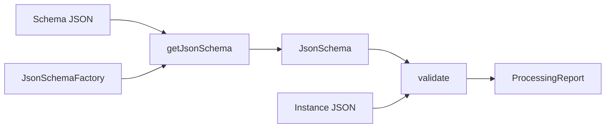
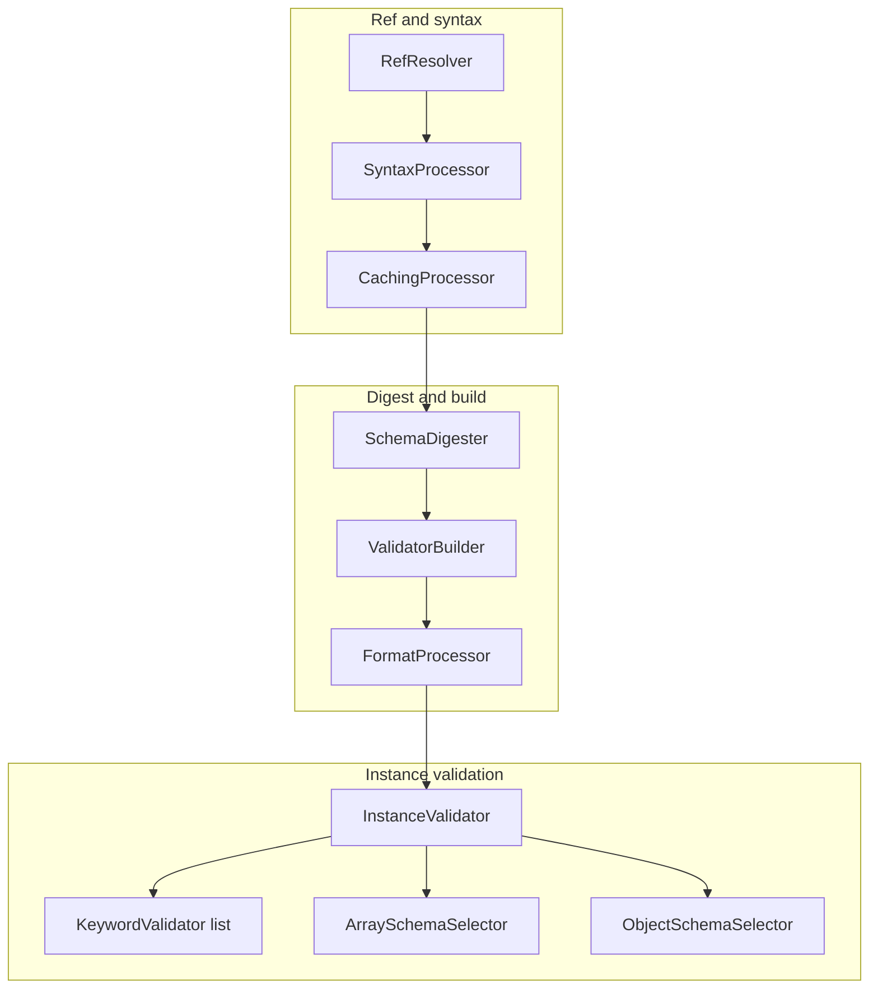

# json-schema-validator (java-json-tools) — Research report

## Metadata

- **Library name**: json-schema-validator
- **Repo URL**: https://github.com/java-json-tools/json-schema-validator
- **Clone path**: `research/repos/java/java-json-tools-json-schema-validator/`
- **Language**: Java
- **License**: LGPLv3 (or later) and ASL 2.0 (dual-licensed)

## Summary

json-schema-validator is a JSON Schema **validation** library for Java. It does **not** generate code. It loads a JSON Schema (via URI, JsonNode, or file), parses it via a five-step pipeline ($ref resolution, syntax validation, digesting, keyword building, instance validation), and validates JSON documents against that schema. Supported drafts are v3 (draft-03) and v4 (draft-04); v4 includes hyperschema support. Validation is the only concern: schema + instance → `ProcessingReport` (success flag and list of validation errors with paths and messages). Optional format validation and syntax validation are supported. The library uses Jackson for JSON and depends on json-schema-core for $ref resolution and syntax checking.

## JSON Schema support

- **Drafts**: Draft v3 (draft-03) and v4 (draft-04). Hyperschema support in v4 only (no hyperschema in v3).
- **Scope**: Validation only (schema + instance → valid/invalid + error list). No code generation.
- **Subset**: README and overview.html state complete validation support for v3 and v4. The implementation uses draft-specific libraries (DraftV3ValidatorDictionary, DraftV4ValidatorDictionary) and digester/validator pairs per keyword. $ref resolution is handled by RefResolver (json-schema-core); JSON Pointer (RFC 6901) and JSON Reference (draft-pbryan-zyp-json-ref-03) are supported.

## Keyword support table

Keyword list derived from vendored draft-03 and draft-04 meta-schemas (`specs/json-schema.org/draft-03/schema.json`, `specs/json-schema.org/draft-04/schema.json`). Implementation evidence from validator and digester dictionaries (CommonValidatorDictionary, DraftV3ValidatorDictionary, DraftV4ValidatorDictionary), ObjectSchemaDigester, ArraySchemaDigester, FormatProcessor, and overview.html.

| Keyword | Implemented | Notes |
|---------|-------------|-------|
| $ref | yes | Resolved by RefResolver (json-schema-core) before validation; JSON Reference and JSON Pointer. |
| $schema | yes | Parsed; used for draft detection and library selection (ValidationChain per JsonRef). |
| id | yes | Used for $ref scope; LoadingConfiguration and URITranslator. |
| additionalItems | yes | AdditionalItemsValidator; ArraySchemaDigester digests hasAdditional, hasItems, itemsIsArray, itemsSize. |
| additionalProperties | yes | AdditionalPropertiesValidator; ObjectSchemaDigester digests hasAdditional. |
| allOf | yes | DraftV4 only; AllOfValidator. |
| anyOf | yes | DraftV4 only; AnyOfValidator. |
| default | no | Not enforced on instance; metadata only. |
| definitions | yes | Used for $ref resolution; subschemas referenced by pointer. |
| dependencies | yes | DependenciesValidator (common); DraftV3DependenciesDigester, DraftV4DependenciesDigester. |
| description | no | Metadata; not used for validation. |
| disallow | yes | DraftV3 only; DisallowKeywordValidator. |
| divisibleBy | yes | DraftV3 only; DivisibleByValidator, DivisibleByDigester. |
| enum | yes | EnumValidator; JsonNumEquivalence for value comparison. |
| exclusiveMaximum | yes | MaximumValidator (NumericValidator) handles both exclusive and inclusive. |
| exclusiveMinimum | yes | MinimumValidator (NumericValidator) handles both exclusive and inclusive. |
| extends | yes | DraftV3 only; ExtendsValidator. |
| format | yes | FormatProcessor; optional (cfg.getUseFormat()); DraftV3/DraftV4/Extra format attributes. |
| items | yes | ArraySchemaDigester; items, additionalItems drive schema selection per array index. |
| maximum | yes | MaximumValidator. |
| maxItems | yes | MaxItemsValidator. |
| maxLength | yes | MaxLengthValidator. |
| maxProperties | yes | DraftV4 only; MaxPropertiesValidator. |
| minimum | yes | MinimumValidator. |
| minItems | yes | MinItemsValidator. |
| minLength | yes | MinLengthValidator. |
| minProperties | yes | DraftV4 only; MinPropertiesValidator. |
| multipleOf | yes | DraftV4 only; MultipleOfValidator; uses BigDecimal for arbitrary precision. |
| not | yes | DraftV4 only; NotValidator. |
| oneOf | yes | DraftV4 only; OneOfValidator. |
| pattern | yes | PatternValidator; overview states ECMA 262 regex (JavaScript regex). |
| patternProperties | yes | ObjectSchemaDigester; digests pattern property names for ObjectSchemaSelector. |
| properties | yes | DraftV3: PropertiesValidator; DraftV4: ObjectSchemaDigester digests property names for per-field schema selection. |
| required | partial | DraftV4: RequiredKeywordValidator (array of required names). DraftV3: required is boolean; no RequiredKeywordValidator in DraftV3ValidatorDictionary. |
| title | no | Metadata; not used for validation. |
| type | yes | DraftV3TypeValidator, DraftV4TypeValidator; type-checking per draft. |
| uniqueItems | yes | UniqueItemsValidator. |

## Constraints

Validation keywords are enforced at **runtime** by the InstanceValidator. Each keyword validator (e.g. EnumValidator, PatternValidator, MinimumValidator) is invoked during validation; constraints are not structure-only—they directly enforce instance validation (e.g. minLength, minItems, pattern, required). Schema digesting filters keywords by instance type (NodeType); the ValidatorBuilder produces a ValidatorList per schema context. Results are cached (CachingProcessor with SchemaContextEquivalence) for reuse. Overview.html notes the implementation can validate numeric JSON data of arbitrary scale/precision (BigDecimal).

## High-level architecture

Pipeline: **Schema** (JsonNode or URI) → **JsonSchemaFactory.getJsonSchema()** or **JsonValidator.validate(schema, instance)** → **ValidationProcessor** → **InstanceValidator**. Internally, ValidationChain performs: (1) $ref resolution (RefResolver), (2) syntax validation (SyntaxProcessor), (3) digesting (SchemaDigester), (4) keyword building (ValidatorBuilder), (5) format processing (FormatProcessor, optional) → **ValidatorList** → per-keyword validation + recursive child validation (arrays, objects) → **ProcessingReport** (isSuccess, messages). No code generation step.

## Medium-level architecture

- **Schema loading**: SchemaLoader (from LoadingConfiguration) loads schemas; URITranslatorConfiguration for namespace and path redirects (e.g. fakeroot). JsonSchemaFactory holds loader; JsonValidator.buildJsonSchema() produces JsonSchemaImpl for a fixed schema.
- **$ref resolution**: RefResolver (json-schema-core) resolves JSON References; failure is fatal. ValidationChain starts with resolver → SyntaxProcessor (cached); then SchemaDigester → ValidatorBuilder → FormatProcessor (if useFormat). Library selection by $schema (ProcessorMap keyed by JsonRef); DraftV3 and DraftV4 each have a ValidationChain with draft-specific Library (digesters, validators, format attributes).
- **Digesting**: SchemaDigester uses Library digesters; filters by instance NodeType. ObjectSchemaDigester and ArraySchemaDigester are structural digesters for objects/arrays (properties, patternProperties, items, additionalItems). ValidatorBuilder builds KeywordValidator instances from digests.
- **Validation**: InstanceValidator processes FullData (SchemaContext + instance); gets ValidatorList from keywordBuilder, runs each validator, then recursively validates array elements (ArraySchemaSelector) and object fields (ObjectSchemaSelector). ValidationStack prevents infinite loops.
- **Key types**: JsonSchemaFactory, JsonValidator, JsonSchema, ValidationProcessor, InstanceValidator, ValidationChain, SchemaDigester, ValidatorBuilder, FormatProcessor, RefResolver, ProcessingReport, SchemaContext, ValidatorList, FullData.

## Low-level details

- **Loaders**: SchemaLoader uses LoadingConfiguration (URITranslatorConfiguration, namespace). CLI sets namespace to CWD; fakeroot option adds path redirect. File/HTTP loading via json-schema-core.
- **Format attributes**: Common (date-time, email, ipv6, regex, uri); DraftV4 (hostname, ipv4); DraftV3 (date, time, utc-millisec, phone, ip-address, host-name); Extra (base64, json-pointer, mac, md5, sha1, sha256, sha512, uuid). Unsupported format → warning, no failure.
- **Regex**: overview.html states ECMA 262 (JavaScript) regex.
- **Errors**: ProcessingReport (ListProcessingReport); ProcessingMessage with domain, keyword, instance path, schema path. Message bundles (JsonSchemaValidationBundle, JsonSchemaConfigurationBundle) for localization.
- **Caching**: CachingProcessor with SchemaContextEquivalence and SchemaHolderEquivalence; cache size from ValidationConfiguration.

## Output and integration

- **Vendored vs build-dir**: N/A (validation only; no generated code output).
- **API vs CLI**: Library API and CLI. Entry points: `JsonSchemaFactory.byDefault().getJsonSchema(schema).validate(instance)`, `validator.validate(schema, instance)`, or `getJsonSchema(uri)` for URI-loaded schema. CLI: `Main` class (Main-Class in jar) with options `--help`, `-s`/`--brief`, `-q`/`--quiet`, `--syntax`, `--fakeroot`; args: schema file [instance file(s)].
- **Writer model**: N/A (validation only).

## Configuration

- **JsonSchemaFactoryBuilder**: setReportProvider, setLoadingConfiguration, setValidationConfiguration.
- **LoadingConfiguration**: URITranslatorConfiguration (namespace, path redirects).
- **ValidationConfiguration**: ReportProvider, default library (draft), libraries (JsonRef → Library), useFormat, cacheSize, syntax/validation message bundles.
- **Library**: DraftV3 and DraftV4 libraries include digesters, validators, format attributes, syntax checkers.

## Pros/cons

- **Pros**: Complete draft v3 and v4 validation; ECMA 262 regex; arbitrary-precision numeric validation (BigDecimal); extensible (custom keywords, format attributes via Library); dual draft support with $schema-based library selection; CLI for schema and instance validation; syntax validation; caching for schema/context reuse; Android-compatible (README).
- **Cons**: No code generation; no draft-06/07/2019-09/2020-12; RefResolver in separate json-schema-core dependency; default, title, description not enforced/used for validation.

## Testability

- **How to run tests**: From repo root, `./gradlew test`. Uses TestNG (useTestNG in build.gradle).
- **Test structure**: TestSuite base class; DraftV3TestSuite, DraftV4TestSuite load tests from `/testsuite/draftv3.json`, `/testsuite/draftv4.json`. Each test: description, schema, data, valid flag; asserts report.isSuccess() == valid. ValidationProcessorTest, FormatProcessorTest, keyword tests (e.g. NotKeywordTest, ExtendsKeywordTest). SelfValidationTest validates meta-schemas.
- **Fixtures**: `src/test/resources/testsuite/`, `keyword/` (validators, digest), `format/`, `object/`, `array/`, `other/` (e.g. google-json-api.json).
- **Entry point for shared fixtures**: `JsonSchemaFactory.byDefault().getJsonSchema(schema).validate(instance)` or `validator.validate(schema, instance)`.

## Performance

- **NewAPIPerfTest**: Manual perf test (`main` method); loads google-json-api schemas, runs 500 validation iterations, prints wall time. Run via `java` on built jar or `./gradlew run` if configured.
- **Entry points for benchmarking**: (1) `JsonSchemaFactory.byDefault().getJsonSchema(schema)` once, then `schema.validate(instance)` in a loop. (2) `validator.validate(schema, instance)` for varying schemas. (3) CLI: `java -jar ... schema.json instance.json` for quiet mode (`-q`).

## Determinism and idempotency

- **Generated output**: N/A (validation only).
- **Validation result**: For a given schema and instance, the validation outcome is deterministic. InstanceValidator processes object fields in sorted order (Collections.sort(fields)) for stable traversal. Error order depends on traversal; no explicit sorting of report messages. Caching uses SchemaContextEquivalence and SchemaHolderEquivalence for stable cache keys.

## Enum handling

- **Implementation**: EnumValidator stores enum array from digest; validates by iterating values and comparing with JsonNumEquivalence.equivalent(enumValue, node). First match returns success; no match reports err.common.enum.notInEnum.
- **Duplicate entries**: Digest passes enum as-is; no deduplication. Test enum.json includes `{"enum":[1,{},[1,2,3]]}`. Duplicate values (e.g. `["a","a"]`) would be stored; instance "a" would match first occurrence. Draft-04 meta-schema requires uniqueItems on enum; draft-03 does not. Unknown whether schema syntax checker rejects duplicates.
- **Case/namespace**: JsonNumEquivalence compares JsonNode values; distinct "a" and "A" are both stored and both match their corresponding instance. No special case handling.

## Reverse generation (Schema from types)

No. json-schema-validator is a validation-only library; it does not generate JSON Schema from Java types.

## Multi-language output

N/A (validation only; no code generation).

## Model deduplication and $ref/$defs

- **Validation context**: There is no generated model; the question is how $ref and definitions are resolved for validation.
- **$ref**: RefResolver (json-schema-core) resolves JSON References; resolved schema is used for validation. Multiple $refs to the same URI resolve to the same schema; CachingProcessor caches by SchemaHolderEquivalence (SchemaTree equality).
- **definitions**: The "definitions" object holds subschemas; $ref to "#/definitions/foo" is resolved by JSON Pointer. Same definition is represented once per ref and shared across all $refs to it (via cache).

## Validation (schema + JSON → errors)

Yes. This is the library's main purpose.

- **Inputs**: (1) A JSON Schema document (JsonNode or URI). (2) A JSON instance (JsonNode).
- **API**: `JsonSchema.validate(JsonNode instance)` or `JsonSchema.validate(JsonNode instance, boolean deepCheck)`; or `JsonValidator.validate(JsonNode schema, JsonNode instance)`. Returns `ProcessingReport`.
- **Output**: `ProcessingReport.isSuccess()` is true if valid, false otherwise. Report is iterable (ProcessingMessage) with domain, keyword, path, message. `validInstance(instance)` returns boolean.
- **Syntax validation**: `SyntaxValidator.validateSchema(JsonNode schema)` returns ProcessingReport; use before getJsonSchema if schema validity is unknown.
- **Unchecked variants**: `validateUnchecked`, `validInstanceUnchecked` mask exceptions (e.g. unresolvable $ref) as report messages.
