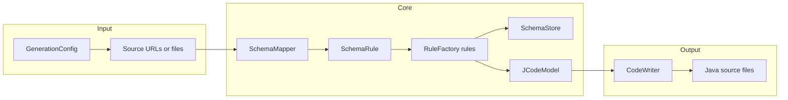
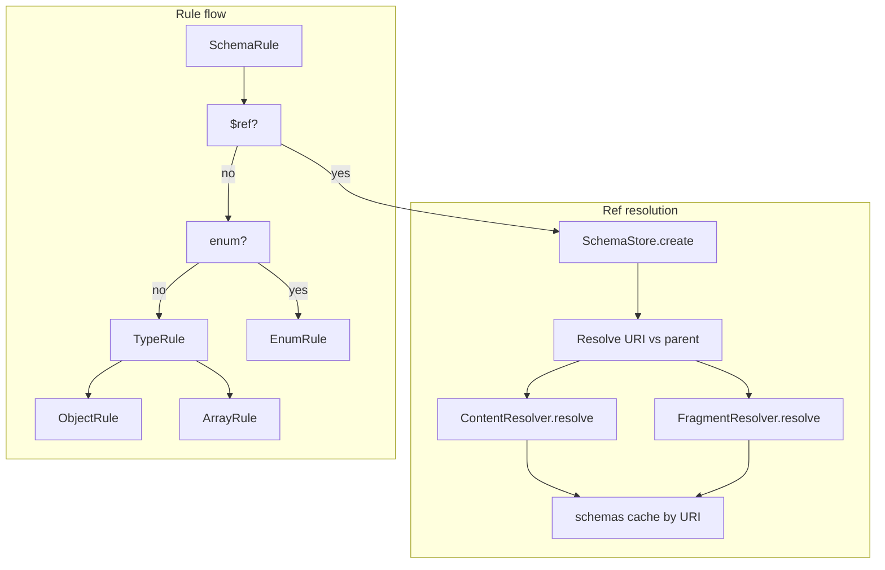

# jsonschema2pojo — Research report

## Metadata

- **Library name**: jsonschema2pojo
- **Repo URL**: https://github.com/joelittlejohn/jsonschema2pojo
- **Clone path**: `research/repos/java/joelittlejohn-jsonschema2pojo/`
- **Language**: Java
- **License**: Apache License, Version 2.0 (see root pom.xml and README)

## Summary

jsonschema2pojo is a JSON Schema to Java code generation library. It reads JSON Schema (or example JSON, which it infers into a schema) and generates DTO-style Java types (POJOs), with optional annotations for Jackson 2.x, Jackson 3.x, Gson, Moshi, or JsonB. It can be used as a Maven plugin, Gradle plugin, command-line tool (jsonschema2pojo-cli), or embedded via the `Jsonschema2Pojo.generate(GenerationConfig, RuleLogger)` API. Output is Java source only; no other target languages. The core uses a rule-based pipeline: schema tree is traversed, and rules (TypeRule, ObjectRule, EnumRule, etc.) produce a CodeModel that is then written to the configured target directory.

## JSON Schema support

- **Drafts**: The codebase references draft-zyp (draft-03), draft-fge (validation), and draft-handrews in Javadocs. Integration tests use `$schema`: `http://json-schema.org/draft-07/schema#`. There is no explicit draft enum or `$schema`-based draft selection in the core; the implementation is effectively draft-03–draft-07 compatible for the keywords it supports. Newer draft-2019-09/2020-12 keywords (e.g. `$defs` as alias, `prefixItems`, `unevaluatedProperties`, `$dynamicRef`) are not advertised or specially handled.
- **Scope**: Code generation only. The library does not validate JSON instances against a schema; it only interprets schema structure to emit Java types.
- **Subset**: Not all meta-schema keywords are implemented. Supported constructs include type, properties, items, required, $ref, definitions (via fragment paths), enum, format, additionalProperties, pattern, default, minimum/maximum, minLength/maxLength, minItems/maxItems, uniqueItems, title, description, $comment, and draft-03 style "extends". allOf/anyOf/oneOf, const, if/then/else, patternProperties, propertyNames, contentEncoding/contentMediaType (as 2020-12 content vocabulary), and unevaluated* are not implemented for type generation.

## Keyword support table

Keyword list derived from vendored draft 2020-12 meta-schemas (`specs/json-schema.org/draft/2020-12/meta/`). Implementation evidence from RuleFactory, SchemaRule, TypeRule, ObjectRule, PropertyRule, ArrayRule, EnumRule, AdditionalPropertiesRule, FormatRule, MediaRule, and related rules in the clone.

| Keyword | Implemented | Notes |
|---------|-------------|-------|
| $anchor | no | Not used in schema resolution or codegen. |
| $comment | yes | CommentRule; emitted as Javadoc. |
| $defs | partial | No explicit keyword; fragment paths like `#/$defs/Name` are resolved by FragmentResolver (path-based). definitions used in tests (`#/definitions/embedded`). |
| $dynamicAnchor | no | Not implemented. |
| $dynamicRef | no | Not implemented. |
| $id | partial | Used implicitly: SchemaStore keys schemas by URI; parent.getId().resolve(path) for $ref. No explicit $id parsing for scope. |
| $ref | yes | SchemaRule, PropertyRule, SchemaStore.create; FragmentResolver for in-document pointers; ContentResolver for remote. Reuse via SchemaStore cache (isGenerated). |
| $schema | no | Accepted in input but not used to select draft or validate schema. |
| $vocabulary | no | Not implemented. |
| additionalProperties | yes | AdditionalPropertiesRule: boolean false = no map; true/absent = Map; schema = generated type for values. |
| allOf | no | Not implemented. ReflectionHelper supports draft-03 "extends" only. |
| anyOf | no | Not implemented. |
| const | no | Not in SchemaRule or TypeRule; only enum branch. |
| contains | no | Not implemented. |
| contentEncoding | no | Not implemented. content/media: MediaRule handles JSON Hyper-Schema "media" with binaryEncoding → byte[]. |
| contentMediaType | no | Not implemented. |
| contentSchema | no | Not implemented. |
| default | yes | DefaultRule; applied to property field initializer. |
| dependentRequired | no | Not implemented. |
| dependentSchemas | no | Not implemented. |
| deprecated | no | Not implemented. |
| description | yes | DescriptionRule; Javadoc. |
| else | no | Not implemented. |
| enum | yes | EnumRule; Java enum with value field, fromValue factory; javaEnums/javaEnumNames extensions. |
| examples | no | Not implemented. |
| exclusiveMaximum | no | MinimumMaximumRule only handles minimum/maximum (and only when isIncludeJsr303Annotations). |
| exclusiveMinimum | no | Same as exclusiveMaximum. |
| format | yes | FormatRule; maps to Java types (date-time, date, time, uri, email, uuid, etc.) and optional JSR-303 @Email when configured. |
| if | no | Not implemented. |
| items | yes | ArrayRule; single schema for element type; List or Set (uniqueItems). |
| maxContains | no | Not implemented. |
| maximum | yes | MinimumMaximumRule when isIncludeJsr303Annotations; @DecimalMax. |
| maxItems | yes | MinItemsMaxItemsRule when isIncludeJsr303Annotations; @Size. |
| maxLength | yes | MinLengthMaxLengthRule when isIncludeJsr303Annotations; @Size. |
| maxProperties | no | Not implemented. |
| minContains | no | Not implemented. |
| minimum | yes | MinimumMaximumRule when isIncludeJsr303Annotations; @DecimalMin. |
| minItems | yes | MinItemsMaxItemsRule when isIncludeJsr303Annotations; @Size. |
| minLength | yes | MinLengthMaxLengthRule when isIncludeJsr303Annotations; @Size. |
| minProperties | no | Not implemented. |
| multipleOf | no | Not implemented. DigitsRule exists for custom "digits" (JSR-303 @Digits), not standard multipleOf. |
| not | no | Not implemented. |
| oneOf | no | Not implemented. |
| pattern | yes | PatternRule; optional JSR-303 @Pattern when isIncludeJsr303Annotations. |
| patternProperties | no | Not implemented. DynamicPropertiesRule adds dynamic get/set for declared properties, not patternProperties. |
| prefixItems | no | Not implemented. |
| properties | yes | PropertiesRule, PropertyRule; generates fields and accessors. |
| propertyNames | no | Not implemented. |
| readOnly | no | Not implemented. |
| required | yes | RequiredArrayRule (array form); ConstructorRule and PropertyRule (required vs optional); draft-03 and draft-04 style both supported. |
| then | no | Not implemented. |
| title | yes | TitleRule; Javadoc. |
| type | yes | TypeRule; object/array/string/number/integer/boolean/null; type array supported (non-null first). |
| unevaluatedItems | no | Not implemented. |
| unevaluatedProperties | no | Not implemented. |
| uniqueItems | yes | ArrayRule; true → Set, false/absent → List. |
| writeOnly | no | Not implemented. |

## Constraints

Validation keywords are used primarily for **structure** (types, required, items, additionalProperties). When `isIncludeJsr303Annotations()` is true, the library also emits Bean Validation annotations so that constraints can be enforced at runtime by a validation framework: minimum/maximum → @DecimalMin/@DecimalMax, minLength/maxLength/minItems/maxItems → @Size, pattern → @Pattern, format email → @Email. So constraint enforcement is optional and delegated to JSR-303/Jakarta Validation; by default generated code does not enforce constraints itself.

## High-level architecture

Pipeline: **Source** (files or URLs from GenerationConfig) → **SchemaMapper.generate** (per source: read schema or infer from example JSON) → **SchemaRule** on root → recursive **RuleFactory** rules (TypeRule, ObjectRule, ArrayRule, EnumRule, etc.) with **SchemaStore** for $ref and **FragmentResolver** for in-document paths → **JCodeModel** (CodeModel) → **CodeWriter** (FileCodeWriterWithEncoding) → Java source files under target directory. Source type can be JSON Schema, YAML Schema, or example JSON/YAML (SchemaGenerator infers schema). For directories, files are processed in an order determined by SourceSortOrder (OS, FILES_FIRST, or SUBDIRS_FIRST).

## Medium-level architecture

- **Entry**: `Jsonschema2Pojo.generate(GenerationConfig, RuleLogger)` creates Annotator, RuleFactory, SchemaStore, SchemaMapper; iterates config.getSource(), calls mapper.generate(codeModel, className, packageName, sourceUrl). For directory sources, generateRecursive sorts files by config.getSourceSortOrder().getComparator() and processes each file (clearing schema cache for JSON/YAML example mode between files).
- **Schema loading**: SchemaMapper.readSchema: for JSONSCHEMA/YAMLSCHEMA builds a single node `{"$ref": schemaUrl.toString()}`; for JSON/YAML loads content and uses SchemaGenerator.schemaFromExample to infer a schema. SchemaRule and PropertyRule resolve $ref via SchemaStore.create(parent, path, refFragmentPathDelimiters). SchemaStore.create(Schema parent, String path, String refFragmentPathDelimiters) resolves path against parent.getId(), then create(URI id, ...). For URI id: normalize; if not in schemas cache, load base document (ContentResolver.resolve(baseId)), parse, store by baseId; if fragment present, FragmentResolver.resolve(baseSchema.getContent(), '#' + id.getFragment(), refFragmentPathDelimiters) returns sub-node and a new Schema(normalizedId, childContent, baseSchema) is cached. So $ref resolution is URI + JSON-Pointer-style fragment (delimiters configurable, default "#/.").
- **Rule dispatch**: SchemaRule: if $ref, resolve and recurse or return cached javaType; else if enum → EnumRule; else TypeRule. TypeRule: type/object → ObjectRule; array → ArrayRule; string/number/integer/boolean → ref or FormatRule; default Object. ObjectRule creates JDefinedClass, applies title/description/$comment, PropertiesRule, AdditionalPropertiesRule, DynamicPropertiesRule, RequiredArrayRule, ConstructorRule, etc. ArrayRule uses items schema (via SchemaStore path #/items or fragment/items), applies SchemaRule for item type, returns List or Set. PropertyRule resolves $ref for property schema, adds field and getter/setter, then DefaultRule, MinimumMaximumRule, MinItemsMaxItemsRule, MinLengthMaxLengthRule, PatternRule when applicable.
- **Key types**: Jsonschema2Pojo, SchemaMapper, SchemaStore, Schema, FragmentResolver, ContentResolver, RuleFactory, SchemaRule, TypeRule, ObjectRule, PropertyRule, ArrayRule, EnumRule, GenerationConfig, Annotator, JCodeModel, CodeWriter.

## Low-level details

- **Fragment delimiters**: `GenerationConfig.getRefFragmentPathDelimiters()` (default `"#/."`) is passed to SchemaStore.create and FragmentResolver.resolve; FragmentResolver splits the path by these characters and walks the JsonNode tree (array index or object key per segment). So `#/definitions/Foo` and `#/$defs/Foo` both work if the document has those keys.
- **definitions vs $defs**: No special handling; both are reachable via fragment paths. Test uses `#/definitions/embedded`. SchemaStore does not treat $defs as a separate scope; resolution is path-only.
- **CodeModel**: com.sun.codemodel (JCodeModel) is used to build types; codeModel.build(sourcesWriter, resourcesWriter) writes .java files. FileCodeWriterWithEncoding writes to config.getTargetDirectory() with config.getOutputEncoding() (default UTF-8).
- **Source order**: Collections.sort(schemaFiles, config.getSourceSortOrder().getComparator()) before processing; SourceSortOrder.OS leaves order to the OS; FILES_FIRST and SUBDIRS_FIRST give deterministic sort. Property order in generated classes follows the iteration order of node.get("properties").properties() (Jackson/JSON order) unless annotator.propertyOrder changes it.

## Output and integration

- **Vendored vs build-dir**: Output is written to a configurable target directory (e.g. Maven `${project.build.directory}/generated-sources/jsonschema2pojo`). Not vendored by default; typical use is build output directory, optionally added as source root.
- **API vs CLI**: Library API (`Jsonschema2Pojo.generate(GenerationConfig, RuleLogger)`), Maven plugin (goal `generate`), Gradle plugin, and CLI (jsonschema2pojo-cli, main in Jsonschema2PojoCLI). No macros; configuration via GenerationConfig (programmatic or Mojo/plugin parameters).
- **Writer model**: File-only. CodeWriter is FileCodeWriterWithEncoding wrapping the target directory; no generic Writer or in-memory string API exposed for generation.

## Configuration

- **Paths and packages**: getSource(), getTargetDirectory(), getTargetPackage(), getFileFilter(), getFileExtensions(), getSourceSortOrder(), getRefFragmentPathDelimiters().
- **Source type**: SourceType.JSONSCHEMA, YAMLSCHEMA, JSON, YAML (schema vs example; JSON/YAML trigger schema inference and cache clear per file).
- **Naming**: getClassNamePrefix(), getClassNameSuffix(), getPropertyWordDelimiters(), isUseTitleAsClassname(), getCustomDatePattern/getCustomTimePattern/getCustomDateTimePattern.
- **Types and primitives**: isUsePrimitives(), isUseLongIntegers(), isUseBigIntegers(), isUseDoubleNumbers(), isUseBigDecimals(), getFormatTypeMapping(), isUseJodaDates(), isUseJodaLocalDates(), isUseJodaLocalTimes(), getDateTimeType(), getDateType(), getTimeType().
- **Serialization**: getAnnotationStyle() (JACKSON, JACKSON2, JACKSON3, GSON, MOSHI1, JSONB, NONE), getInclusionLevel(), getCustomAnnotator(), isIncludeTypeInfo().
- **Validation annotations**: isIncludeJsr303Annotations(), isUseJakartaValidation() (for JSR-303 vs Jakarta); when true, minimum/maximum, min/max length/items, pattern, email format can emit annotations.
- **Behaviour**: isGenerateBuilders(), isUseInnerClassBuilders(), isIncludeConstructors(), isIncludeRequiredPropertiesConstructor(), isIncludeAllPropertiesConstructor(), isIncludeCopyConstructor(), isIncludeAdditionalProperties(), isIncludeGetters(), isIncludeSetters(), isUseOptionalForGetters(), isIncludeHashcodeAndEquals(), isIncludeToString(), getToStringExcludes(), isParcelable(), isSerializable(), isRemoveOldOutput(), isIncludeGeneratedAnnotation(), isIncludeConstructorPropertiesAnnotation(), isIncludeDynamicAccessors(), isIncludeJsr305Annotations(), getCustomRuleFactory(), getTargetVersion().

## Pros/cons

- **Pros**: Multiple integration options (Maven, Gradle, CLI, API); supports JSON and YAML schema or example input; configurable annotation styles (Jackson 2/3, Gson, Moshi, JsonB); optional JSR-303/Jakarta Validation annotations for constraints; $ref and definitions-style fragments with configurable path delimiters; SchemaStore caches resolved schemas so shared $refs produce a single Java type; enum with value field and fromValue factory; format mapping and custom format type mapping; builders and optional/getters; extensive GenerationConfig for naming and behaviour.
- **Cons**: No allOf/anyOf/oneOf or if/then/else; no const; no patternProperties or propertyNames; no validation (schema + JSON → errors) in this library; exclusiveMinimum/exclusiveMaximum and multipleOf not applied; source file order can be OS-dependent unless SourceSortOrder is set; no built-in benchmarks in repo.

## Testability

- **How to run tests**: From repo root, `mvn test`. Multi-module Maven build; each module has its own tests.
- **Unit tests**: jsonschema2pojo-core has unit tests under src/test/java (e.g. SchemaRuleTest, SchemaStoreTest, EnumRuleTest, ObjectRuleTest, PropertyRuleTest, TypeRuleTest, SourceSortOrderTest). Tests use JUnit and mock or in-memory config/schemas.
- **Integration tests**: jsonschema2pojo-integration-tests uses schema and YAML fixtures under src/test/resources (e.g. schema/yaml, schema/json, refs, type variants). Maven plugin tests under jsonschema2pojo-maven-plugin/src/test use filtered schema directories and run the plugin.
- **Fixtures**: Schemas in integration-tests and maven-plugin test resources; SchemaStoreTest uses "#/definitions/embedded". No shared external test-suite layout documented in clone.

## Performance

No built-in benchmarks or performance tests were found in the cloned repo. Entry points for external benchmarking: `Jsonschema2Pojo.generate(config, logger)` (API), Maven goal `generate`, Gradle task, or CLI invocation (org.jsonschema2pojo.cli.Jsonschema2PojoCLI.main). Measuring wall time or JVM metrics around a single generate() call or CLI run would be the way to compare against shared fixtures.

## Determinism and idempotency

- **Source order**: Configurable via SourceSortOrder (OS, FILES_FIRST, SUBDIRS_FIRST). With FILES_FIRST or SUBDIRS_FIRST, file processing order is deterministic; with OS, it may vary by filesystem.
- **SchemaStore cache**: Same $ref (same resolved URI) returns the same Schema and thus the same Java type; repeated runs with the same config and sources should produce the same set of types. Cache is cleared per file when source type is JSON or YAML (example mode).
- **Property order**: Follows JSON object key order from the parser (Jackson) unless annotator changes it; no explicit sort of properties in the report. Class and field order within CodeModel are not explicitly sorted in the core (SerializableHelper uses TreeMap for serialVersionUID block ordering).
- **Idempotency**: For the same input and config, output is expected to be stable modulo source order choice; no evidence of intentional randomization. Small schema changes typically result in localized code changes (new types or properties) rather than global reordering.

## Enum handling

- **Implementation**: EnumRule builds a Java enum with a "value" field holding the JSON value; constants are created from the enum array. getConstantName() derives Java constant names (e.g. uppercase with underscores); makeUnique(name, existingNames) appends "_" if the name collides.
- **Duplicate entries**: Duplicate enum values (e.g. `["a", "a"]`) are both processed; the second gets a unique constant name via makeUnique (e.g. A and A_), so two enum constants with the same value can exist. No deduplication of values; no error.
- **Namespace/case collisions**: Values "a" and "A" produce different constant names (e.g. A and A or similar per getConstantName); makeUnique ensures distinct constant names if one would otherwise collide. Both values remain in the enum and are de/serializable via the value field and fromValue.

## Reverse generation (Schema from types)

No. The library generates Java types from JSON Schema (or example JSON). There is no facility in the cloned repo to generate JSON Schema from existing Java classes or POJOs.

## Multi-language output

Java only. The library generates Java source code. There is no option or module to emit TypeScript, Kotlin, or other languages; output is exclusively Java.

## Model deduplication and $ref/$defs

- **$ref**: When a schema node is a single $ref, SchemaRule resolves it via SchemaStore.create(). SchemaStore caches Schema instances by normalized URI (including fragment). If the same ref is encountered again, schemas.get(normalizedId) returns the existing Schema; if that schema already has a javaType (isGenerated()), SchemaRule returns that type without regenerating. So multiple $refs to the same definition produce one Java type and reuse it.
- **definitions / $defs**: No structural deduplication of inline object shapes. Deduplication happens only when the schema uses $ref (or fragment paths like #/definitions/Foo). Identical inline object schemas in two different places generate two separate classes unless they are factored into a definition and referenced. Fragment paths under #/definitions/ or #/$defs/ are resolved by FragmentResolver; the resulting Schema is cached by full URI (document + fragment), so each distinct ref resolves to one Schema and one generated type.

## Validation (schema + JSON → errors)

No. jsonschema2pojo does not validate a JSON payload against a JSON Schema. It only reads schema (or example JSON) and generates Java types. Validation of JSON at runtime would require a separate library (e.g. a Java JSON Schema validator) and optionally the JSR-303 annotations that jsonschema2pojo can emit.
