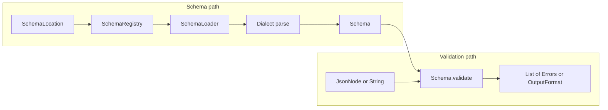
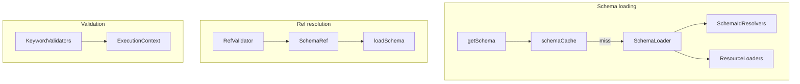

# json-schema-validator (networknt) — Research report

## Metadata

- **Library name**: json-schema-validator (networknt)
- **Repo URL**: https://github.com/networknt/json-schema-validator
- **Clone path**: `research/repos/java/networknt-json-schema-validator/`
- **Language**: Java
- **License**: Apache License 2.0 (see pom.xml)

## Summary

networknt json-schema-validator is a JSON Schema **validation** library for Java. It does **not** generate code. It loads a JSON Schema (via SchemaRegistry and SchemaLoader, from classpath, URI, or in-memory resources), parses it into a Schema graph with KeywordValidators per dialect, and validates JSON (or YAML) documents against that schema. Supported drafts are draft-04, draft-06, draft-07, draft 2019-09, and draft 2020-12; the default dialect can be set (e.g. Draft 2020-12), and `$schema` in the schema data selects the dialect. Validation is the main concern: SchemaRegistry → getSchema(SchemaLocation) → Schema → validate(JsonNode) → List&lt;Error&gt; or format-specific output (Flag, List, Hierarchical). Custom dialects, vocabularies, keywords, and formats are supported. The library uses Jackson for JSON/YAML and is designed for performance as part of the light-4j framework.

## JSON Schema support

- **Drafts**: Draft-04, draft-06, draft-07, draft 2019-09, draft 2020-12. SchemaRegistry is created with `withDefaultDialect(SpecificationVersion.DRAFT_2020_12)` or `withDialect(Dialect)`; if the schema data specifies `$schema`, that dialect is used. Cross-dialect validation is supported (e.g. draft-07 schema referencing draft-04).
- **Scope**: Validation only (schema + instance → errors or machine-readable output). No code generation.
- **Subset**: README and doc/compatibility.md state full support for the required functionality of each draft. Format keyword is annotation-only by default since draft 2019-09; format assertions can be enabled via ExecutionConfig or meta-schema vocabulary. contentEncoding/contentMediaType do not generate assertions since 2019-09; contentSchema does not generate assertions. Pattern uses JDK regex by default (not ECMA-262); optional Joni or GraalJS for compliance. Annotation collection and output formats (Flag, List, Hierarchical) follow the machine-readable output specification.

## Keyword support table

Keyword list derived from vendored draft 2020-12 meta-schemas (`specs/json-schema.org/draft/2020-12/meta/*.json`). Implementation evidence from `keyword/*Validator.java`, `KeywordType`, `NonValidationKeyword`, `Vocabulary.java`, and doc/compatibility.md.

| Keyword | Implemented | Notes |
|---------|-------------|-------|
| $anchor | yes | 2019-09/2020-12; registered in NonValidationKeyword (readAnchor); used for $ref resolution. |
| $comment | yes | Meta-data; annotation only, no validation. |
| $defs | yes | NonValidationKeyword; registers subschemas for $ref; 2019-09/2020-12. |
| $dynamicAnchor | yes | NonValidationKeyword (readDynamicAnchor); 2020-12. |
| $dynamicRef | yes | DynamicRefValidator; 2020-12. |
| $id | yes | Resolved via SchemaLoader/schemaIdResolvers; used for schema loading and $ref. |
| $ref | yes | RefValidator; resolves via SchemaRegistry.loadSchema, SchemaRef cache; URI + JSON Pointer. |
| $schema | yes | Accepted; used for dialect selection (DialectRegistry). |
| $vocabulary | yes | Dialect/vocabulary support; custom vocabularies via VocabularyRegistry. |
| additionalProperties | yes | AdditionalPropertiesValidator. |
| allOf | yes | AllOfValidator. |
| anyOf | yes | AnyOfValidator. |
| const | yes | ConstValidator; draft-06+. |
| contains | yes | ContainsValidator; draft-06+. |
| contentEncoding | yes | ContentEncodingValidator; draft-07+; annotation-only since 2019-09 (no assertions). |
| contentMediaType | yes | ContentMediaTypeValidator; draft-07+; annotation-only since 2019-09. |
| contentSchema | yes | AnnotationKeyword; annotation only, does not generate assertions (compatibility.md). |
| default | yes | Meta-data; annotation; ApplyDefaultsStrategy in walk. |
| dependentRequired | yes | DependentRequired; 2019-09/2020-12. |
| dependentSchemas | yes | DependentSchemas; 2019-09/2020-12. |
| deprecated | yes | Meta-data; annotation only. |
| description | yes | Meta-data; annotation only. |
| else | yes | Part of IfValidator (if/then/else); draft-07+. |
| enum | yes | EnumValidator; value must match one of enum set (HashSet of JsonNode). |
| examples | yes | Meta-data; annotation only. |
| exclusiveMaximum | yes | ExclusiveMaximumValidator; draft-06+ numeric; draft-04 boolean in legacy. |
| exclusiveMinimum | yes | ExclusiveMinimumValidator; draft-06+ numeric; draft-04 boolean in legacy. |
| format | yes | FormatValidator/FormatKeyword; optional assertions (formatAssertionsEnabled); many built-in formats. |
| if | yes | IfValidator; draft-07+. |
| items | yes | ItemsValidator (2020-12) or ItemsLegacyValidator (draft-07 and earlier). |
| maxContains | yes | MinMaxContainsValidator; 2019-09/2020-12. |
| maximum | yes | MaximumValidator. |
| maxItems | yes | MaxItemsValidator. |
| maxLength | yes | MaxLengthValidator. |
| maxProperties | yes | MaxPropertiesValidator. |
| minContains | yes | MinMaxContainsValidator; 2019-09/2020-12. |
| minimum | yes | MinimumValidator. |
| minItems | yes | MinItemsValidator. |
| minLength | yes | MinLengthValidator. |
| minProperties | yes | MinPropertiesValidator. |
| multipleOf | yes | MultipleOfValidator. |
| not | yes | NotValidator. |
| oneOf | yes | OneOfValidator. |
| pattern | yes | PatternValidator; default JDK regex; optional Joni/GraalJS for ECMA-262. |
| patternProperties | yes | PatternPropertiesValidator. |
| prefixItems | yes | PrefixItemsValidator; 2020-12. |
| properties | yes | PropertiesValidator. |
| propertyNames | yes | PropertyNamesValidator; draft-06+. |
| readOnly | yes | ReadOnlyValidator; draft-07+. |
| required | yes | RequiredValidator. |
| then | yes | Part of IfValidator; draft-07+. |
| title | yes | Meta-data; annotation only. |
| type | yes | TypeValidator (UnionTypeValidator for union types). |
| unevaluatedItems | yes | UnevaluatedItemsValidator; 2019-09/2020-12; uses annotations. |
| unevaluatedProperties | yes | UnevaluatedPropertiesValidator; 2019-09/2020-12; uses annotations. |
| uniqueItems | yes | UniqueItemsValidator. |
| writeOnly | yes | WriteOnlyValidator; draft-07+. |

## Constraints

Validation keywords are enforced at **runtime** by the keyword validators. Each Schema holds a list of KeywordValidators (sorted by evaluation path). Schema.validate(ExecutionContext, JsonNode, ...) invokes each validator; validators dispatch on keyword (e.g. TypeValidator, PropertiesValidator, RefValidator). Constraints such as minLength, minItems, pattern, required, multipleOf are fully enforced. Meta-data keywords ($comment, title, description, default, examples, deprecated) are annotations only. Format can be annotation-only (default since 2019-09) or assertion when formatAssertionsEnabled is true. contentEncoding, contentMediaType, and contentSchema do not generate assertions per spec/compatibility.

## High-level architecture

Pipeline: **Schema location** (e.g. URI or classpath) → **SchemaRegistry.getSchema(SchemaLocation)** → load schema document via **SchemaLoader** (SchemaIdResolvers, ResourceLoaders) → parse with **Dialect** (vocabularies, keywords) → **Schema** (tree of Schema nodes, each with KeywordValidators) → **Schema.validate(JsonNode)** (or validate with OutputFormat) → **List&lt;Error&gt;** or format-specific output (Flag, List, Hierarchical). No code generation step.

## Medium-level architecture

- **Schema loading**: SchemaRegistry.getSchema(SchemaLocation) checks schemaCache; on miss, loads via SchemaLoader.getSchemaResource(AbsoluteIri). SchemaIdResolvers map $id to retrieval IRIs (e.g. mapPrefix); ResourceLoaders (ClasspathResourceLoader, IriResourceLoader, MapResourceLoader) supply InputStreamSource. MetaSchemaIdResolver resolves known meta-schema URIs to classpath resources. Schema documents are read with NodeReader (JSON/YAML).
- **Parsing and dialects**: Each dialect (Draft 4/6/7, 2019-09, 2020-12) is a Dialect with a VocabularyRegistry. Vocabularies supply Keyword instances (KeywordType or custom). Schema is built recursively; NonValidationKeyword handles $id, $anchor, $dynamicAnchor, $defs/definitions (registers subschemas). Keyword validators are created per keyword via Keyword.newValidator(...).
- **$ref resolution**: RefValidator holds a SchemaRef (caching Supplier). getRefSchema resolves URI and optional JSON Pointer; SchemaRegistry.loadSchema(SchemaLocation) loads the root document if needed; in-document refs resolve via getSchema on the loaded schema and pointer. schemaContext.getSchemaResources() and getDynamicAnchors() cache by location. Multiple $refs to the same location reuse cached Schema.
- **Validation**: Schema.validate(executionContext, node, rootNode, instanceLocation) iterates getValidators() and calls each validator's validate(ExecutionContext, JsonNode, JsonNode, NodePath). Errors are added to ExecutionContext; annotations collected when output format or unevaluatedProperties/unevaluatedItems require them.
- **Key types**: Schema, SchemaRegistry, SchemaLoader, SchemaIdResolver, ResourceLoader, SchemaContext, ExecutionContext, KeywordValidator, Dialect, Vocabulary, OutputFormat, Error.

## Low-level details

- **Loaders**: SchemaLoader has list of SchemaIdResolvers and ResourceLoaders. Built-in: ClasspathResourceLoader, IriResourceLoader (optional, fetchRemoteResources), MapResourceLoader (schemas by IRI). SchemaRegistry.Builder.schemas(Map) or schemas(Function) configures resource loaders.
- **Regex**: PatternValidator uses RegularExpression from schemaRegistryConfig.getRegularExpressionFactory(). Default JDKRegularExpressionFactory (not ECMA-262). JoniRegularExpressionFactory or GraalJSRegularExpressionFactory for ECMA-262; require optional dependencies (joni, graaljs).
- **Numbers**: BigDecimal/DecimalNode used for numeric comparison and multipleOf (e.g. EnumValidator.processNumberNode strips trailing zeros for equality).
- **Errors**: Error has message, instanceLocation, evaluationPath, keyword, etc. List&lt;Error&gt; from validate(JsonNode); OutputFormat.DEFAULT returns List&lt;Error&gt;; OutputFormat can produce Flag, List, or Hierarchical machine-readable output.
- **Apply defaults**: WalkHandler and ApplyDefaultsStrategy apply default values during walk when configured.

## Output and integration

- **Vendored vs build-dir**: N/A (validation only; no generated code output).
- **API vs CLI**: Library API only. No CLI. Entry: SchemaRegistry.withDefaultDialect(SpecificationVersion) or withDialect(Dialect); schemaRegistry.getSchema(SchemaLocation.of(uri)); schema.validate(JsonNode) or schema.validate(String, InputFormat, OutputFormat). Optional ExecutionContextCustomizer for locale, formatAssertionsEnabled, etc.
- **Writer model**: N/A (validation only). Validation result is in-memory (List&lt;Error&gt; or format object).

## Configuration

- **SchemaRegistry**: defaultDialectId, dialectRegistry, nodeReader, schemaLoader, schemaCacheEnabled, schemaRegistryConfig. withDefaultDialect(Version) or withDialect(Dialect) for standard dialects.
- **SchemaLoader**: schemaIdResolvers (e.g. mapPrefix for $id → retrieval IRI), resourceLoaders, allow/block predicates, fetchRemoteResources.
- **SchemaRegistryConfig**: regularExpressionFactory (JDK, Joni, GraalJS), formatAssertionsEnabled, pathType, typeLoose, cacheRefs, etc. ExecutionConfig (per validate call): formatAssertionsEnabled, readOnly, writeOnly, locale.
- **Custom dialect/keywords/formats**: doc/custom-dialect.md; Dialect.builder(base).keyword(...).build(); SchemaRegistry.withDialect(dialect). Custom Keyword and KeywordValidator; VocabularyRegistry for custom vocabularies.

## Pros/cons

- **Pros**: Validation-only; supports draft-04 through 2020-12 and custom dialects; optional format assertions; configurable regex (JDK/Joni/GraalJS); SchemaRegistry and SchemaLoader flexible (classpath, URI, map); custom keywords/vocabularies/formats; Flag/List/Hierarchical output; annotation collection; OpenAPI 3.0/3.1 dialects; Jackson-based (JSON and YAML); tested against JSON Schema Test Suite (100% pass per compatibility.md); performance-focused; minimal required dependencies; active maintenance (light-4j).
- **Cons**: No code generation; default pattern is not ECMA-262 compliant; format assertions off by default (2019-09+); unevaluatedProperties/unevaluatedItems require annotation collection (performance impact); optional Joni/GraalJS add dependency size.

## Testability

- **How to run tests**: From repo root, `mvn test`. Tests use JUnit 5.
- **Test suite**: JsonSchemaTestSuiteTest and other *Test classes extend AbstractJsonSchemaTestSuite; they discover test files under src/test/suite/tests/ (draft4, draft6, draft7, draft2019-09, draft2020-12). Each test case runs schema.validate(testSpec.getData(), OutputFormat.DEFAULT, ...) and asserts errors match expected valid/invalid. Format tests enable formatAssertionsEnabled when parent path ends with "format". README notes JSON Schema Test Suite is in src/test/suite; compatibility.md reports 100% pass for required tests (r and o) across drafts.
- **Other tests**: Unit tests for validators (e.g. PropertiesTest, PrefixItemsValidatorTest, UnevaluatedPropertiesTest), OpenAPI30JsonSchemaTest, V4JsonSchemaTest, benchmarks (NetworkntTestSuiteRequiredBenchmark, NetworkntTestSuiteOptionalBenchmark) in src/test/java.

## Performance

- README references external project [networknt/json-schema-validator-perftest](https://github.com/networknt/json-schema-validator-perftest) using JMH. Example figures for "basic" benchmark (Draft 4, properties-heavy) are given (e.g. NetworkntBenchmark.basic ops/s, gc.alloc.rate). doc/compatibility.md notes that annotation collection (e.g. for unevaluatedProperties/unevaluatedItems) adversely affects performance; deeply nested oneOf/anyOf without if/then can force full evaluation.
- Entry points for benchmarking: SchemaRegistry.withDefaultDialect(...); schemaRegistry.getSchema(SchemaLocation.of(...)); schema.validate(node) in a loop. In-repo benchmarks: NetworkntTestSuiteRequiredBenchmark, NetworkntTestSuiteOptionalBenchmark.

## Determinism and idempotency

- **Generated output**: N/A (validation only).
- **Validation result**: For a given schema and instance, validation outcome is deterministic. Errors are added during validator traversal; order depends on evaluation order of validators and instance structure. No explicit sorting of errors documented; output formats present errors in the order produced.

## Enum handling

- **Implementation**: EnumValidator parses enum as array; each element is stored in a HashSet&lt;JsonNode&gt; (processNumberNode for numbers to normalize trailing zeros; processArrayNode for arrays). Validation: instance is normalized (number/array) and checked with nodes.contains(node); typeLoose mode allows string comparison for enum containing strings (isTypeLooseContainsInEnum).
- **Duplicate entries**: Duplicates in the schema enum array are deduplicated because values are stored in a HashSet; a single representative is kept per value.
- **Case / namespace**: Comparison is by JsonNode equality (and number/array normalization). Distinct values "a" and "A" are both stored and both match the corresponding instance; no special case or namespace handling.

## Reverse generation (Schema from types)

No. networknt json-schema-validator is a validation-only library; it does not generate JSON Schema from Java types.

## Multi-language output

N/A (validation only; no code generation).

## Model deduplication and $ref/$defs

- **Validation context**: There is no generated model; the question is how $ref and $defs are resolved and cached for validation.
- **$ref**: Resolved at validation time via RefValidator. SchemaRef caches the resolved Schema (Supplier, cacheRefs in config). SchemaRegistry.loadSchema(SchemaLocation) loads and parses the document; in-document pointers resolve to the same Schema instance for the same location. schemaContext.getSchemaResources() holds loaded root schemas by URI; getDynamicAnchors() for dynamic anchors. Multiple $refs to the same URI#fragment resolve to the same cached Schema.
- **$defs**: NonValidationKeyword parses $defs (and definitions); each entry is registered as a new Schema with schemaContext.newSchema(location, property.getValue(), parentSchema) and stored in schemaContext.getSchemaReferences(). $ref to "#/$defs/foo" resolves to that single Schema instance and is shared across all $refs to it.

## Validation (schema + JSON → errors)

Yes. This is the library's main purpose.

- **Inputs**: (1) A JSON Schema, obtained via SchemaRegistry.getSchema(SchemaLocation) where the location is a URI (or mapped via schemaIdResolvers to classpath/map). (2) A JSON or YAML instance, as JsonNode or String (with InputFormat.JSON/YAML) or AbsoluteIri.
- **API**: schema.validate(JsonNode rootNode) returns List&lt;Error&gt;; overloads with OutputFormat&lt;T&gt; return T (e.g. Flag, List or Hierarchical output); validate(String, InputFormat, ...) and validate(AbsoluteIri, InputFormat, ...) deserialize then validate. ExecutionContextCustomizer or Consumer&lt;ExecutionContext&gt; can set executionConfig (formatAssertionsEnabled, readOnly, writeOnly, locale).
- **Output**: List&lt;Error&gt; (DEFAULT format); or machine-readable output (Flag, List, Hierarchical) per Specification for Machine-Readable Output. Each Error has type, instanceLocation, evaluationPath, message, etc.
- **Meta-schema validation**: Not required before use; schemas are parsed with the dialect determined by $schema or default. Optional validation of schema documents against a meta-schema can be done by validating the schema node with a meta-schema Schema.
- **Format**: When format keyword is present, FormatValidator runs; assertions only if formatAssertionsEnabled (ExecutionConfig or format-assertion vocabulary in meta-schema).
