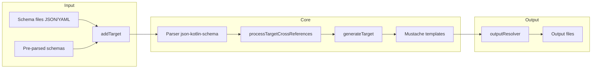
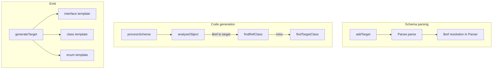

# json-kotlin-schema-codegen — Research report

## Metadata

- **Library name**: json-kotlin-schema-codegen
- **Repo URL**: https://github.com/pwall567/json-kotlin-schema-codegen
- **Clone path**: `research/repos/kotlin/pwall567-json-kotlin-schema-codegen/`
- **Language**: Kotlin
- **License**: MIT (see LICENSE in repo)

## Summary

json-kotlin-schema-codegen is a JSON Schema to code generation library for Kotlin. It reads JSON or YAML schema files, parses them using the companion library json-kotlin-schema, and generates Kotlin, Java, or TypeScript source code via Mustache templates. The library can be used as an API (`CodeGenerator` with `generate()`, `generateClass()`, `generateAll()`), or via Gradle/Maven plugins (json-kotlin-gradle, json-kotlin-maven). It supports Draft-07 and some Draft 2019-09 features. Generated code includes init-block validations for constraints (minimum, maximum, pattern, enum, etc.) and optional format validation via the json-validation library. $ref and $defs are resolved by the underlying schema parser; cross-file references are resolved when multiple schemas are supplied in a single run.

## JSON Schema support

- **Drafts**: Draft-07 primary; some features from Draft 2019-09. README states the code generator targets Draft-07 and includes features from 2019-09. Test schemas use `$schema`: `http://json-schema.org/draft/2019-09/schema` and `http://json-schema.org/draft/2020-12/schema` in some fixtures.
- **Scope**: Code generation only. The library does not validate JSON instances itself; it emits generated code that performs init-block validation. The dependency json-kotlin-schema validates schemas and optionally validates `examples` and `default` during parsing.
- **Subset**: Not all meta-schema keywords are implemented. The schema library (json-kotlin-schema) implements a subset documented in its README (Core, Structure, Validation); codegen support follows that subset plus `not` (reversed validations). `$recursiveRef`, `$recursiveAnchor`, `$anchor`, `$vocabulary`, `unevaluatedProperties`, `unevaluatedItems`, `dependentSchemas`, `dependentRequired`, `contentEncoding`, `contentMediaType`, `contentSchema`, `deprecated`, `readOnly`, `writeOnly` are not implemented. `prefixItems` (draft 2020-12) is not implemented.

## Keyword support table

Keyword list derived from vendored draft 2020-12 meta-schemas (`specs/json-schema.org/draft/2020-12/meta/`). Implementation evidence from json-kotlin-schema README, json-kotlin-schema Parser.kt, CodeGenerator.kt, Constraints.kt, and test resources.

| Keyword | Implemented | Notes |
|---------|-------------|-------|
| $anchor | no | Not implemented (json-kotlin-schema README). |
| $comment | yes | Parsed and stored; codegen does not emit. |
| $defs | yes | Parsed by schema library; $ref to #/$defs/X resolved; codegen uses for type reuse. |
| $dynamicAnchor | no | Not implemented. |
| $dynamicRef | no | Not implemented. |
| $id | yes | Parsed; used for URI scope and class naming (uri-derived className). |
| $ref | yes | RefSchema; resolved by json-kotlin-schema; codegen emits class reference when target is in same run. |
| $schema | yes | Accepted; used for draft detection in schema library. |
| $vocabulary | no | Not implemented. |
| additionalProperties | yes | AdditionalPropertiesSchema; default IGNORE (treat as false); STRICT uses Map-based class when true/schema. |
| allOf | yes | AllOfSchema; base class / composition; analyseObject merges refTarget. |
| anyOf | yes | CombinationSchema; used for nullability pattern (anyOf [$ref, {type:null}]). |
| const | yes | ConstValidator; codegen emits init validation (CONST_STRING, CONST_INT, etc.). |
| contains | partial | Schema library implements; codegen does not generate contains-specific structure. |
| contentEncoding | no | Not implemented. |
| contentMediaType | no | Not implemented. |
| contentSchema | no | Not implemented. |
| default | yes | DefaultValidator; codegen emits default parameter values; optional validation via defaultValidationOption. |
| dependentRequired | no | Not implemented (dependencies typo in schema README). |
| dependentSchemas | no | Not implemented. |
| deprecated | no | Not implemented. |
| description | yes | Emitted as KDoc in generated code. |
| else | yes | IfThenElseSchema; schema library supports; codegen uses conditional logic. |
| enum | yes | EnumValidator; generates Kotlin/Java enum or string union; extensible enum via extension keyword. |
| examples | yes | Parsed; optional validation via examplesValidationOption. |
| exclusiveMaximum | yes | NumberValidator; emitted as init validation. |
| exclusiveMinimum | yes | NumberValidator; emitted as init validation. |
| format | yes | FormatValidator; date-time, date, time, duration, email, hostname, uri, uuid, ipv4, ipv6, etc.; some require json-validation; idn-email, idn-hostname, iri, iri-reference not implemented. |
| if | yes | IfThenElseSchema; schema library supports. |
| items | yes | ItemsSchema, ItemsArraySchema; single schema or array; arrayItems in Constraints. |
| maxContains | yes | Schema library implements. |
| maximum | yes | NumberValidator; emitted as init validation; Int/Long when min/max fit. |
| maxItems | yes | ArrayValidator; emitted as init validation. |
| maxLength | yes | StringValidator; emitted as init validation. |
| maxProperties | yes | PROPERTIES validation; requires additionalPropertiesOption STRICT. |
| minContains | yes | Schema library implements. |
| minimum | yes | NumberValidator; emitted as init validation. |
| minItems | yes | ArrayValidator; emitted as init validation. |
| minLength | yes | StringValidator; emitted as init validation. |
| minProperties | yes | PROPERTIES validation; requires additionalPropertiesOption STRICT. |
| multipleOf | yes | NumberValidator; emitted as init validation. |
| not | partial | JSONSchema.Not parsed; codegen v0.84+ emits reversed validations for format, enum, min/max in property subschemas. |
| oneOf | yes | OneOfSchema; generates interface + implementing classes for polymorphism. |
| pattern | yes | PatternValidator; emitted as init validation. |
| patternProperties | yes | PatternPropertiesSchema; requires additionalPropertiesOption STRICT; Map-based class. |
| prefixItems | no | Draft 2020-12; not implemented. |
| properties | yes | PropertiesSchema; generates data class fields. |
| propertyNames | yes | PropertyNamesSchema; schema library implements. |
| readOnly | no | Not implemented. |
| required | yes | RequiredSchema; non-required → nullable/default. |
| then | yes | IfThenElseSchema; schema library supports. |
| title | yes | Parsed; used for class naming when available. |
| type | yes | TypeValidator; object, array, string, number, integer, boolean, null; type array for nullability. |
| unevaluatedItems | no | Not implemented. |
| unevaluatedProperties | no | Not implemented. |
| uniqueItems | yes | UniqueItemsValidator; Set vs List for array type. |
| writeOnly | no | Not implemented. |

## Constraints

Validation keywords are used both for **structure** (types, required, items, properties) and for **constraint enforcement** in generated code. The codegen emits `init` blocks with `require()` checks for: minimum/maximum, exclusiveMinimum/exclusiveMaximum, minLength/maxLength, minItems/maxItems, multipleOf, pattern, enum, const, required presence, and (when additionalPropertiesOption is STRICT) minProperties, maxProperties, patternProperties, additionalProperties schema. Format validations for email, hostname, ipv4, ipv6, json-pointer, relative-json-pointer, uri-template require the json-validation library at runtime. Constraints are applied in `analyseProperty` and rendered via Mustache templates.

## High-level architecture

Pipeline: **Schema files** (JSON/YAML) or **pre-parsed schema objects** → **Parser** (from json-kotlin-schema, via CodeGenerator.schemaParser) → **addTarget** / **generate** → **processTargetCrossReferences** (walk schema tree, build Constraints, resolve $ref to targets) → **generateAllTargets** → for each Target: **generateTarget** (dispatch by constraints: interface, class, enum) → **Mustache templates** (class, interface, enum) → **outputResolver** → **Output files** (Kotlin/Java/TypeScript under baseDirectoryName).

## Medium-level architecture

- **Schema parsing**: CodeGenerator uses `schemaParser` (json-kotlin-schema Parser). `addTarget(File)`, `addTarget(URI)`, `addTargets` call `schemaParser.parse()` or `schemaParser.parseSchema()` for composite files. Parser resolves $ref, $defs, internal and external references. Optional `examplesValidationOption` and `defaultValidationOption` (NONE/WARN/BLOCK) validate examples/default during parse.
- **$ref resolution**: Handled by json-kotlin-schema (RefSchema, URI + JSON Pointer). Codegen `processTargetCrossReferences` walks each target's schema via `processSchema`; when a RefSchema targets a schema that is itself a target (same run), `findRefClass` / `findTargetClass` sets `constraints.localType` to that target, producing a class reference instead of an inline nested class. `targets.find { it.schema === ref.target }` for cross-reference.
- **Codegen dispatch**: `generateTarget` checks `constraints.generateAsInterface` → interface template; `constraints.isObject` → class template; `constraints.oneOfSchemata.any { it.isObject }` → interface for oneOf polymorphism; `constraints.isString && enumValues && allIdentifier` → enum template. For oneOf with object refs, `implementInterface` creates interface + implementing classes; for inline oneOf items, `createCombinedClass` creates nested classes.
- **Key types**: CodeGenerator, Target, TargetFileName, Constraints, NamedConstraints, GeneratorContext, Parser (json-kotlin-schema), Template (Mustache), OutputResolver.

## Low-level details

- **Templates**: Loaded from classpath `/templates/{kotlin,java,typescript}/` via MustacheParser; primary templates: `class`, `enum`, `interface`. Custom templates via `setTemplateDirectory`.
- **Output**: `outputResolver` defaults to `TargetFileName.resolve(File(baseDirectoryName))`; configurable. Package structure follows `basePackageName` + optional `derivePackageFromStructure` (directory → subpackage).
- **OpenAPI/Swagger**: `generateAll(base, pointer, ...)` and `addCompositeTargets` accept a JSON pointer (e.g. `/definitions`) to extract schema definitions from composite documents.

## Output and integration

- **Vendored vs build-dir**: Output is written to `baseDirectoryName` (default `.`). Not vendored by default; typical use is a build output directory (e.g. Gradle `build/generated/`). Configurable via `baseDirectoryName`.
- **API vs CLI**: Library API (`CodeGenerator.generate()`, `generateClass()`, `generateAll()`); build plugins: json-kotlin-gradle, json-kotlin-maven. No standalone CLI in this repo.
- **Writer model**: File-only. `outputResolver: (TargetFileName) -> Writer` defaults to `targetFileName.resolve(File(baseDirectoryName)).writer()`; can be overridden for custom output.

## Configuration

- **Target language**: `targetLanguage` (KOTLIN, JAVA, TYPESCRIPT).
- **Package and naming**: `basePackageName`, `derivePackageFromStructure`, `classNames` (URI → class name), `nestedClassNameOption` (USE_NAME_FROM_REF_SCHEMA, USE_NAME_FROM_PROPERTY).
- **Additional properties**: `additionalPropertiesOption` (IGNORE, STRICT); IGNORE treats additionalProperties as false by default; STRICT enables Map-based classes for additionalProperties true/patternProperties.
- **Validation options**: `examplesValidationOption`, `defaultValidationOption` (NONE, WARN, BLOCK).
- **Custom classes**: `addCustomClassByURI`, `addCustomClassByFormat`, `addCustomClassByExtension`; config file supports `customClasses` (extension, format, uri).
- **Extensions**: `extensionValidations`, `nonStandardFormat` for x-* keywords and custom formats.
- **Decimal**: `decimalClassName` for KMP (non-JVM decimal type).
- **Annotations**: `annotations` (classes, fields) with Mustache templates.
- **Companion object**: `companionObject` (boolean or list of class names).
- **Configuration file**: `configure(File)` or `configure(Path)`; JSON or YAML.

## Pros/cons

- **Pros**: Multi-language output (Kotlin, Java, TypeScript); template-based (Mustache) for customization; init-block validations in generated code; oneOf polymorphism (interface + implementations); allOf for base classes; custom classes via URI, format, or extension; OpenAPI/Swagger support via generateAll; build tool plugins; configuration file (JSON/YAML); optional examples/default validation.
- **Cons**: additionalPropertiesOption IGNORE by default (strict interpretation); patternProperties/additionalProperties require STRICT for Map-based output; TypeScript coverage less advanced; no $anchor/$dynamicRef; no reverse generation; validation is emitted code, not a separate validation API.

## Testability

- **How to run tests**: Gradle build; `./gradlew test` (or equivalent) from repo root.
- **Unit tests**: Tests under `src/test/kotlin/net/pwall/json/schema/codegen/` (e.g. CodeGeneratorAdditionalPropertiesTest, CodeGeneratorFindClassDescriptorTest) and `src/test/kotlin/net/pwall/util/`. Tests compare generated output to expected files (`resultFile()`).
- **Integration tests**: Test schemas in `src/test/resources/` (test-polymorphic-group*.schema.json, test-derived-class/, test-enum.schema.json, etc.). Generated classes under `src/test/kotlin/.../generated/` and `.../codegen/test/`.
- **Fixtures**: Numerous schema fixtures; some use JSON Schema test-suite style. OpenAPI fixture: test-swagger.yaml with definitions.

## Performance

No built-in benchmarks were found in the cloned repo. Entry points for benchmarking: `CodeGenerator.generate(File(...))` or `generate(vararg File)`, or Gradle/Maven plugin invocations. Measuring wall time around a single generate() call would allow comparison against shared fixtures.

## Determinism and idempotency

- **Order**: Targets are processed in the order added (`addTarget`, `addTargets`). File/directory traversal order is deterministic (listFiles, directory stream). `target.systemClasses.sortBy { it.order }` and `target.imports.sort()` before output.
- **Naming**: Class names derived from $id or filename; `NameGenerator` used for unique names (e.g. nested classes). No apparent randomization.
- **Idempotency**: For the same input schemas and configuration, output is expected to be stable. No evidence of intentional non-determinism. Property order follows schema structure; imports are sorted.

## Enum handling

- **Implementation**: When `constraints.isString && enumValues && allIdentifier(enumValues)`, codegen emits an enum template. Enum constants are derived from the enum array; constant names are generated (e.g. uppercase, sanitised).
- **Duplicate entries**: No explicit deduplication found in enum generation. Duplicate values in the enum array would likely produce duplicate constant names; NameGenerator or similar may disambiguate. Unknown from code inspection.
- **Namespace/case collisions**: Values "a" and "A" would produce distinct enum constants (e.g. A and A_ or similar). The `allIdentifier` check ensures values are valid identifiers for enum generation; otherwise a string type with validation may be used. Extensible enum via `extensibleEnumKeyword` (e.g. x-extensible-enum) allows open enums.

## Reverse generation (Schema from types)

No. The library generates Kotlin, Java, or TypeScript from JSON Schema. There is no facility to generate JSON Schema from existing Kotlin/Java/TypeScript types.

## Multi-language output

Yes. Target languages: Kotlin (default), Java, TypeScript. `targetLanguage` parameter; `TargetLanguage.KOTLIN`, `TargetLanguage.JAVA`, `TargetLanguage.TYPESCRIPT`. README notes TypeScript coverage is not as advanced as Kotlin/Java. Templates exist under `templates/kotlin/`, `templates/java/`, `templates/typescript/`.

## Model deduplication and $ref/$defs

- **$ref**: When a schema node is a RefSchema pointing to a schema that is a target in the same run, `findRefClass` sets `constraints.localType` to that target, so one generated class is reused. When the ref points to a schema not in targets (e.g. $defs entry), `findTargetClass` creates a nested class or reuses an existing nested class by schema identity.
- **$defs**: Definitions under $defs are referenced via $ref (#/$defs/X). The schema library resolves these. Codegen treats the resolved schema as the type; if it appears in multiple places via $ref, the same ClassDescriptor (target or nested class) is used. `targets.find { it.schema === ref.target }` ensures refs to the same schema produce one type.
- **Inline deduplication**: Identical inline object schemas in two branches without $ref generate separate nested classes; no structural deduplication. Deduplication occurs only via $ref/$defs.

## Validation (schema + JSON → errors)

The codegen library does **not** validate a JSON payload against a JSON Schema. It generates code that validates at instantiation (init blocks). The dependency json-kotlin-schema provides validation: `JSONSchema.validate(json)` and `validateBasic(json)` return success/errors. Codegen optionally validates `examples` and `default` entries during schema parsing (examplesValidationOption, defaultValidationOption) and reports or blocks on errors, but that is schema-level validation, not instance validation. For instance validation at runtime, users would use json-kotlin-schema directly or rely on the generated init-block checks when deserialising into the generated types.
