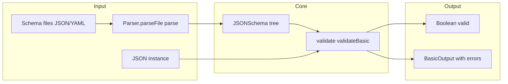
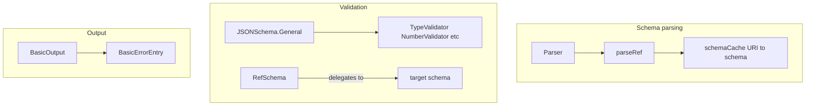

# json-kotlin-schema — Research report

## Metadata

- **Library name**: json-kotlin-schema
- **Repo URL**: https://github.com/pwall567/json-kotlin-schema
- **Clone path**: `research/repos/kotlin/pwall567-json-kotlin-schema/`
- **Language**: Kotlin
- **License**: MIT (see LICENSE in repo)

## Summary

json-kotlin-schema is a JSON Schema parsing and validation library for Kotlin. It reads JSON or YAML schema files, parses them into an internal tree of `JSONSchema` nodes, and validates JSON instances against that schema. The library exposes `validate(json)` (returns boolean) and `validateBasic(json)` (returns `BasicOutput` with a list of errors) for instance validation. It supports Draft-07 and some Draft 2019-09 features. There is no code generation; this is a pure validator. It is used as a dependency by json-kotlin-schema-codegen for schema parsing.

## JSON Schema support

- **Drafts**: Draft-07 primary; some features from Draft 2019-09. README states "Kotlin implementation of JSON Schema (Draft-07)" and that it covers much of Draft 07 and a few features from 2019-09. Parser recognizes `schemaVersionDraft07` and `schemaVersion201909`; Draft-07 is currently parsed as 2019-09.
- **Scope**: Schema parsing and instance validation only. No code generation.
- **Subset**: Not all meta-schema keywords are implemented. README documents "Implemented Subset" (Core, Structure, Validation) and "Not Currently Implemented" (e.g. `$recursiveRef`, `$recursiveAnchor`, `$anchor`, `$vocabulary`, `unevaluatedProperties`, `unevaluatedItems`, `dependentSchemas`, `dependentRequired`, `contentEncoding`, `contentMediaType`, `contentSchema`, `deprecated`, `readOnly`, `writeOnly`, format `idn-email`, `idn-hostname`, `iri`, `iri-reference`).

## Keyword support table

Keyword list derived from vendored draft 2020-12 meta-schemas (`specs/json-schema.org/draft/2020-12/meta/`). Implementation evidence from README, Parser.kt, subschema/, validation/, and test resources.

| Keyword | Implemented | Notes |
|---------|-------------|-------|
| $anchor | no | Not implemented (README). |
| $comment | yes | Parsed; must be string; stored but not used in validation. |
| $defs | yes | Parsed; used for $ref resolution (#/$defs/X). |
| $dynamicAnchor | no | Not implemented. |
| $dynamicRef | no | Not implemented. |
| $id | yes | Parsed; used for URI scope and resolution. |
| $ref | yes | RefSchema; resolved by Parser; internal and external refs supported. |
| $schema | yes | Parsed; used for draft detection (2019-09 vs Draft-07). |
| $vocabulary | no | Not implemented. |
| additionalProperties | yes | AdditionalPropertiesSchema; schema applied to extra properties. |
| allOf | yes | CombinationSchema; all subschemas must validate. |
| anyOf | yes | CombinationSchema; at least one subschema must validate. |
| const | yes | ConstValidator; value must equal const. |
| contains | yes | ContainsValidator; minContains/maxContains supported. |
| contentEncoding | no | Not implemented. |
| contentMediaType | no | Not implemented. |
| contentSchema | no | Not implemented. |
| default | yes | DefaultValidator; parsed and stored; no validation semantics. |
| dependentRequired | no | Not implemented (README; typo "dependentcies"). |
| dependentSchemas | no | Not implemented. |
| deprecated | no | Not implemented. |
| description | yes | Parsed and stored in General schema. |
| else | yes | IfThenElseSchema; conditional validation. |
| enum | yes | EnumValidator; instance must be in enum array. |
| examples | yes | Parsed; optional validation via validateExamples. |
| exclusiveMaximum | yes | NumberValidator. |
| exclusiveMinimum | yes | NumberValidator. |
| format | yes | FormatValidator; date-time, date, time, duration, email, hostname, uri, uri-reference, uri-template, uuid, ipv4, ipv6, json-pointer, relative-json-pointer, regex; idn-email, idn-hostname, iri, iri-reference not implemented. |
| if | yes | IfThenElseSchema; conditional validation. |
| items | yes | ItemsSchema, ItemsArraySchema; single schema or array. |
| maxContains | yes | ContainsValidator. |
| maximum | yes | NumberValidator. |
| maxItems | yes | ArrayValidator. |
| maxLength | yes | StringValidator. |
| maxProperties | yes | PropertiesValidator. |
| minContains | yes | ContainsValidator. |
| minimum | yes | NumberValidator. |
| minItems | yes | ArrayValidator. |
| minLength | yes | StringValidator. |
| minProperties | yes | PropertiesValidator. |
| multipleOf | yes | NumberValidator. |
| not | yes | JSONSchema.Not; nested schema must not validate. |
| oneOf | yes | CombinationSchema; exactly one subschema must validate. |
| pattern | yes | PatternValidator. |
| patternProperties | yes | PatternPropertiesSchema; regex → schema. |
| prefixItems | no | Draft 2020-12; not in Parser. |
| properties | yes | PropertiesSchema; property name → schema. |
| propertyNames | yes | PropertyNamesSchema; schema for property names. |
| readOnly | no | Not implemented. |
| required | yes | RequiredSchema; listed properties must be present. |
| then | yes | IfThenElseSchema; conditional validation. |
| title | yes | Parsed and stored in General schema. |
| type | yes | TypeValidator; null, boolean, object, array, number, string, integer; type array for union. |
| unevaluatedItems | no | Not implemented. |
| unevaluatedProperties | no | Not implemented. |
| uniqueItems | yes | UniqueItemsValidator. |
| writeOnly | no | Not implemented. |

## Constraints

Validation keywords are enforced **at validation time** when `validate()` or `validateBasic()` is called. The library does not generate code; it traverses the schema tree and applies validators (TypeValidator, NumberValidator, StringValidator, FormatValidator, EnumValidator, ConstValidator, ArrayValidator, PropertiesValidator, ContainsValidator, UniqueItemsValidator, PatternValidator, etc.) to the JSON instance. Each validator returns a boolean or BasicOutput; General schema combines children via all/any/oneOf logic.

## High-level architecture

Pipeline: **Schema (JSON/YAML)** → **Parser** (parseFile/parse/parseSchema) → **JSONSchema tree** (sealed class: True, False, Not, General, RefSchema, SubSchema, Validator subclasses) → **validate(json)** / **validateBasic(json)** → **Output** (boolean or BasicOutput with errors list).



## Medium-level architecture

- **JSONSchema**: Sealed class with subtypes True, False, Not, General (children list), SubSchema, Validator. Each node has `validate(json, instanceLocation)` and `validateBasic(relativeLocation, json, instanceLocation)`.
- **Parser**: Parses JSON/YAML via JSONReader; builds schema tree via parseSchema; resolves $ref via parseRef (internal #/..., external URI, fragment). Uses schemaCache (URI → JSONSchema) to avoid re-parsing and detect recursive refs. Options: validateExamples, validateDefault, allowDescriptionRef.
- **RefSchema**: Holds `target: JSONSchema` (resolved); delegates validate/validateBasic to target.
- **Validators**: TypeValidator, NumberValidator, StringValidator, FormatValidator, EnumValidator, ConstValidator, ArrayValidator, PropertiesValidator, ContainsValidator, UniqueItemsValidator, PatternValidator, DefaultValidator; customValidationHandler and nonstandardFormatHandler for extensions.
- **Output**: BasicOutput(valid, errors?), BasicErrorEntry(keywordLocation, absoluteKeywordLocation, instanceLocation, error). DetailedOutput for detailed/annotation output.



## Low-level details

- **BasicErrorEntry**: Fields `keywordLocation`, `absoluteKeywordLocation`, `instanceLocation` (JSON Pointer fragments), `error` (message). Format follows [Basic output](https://json-schema.org/draft/2019-09/json-schema-core.html#rfc.section.10.4.2) specification.
- **JSONReader**: Reads JSON/YAML from File, Path, URI, String; handles content-type for remote URIs. PreLoad for external ref resolution.
- **FormatValidator**: Uses FormatChecker interface; built-in checkers for date-time, date, time, duration, email, hostname, uri, uuid, ipv4, ipv6, etc. Optional json-validation library for some formats. nonstandardFormatHandler for custom formats.

## Output and integration

- **Vendored vs build-dir**: N/A; library does not emit files. Validation returns in-memory BasicOutput or boolean.
- **API vs CLI**: Library API only. `JSONSchema.parseFile(filename)`, `JSONSchema.parse(string, uri?)`, `schema.validate(json)`, `schema.validateBasic(json)`. Parser can be used directly with custom options.
- **Writer model**: N/A for output; validation results are returned as objects.

## Configuration

- **Parser options**: `options.validateExamples` (validate examples/default during parse), `options.validateDefault`, `options.allowDescriptionRef`.
- **Custom validation**: `customValidationHandler` for unknown keywords; `nonstandardFormatHandler` for custom format strings.
- **Connection filters**: `addConnectionFilter`, `addAuthorizationFilter`, `addRedirectionFilter` for HTTP/URI resolution.
- **URI resolver**: Parser accepts custom `uriResolver: (URI) -> InputStream?` for external refs.

## Pros/cons

- **Pros**: Pure validation API; Basic output format follows spec; YAML schema support; optional examples/default validation during parse; JSON Schema test suite integration (TestSuiteTests); extensible via customValidationHandler and nonstandardFormatHandler.
- **Cons**: Subset of keywords; no $anchor/$dynamicRef/$dynamicAnchor; no prefixItems; no unevaluatedProperties/unevaluatedItems; some format strings (idn-email, idn-hostname, iri, iri-reference) not implemented.

## Testability

- **How to run tests**: Gradle build; `./gradlew test` from repo root.
- **Unit tests**: Tests under `src/test/kotlin/net/pwall/json/schema/` (JSONSchemaTest, ParserTest, FormatValidatorTest, JSONSchemaExamplesTest, JSONSchemaItemsTest, etc.).
- **Integration tests**: TestSuiteTests runs JSON Schema test suite from `src/test/resources/test-suite/tests/draft7`; skips id.json, ref.json, definitions.json, dependencies.json and some remote-ref tests. Fixtures under `src/test/resources/` (test-suite, test schemas).

## Performance

No built-in benchmarks were found in the cloned repo. Entry points for future benchmarking: `JSONSchema.parseFile(path)` followed by `schema.validate(json)` or `schema.validateBasic(json)`; or `Parser().parseFile(path)` with custom options.

## Determinism and idempotency

- **Validation**: Same schema and JSON instance produce the same result. Validation is deterministic; no randomness in error collection.
- **Error order**: BasicOutput.errors is collected from children in schema order (e.g. General folds children); sub-errors appended. Order depends on traversal order.
- **Idempotency**: N/A for generated output (no codegen). For validation, repeated calls with same inputs yield identical results.

## Enum handling

- **Implementation**: EnumValidator stores the enum array; `validate` returns true if instance equals any array element (reference/structural equality). `getErrorEntry` returns error "Not in enumerated values: ..." when no match.
- **Duplicate entries**: No explicit deduplication. Duplicate values in the enum array are both checked; if instance matches any, validation passes. Duplicates do not cause errors.
- **Case collisions**: Values "a" and "A" are distinct; both can appear in enum array. Validation compares instance to each element; both are valid if present.

## Reverse generation (Schema from types)

No. The library parses and validates; it does not generate JSON Schema from Kotlin types.

## Multi-language output

N/A. This is a validation-only library; it does not emit code.

## Model deduplication and $ref/$defs

- **$ref**: RefSchema holds a single `target: JSONSchema`; the target is resolved once during parse. When the same $ref is used in multiple places, each RefSchema points to the same target (via schemaCache). No duplication of the referenced schema in memory.
- **$defs**: Definitions under $defs are parsed; $ref "#/$defs/X" resolves to the definition. Parser uses schemaCache keyed by URI+fragment to cache parsed schemas; $defs entries are parsed once and reused.
- **Inline deduplication**: Identical inline object schemas in different branches are parsed as separate General nodes; no structural deduplication. Deduplication occurs only via $ref/$defs.

## Validation (schema + JSON → errors)

Yes. This is the primary purpose of the library.

- **Inputs**: Schema (JSON or YAML string/file/URI) and JSON instance (string or JSONValue).
- **API**: `schema.validate(json)` returns `Boolean` (true = valid). `schema.validateBasic(json)` returns `BasicOutput(valid, errors?)`; when invalid, `errors` is a list of `BasicErrorEntry` with `keywordLocation`, `absoluteKeywordLocation`, `instanceLocation`, `error`.
- **Usage** (from README):
  ```kotlin
  val schema = JSONSchema.parseFile("/path/to/example.schema.json")
  val output = schema.validateBasic(json)
  output.errors?.forEach { println("${it.error} - ${it.instanceLocation}") }
  ```
- **Basic output format**: Follows [Basic output](https://json-schema.org/draft/2019-09/json-schema-core.html#rfc.section.10.4.2) specification. `validateDetailed` returns DetailedOutput with annotations/errors structure.
- **Optional examples/default validation**: When `Parser.options.validateExamples = true` or `validateDefault = true`, the parser validates `examples` and `default` entries during parse; errors collected in `parser.examplesValidationErrors` and `parser.defaultValidationErrors`.
