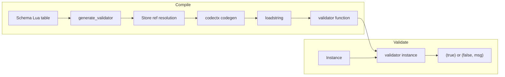
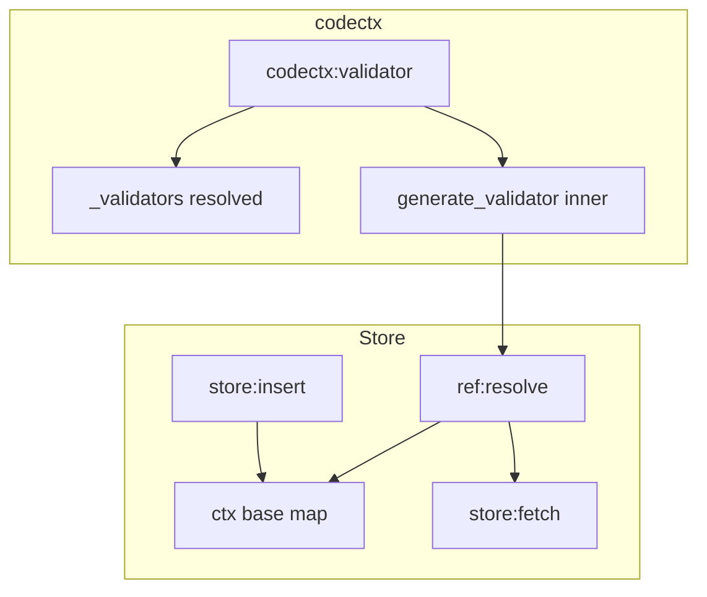

# jsonschema (api7) — Research report

## Metadata

- **Library name**: jsonschema
- **Repo URL**: https://github.com/api7/jsonschema
- **Clone path**: `research/repos/lua/api7-jsonschema/`
- **Language**: Lua
- **License**: Apache License 2.0 (see LICENSE in repo)

## Summary

api7 jsonschema is a pure Lua JSON Schema validator library for Lua 5.2, Lua 5.3, and LuaJIT 2.1 beta. It compiles a JSON Schema into a Lua validator function at runtime via `generate_validator(schema)`. Validation is not limited to JSON and can validate Lua tables, msgpack, bencode, and other key-value formats. The library is designed for validating HTTP requests and is optimized for OpenResty (uses `ngx.re.find` for pattern matching, FFI-based IPv4/IPv6 parsing). Dependencies: net-url (URI resolution for $ref), lrexlib-pcre (regex on non-OpenResty); optional cjson.safe for null token.

## JSON Schema support

- **Drafts**: Draft-04, draft-06, draft-07 (from README). Draft-05 is not supported.
- **Scope**: Validation only (schema + instance → valid/invalid + error message). No static code generation; generates in-memory Lua functions at runtime.
- **Subset**: Supports draft-07 validation keywords where implemented. Known gaps from test blacklist in `t/draft7.lua`: empty object/array distinction (Lua limitation), unsupported regex constructs, required/minProperties on arrays, propertyNames schema validation (partial), contains for non-arrays, remote refs (requires user-provided external_resolver), recursive refs, location-independent identifiers with absolute URI or base URI change.

## Keyword support table

Keyword list derived from vendored draft-07 meta-schema (`specs/json-schema.org/draft-07/schema.json`). Implementation evidence from `lib/jsonschema.lua`, `lib/jsonschema/store.lua`, and tests.

| Keyword | Implemented | Notes |
|---------|-------------|-------|
| $id | yes | Parsed and stored; used for scope and $ref resolution in store.lua. Location-independent ids only; absolute URI and base URI change in subschema blacklisted. |
| $schema | yes | Accepted; not explicitly validated; schema passed through. |
| $ref | yes | Resolved in store.lua via net.url; in-document JSON Pointer; external refs require external_resolver. Remote ref, recursive ref, and some location-independent tests blacklisted. |
| $comment | yes | Passed through schema; not used for validation (metadata). |
| title | yes | Passed through; not used for validation. |
| description | yes | Passed through; not used for validation. |
| default | partial | Used to mutate instance (add default values when property missing); not enforced as validation. |
| readOnly | no | Not in generate_validator; passed through but not enforced. |
| writeOnly | no | Not in generate_validator; passed through but not enforced. |
| examples | yes | Passed through; not used for validation. |
| multipleOf | yes | Instance validation; integer and float cases. |
| maximum | yes | Instance validation. |
| exclusiveMaximum | yes | Draft-07 number semantics. |
| minimum | yes | Instance validation. |
| exclusiveMinimum | yes | Draft-07 number semantics. |
| maxLength | yes | Instance validation; UTF-8 character length via validatorlib.utf8_len. |
| minLength | yes | Instance validation. |
| pattern | yes | Instance validation; ngx.re.find or lrexlib-pcre; some pattern constructs blacklisted. |
| additionalItems | yes | Instance validation; boolean or schema. |
| items | yes | Instance validation; single schema or array (tuple). |
| maxItems | yes | Instance validation. |
| minItems | yes | Instance validation. |
| uniqueItems | yes | Instance validation; validatorlib.unique_item_in_array with deepeq. |
| contains | partial | Implemented; blacklist: "not array is valid" (empty/non-array handling). |
| maxProperties | yes | Instance validation. |
| minProperties | yes | Instance validation; blacklist: "ignores arrays". |
| required | yes | Instance validation; blacklist: "ignores arrays". |
| additionalProperties | yes | Instance validation; boolean or schema. |
| definitions | yes | Walked by store; subschemas used for $ref targets. |
| properties | yes | Instance validation. |
| patternProperties | yes | Instance validation; regex keys. |
| dependencies | yes | Instance validation; property and schema dependencies. |
| propertyNames | partial | Boolean schemas (true/false) only; schema-based validation blacklisted ("some property names invalid"). |
| const | yes | Instance validation; lib.deepeq. |
| enum | yes | Instance validation; linear scan with == or deepeq; null unsupported (error). |
| type | yes | Instance validation; single type or array; includes extra types: table, function (README). |
| format | partial | email, ipv4, ipv6, hostname in reg_map; ipv4/ipv6 use FFI in OpenResty when available. |
| contentMediaType | no | Not in generate_validator. |
| contentEncoding | no | Not in generate_validator. |
| if | yes | Instance validation; conditional then/else. |
| then | yes | Instance validation. |
| else | yes | Instance validation. |
| allOf | yes | Instance validation. |
| anyOf | yes | Instance validation. |
| oneOf | yes | Instance validation; exactly one must match. |
| not | yes | Instance validation. |

**Extra keywords** (README): `table` (matches arrays or objects; faster), `function` (checks for Lua functions).

## Constraints

Validation keywords are enforced at **runtime** by the generated validator function. Each constraint (type, enum, const, numeric bounds, string length/pattern, array items, object properties, etc.) is applied when the validator executes. Constraints are enforced directly on the instance. Format validation is limited to email, ipv4, ipv6, hostname. Default values are applied by mutating the instance when a property is missing and the subschema has a default.

## High-level architecture

Pipeline: **Schema** (Lua table) → `generate_validator(schema, custom)` → **Store** (store.new, $ref/$id resolution) → **codectx** (Lua code generation) → **loadstring** (compile to function) → **validator(instance)** → `(true)` or `(false, "error message")`. Instance can be a Lua table, parsed JSON, or other key-value structure.

## Medium-level architecture

- **generate_validator**: Wraps schema, builds customlib (null, match_pattern, parse_ipv4, parse_ipv6), creates codectx via `generate_main_validator_ctx`, compiles via `as_func(name, validatorlib, customlib)` returning the validator.
- **Store** (store.lua): Manages schema graph; `store.new(schema, external_resolver)` parses schema, walks to collect $id, builds context map; `ref:resolve()` follows $ref via net.url, JSON Pointer, and resolver. External refs require user-provided `external_resolver(url)`; default resolver errors. Supports location-independent $id (fragment-only); relative id resolution for nested schemas.
- **codectx**: Code generation context; `libfunc`, `localvar`, `localvartab`, `stmt`, `validator(path, schema)` (resolves ref, deduplicates validators via `root._validators[resolved]`), `child(ref)`, `as_func`, `as_string`. Generates Lua source, then loads via loadstring with uservalues, lib, custom as varargs.
- **$ref resolution flow**: schema['$ref'] → store:ctx(schema).base.id + $ref → url.parse/resolve → store:fetch(uri) or fragment walk → resolved schema; validator reuses `root._validators[resolved]` for same logical schema.

## Low-level details

- **codectx API**: `libfunc(globalname)` caches and emits `local X = globalname`; `localvar(init, nres)` creates `var_{idx}_{nloc}`; `localvartab` uses `locals.var_...` for shared state; `stmt` appends to body; `uservalue(val)` stores in array for enum/const.
- **Pattern matching**: OpenResty uses `ngx.re.find(s, p, "jo")`; otherwise lrexlib-pcre `rex.find(s, p)`.
- **IPv4/IPv6**: In OpenResty, FFI `inet_pton` for format validation; otherwise reg_map regex only.
- **tablekind**: `validatorlib.tablekind(t)` returns 0 (object), 1 (empty), 2 (array); Lua cannot distinguish empty array from empty object.

## Output and integration

- **Vendored vs build-dir**: N/A (validation only; no generated file output).
- **API vs CLI**: Library API only. `jsonschema.generate_validator(schema, custom)` returns validator function; `jsonschema.generate_validator_code(schema, custom)` returns raw Lua code string (debug). No CLI.
- **Writer model**: N/A (returns in-memory function).

## Configuration

- **Extension points** (README, generate_validator): `null` (token for null; default cjson.null or nil), `match_pattern` (function(string, patt) → boolean), `external_resolver` (function(url) → schema table; required for remote refs), `name` (string for stack traces).
- **Dependencies**: net-url, lrexlib-pcre (or OpenResty); optional cjson.safe, table.nkeys.

## Pros/cons

- **Pros**: Pure Lua; JIT-friendly; OpenResty optimizations (ngx.re, FFI); extension points for null, pattern, external refs; JSON-Schema-Test-Suite coverage; supports Lua tables and other formats; validator deduplication for $ref; default value injection.
- **Cons**: Empty table/array ambiguity in Lua; no remote ref resolver by default; limited format support (email, ipv4, ipv6, hostname); propertyNames schema validation partial; enum null unsupported; blacklisted edge cases.

## Testability

- **Run tests**: `make deps` (git submodule + luarocks install --tree=deps), then `make test` (resty runs t/draft4.lua, t/draft6.lua, t/draft7.lua, t/default.lua, t/200more_variables.lua). Requires OpenResty (resty).
- **Fixtures**: JSON-Schema-Test-Suite submodule in `spec/JSON-Schema-Test-Suite/`; `spec/extra/` (sanity, empty, dependencies, table, ref, format, default).
- **Test layout**: Each t/*.lua loads supported descriptors, generates validators, runs cases; blacklist skips known failures.

## Performance

- `t/draft7.lua` includes timer logic (ngx.update_time, ngx.now) for load and validation phases; prints timings. Benchmarking assumes OpenResty.
- **Entry points**: `jsonschema.generate_validator(schema)` (compile); `validator(instance)` (validate). Cache validator for reuse.

## Determinism and idempotency

- **Generated code**: Deterministic. codectx uses `_idx` (context depth) and `_nloc` (local counter) for variable names; same schema yields same traversal order and identical generated code. `root._validators` keyed by resolved schema ensures consistent validator reuse.
- **Validation result**: For a given schema and instance, result is deterministic.

## Enum handling

- **Implementation**: Linear scan over `schema.enum`; primitives compared with `==`, tables with `lib.deepeq`. Passes if instance equals any enum value.
- **Duplicate entries**: No deduplication; duplicates would produce redundant checks; both would match if equal. Draft-07 meta-schema requires uniqueItems on enum; invalid schemas may have duplicates.
- **Case/namespace**: Value-based equality; "a" and "A" are distinct; both valid if both in enum.
- **null**: Error "unsupported enum type: " when enum contains null; null not supported in enum.

## Reverse generation (Schema from types)

No. Validation-only library; does not generate JSON Schema from Lua types.

## Multi-language output

N/A (validation only; no code generation to files).

## Model deduplication and $ref/$defs

- **Validator deduplication**: `codectx:validator(path, schema)` resolves schema (including $ref) and keys `root._validators` by the resolved schema object. Multiple $refs to the same definition resolve to the same schema node and reuse the same generated validator variable; one validator function is shared.
- **definitions**: Store walks schema including definitions; subschemas under definitions are $ref targets. In-document $ref to definitions works; same definition = same validator.
- **Identical inline shapes**: No structural deduplication; two identical inline object definitions produce two separate validators unless they are the same table reference or reached via $ref.

## Validation (schema + JSON → errors)

Yes. This is the library's main purpose.

- **Inputs**: (1) JSON Schema as Lua table. (2) Instance as Lua value (table, string, number, etc.); not limited to JSON.
- **API**: `validator = jsonschema.generate_validator(schema, custom)`; `ok, err = validator(instance)`.
- **Output**: `ok` is true when valid, false when invalid; `err` is error message string when invalid (nil when valid).
- **Error format**: Plain string (e.g. "wrong type: expected string, got number", "property foo is required", "failed to match pattern ..."). No structured instance path or schema path; single message per failure (first error only).
