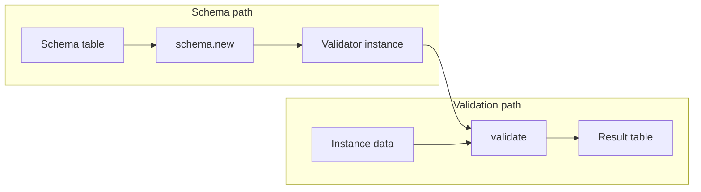
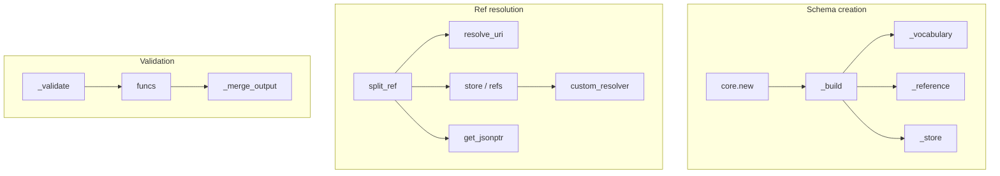

# lua-schema (fperrad) — Research report

## Metadata

- **Library name**: lua-schema
- **Repo URL**: https://framagit.org/fperrad/lua-schema
- **Clone path**: `research/repos/lua/fperrad-lua-schema/`
- **Language**: Lua
- **License**: MIT/X11 (see LICENSE in repo)

## Summary

lua-schema (fperrad) is a JSON Schema **validation** library for Lua. It does not generate code. It compiles a JSON Schema (Lua table) into an internal validator via `schema.new(schema)` and validates data with `validator:validate(data)`, returning a result table with `valid`, `instanceLocation`, `keywordLocation`, `absoluteKeywordLocation`, and `error`/`errors` or `annotation`/`annotations`. Supported drafts are draft-03, draft-04, draft-06, draft-07, draft-2019-09, draft-2020-12, and v1-2026; the default meta-schema is v1-2026. Validation supports output formats `flag`, `basic`, and `detailed`. Optional format assertion, custom keywords/formats, and a custom resolver for external `$ref`s are supported. Lua-specific extensions include extra `type` values (e.g. `nil`, `function`, `table`, `cdata`) and optional `luaPattern`/`luaPatternProperties`/`lpegPattern` and formats `lua-regex`/`lpeg-regex`.

## JSON Schema support

- **Drafts**: Draft-03, draft-04, draft-06, draft-07, draft-2019-09, draft-2020-12, v1-2026. Default is v1-2026 (only that meta-schema is loaded by default); other drafts are used by requiring the corresponding module (e.g. `require'schema.draft-07'`) and setting `schema.default_schema`. Draft is determined by the schema’s `$schema` (or `id` for draft-04) and validated against the appropriate meta-schema from `store`.
- **Scope**: Validation only (schema + instance → valid/invalid + error/annotation output). No code generation.
- **Subset**: Full validation keyword set per draft; applicator, validation, and metadata keywords implemented. Vocabulary-driven format behaviour for draft-2019-09 and later (`_vocabulary` in core.lua). Optional format assertion (`format_assertion`); content keywords are annotation-only.

## Keyword support table

Keyword list derived from vendored draft 2020-12 meta-schemas (`specs/json-schema.org/draft/2020-12/meta/*.json`). Implementation evidence from `src/schema/keyword.lua`, `src/schema/core.lua`, `src/schema/format.lua`, `src/schema/utils.lua`, and draft meta-schema modules.

| Keyword | Implemented | Notes |
|---------|-------------|-------|
| $anchor | yes | Parsed in _reference; used for ref resolution (resolve_uri(base, '#' .. anchor)). |
| $comment | yes | Parsed and ignored for validation (metadata). |
| $defs | yes | Collected in _reference walk; subschemas resolved via $ref. draft-04 uses definitions. |
| $dynamicAnchor | yes | Parsed in _reference; _dynamic_ref resolves via parent chain. |
| $dynamicRef | yes | Resolved in _build via _dynamic_ref; falls back to _ref. |
| $id | yes | Parsed; sets base URI, registers schema in store and refs. draft-04 uses id. |
| $ref | yes | Resolved in _build via _ref; split_ref, store/refs, get_jsonptr; external via custom_resolver. |
| $schema | yes | Used for meta-schema selection and schema validation in _new. |
| $vocabulary | yes | Parsed in _vocabulary; drives format_annotation, format_assertion, validation. |
| additionalProperties | yes | Instance validation in keyword.lua; respects properties, patternProperties, luaPatternProperties. |
| allOf | yes | Instance validation; all subschemas must pass; evaluated merged. |
| anyOf | yes | Instance validation; at least one subschema must pass. |
| const | yes | Instance validation via same() for tables, equality for primitives. |
| contains | yes | Instance validation; minContains/maxContains supported. |
| contentEncoding | yes | Annotation only (_mk_output_anno). |
| contentMediaType | yes | Annotation only. |
| contentSchema | yes | Annotation only when contentMediaType present. |
| default | yes | Annotation only (keyword __index fallback). |
| dependentRequired | yes | Instance validation in keyword.lua. |
| dependentSchemas | yes | Instance validation. |
| deprecated | yes | Annotation only. |
| description | yes | Annotation only. |
| else | yes | Instance validation; conditional with if/then. |
| enum | yes | Instance validation; type check and same()/equality; first match wins. |
| examples | yes | Annotation only. |
| exclusiveMaximum | yes | Instance validation; draft-04 boolean or number. |
| exclusiveMinimum | yes | Instance validation; draft-04 boolean or number. |
| format | partial | Optional assertion; built-in formats in format.lua (date-time, date, time, duration, email, idn-email, hostname, idn-hostname, ipv4, ipv6, uri, uri-reference, iri, iri-reference, uuid, uri-template, json-pointer, relative-json-pointer, regex, lua-regex, lpeg-regex); regex requires Lrexlib-PCRE2; custom_format table. |
| if | yes | Instance validation; then/else applied accordingly. |
| items | yes | Instance validation; single schema or array; integrates with prefixItems. |
| maxContains | yes | Instance validation with contains. |
| maximum | yes | Instance validation; draft-04 exclusiveMaximum boolean supported. |
| maxItems | yes | Instance validation. |
| maxLength | yes | Instance validation; utf8.len. |
| maxProperties | yes | Instance validation. |
| minContains | yes | Instance validation; default 1. |
| minimum | yes | Instance validation; draft-04 exclusiveMinimum boolean. |
| minItems | yes | Instance validation. |
| minLength | yes | Instance validation. |
| minProperties | yes | Instance validation. |
| multipleOf | yes | Instance validation (data % multiple == 0). |
| not | yes | Instance validation; negates subschema result. |
| oneOf | yes | Instance validation; exactly one subschema must pass. |
| pattern | yes | Instance validation; PCRE2 via rex_pcre2. |
| patternProperties | yes | Instance validation; regex keys. |
| prefixItems | yes | Instance validation; draft 2020-12 style. |
| properties | yes | Instance validation. |
| propertyNames | yes | Instance validation; schema applied to each key. |
| readOnly | yes | Annotation only. |
| required | yes | Instance validation. |
| then | yes | Instance validation; conditional with if. |
| title | yes | Annotation only. |
| type | yes | Instance validation; single or array; integer/number; Lua types (nil, function, userdata, thread, table, cdata). |
| unevaluatedItems | yes | Instance validation; uses evaluated from prefixItems/items/contains. |
| unevaluatedProperties | yes | Instance validation; uses evaluated from properties/patternProperties/additionalProperties. |
| uniqueItems | yes | Instance validation; same() for tables, identity for primitives. |
| writeOnly | yes | Annotation only. |

## Constraints

Validation keywords are enforced at **runtime** by the validator built in `core._new` and `mt:_build`. Each keyword (type, enum, const, numeric bounds, string length/pattern, array items, object properties, applicators, unevaluated*) is applied when the validator’s `funcs` run in `_validate`. Constraints are enforced directly on the instance. Format validation is controlled by `format_assertion` and vocabulary; contentEncoding/contentMediaType/contentSchema are annotation-only.

## High-level architecture

Pipeline: **Schema** (Lua table) → **schema.new(schema)** → validator instance (meta-table with `funcs`, `schema`, `ptr`, `abs`, `refs`, etc.) → **validator:validate(data)** → **result table** (`valid`, `instanceLocation`, `keywordLocation`, `absoluteKeywordLocation`, `error`/`errors`, `annotation`/`annotations`).

## Medium-level architecture

- **Schema creation**: `core.new(schema)` calls `_new(schema)`. `_new` resolves meta-schema from `schema['$schema']` or parent or `core.default_schema`, validates the schema against that meta-schema (from `store` or `custom_resolver`), builds pointer/absolute paths, then either sets `funcs` for boolean schemas or calls `obj:_build(parent)`. `_build` runs vocabulary setup (`_vocabulary`), reference collection (`_reference`), stores schema by `$id` (`_store`), then handles `$dynamicRef`/`$recursiveRef`/`$ref`, then registers in-place applicator keywords, then other keywords (including custom_keyword), then unevaluated*.
- **$ref resolution**: `_ref(ref)` splits ref into path and fragment via `split_ref`. Relative paths resolved with `resolve_uri(base, path)`. Root document from `store[path]` or `refs[path]` or `new_external(path)` (custom_resolver). Fragment resolution: named anchors via `refs[url]` (url = base + '#' + fragment); JSON Pointer via `_get_jsonptr` (utils.get_jsonptr). Dereferenced schema is merged with current schema for non–draft-04 style (merge), then `_new(merge(schema, deref), curr, kw)` or `_new(deref, curr, kw)` sets `self.funcs`. Infinite recursion guarded by `parent.level < 99`.
- **Validation**: Validator’s `validate(data)` calls `_validate(data)`. `_validate` runs each function in `funcs` with `(self, data, data_ptr, evaluated)` and merges outputs via `_merge_output` according to `core.output_format` (flag/basic/detailed).
- **Key types**: `core` (module), validator object (schema, ptr, abs, refs, base, funcs, …), `store` (meta_schema → validator), `resolve_uri`/`get_jsonptr` in utils.

## Low-level details

- **Custom keywords/formats**: `core.custom_keyword[kw]` and `core.custom_format[fmt]` are checked in `_build` and in `keyword.format`; unknown metadata keywords use keyword.lua’s `__index` and return annotation-only output.
- **Format assertion**: `core.format_assertion` (default true) and vocabulary (e.g. format-assertion) control whether format failures are validation errors or annotations.
- **Lua types**: `known_types` in keyword.lua maps JSON and Lua types (e.g. array/object → table, null → nil, plus function, userdata, thread, cdata).
- **Infinite recursion**: `assert(parent.level < 99, "infinite recursion")` in _build.

## Output and integration

- **Vendored vs build-dir**: N/A (validation only; no generated code).
- **API vs CLI**: Library API only. `schema.new(schema)` returns a validator; `validator:validate(data)` returns result table. No CLI in Makefile.
- **Writer model**: N/A (validation only).

## Configuration

- **default_schema**: String; default meta-schema (default v1-2026). Set after requiring a draft module to use that draft.
- **output_format**: `"flag"` | `"basic"` | `"detailed"` (default); controls result shape (flag: only `valid`; basic: annotations/errors arrays; detailed: nested annotation/error objects).
- **format_assertion**: Boolean (default true); whether format keyword asserts or annotates.
- **custom_keyword**: Table; name → function(schema_value, parent) returning validator function.
- **custom_format**: Table; format name → function(data) returning true or false, err.
- **custom_resolver**: Function(uri) → decoded schema table or nil; used for external $ref.

## Pros/cons

- **Pros**: Multi-draft support (draft-03 through v1-2026); vocabulary-aware format/validation; output formats flag/basic/detailed with instanceLocation, keywordLocation, absoluteKeywordLocation; custom keywords and formats; custom resolver for external refs; Lua-friendly types and optional luaPattern/lpegPattern; infinite recursion detection; test suite coverage (draft-specific and output tests).
- **Cons**: No code generation; pattern requires Lrexlib-PCRE2 (optional luaPattern/lpegPattern avoid it); idn-email/idn-hostname marked TODO; content* annotation-only; empty array vs empty object ambiguity in Lua tables.

## Testability

- **Run tests**: `make test` (or `make check`); uses `prove` with `LUA_PATH="$(CURDIR)/src/?.lua;;"` and `$(LUA)` on `test/*.lua`. Optional deps: `make bed` installs lua, luacheck, luarocks, lua-testassertion, etc.
- **Fixtures**: Per-draft test-suite runs (e.g. test/52-test-suite-draft-04.lua through 57, 62–67, 75–77) reference JSON-Schema-Test-Suite; some tests skipped (e.g. heterogeneous enum-with-null) with comments. Unit tests in test/01-basic.lua through test/12-resolve-uri.lua, test/31-custom-keyword.lua, test/32-custom-format.lua.
- **Test layout**: test/*.lua; test/dev/ for development tests.

## Performance

No built-in benchmarks in the repo. Entry points for future benchmarking: `require'schema'` (or a draft), `schema.new(schema)` (compile once), `validator:validate(data)` (validation). Makefile has no benchmark target.

## Determinism and idempotency

- **Generated output**: N/A (validation only).
- **Validation result**: For a given schema and instance, the result is deterministic. Output format (flag/basic/detailed) and traversal order fix the shape of errors/annotations; no explicit sorting of errors.

## Enum handling

- **Implementation**: `keyword.enum` iterates over the enum array and checks type match and equality (`same(data, elt)` for tables, `data == elt` otherwise); first matching entry makes the instance valid.
- **Duplicate entries**: No deduplication of enum values; if the schema contains duplicate values (e.g. `["a", "a"]`), both are checked and the first match wins. Meta-schemas may constrain enum uniqueness; the library does not explicitly reject duplicate enum entries.
- **Case / namespace**: Value-based equality; distinct values `"a"` and `"A"` are both valid when both appear in the enum; no special collision handling.

## Reverse generation (Schema from types)

No. Validation-only library; does not generate JSON Schema from Lua types.

## Multi-language output

N/A (validation only; no code generation).

## Model deduplication and $ref/$defs

- **Validation context**: No generated types; the question is how $ref and definitions are resolved and reused.
- **$ref**: Resolved in `_ref`; in-document refs use `store`, `refs`, and `get_jsonptr`; external refs use `custom_resolver`. The same dereferenced schema is reused: `_new(merge(schema, deref), curr, kw)` or `_new(deref, curr, kw)` builds one validator and sets `self.funcs`, so multiple $refs to the same definition resolve to the same logical validator construction.
- **definitions / $defs**: Collected in `_reference` (walk over schema); subschemas under definitions or $defs are in `refs` by $id/$anchor; $ref to them yields the same resolution path. No separate deduplication of inline shapes; reuse is by ref identity.

## Validation (schema + JSON → errors)

Yes. This is the library’s main purpose.

- **Inputs**: (1) JSON Schema as Lua table (or string/key structure acceptable to the loader). (2) Instance as Lua value (table, number, string, etc.).
- **API**: `validator = schema.new(schema)` (throws if schema invalid against meta-schema); `result = validator:validate(data)`.
- **Output**: Result table with `valid` (boolean), `instanceLocation`, `keywordLocation`, `absoluteKeywordLocation`, and either `error`/`errors` (validation failures) or `annotation`/`annotations` (when valid and output_format is basic/detailed). Format controlled by `core.output_format`.
- **Error format**: In detailed mode, errors are tables with valid, instanceLocation, keywordLocation, absoluteKeywordLocation, error; can be nested under `errors`.
