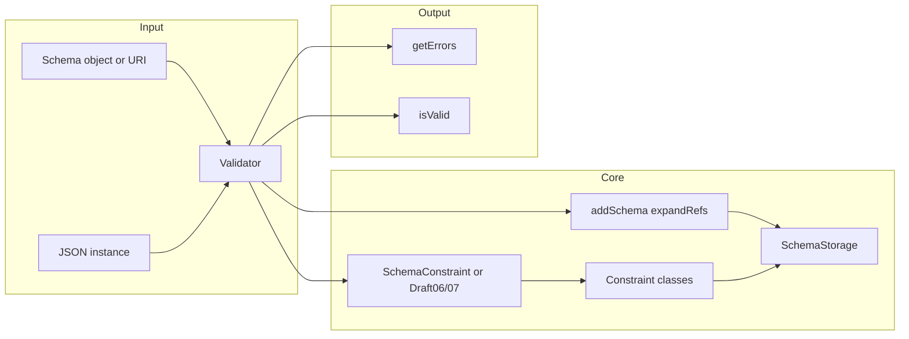
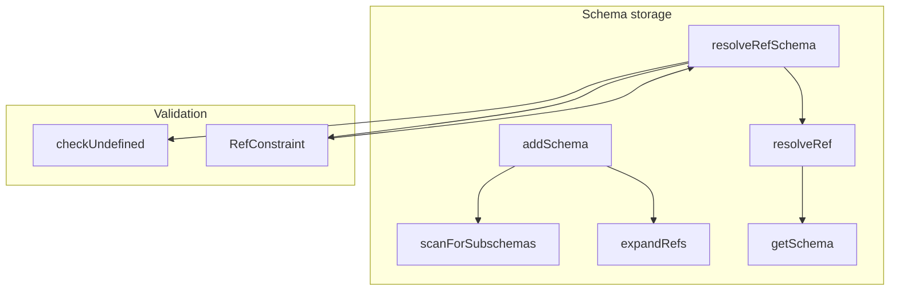

# json-schema (jsonrainbow) — Research report

## Metadata

- **Library name**: json-schema (justinrainbow/json-schema, jsonrainbow/json-schema)
- **Repo URL**: https://github.com/jsonrainbow/json-schema
- **Clone path**: `research/repos/php/jsonrainbow-json-schema/`
- **Language**: PHP
- **License**: MIT (see LICENSE in repo)

## Summary

jsonrainbow/json-schema is a JSON Schema **validation** library for PHP. It does **not** generate code. It loads a JSON Schema (inline object, file URI, or via SchemaStorage), resolves `$ref` through SchemaStorage and UriRetriever, and validates JSON instances against the schema using constraint classes. Supported drafts are Draft-3, Draft-4 (default in non-strict mode), Draft-6, and Draft-7. Strict mode (CHECK_MODE_STRICT) uses draft-specific constraint pipelines (Draft06Constraint, Draft07Constraint) and supports only Draft-6 and Draft-7; non-strict mode uses SchemaConstraint and UndefinedConstraint and supports Draft-3/4 features (extends, disallow, dependencies). Validation is the only concern: schema + instance → Validator::validate() → isValid() / getErrors(). Optional features include type coercion, default application, format validation, and meta-schema validation.

## JSON Schema support

- **Drafts**: Draft-3, Draft-4, Draft-6, Draft-7. README states support for Draft-3, Draft-4, and Draft-6; the code also supports Draft-7 when CHECK_MODE_STRICT is set and `$schema` is draft-07 (or default dialect Draft-6). DraftIdentifiers defines DRAFT_3, DRAFT_4, DRAFT_6, DRAFT_7 (and 2019-09, 2020-12 as constants); Factory constraintMap only registers draft06 and draft07, so strict mode is limited to Draft-6 and Draft-7. Non-strict mode defaults to draft-04–style behavior (SchemaConstraint::DEFAULT_SCHEMA_SPEC).
- **Scope**: Validation only (schema + instance → valid/invalid + error list). No code generation.
- **Subset**: Not all meta-schema keywords are implemented. Draft-07 adds if/then/else, contentMediaType/contentEncoding (partial: base64, application/json), and ContentConstraint; maxContains/minContains, prefixItems, $anchor, $dynamicRef, dependentRequired, dependentSchemas, unevaluatedProperties/Items are not implemented. Format is optional (CHECK_MODE_DISABLE_FORMAT). Draft-03/04–specific: extends, disallow, id, dependencies (string, array, or schema) are supported in non-strict path.

## Keyword support table

Keyword list derived from vendored draft 2020-12 meta-schemas (`specs/json-schema.org/draft/2020-12/meta/`). Implementation evidence from Factory, Draft06/Draft07 Constraint and Factory classes, UndefinedConstraint, SchemaStorage, RefConstraint, FormatConstraint, ContentConstraint, IfThenElseConstraint, and tests under tests/Constraints/, tests/Drafts/, tests/RefTest.php.

| Keyword | Implemented | Notes |
|---------|-------------|-------|
| $anchor | no | Not implemented. |
| $comment | no | Not parsed or used for validation. |
| $defs | yes | Subschemas with $id/id are registered by SchemaStorage::scanForSubschemas; $ref to #/definitions/… or #/$defs/… resolved via JsonPointer and resolveRef. |
| $dynamicAnchor | no | Not implemented. |
| $dynamicRef | no | Not implemented. |
| $id | yes | Parsed (SchemaStorage::findSchemaIdInObject); used for URI scope and sub-schema registration. Draft-04 `id` also supported. |
| $ref | yes | RefConstraint (Draft06/07); non-strict path resolves via Constraint::checkUndefined → resolveRefSchema before delegating to UndefinedConstraint. SchemaStorage::expandRefs normalizes refs; resolveRef/resolveRefSchema resolve to schema. |
| $schema | yes | Accepted; used for strict dialect selection and optional meta-schema validation (CHECK_MODE_VALIDATE_SCHEMA). |
| $vocabulary | no | Not implemented. |
| additionalProperties | yes | AdditionalPropertiesConstraint (Draft06/07); ObjectConstraint/UndefinedConstraint in non-strict. |
| allOf | yes | AllOfConstraint (Draft06/07); UndefinedConstraint::validateOfProperties in non-strict. |
| anyOf | yes | AnyOfConstraint (Draft06/07); UndefinedConstraint::validateOfProperties. |
| const | yes | ConstConstraint (Draft06/07); UndefinedConstraint::checkConst in non-strict. |
| contains | yes | ContainsConstraint (Draft06/07). At least one array element must match schema. |
| contentEncoding | yes | ContentConstraint (Draft07); base64 decoding validated. |
| contentMediaType | yes | ContentConstraint (Draft07); application/json validated. |
| contentSchema | no | ContentConstraint does not apply a subschema to decoded content. |
| default | yes | Applied when CHECK_MODE_APPLY_DEFAULTS; UndefinedConstraint::applyDefaultValues. |
| dependentRequired | no | Not implemented (Draft07). DependenciesConstraint implements draft-04 style dependencies. |
| dependentSchemas | no | Not implemented. |
| deprecated | no | Not implemented. |
| description | no | Not used for validation. |
| else | yes | IfThenElseConstraint (Draft07). |
| enum | yes | EnumConstraint (Draft06/07); UndefinedConstraint::checkEnum in non-strict. |
| examples | no | Not validated. |
| exclusiveMaximum | yes | ExclusiveMaximumConstraint (Draft06/07). |
| exclusiveMinimum | yes | ExclusiveMinimumConstraint (Draft06/07). |
| format | yes | FormatConstraint; date, time, date-time, utc-millisec, regex, color, style, phone, uri, uriref, uri-reference, email, ipv4, ipv6, hostname; optional (CHECK_MODE_DISABLE_FORMAT). |
| if | yes | IfThenElseConstraint (Draft07). |
| items | yes | ItemsConstraint (Draft06/07); CollectionConstraint/UndefinedConstraint in non-strict. |
| maxContains | no | Not implemented. |
| maximum | yes | MaximumConstraint (Draft06/07); NumberConstraint in non-strict. |
| maxItems | yes | MaxItemsConstraint (Draft06/07). |
| maxLength | yes | MaxLengthConstraint (Draft06/07); StringConstraint in non-strict. |
| maxProperties | yes | MaxPropertiesConstraint (Draft06/07); ObjectConstraint::validateMinMaxConstraint. |
| minContains | no | Not implemented. |
| minimum | yes | MinimumConstraint (Draft06/07); NumberConstraint in non-strict. |
| minItems | yes | MinItemsConstraint (Draft06/07). |
| minLength | yes | MinLengthConstraint (Draft06/07); StringConstraint in non-strict. |
| minProperties | yes | MinPropertiesConstraint (Draft06/07); ObjectConstraint::validateMinMaxConstraint. |
| multipleOf | yes | MultipleOfConstraint (Draft06/07); NumberConstraint (DivisibleBy) in non-strict. |
| not | yes | NotConstraint (Draft06/07); UndefinedConstraint in non-strict. |
| oneOf | yes | OneOfConstraint (Draft06/07); UndefinedConstraint::validateOfProperties. |
| pattern | yes | PatternConstraint (Draft06/07); StringConstraint in non-strict. |
| patternProperties | yes | PatternPropertiesConstraint (Draft06/07); ObjectConstraint::validatePatternProperties. |
| prefixItems | no | Not implemented (Draft 2020-12). |
| properties | yes | PropertiesConstraint (Draft06/07); ObjectConstraint in non-strict. |
| propertyNames | yes | PropertiesNamesConstraint (Draft06/07). |
| readOnly | no | Not implemented (ReadOnlyTest exists but validates presence only; no write-only path). |
| required | yes | RequiredConstraint (Draft06/07); UndefinedConstraint supports draft-04 array and draft-03 boolean. |
| then | yes | IfThenElseConstraint (Draft07). |
| title | no | Not used for validation. |
| type | yes | TypeConstraint (Draft06/07); TypeConstraint/UndefinedConstraint in non-strict; strict/loose type check. |
| unevaluatedItems | no | Not implemented. |
| unevaluatedProperties | no | Not implemented. |
| uniqueItems | yes | UniqueItemsConstraint (Draft06/07). |
| writeOnly | no | Not implemented. |

Draft-03/04–specific keywords (not in 2020-12 core): **extends** (yes, UndefinedConstraint::validateCommonProperties); **disallow** (yes, UndefinedConstraint); **id** (yes, as $id above); **dependencies** (yes, DependenciesConstraint and UndefinedConstraint::validateDependencies — string, array, or schema).

## Constraints

Validation keywords are enforced at **runtime** by the recursive constraint pipeline. In non-strict mode, SchemaConstraint delegates to UndefinedConstraint, which applies type checks, extends, required, default, disallow, not, dependencies, allOf/anyOf/oneOf, and type-specific checks (object, array, string, number, enum, const). In strict mode (Draft06 or Draft07), the draft-specific root constraint (Draft06Constraint or Draft07Constraint) invokes keyword-specific constraints in a fixed order. Constraints are used for instance validation only (e.g. minLength, pattern, required); there is no generated code. Type coercion (CHECK_MODE_COERCE_TYPES) and default application (CHECK_MODE_APPLY_DEFAULTS) mutate the instance when enabled.

## High-level architecture

Pipeline: **Schema** (object or file URI) → **Validator::validate()** → schema added to **SchemaStorage** (addSchema normalizes and expandRefs) → **SchemaConstraint** or **Draft06/Draft07Constraint** (when CHECK_MODE_STRICT) → **constraint instances** (ref, type, properties, items, etc.) → **SchemaStorage::resolveRefSchema** for $ref → **BaseConstraint::addError** → **errors array**; **isValid()** / **getErrors()** report result.

## Medium-level architecture

- **Validator**: Entry point; validate(&$value, $schema, $checkMode) adds schema to SchemaStorage, gets schema (possibly from getSchema), then runs schema or draft-specific root constraint. Returns error mask; errors collected in BaseConstraint.
- **SchemaStorage**: Holds schemas by URI; addSchema() scans for subschemas (id/$id), expandRefs() normalizes $ref to full pointer strings; resolveRef() / resolveRefSchema() resolve references (with cycle detection). UriRetriever loads remote schemas; UriResolver resolves relative URIs.
- **Factory**: Creates constraint instances by name (constraintMap: schema, type, undefined, ref, properties, items, etc.). Draft06/07 Factory subclasses override constraintMap with draft-specific constraint classes. Check mode (coerce, apply defaults, strict, format, etc.) is stored on Factory.
- **$ref resolution**: When a schema has $ref, resolveRefSchema() returns the dereferenced schema (recursively following $ref). RefConstraint (Draft06/07) calls resolveRefSchema() then validates against the resolved schema. In non-strict path, Constraint::checkUndefined() resolves the schema via resolveRefSchema() before passing to UndefinedConstraint, so every subschema is resolved before use.

## Low-level details

- **Type coercion**: CHECK_MODE_COERCE_TYPES uses LooseTypeCheck; strings can be coerced to boolean/number. CHECK_MODE_EARLY_COERCE chooses first matching type in anyOf/oneOf when coercion is on.
- **Format**: FormatConstraint supports date, time, date-time (Rfc3339), utc-millisec, regex, color, style, phone, uri, uri-reference, email, ipv4, ipv6, hostname. Can be disabled with CHECK_MODE_DISABLE_FORMAT.
- **Error shape**: Each error has keys: property (path string), pointer (JSON Pointer), message, constraint (name, params), context (ERROR_DOCUMENT_VALIDATION or ERROR_SCHEMA_VALIDATION).

## Output and integration

- **Vendored vs build-dir**: N/A (validation only; no generated code).
- **API vs CLI**: Library API: `new Validator()`, `$validator->validate($data, $schema)`, `$validator->isValid()`, `$validator->getErrors()`. Optional Factory with SchemaStorage for $ref resolution. CLI: `bin/validate-json` (data.json [schema.json]); validates JSON file, optional schema file or from document `$schema` / Link header.
- **Writer model**: N/A (validation only).

## Configuration

- **Check mode flags** (third argument to validate() or Factory constructor): CHECK_MODE_NORMAL, CHECK_MODE_TYPE_CAST, CHECK_MODE_COERCE_TYPES, CHECK_MODE_APPLY_DEFAULTS, CHECK_MODE_ONLY_REQUIRED_DEFAULTS, CHECK_MODE_EXCEPTIONS, CHECK_MODE_DISABLE_FORMAT, CHECK_MODE_EARLY_COERCE, CHECK_MODE_VALIDATE_SCHEMA, CHECK_MODE_STRICT. README documents these.
- **Strict mode**: CHECK_MODE_STRICT uses draft from schema `$schema` or Factory default dialect (Draft-6). Only Draft-6 and Draft-7 have dedicated constraint pipelines.
- **Custom constraints**: Factory::setConstraintClass() allows replacing constraint implementations.
- **SchemaStorage / UriRetriever**: Can inject custom retriever or preload schemas via addSchema().

## Pros/cons

- **Pros**: Mature PHP validator; supports Draft-3 through Draft-7; type coercion and default application; optional meta-schema validation; inline and remote $ref; Bowtie compliance badges; PHPUnit test suite and JSON Schema Test Suite usage; CLI for quick checks.
- **Cons**: No code generation; strict mode only for Draft-6/7; no $anchor, $dynamicRef, prefixItems, unevaluated*, dependentRequired/dependentSchemas; content keyword only partially supported (base64, application/json); README warns that features of drafts newer than Draft-4 may not be supported.

## Testability

- **Framework**: PHPUnit; Composer scripts: `composer test`, `composer testOnly TestClass`, `composer testOnly TestClass::testMethod`.
- **Structure**: tests/Constraints/ (per-keyword tests: EnumTest, FormatTest, RefTest, etc.), tests/Drafts/ (Draft3Test, Draft4Test using JSON Schema Test Suite), tests/RefTest.php, tests/ValidatorTest.php, tests/JsonSchemaTestSuiteTest.php, tests/SchemaStorageTest.php. Fixtures under tests/fixtures/.
- **Running**: From repo root, `composer test`. Style: `composer style-check`, `composer style-fix`.

## Performance

No built-in benchmarks found in the repo. Entry point for future benchmarking: `Validator::validate($data, $schema)` (and optionally with Factory + SchemaStorage for $ref-heavy schemas). Unknown whether any external benchmarks exist.

## Determinism and idempotency

N/A for validation-only library (no generated files). Error list order may depend on traversal; no explicit sorting of errors documented.

## Enum handling

- **Implementation**: EnumConstraint (Draft06/07) and UndefinedConstraint iterate over the schema `enum` array and compare the instance value with DeepComparer::isEqual(); numeric comparison also allows float equality. No deduplication of enum values in the schema.
- **Duplicate entries**: Duplicate values in the enum array (e.g. `["a", "a"]`) both match the same instance; no error or dedupe. Not explicitly documented.
- **Case/namespace collisions**: Distinct values (e.g. `"a"` and `"A"`) are both valid; no special handling for case collisions. Unknown whether duplicate keys or naming in generated artifacts is applicable (no codegen).

## Reverse generation (Schema from types)

No. Validator only; no schema-from-PHP-types or code generation.

## Multi-language output

No. PHP only; validation only.

## Model deduplication and $ref/$defs

- **Validation only**: The library does not generate types; it only validates instances. There is no “model” deduplication in a codegen sense.
- **$ref / definitions**: SchemaStorage::scanForSubschemas() registers subschemas that have `id` or `$id`; addSchema() and expandRefs() normalize $ref to full URIs + pointer. resolveRefSchema() dereferences $ref (with cycle detection). So multiple $refs to the same #/definitions/foo resolve to the same in-memory schema; validation is consistent. No deduplication of inline object shapes beyond what the schema author defines via $ref/definitions.

## Validation (schema + JSON → errors)

- **Inputs**: (1) JSON instance (PHP value, typically from json_decode); (2) JSON Schema (object or reference such as `(object)['$ref' => 'file://...']`). Schema can be pre-registered via SchemaStorage::addSchema().
- **API**: `$validator = new JsonSchema\Validator();` (optionally `new Validator(new Factory($schemaStorage))`); `$validator->validate($value, $schema, $checkMode);` then `$validator->isValid()` and `$validator->getErrors()`.
- **Error shape**: Each error is an array: `property` (human-readable path), `pointer` (JSON Pointer without leading #), `message` (ucfirst’d message), `constraint` (`name`, `params`), `context` (Validator::ERROR_DOCUMENT_VALIDATION or ERROR_SCHEMA_VALIDATION). CHECK_MODE_EXCEPTIONS throws ValidationException on first error.
- **CLI**: `bin/validate-json data.json [schema.json]` loads data and schema (or schema from data’s `$schema` / Link header), runs Validator::validate(), exits 23 on validation failure and prints errors.
