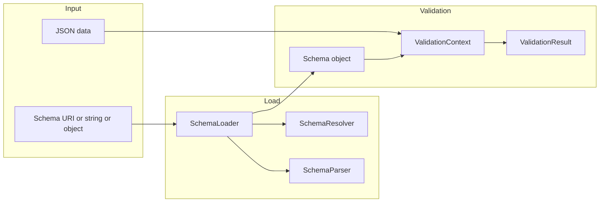
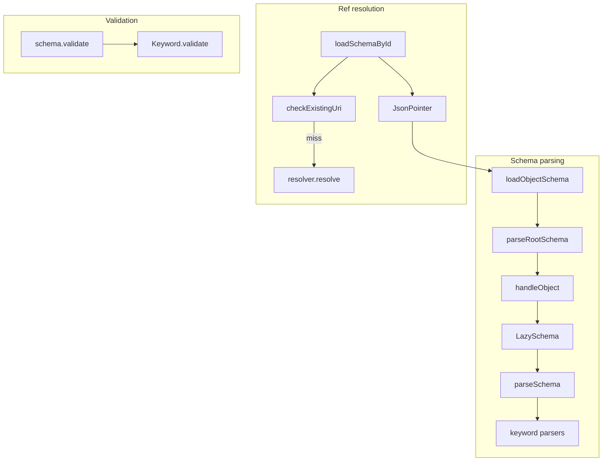

# Opis JSON Schema — Research report

## Metadata

- **Library name**: Opis JSON Schema
- **Repo URL**: https://github.com/opis/json-schema
- **Clone path**: `research/repos/php/opis-json-schema/`
- **Language**: PHP
- **License**: Apache License 2.0 (README, composer.json)

## Summary

Opis JSON Schema is a JSON Schema **validation** library for PHP. It does **not** generate code. It loads a JSON Schema (via URI, string, or object), parses it through SchemaLoader and SchemaParser into an internal schema graph (Schema objects), and validates JSON data against that schema. Supported drafts are draft-2020-12, draft-2019-09, draft-07, and draft-06; the default draft is 2020-12. Validation is the only concern: schema + data → `Validator::validate()` → `ValidationResult` (valid flag and validation error tree). The library also supports custom features: `$error`, `$filters`, `$map`, slots, `$data`, casting pragma, and custom format/media-type resolvers.

## JSON Schema support

- **Drafts**: Draft-06, draft-07, draft-2019-09, draft-2020-12. The parser has a `defaultDraft` option (default `'2020-12'`); draft is taken from the `$schema` keyword when present, otherwise from the option or parent. Each draft has a dedicated class in `Parsers/Drafts/` (Draft06, Draft07, Draft201909, Draft202012).
- **Scope**: Validation only (schema + instance → valid/invalid + error tree). No code generation.
- **Subset**: README states support for all keywords from all drafts (draft-2020-12 down to draft-06). Meta-schema keywords `$comment`, `$vocabulary`, `deprecated`, `readOnly`, `writeOnly`, and `examples` were not found in the codebase and are not implemented. `title` and `description` have no dedicated keyword parsers (accepted in schema but not used for validation). All other draft 2020-12 core/applicator/validation/unevaluated/format/content keywords are implemented.

## Keyword support table

Keyword list derived from vendored draft 2020-12 meta-schemas (`specs/json-schema.org/draft/2020-12/meta/*.json`). Implementation evidence from `src/Parsers/Keywords/*.php`, `src/Keywords/*.php`, `src/Parsers/Drafts/Draft202012.php`, `src/Parsers/SchemaParser.php`, `src/Resolvers/`, and README.

| Keyword | Implemented | Notes |
|---------|-------------|-------|
| $anchor | yes | Parsed in SchemaParser::parseAnchor; used for ref resolution (uriCache by base + fragment). |
| $comment | no | Not parsed or stored. |
| $defs | yes | No dedicated parser; subschemas under $defs are traversed by handleObject; $ref to #/$defs/X resolved via loadSchemaById and JSON Pointer. |
| $dynamicAnchor | yes | Draft202012 getRefKeywordParser registers $dynamicRef/$dynamicAnchor variation; used for dynamic ref resolution. |
| $dynamicRef | yes | RefKeywordParser variation; TemplateRefKeyword/URIRefKeyword. |
| $id | yes | Parsed in parseId, parseRootSchema; used for scope and cache (uriCache, handle_id). |
| $ref | yes | RefKeywordParser; URIRefKeyword, PointerRefKeyword, TemplateRefKeyword, RecursiveRefKeyword; resolved via SchemaLoader and SchemaResolver. |
| $schema | yes | Parsed in parseSchemaDraft; used for draft version detection. |
| $vocabulary | no | Not implemented. |
| additionalProperties | yes | AdditionalPropertiesKeywordParser; validated in object context. |
| allOf | yes | AllOfKeywordParser; all subschemas must pass. |
| anyOf | yes | AnyOfKeywordParser; at least one must pass. |
| const | yes | ConstKeywordParser; value must equal const (Helper::equals). |
| contains | yes | ContainsKeywordParser (contains, minContains, maxContains). |
| contentEncoding | yes | ContentEncodingKeywordParser; ContentEncodingResolver for decoding. |
| contentMediaType | yes | ContentMediaTypeKeywordParser; ContentMediaTypeResolver. |
| contentSchema | yes | ContentSchemaKeywordParser. |
| default | yes | DefaultKeywordParser; parsed (annotation); not enforced on instance. |
| dependentRequired | yes | DependentRequiredKeywordParser. |
| dependentSchemas | yes | DependentSchemasKeywordParser. |
| deprecated | no | Not implemented. |
| description | partial | No dedicated parser; accepted in schema but not used for validation. |
| else | yes | IfThenElseKeywordParser; applied when if fails. |
| enum | yes | EnumKeywordParser, EnumKeyword; values grouped by type; Helper::equals for match. |
| examples | no | Not implemented. |
| exclusiveMaximum | yes | ExclusiveMaximumKeywordParser; draft-07 number or legacy boolean. |
| exclusiveMinimum | yes | ExclusiveMinimumKeywordParser; draft-07 number or legacy boolean. |
| format | yes | FormatKeywordParser; FormatResolver with built-in string formats (date, time, date-time, duration, uri, uri-reference, uri-template, regex, ipv4, ipv6, uuid, email, hostname, json-pointer, relative-json-pointer, idn-hostname, idn-email, iri, iri-reference); custom formats via resolver. |
| if | yes | IfThenElseKeywordParser; conditional. |
| items | yes | ItemsKeywordParser (items with prefixItems); schema or array (prefixItems). |
| maxContains | yes | In ContainsKeywordParser. |
| maximum | yes | MaximumKeywordParser. |
| maxItems | yes | MaxItemsKeywordParser. |
| maxLength | yes | MaxLengthKeywordParser. |
| maxProperties | yes | MaxPropertiesKeywordParser. |
| minContains | yes | In ContainsKeywordParser. |
| minimum | yes | MinimumKeywordParser. |
| minItems | yes | MinItemsKeywordParser. |
| minLength | yes | MinLengthKeywordParser. |
| minProperties | yes | MinPropertiesKeywordParser. |
| multipleOf | yes | MultipleOfKeywordParser. |
| not | yes | NotKeywordParser. |
| oneOf | yes | OneOfKeywordParser; exactly one must pass. |
| pattern | yes | PatternKeywordParser; PCRE. |
| patternProperties | yes | PatternPropertiesKeywordParser. |
| prefixItems | yes | ItemsKeywordParser('prefixItems', ONLY_ARRAY); tuple validation. |
| properties | yes | PropertiesKeywordParser. |
| propertyNames | yes | PropertyNamesKeywordParser. |
| readOnly | no | Not implemented. |
| required | yes | RequiredKeywordParser. |
| then | yes | IfThenElseKeywordParser; applied when if passes. |
| title | partial | No dedicated parser; accepted in schema but not used for validation. |
| type | yes | TypeKeywordParser; single type or array. |
| unevaluatedItems | yes | UnevaluatedItemsKeywordParser. |
| unevaluatedProperties | yes | UnevaluatedPropertiesKeywordParser. |
| uniqueItems | yes | UniqueItemsKeywordParser. |
| writeOnly | no | Not implemented. |

## Constraints

Validation keywords are enforced at **runtime** by the validator. Schema parsing builds a graph of Schema objects (ObjectSchema, BooleanSchema, etc.) with Keyword instances. Validation is invoked via `Schema::validate(ValidationContext)`; ObjectSchema dispatches through a KeywordValidator chain and applies type-specific keyword groups (before, types, after). Each keyword's `validate()` returns a ValidationError or null. Constraints (minLength, minItems, pattern, required, enum, etc.) are enforced directly during traversal; they are not used for structure-only. Schema parsing only builds the schema graph; there is no separate meta-schema validation step in the default flow.

## High-level architecture

Pipeline: **Schema** (URI / string / object) → **Validator::validate(data, schema)** → if URI: **SchemaLoader::loadSchemaById** → **SchemaResolver::resolve** (or cache) → **SchemaParser::parseRootSchema** / **loadObjectSchema** → **Schema** (object graph with LazySchema) → **schema::validate(context)** → **ValidationResult** (error tree or null). For inline schema (object/string), **loadObjectSchema** / **loadBooleanSchema** is used. No code generation step.

## Medium-level architecture

- **Schema parsing**: SchemaLoader holds parser, resolver, uriCache, and dataCache. `loadObjectSchema(object, id, draft)` checks dataCache for existing Schema, then calls `parser->parseRootSchema(data, id, handle_id, handle_object, draft)`. parseRootSchema parses `$id` and `$schema`, determines draft, then handle_object registers the root (LazySchema) in uriCache and dataCache and recursively handles nested objects/arrays/booleans. SchemaParser::parseSchema uses the draft's keyword parsers to build ObjectSchema (KeywordValidator chain and Keyword arrays per type). Refs are resolved when the RefKeyword is evaluated (loader->loadSchemaById).
- **$ref resolution**: RefKeywordParser produces URIRefKeyword, PointerRefKeyword, TemplateRefKeyword, or RecursiveRefKeyword. Resolution: SchemaLoader::loadSchemaById(uri) normalizes the URI (base + fragment), checks uriCache, then for empty fragment calls resolver->resolve(uri) to load the document; for non-empty fragment uses JsonPointer to get the subschema from the root and loadObjectSchema/loadBooleanSchema. Resolved schemas are cached in uriCache and dataCache. SchemaResolver supports registerRaw, registerFile, registerPrefix, and custom protocols.
- **Validation**: ValidationContext holds current data, loader, globals, slots, maxErrors, stopAtFirstError. ObjectSchema::validate runs the keyword validator chain; each Keyword::validate(context, schema) can recurse into child schemas. Errors are ValidationError instances (keyword, schema, data info, message, subErrors).
- **Key types**: Validator, SchemaLoader, SchemaParser, SchemaResolver, Schema (SchemaValidator + info()), ObjectSchema, BooleanSchema, LazySchema, ValidationContext, ValidationResult, ValidationError, Draft (Draft06/07/201909/202012), Vocabulary, KeywordParser, Keyword.

## Low-level details

- **Loaders**: SchemaLoader does not implement a separate document loader interface; schema loading is via SchemaResolver (raw, files, prefixes, protocols). Validator accepts data as PHP value; no separate JSON document loader in the public API.
- **Formats**: FormatResolver constructor registers string formats (date, time, date-time, duration, uri, uri-reference, uri-template, regex, ipv4, ipv6, uuid, email, hostname, json-pointer, relative-json-pointer, idn-hostname, idn-email, iri, iri-reference). Custom formats can be registered. ContentEncodingResolver and ContentMediaTypeResolver allow custom decoders/validators.
- **Pragmas**: DefaultVocabulary adds $pragma; MaxErrorsPragmaParser, SlotsPragmaParser, GlobalsPragmaParser, CastPragmaParser. Parser options include allowFilters, allowFormats, allowMappers, allowSlots, allowDataKeyword, allowUnevaluated, etc.
- **Errors**: ValidationError holds keyword, schema, DataInfo, message, args, subErrors. ValidationResult wraps a single root error (tree). ErrorFormatter can produce output with keywordLocation, absoluteKeywordLocation, etc.

## Output and integration

- **Vendored vs build-dir**: N/A (validation only; no generated code output).
- **API vs CLI**: Library API only. No CLI. Entry point: `$validator->validate($data, $schema)` or `$validator->uriValidation($data, $uri)` / `$validator->dataValidation($data, $schemaObject)` with optional globals and slots. Returns ValidationResult. SchemaLoader can be configured with custom SchemaResolver (e.g. registerPrefix for test remotes).
- **Writer model**: N/A (validation only).

## Configuration

- **Draft**: SchemaParser option `defaultDraft` (default `'2020-12'`). Draft is also inferred from `$schema` on each schema.
- **Validator**: `setMaxErrors(int)`, `setStopAtFirstError(bool)`; `setLoader(SchemaLoader)`, `setParser(SchemaParser)`, `setResolver(SchemaResolver)`.
- **SchemaLoader**: `setBaseUri(Uri)`, `setParser`, `setResolver`, `decodeJsonString` (constructor). `clearCache()` clears uriCache and dataCache.
- **SchemaParser**: options in DEFAULT_OPTIONS (allowFilters, allowFormats, allowMappers, allowSlots, allowDataKeyword, allowKeywordsAlongsideRef, allowUnevaluated, allowRelativeJsonPointerInRef, etc.). Resolvers array (format, filter, content media type, content encoding) and optional extra Vocabulary.
- **SchemaResolver**: registerRaw(schema, id), registerFile(id, file), registerPrefix(prefix, dir), registerProtocol(scheme, callable).

## Pros/cons

- **Pros**: Full draft-06 through draft-2020-12 support; all standard validation keywords plus unevaluatedProperties/unevaluatedItems, prefixItems, $dynamicRef/$dynamicAnchor; flexible ref resolution (URI, JSON Pointer, URI templates); custom $error, $filters, $map, slots, $data, casting; extensible format and content resolvers; official JSON Schema test suite used (tests/official); Apache 2.0 license.
- **Cons**: Validation only (no code generation); $comment, $vocabulary, deprecated, readOnly, writeOnly, examples not implemented; title/description not used; no built-in benchmarks in repo.

## Testability

- **How to run tests**: From clone root, `composer install` then `composer tests` (runs `./vendor/bin/phpunit --verbose --color`) or `./vendor/bin/phpunit`.
- **Test suite**: AbstractOfficialDraftTest subclasses (OfficialDraft202012Test, OfficialDraft201909Test, OfficialDraft7Test, OfficialDraft6Test) run the JSON Schema test suite. CompliantValidator is used; resolver registers prefixes for `http://json-schema.org/` and `https://json-schema.org/` to tests/official/drafts and `http://localhost:1234/` to tests/official/remotes. Each test calls doValidation(schema, description, data, valid); schema is passed as object with draft set via getDraft(). Test data lives under tests/official/tests/draft2020-12/, draft2019-09/, draft-07/, draft-06/ (and optional subdirs).
- **Other tests**: Unit tests (BasicTest, RefTest, SlotTest, MapperTest, FiltersTest, PragmaTest, DataTest, type tests, ErrorFormatterTest, etc.) in tests/.

## Performance

No built-in benchmarks or profiling hooks were found in the cloned repo. Entry point for external benchmarking: load schema once via `$validator->loader()->loadSchemaById($uri)` or `$validator->dataValidation($data, $schemaObject)` (which compiles schema), then call `$validator->validate($data, $schema)` in a loop; measure wall time or use PHP benchmarking tools.

## Determinism and idempotency

- **Generated output**: N/A (validation only).
- **Validation result**: For a given schema and data, the validation outcome is deterministic. Errors are collected during traversal; order depends on keyword validator order and schema structure. stopAtFirstError and maxErrors limit how many errors are collected. No explicit sorting of errors; ValidationResult holds the first (root) error and its subErrors tree.

## Enum handling

- **Implementation**: EnumKeywordParser parses the enum array; EnumKeyword stores values grouped by JSON type (listByType) for faster lookup. validate() uses Helper::getJsonType and checks the matching type bucket; Helper::equals for value comparison. Error message: "The data should match one item from enum".
- **Duplicate entries**: listByType appends each value to the list for its type; duplicate enum values (e.g. `["a", "a"]`) both appear in the list. Instance "a" matches the first; no deduplication. Not explicitly documented.
- **Case / namespace**: Helper::equals is used; comparison is value equality (PHP semantics). Distinct values "a" and "A" are both stored and both match the corresponding instance; no special handling for case or naming.

## Reverse generation (Schema from types)

No. Opis JSON Schema is a validation-only library; it does not generate JSON Schema from PHP types.

## Multi-language output

N/A (validation only; no code generation).

## Model deduplication and $ref/$defs

- **Validation context**: There is no generated model; the question is how $ref and $defs are resolved and cached.
- **$ref**: Resolved at validation time when a ref keyword is evaluated (or during parse when the draft resolves refs). SchemaLoader::loadSchemaById resolves the URI (with base), checks uriCache, then resolver or JsonPointer into an already-loaded root. Resolved Schema is cached in uriCache (by full URI string) and in dataCache (by object identity). Multiple $refs to the same URI resolve to the same cached Schema. LazySchema defers full parse until first use; then the same Schema instance is stored in cache.
- **$defs**: Definitions under $defs are just nested objects in the schema; they are registered in uriCache when the root (or parent) is handleObject'd, keyed by document URI + fragment (e.g. #/$defs/name). $ref to #/$defs/name loads the root (if not already), then JsonPointer into it and loadObjectSchema for that subschema; that Schema is cached. So one Schema instance per distinct resolved ref; $defs entries are shared when multiple $refs point to them.

## Validation (schema + JSON → errors)

Yes. This is the library's main purpose.

- **Inputs**: (1) A JSON Schema: URI (string or Uri), schema as JSON string, or schema as PHP object. (2) JSON data as PHP value (array, object, scalar).
- **API**: `$validator->validate($data, $schema)` or `$validator->uriValidation($data, $uri)` or `$validator->dataValidation($data, $schema, $globals, $slots)`. Optional globals and slots for $data/slots feature. Returns ValidationResult.
- **Output**: ValidationResult::isValid() is true if valid, false otherwise. ValidationResult::error() returns the root ValidationError or null. ValidationError has keyword(), schema(), data(), message(), subErrors(). ErrorFormatter can format errors with locations.
- **Meta-schema validation**: Not built into the default flow; schemas are not validated against a meta-schema before use.
- **Format**: When the schema has a "format" keyword, FormatResolver::resolve is used; built-in string formats and custom formats (via parser resolvers) are supported.
