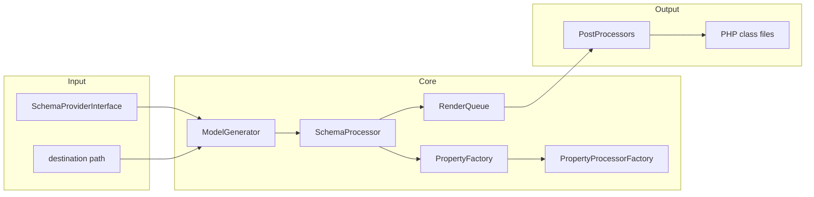
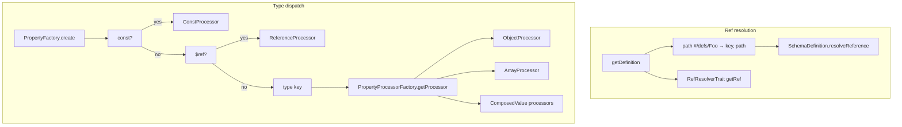

# php-json-schema-model-generator — Research report

## Metadata

- **Library name**: php-json-schema-model-generator
- **Repo URL**: https://github.com/wol-soft/php-json-schema-model-generator
- **Clone path**: `research/repos/php/wol-soft-php-json-schema-model-generator/`
- **Language**: PHP
- **License**: MIT (see README and composer.json)

## Summary

php-json-schema-model-generator is a JSON Schema to PHP model code generator. It reads JSON Schema files (or schemas from OpenAPI v3 `#/components/schemas`) and generates PHP 8+ model classes that include validation logic: constructor and setters validate input, and the generated code throws exceptions when constraints are violated. Schemas are supplied via a `SchemaProviderInterface` (e.g. `RecursiveDirectoryProvider` for a directory of `*.json` files, or `OpenAPIv3Provider` for an OpenAPI spec). The main API is `ModelGenerator::generateModels(SchemaProviderInterface $schemaProvider, string $destination)`. Output is PHP source only. The library does not validate a JSON payload against a schema via a separate validator API; validation is performed by the generated model classes at runtime when data is passed to their constructor or (when immutability is disabled) setters.

## JSON Schema support

- **Drafts**: Tests and manual examples use `$schema`: `http://json-schema.org/draft-04/schema#`. The implementation does not select behavior by draft; it supports a mix of draft-04–style and later keywords: e.g. `definitions` and `$defs` (as root-level keys for `$ref` paths), `dependencies` (both property and schema dependency), tuple-style `items` as array, and applicator keywords `allOf`, `anyOf`, `oneOf`, `if`/`then`/`else`, `not`.
- **Scope**: Code generation plus runtime validation in generated code. No standalone validator API (schema + JSON → error list) in this repo.
- **Subset**: Not all 2020-12 meta-schema keywords are implemented. Unsupported or only partially supported: `$anchor`, `$dynamicAnchor`/`$dynamicRef`, `$schema`/`$vocabulary`, `dependentRequired`/`dependentSchemas` (draft-04 `dependencies` is supported instead), `prefixItems`, `unevaluatedItems`/`unevaluatedProperties`, `maxContains`/`minContains`, `contentEncoding`/`contentMediaType`/`contentSchema`, `deprecated`, `examples`, `writeOnly`.

## Keyword support table

Keyword list derived from vendored draft 2020-12 meta-schemas (`specs/json-schema.org/draft/2020-12/meta/`). Implementation evidence from PropertyFactory, PropertyProcessorFactory, BaseProcessor, ObjectProcessor, ArrayProcessor, StringProcessor, AbstractNumericProcessor, ConstProcessor, ReferenceProcessor, ComposedValueProcessorFactory, IfProcessor, SchemaDefinitionDictionary, RefResolverTrait, EnumPostProcessor, validators, and test fixtures in the clone.

| Keyword | Implemented | Notes |
|---------|-------------|-------|
| $anchor | no | Not used in resolution or codegen. |
| $comment | no | Not implemented. |
| $defs | yes | Root-level key in schema; addDefinition($key, ...) in SchemaDefinitionDictionary for each key in getJson(); path #/$defs/Name resolved via getDefinition and SchemaDefinition.resolveReference. |
| $dynamicAnchor | no | Not implemented. |
| $dynamicRef | no | Not implemented. |
| $id | yes | Used: fetchDefinitionsById adds definition by $id; RefResolverTrait getFullRefURL uses $id for resolving relative $ref. |
| $ref | yes | ReferenceProcessor; SchemaDefinitionDictionary.getDefinition with file#fragment or path; RefResolverTrait for external files. |
| $schema | no | Accepted in input but not used to select draft or validate schema. |
| $vocabulary | no | Not implemented. |
| additionalProperties | yes | BaseProcessor addAdditionalPropertiesValidator; boolean false → NoAdditionalPropertiesValidator; schema → AdditionalPropertiesValidator; PostProcessors for accessors and serialization. |
| allOf | yes | AllOfProcessor; composition validators and property transfer to schema. |
| anyOf | yes | AnyOfProcessor. |
| const | yes | ConstProcessor (PropertyFactory redirects when const present). |
| contains | yes | ArrayProcessor addContainsValidation; PropertyTemplateValidator with ArrayContains.phptpl. |
| contentEncoding | no | Not implemented. |
| contentMediaType | no | Not implemented. |
| contentSchema | no | Not implemented. |
| default | yes | AbstractTypedValueProcessor setDefaultValue; applied to property default. |
| dependentRequired | no | Draft-04 "dependencies" with array of property names is supported (PropertyDependencyValidator); not 2020-12 dependentRequired. |
| dependentSchemas | no | Draft-04 "dependencies" with schema value is supported (SchemaDependencyValidator); not 2020-12 dependentSchemas. |
| deprecated | no | Not implemented. |
| description | yes | Property constructor: `$json['description'] ?? ''` passed to Property. |
| else | yes | IfProcessor; conditional composition with then/else. |
| enum | yes | addEnumValidator in AbstractPropertyProcessor; EnumPostProcessor can generate PHP enums (optional). |
| examples | no | Not implemented. |
| exclusiveMaximum | yes | AbstractNumericProcessor addRangeValidator. |
| exclusiveMinimum | yes | AbstractNumericProcessor addRangeValidator. |
| format | yes | StringProcessor addFormatValidator; GeneratorConfiguration getFormat (custom formats addable). |
| if | yes | IfProcessor; conditional composition. |
| items | yes | ArrayProcessor: single schema or tuple (array of schemas); ArrayItemValidator, ArrayTupleValidator, additionalItems. |
| maxContains | no | Not implemented. |
| maximum | yes | AbstractNumericProcessor addRangeValidator. |
| maxItems | yes | ArrayProcessor addLengthValidation. |
| maxLength | yes | StringProcessor addLengthValidator. |
| maxProperties | yes | BaseProcessor addMaxPropertiesValidator. |
| minContains | no | Not implemented. |
| minimum | yes | AbstractNumericProcessor addRangeValidator. |
| minItems | yes | ArrayProcessor addLengthValidation. |
| minLength | yes | StringProcessor addLengthValidator. |
| minProperties | yes | BaseProcessor addMinPropertiesValidator. |
| multipleOf | yes | AbstractNumericProcessor addMultipleOfValidator. |
| not | yes | NotProcessor. |
| oneOf | yes | OneOfProcessor. |
| pattern | yes | StringProcessor addPatternValidator. |
| patternProperties | yes | BaseProcessor addPatternPropertiesValidator; PatternPropertiesPostProcessor, serialization and accessor post-processors. |
| prefixItems | no | Tuple arrays use draft-04 style items-as-array; prefixItems not implemented. |
| properties | yes | BaseProcessor addPropertiesToSchema; PropertyFactory.create per property. |
| propertyNames | yes | BaseProcessor addPropertyNamesValidator; PropertyNamesValidator. |
| readOnly | yes | AbstractValueProcessor setReadOnly (readOnly true or global immutable). |
| required | yes | PropertyMetaDataCollection(required); RequiredPropertyValidator. |
| then | yes | IfProcessor. |
| title | yes | ClassNameGenerator getClassName: title used for class naming when present. |
| type | yes | PropertyProcessorFactory getSingleTypePropertyProcessor by type string; object, array, string, integer, number, boolean, null, reference, const, any, multi-type (array of types). |
| unevaluatedItems | no | Not implemented. |
| unevaluatedProperties | no | Not implemented. |
| uniqueItems | yes | ArrayProcessor addUniqueItemsValidation; PropertyTemplateValidator ArrayUnique.phptpl. |
| writeOnly | no | Not implemented. |

## Constraints

Validation keywords are both reflected in structure (types, required, nested objects, etc.) and **enforced in generated PHP code**. The generated model constructor accepts an array and validates it; invalid data triggers exceptions (e.g. MinLengthException, MinimumException, PatternException, composition errors). Setters (when immutability is disabled) also run the same validators. So minimum/maximum, minLength/maxLength, pattern, format, minItems/maxItems, uniqueItems, contains, minProperties/maxProperties, additionalProperties, patternProperties, propertyNames, dependencies, and composition (allOf/anyOf/oneOf/if/then/else/not) are all enforced at runtime in the generated classes.

## High-level architecture

Pipeline: **SchemaProvider** (e.g. RecursiveDirectoryProvider or OpenAPIv3Provider) yields JSON Schema documents → **ModelGenerator.generateModels()** iterates schemas and passes each to **SchemaProcessor.process()** → SchemaProcessor builds a **Schema** model (and nested schemas) via **PropertyFactory** and **PropertyProcessorFactory** (type-specific processors: Object, Array, String, Integer, Number, Boolean, Null, Reference, Const, Any, MultiType, and ComposedValue processors for allOf/anyOf/oneOf/if/not) → each root or nested object **Schema** is enqueued as a **RenderJob** in **RenderQueue** → after all schemas are processed, **RenderQueue.execute()** runs **PostProcessors** (composition validation, additionalProperties, patternProperties, etc., and optional serialization/enum post-processors) then renders PHP files to the destination directory.

## Medium-level architecture

- **Entry**: `ModelGenerator::generateModels($schemaProvider, $destination)` creates a RenderQueue and SchemaProcessor, iterates `$schemaProvider->getSchemas()`, calls `$schemaProcessor->process($jsonSchema)` per schema, then `$renderQueue->execute($this->generatorConfiguration, $this->postProcessors)` to run post-processors and render all jobs.
- **Schema loading**: RecursiveDirectoryProvider: RecursiveDirectoryIterator + RegexIterator for `*.json`, `sort($schemaFiles, SORT_REGULAR)`, each file loaded and wrapped in JsonSchema. OpenAPIv3Provider reads OpenAPI spec and yields schemas from components/schemas. Refs: SchemaDefinitionDictionary.setUpDefinitionDictionary adds root-level keys (e.g. definitions, $defs) as definition keys; getDefinition(reference, ...) parses `#` and path segments, resolves in-document paths via SchemaDefinition.resolveReference (walk path segments) or external file via SchemaProvider.getRef (RefResolverTrait: local path or $id-relative URL).
- **Type dispatch**: PropertyFactory: if `const` → treat as type const; if `$ref` → reference or baseReference; else `$json['type'] ?? 'any'`. PropertyProcessorFactory returns *Processor by type (ObjectProcessor, ArrayProcessor, etc.); array type → MultiTypeProcessor. Composed values (allOf/anyOf/oneOf/if/not) detected in AbstractPropertyProcessor addComposedValueValidator and dispatched via ComposedValueProcessorFactory.
- **Deduplication**: SchemaProcessor.generateModel uses `$jsonSchema->getSignature()` (hash of relevant schema fields); processedSchema[signature] reuses existing Schema for same signature. processedMergedProperties[signature] reuses merged composition properties. EnumPostProcessor deduplicates enums by enumSignature (hash of enum, enum-map, title, $id).

## Low-level details

- **Class naming**: ClassNameGenerator.getClassName: for merge classes uses title or $id basename or property name + hash; otherwise title or $id basename or propertyName + (md5 of json); result sanitized with ucfirst(preg_replace('/\W/', '', ucwords(..., '_-. '))).
- **Schema signature**: JsonSchema.getSignature() hashes only SCHEMA_SIGNATURE_RELEVANT_FIELDS (type, properties, $ref, allOf, anyOf, oneOf, not, if, then, else, additionalProperties, required, propertyNames, minProperties, maxProperties, dependencies, patternProperties) for deduplication.
- **Definitions**: Any root-level key whose value is an array/object is added as a definition key; so both `definitions` and `$defs` work. Fragment paths like #/definitions/Foo or #/$defs/Foo are resolved by splitting path and walking the stored schema in SchemaDefinition.resolveReference.
- **Hooks**: SchemaHookInterface and SchemaHookResolver allow custom hooks (getter, setter, constructor before/after validation, serialization); not required for default codegen.

## Output and integration

- **Vendored vs build-dir**: Output is written to a configurable destination directory (required to exist and be empty for generateModels; generateModelDirectory() can create/clear it). Not vendored by default; typical use is a build or result directory.
- **API vs CLI**: Library API only (ModelGenerator, SchemaProviderInterface, GeneratorConfiguration). No CLI in the clone; manual example runs `php ./tests/manual/test.php` which uses the API.
- **Writer model**: File-only; RenderJob renders to the filesystem at the destination path.

## Configuration

GeneratorConfiguration (and fluent setters): namespacePrefix, immutable, allowImplicitNull (setImplicitNull), defaultArraysToEmptyArray, denyAdditionalProperties, outputEnabled, collectErrors, errorRegistryClass, serialization (enables SerializationPostProcessor), classNameGenerator (ClassNameGeneratorInterface), addFilter / addFormat (filters and format validators). No separate config file; configuration is programmatic.

## Pros/cons

- **Pros**: Rich keyword support including composition (allOf, anyOf, oneOf, if/then/else, not), const, contains, patternProperties, propertyNames, dependencies (draft-04), min/max properties and items/length, format and custom formats, optional PHP enum generation (EnumPostProcessor), optional serialization post-processor; validation embedded in generated code; $ref and definitions/$defs with in-document and external file resolution; schema signature–based deduplication of identical shapes; RecursiveDirectoryProvider and OpenAPIv3Provider; configurable naming and immutability.
- **Cons**: No separate validator API (schema + JSON → errors); no $schema-based draft selection; no dependentRequired/dependentSchemas (uses draft-04 dependencies); no prefixItems, unevaluated*, content*, deprecated, examples, writeOnly; enum case names can collide when values normalize to the same name (e.g. "a" and "A"); destination must exist and be empty.

## Testability

- **How to run tests**: From repo root, `./vendor/bin/phpunit` (or `vendor\bin\phpunit.bat` on Windows). Dependencies via `composer update`.
- **Unit / integration**: Tests are mostly integration-style: generate classes from JSON Schema fixtures, instantiate generated classes, assert behavior. Fixtures live under tests/Schema/, tests/ComposedValue/, tests/Objects/, tests/Basic/, tests/Issues/, etc. PHPUnit with --testdox is recommended. Tests write to a tmp directory (PHPModelGeneratorTest); on failure, schema and generated classes can be dumped to ./failed-classes.
- **Fixtures**: Many JSON schema files covering objects, arrays, refs, composition, patternProperties, dependencies, enums, tuple items, etc.

## Performance

No built-in benchmarks or performance tests were found in the clone. Entry point for external benchmarking: `ModelGenerator::generateModels($schemaProvider, $destination)` (single call for a given provider and destination).

## Determinism and idempotency

- **Schema order**: RecursiveDirectoryProvider uses `sort($schemaFiles, SORT_REGULAR)` so file order is deterministic. RenderQueue executes jobs in the order they were added.
- **Deduplication**: Same schema signature yields the same Schema instance and class name; same enum signature yields the same enum type. Repeated runs with the same input and config should produce the same set of files.
- **Class naming**: Class names derive from title, $id, or property name + content hash; no randomness. Property order follows schema key order.
- **Idempotency**: Same input and configuration is expected to produce identical output; no intentional randomization found.

## Enum handling

- **Implementation**: AbstractPropertyProcessor.addEnumValidator validates against an allowed-values list (array_unique applied). Optional EnumPostProcessor generates PHP enums: enum name from title or $id or derived; case names from NormalizedName::from (value or enum-map key), leading digit prefixed with underscore; duplicate enum signatures reuse the same generated enum type.
- **Duplicate entries**: In addEnumValidator, `array_unique($allowedValues)` is used, so duplicate enum values are deduped to one.
- **Namespace/case collisions**: NormalizedName::from lowercases and normalizes; e.g. "a" and "A" can produce the same case name, so two enum values could map to one PHP enum case (second overwrites in renderEnum cases array). For distinct enum types with the same name, EnumPostProcessor appends "_1" until the FQCN is unique.

## Reverse generation (Schema from types)

No. The library generates PHP model classes from JSON Schema only. There is no facility in the clone to generate JSON Schema from existing PHP classes or types.

## Multi-language output

PHP only. The library generates PHP source code. No option or code path to emit other languages.

## Model deduplication and $ref/$defs

- **$ref**: ReferenceProcessor resolves $ref via SchemaDefinitionDictionary.getDefinition; the resolved definition is cached in SchemaDefinition (ResolvedDefinitionsCollection) so the same #/definitions/Foo (or #/$defs/Foo) yields one generated type and reused property.
- **Inline deduplication**: SchemaProcessor.generateModel uses JsonSchema.getSignature(); if processedSchema[schemaSignature] exists, the existing Schema is returned and no duplicate class is generated (IdenticalNestedSchemaTest asserts identical nested schemas map to one class). Merged composition properties are deduplicated by processedMergedProperties[schemaSignature].
- **definitions / $defs**: Root-level keys such as definitions or $defs are added to the definition dictionary; fragment paths (#/definitions/Name or #/$defs/Name) resolve to the same definition and thus the same generated type when referenced multiple times.

## Validation (schema + JSON → errors)

The library does not provide a separate API that takes a JSON Schema and a JSON instance and returns a list of validation errors. Validation is implemented **inside the generated PHP models**: when you instantiate a generated class with an array (e.g. from request data), the constructor and the generated validators run; if constraints are violated, the generated code throws exceptions (e.g. type errors, minimum/maximum, pattern, composition failures). So "validation" is runtime behavior of the generated code, not a standalone validator service in this repo.
