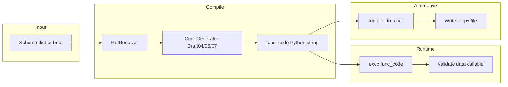
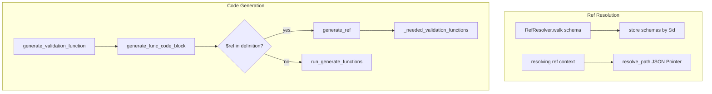

# Fast JSON Schema (horejsek/python-fastjsonschema) — Research report

## Metadata

- **Library name**: Fast JSON Schema (fastjsonschema)
- **Repo URL**: https://github.com/horejsek/python-fastjsonschema
- **Clone path**: `research/repos/python/horejsek-python-fastjsonschema/`
- **Language**: Python
- **License**: BSD-3-Clause (LICENSE, setup.py)

## Summary

Fast JSON Schema is a JSON Schema **validation** library for Python that achieves high performance by **generating Python validation code** from a schema at compile time. It supports draft-04, draft-06, and draft-07. The flow is: schema (dict) → CodeGenerator → Python source string → either `exec()` (in-memory) or `compile_to_code()` (write to file). The generated code is then invoked to validate JSON-like data. It does not generate data models (e.g. dataclasses, Pydantic); it generates imperative validation logic. Primary focus is performance (README cites ~25 ms for valid inputs vs ~5 s for jsonschema).

## JSON Schema support

- **Drafts**: Draft-04, draft-06, draft-07. Draft selection is via `$schema` in the schema; when absent, draft-07 is used (`_get_code_generator_class` in `__init__.py`).
- **Scope**: Validation (schema + instance → valid/invalid + exception) and validation code generation (schema → Python source).
- **Subset**: All core validation keywords from draft-04/06/07 are implemented. Meta-schema keywords `$comment`, `title`, `description`, `readOnly`, `writeOnly`, and `examples` are not implemented (accepted in schema but ignored).

## Keyword support table

Keyword list derived from vendored draft-07 meta-schema (`specs/json-schema.org/draft-07/schema.json`). Implementation evidence from `draft04.py`, `draft06.py`, `draft07.py`, `generator.py`, and `ref_resolver.py`.

| Keyword | Implemented | Notes |
|---------|-------------|-------|
| $id | yes | Used by RefResolver for resolution scope; walk stores schemas by URI in store. |
| $ref | yes | generate_ref; resolves via RefResolver.resolving(); emits call to generated validation function per ref. |
| $schema | yes | Used for draft detection in _get_code_generator_class. |
| $comment | no | Not in _json_keywords_to_function; ignored. |
| additionalItems | yes | Handled in generate_items (draft04) when items is array; can be false or schema. |
| additionalProperties | yes | generate_additional_properties. |
| allOf | yes | generate_all_of. |
| anyOf | yes | generate_any_of. |
| const | yes | generate_const (draft06). |
| contains | yes | generate_contains (draft06). |
| contentEncoding | yes | generate_content_encoding (draft07); base64 decoding only. |
| contentMediaType | yes | generate_content_media_type (draft07); application/json only. |
| default | yes | Applied in generate_properties and generate_items when use_default; returns transformed data. |
| definitions | partial | No dedicated handler; $ref to #/definitions/X resolved via RefResolver.resolve_path (JSON Pointer). |
| dependencies | yes | generate_dependencies (draft04); supports both array and schema forms. |
| description | no | Ignored. |
| enum | yes | generate_enum; `if variable not in enum`. |
| examples | no | Not implemented. |
| exclusiveMaximum | yes | generate_exclusive_maximum (draft06); numeric form. |
| exclusiveMinimum | yes | generate_exclusive_minimum (draft06); numeric form. |
| format | yes | generate_format; built-in regex for date-time, email, hostname, ipv4, ipv6, uri, json-pointer, uri-reference, uri-template, date, time, iri, iri-reference, idn-email, idn-hostname, relative-json-pointer; custom via formats param. |
| if/then/else | yes | generate_if_then_else (draft07). |
| items | yes | generate_items; supports schema, array (tuple), boolean (draft06+). |
| maxItems | yes | generate_max_items. |
| maxLength | yes | generate_max_length. |
| maxProperties | yes | generate_max_properties. |
| maximum | yes | generate_maximum. |
| minItems | yes | generate_min_items. |
| minLength | yes | generate_min_length. |
| minProperties | yes | generate_min_properties. |
| minimum | yes | generate_minimum. |
| multipleOf | yes | generate_multiple_of; uses Decimal for float precision. |
| not | yes | generate_not; supports boolean schema (draft06+). |
| oneOf | yes | generate_one_of. |
| pattern | yes | generate_pattern; Python regex; $ replaced with \Z for end-of-string. |
| patternProperties | yes | generate_pattern_properties. |
| properties | yes | generate_properties. |
| propertyNames | yes | generate_property_names (draft06). |
| readOnly | no | Not implemented. |
| required | yes | generate_required. |
| title | no | Ignored. |
| type | yes | generate_type; single or array; draft06 treats integer distinct from float. |
| uniqueItems | yes | generate_unique_items. |
| writeOnly | no | Not implemented. |

## Constraints

Validation keywords are enforced at **runtime** by the generated Python code. Each keyword (minLength, pattern, required, enum, etc.) produces conditional checks in the emitted code. Constraints are full validation checks, not structure-only. The generator emits `if` blocks that raise `JsonSchemaValueException` when violated. `use_default=True` (default) applies `default` values from schema to missing properties/items, so the validator returns transformed data rather than pass-through.

## High-level architecture

Pipeline: **Schema** (dict or bool) → **RefResolver.from_schema** → **CodeGenerator** (Draft04/06/07) → **func_code** (Python string) → **exec()** (compile) or **compile_to_code** (returns source for file) → callable **validate(data)**.

## Medium-level architecture

- **RefResolver**: Holds base_uri, schema, store (cache), handlers. `walk()` traverses schema, resolves relative `$ref` to full URIs, stores schemas with `$id` in store. `resolving(ref)` context manager yields resolved subschema via `resolve_path` (JSON Pointer). Supports remote schemas via `handlers` or urlopen.
- **CodeGenerator**: Base class in `generator.py`. Holds `_needed_validation_functions` (URIs to function names), `_validation_functions_done`. `generate_func_code` loops: pop from `_needed_validation_functions`, call `generate_validation_function(uri, name)` to emit a `def validate_*(data, custom_formats, name_prefix)` block, recurse via `generate_func_code_block` which dispatches to keyword handlers from `_json_keywords_to_function`.
- **$ref flow**: When `$ref` is encountered, `generate_ref` enters resolver scope, gets URI and function name, adds to `_needed_validation_functions` if not yet done, and emits a call to that function. Each ref’d schema becomes one generated function; refs to same URI reuse it.

## Low-level details

- **Regex**: Uses full Python regex; JSON Schema `$` is replaced with `\Z` for end-of-string (draft04.py DOLLAR_FINDER). Python `$` matches newline; `\Z` does not. User patterns with `$` are transformed.
- **default**: Applied when property/item missing and `use_default=True`; object/array defaults use `repr()` in generated code.
- **REGEX_PATTERNS**: Compiled regexes cached in `_compile_regexps` and passed in `global_state`; `compile_to_code` serializes them to `re.compile(...)` in emitted source.
- **OrderedDict**: `_json_keywords_to_function` is OrderedDict so keyword evaluation order is stable (draft04 defines order; draft06/07 update in place).

## Output and integration

- **Vendored vs build-dir**: Neither. Output is either in-memory (compile) or user writes `compile_to_code` result to file. No checked-in or build-dir convention.
- **API vs CLI**: Both. API: `compile(schema)` returns callable; `compile_to_code(schema)` returns string. CLI: `python -m fastjsonschema` reads schema from stdin or argv, prints generated code to stdout.
- **Writer model**: String only. `compile_to_code` returns str; user writes to file if desired.

## Configuration

- **handlers**: Dict mapping URI scheme to callable(uri) for remote schema fetch.
- **formats**: Dict of format name → regex string or callable(value) → bool for custom formats.
- **use_default**: If True, apply `default` for missing properties/items (default True).
- **use_formats**: If True, validate `format` keyword (default True).
- **detailed_exceptions**: If True, exceptions include value, name, definition, rule (default True).
- **fast_fail**: If True, stop at first error; if False, collect all errors in JsonSchemaValuesException (default True).

## Pros/cons

**Pros**: Very fast validation (compiled code, regex caching); simple API; supports draft-04/06/07; `compile_to_code` allows precompilation and distribution; custom formats; remote refs via handlers; `default` support with transformed output.

**Cons**: Regex uses full Python semantics (not JSON Schema subset); `$` → `\Z` substitution may surprise users; only base64 and application/json for contentEncoding/contentMediaType; no draft-2019-09/2020-12; no readOnly/writeOnly/title/description/examples; codegen uses string concatenation (maintainability).

## Testability

- **Test framework**: pytest. Run: `pytest -W default --benchmark-skip` or `make test` (uses venv).
- **Tox**: `tox` runs tests on py34–py313 and lint.
- **Fixtures**: `tests/examples/` (path_with_definition, issue-109, conditional, issue-109-regex-only); JSON Schema Test Suite via submodule `jsonschemasuitcases` (make jsonschemasuitcases).
- **Benchmarks**: pytest-benchmark in `tests/benchmarks/`; `make benchmark` / `make benchmark-save`.

## Performance

- **Script**: `performance.py`; run via `make performance` (or `python performance.py`).
- **Metric**: `timeit.timeit` wall time over 1000 iterations for valid and invalid cases.
- **Comparisons**: fast_compiled, fast_compiled_without_exc, fast_file (compile_to_code written to temp), fast_not_compiled (compile each call), jsonschema, jsonschema_compiled, jsonspec, validictory.
- **Entry points for benchmarking**: `fastjsonschema.compile(schema)(data)` and `fastjsonschema.compile_to_code(schema)` then import/validate.

## Determinism and idempotency

**Likely deterministic**. `_json_keywords_to_function` is OrderedDict; keyword order fixed per draft. `_needed_validation_functions` is a dict (insertion order in Python 3.7+); `popitem()` removes last inserted. Ref discovery order follows schema traversal, which is deterministic for a given schema. No explicit sorting; repeated compilation of same schema should yield same code. No explicit test for byte-for-byte idempotency found in repo.

## Enum handling

- **Duplicate entries** (e.g. `["a", "a"]`): Generated code uses `if variable not in enum`. Duplicates remain in list; validation passes if value equals any element. No deduplication. Draft-07 meta-schema requires `uniqueItems: true` for enum, but fastjsonschema does not validate schema against meta-schema, so duplicate enum values are accepted.
- **Case collisions** (e.g. `"a"` and `"A"`): Python strings are case-sensitive; both are distinct and both valid. No collision issue.

## Reverse generation (Schema from types)

No. The library generates validation code from schema only. There is no facility to produce JSON Schema from Python types or classes.

## Multi-language output

No. Output is Python source only. `compile_to_code` emits a single Python module with a `validate` function and optional `REGEX_PATTERNS`.

## Model deduplication and $ref/$defs

- **$ref**: Each distinct resolved URI produces one validation function. Refs to the same URI (e.g. multiple `$ref: "#/definitions/Person"`) all call the same generated function. Deduplication by URI.
- **definitions**: Schemas under `definitions` are referenced by `$ref`; no separate "definitions" handler. Same definition ref’d multiple times → one function, many calls.
- **Inline duplicates**: Two identical inline object schemas in different branches are not deduplicated; each generates its own inline validation block. Only `$ref`-backed schemas are deduplicated.

## Validation (schema + JSON → errors)

Yes. Primary feature.

- **Input**: Schema (dict or bool) and data (JSON-like Python object).
- **Output**: On success, returns data (with defaults applied if `use_default`). On failure, raises `JsonSchemaValueException` (or `JsonSchemaValuesException` when `fast_fail=False`) with message, value, name, definition, rule, path, rule_definition.
- **API**: `validate(schema, data, ...)` (convenience, compiles each call) or `compile(schema, ...)(data)` (recommended for reuse).
- **compile()**: Generates code, exec’s it, returns the validation callable.
- **Exceptions**: `JsonSchemaDefinitionException` for invalid schema during compile; `JsonSchemaValueException` for validation failure; `JsonSchemaValuesException` (list of JsonSchemaValueException) when `fast_fail=False`.
