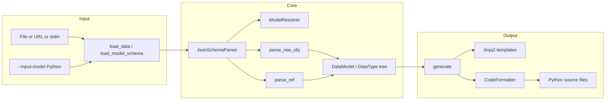
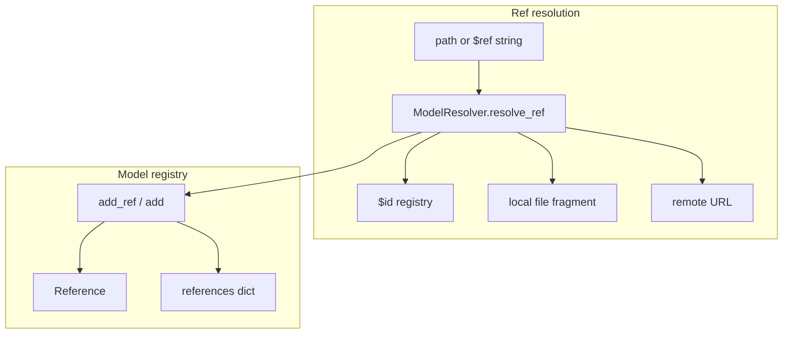

# datamodel-code-generator — Research report

## Metadata

- **Library name**: datamodel-code-generator
- **Repo URL**: https://github.com/koxudaxi/datamodel-code-generator
- **Clone path**: `research/repos/python/koxudaxi-datamodel-code-generator/`
- **Language**: Python
- **License**: MIT (pyproject.toml)

## Summary

datamodel-code-generator is a JSON Schema (and OpenAPI, GraphQL, raw data) to Python code generation library. It reads JSON Schema (and other inputs), parses them via version-aware parsers (e.g. JsonSchemaParser with draft-04 through 2020-12), resolves `$ref` and definitions, and emits Python source for Pydantic v1/v2, dataclasses, TypedDict, or msgspec. It supports CLI (`datamodel-codegen`), programmatic `generate()`, and optional reverse generation from existing Python types (`--input-model`). Output is Python only; generated models can be validated at runtime by Pydantic (or equivalent) but the tool does not provide a separate schema + JSON → validation errors API.

## JSON Schema support

- **Drafts**: Draft-04, draft-06, draft-07, draft-2019-09, draft-2020-12. Version is detected from `$schema` or heuristics (`$defs` vs `definitions`); see `parser/schema_version.py` (`detect_jsonschema_version`, `_JSONSCHEMA_VERSION_PATTERNS`) and `JsonSchemaFeatures.from_version`.
- **Scope**: Code generation only (schema → Python models). No built-in JSON instance validation against schema; generated Pydantic/dataclass code can enforce constraints at runtime when `--field-constraints` is used.
- **Subset**: Not all draft 2020-12 keywords are implemented. Supported: type, properties, required, items, prefixItems, additionalProperties, patternProperties, propertyNames, enum, format, default, title, description, $ref, $defs/definitions, $id, $recursiveRef/$recursiveAnchor, $dynamicRef/$dynamicAnchor, allOf/anyOf/oneOf, const, readOnly/writeOnly, validation keywords (minimum, maximum, minLength, maxLength, pattern, etc.) for field constraints. Not supported: $anchor, $vocabulary, if/then/else, contains, contentEncoding/contentMediaType/contentSchema, dependentRequired/dependentSchemas, unevaluatedProperties/unevaluatedItems (see `JsonSchemaFeatures` in `parser/schema_version.py`).

## Keyword support table

Keyword list derived from vendored draft 2020-12 meta-schemas (`specs/json-schema.org/draft/2020-12/meta/*.json`). Implementation evidence from `parser/jsonschema.py` (JsonSchemaObject, JsonSchemaParser), `parser/schema_version.py` (JsonSchemaFeatures), and `reference.py`.

| Keyword | Implemented | Notes |
|---------|-------------|-------|
| $anchor | no | JsonSchemaFeatures.anchor status "not_supported"; no parsing or resolution of $anchor. |
| $comment | partial | Stored in JsonSchemaObject extras; not explicitly parsed as keyword; may pass through. |
| $defs | yes | SCHEMA_PATHS includes "#/$defs"; definitions_key in JsonSchemaFeatures; parsed and resolved. |
| $dynamicAnchor | yes | JsonSchemaObject has dynamicAnchor (alias); JsonSchemaFeatures.dynamic_ref true for 2020-12. |
| $dynamicRef | yes | JsonSchemaObject has dynamicRef (alias); resolved with dynamic ref support. |
| $id | yes | JsonSchemaObject.id (alias "$id"); model_resolver.ids, set_root_id; used for ref resolution. |
| $ref | yes | JsonSchemaObject.ref (alias "$ref"); get_ref_type, parse_ref, _load_ref_schema_object; full resolution. |
| $schema | yes | Used in detect_jsonschema_version to select draft. |
| $vocabulary | no | JsonSchemaFeatures.vocabulary "not_supported". |
| additionalProperties | yes | JsonSchemaObject.additionalProperties; drives Dict/value type or forbidden extra. |
| allOf | yes | JsonSchemaObject.allOf; merged or class hierarchy per allof_merge_mode/allof_class_hierarchy. |
| anyOf | yes | JsonSchemaObject.anyOf; emitted as Union types. |
| const | yes | In __constraint_fields__ and extras; const_support in JsonSchemaFeatures; Literal/single value. |
| contains | no | JsonSchemaFeatures.contains status "not_supported". |
| contentEncoding | no | JsonSchemaFeatures.content_encoding "not_supported". |
| contentMediaType | no | Not supported (content vocabulary). |
| contentSchema | no | Not supported. |
| default | yes | JsonSchemaObject.default; applied to field default/initializer. |
| dependentRequired | no | JsonSchemaFeatures.dependent_required "not_supported". |
| dependentSchemas | no | JsonSchemaFeatures.dependent_schemas "not_supported". |
| deprecated | partial | In EXCLUDE_FIELD_KEYS/extras; JsonSchemaFeatures.deprecated_keyword "partial". |
| description | yes | JsonSchemaObject.description; docstrings or Field(description=...). |
| else | no | if_then_else "not_supported". |
| enum | yes | JsonSchemaObject.enum; Enum or Literal; x-enum-varnames/x-enumNames supported. |
| examples | partial | JsonSchemaObject.examples; stored in extras; not used for codegen structure. |
| exclusiveMaximum | yes | JsonSchemaObject; boolean converted to number for draft-04 compat (validate_exclusive_maximum_and_exclusive_minimum). |
| exclusiveMinimum | yes | Same as exclusiveMaximum. |
| format | yes | JsonSchemaObject.format; json_schema_data_formats maps to Types (date-time, uuid, etc.). |
| if | no | if_then_else "not_supported". |
| items | yes | JsonSchemaObject.items; single schema or legacy array; prefixItems for tuples. |
| maxContains | no | Not in JsonSchemaObject. |
| maximum | yes | JsonSchemaObject.maximum; Field(ge=/le=) when field_constraints. |
| maxItems | yes | JsonSchemaObject.maxItems; Field when field_constraints. |
| maxLength | yes | JsonSchemaObject.maxLength; Field when field_constraints. |
| maxProperties | yes | In __constraint_fields__; minProperties/maxProperties supported. |
| minContains | no | Not implemented. |
| minimum | yes | JsonSchemaObject.minimum; Field(ge=/le=) when field_constraints. |
| minItems | yes | JsonSchemaObject.minItems; Field when field_constraints. |
| minLength | yes | JsonSchemaObject.minLength; Field when field_constraints. |
| minProperties | yes | In __constraint_fields__. |
| multipleOf | yes | JsonSchemaObject.multipleOf; optional Decimal via use_decimal_for_multiple_of. |
| not | no | Not implemented for codegen (no dedicated branch). |
| oneOf | yes | JsonSchemaObject.oneOf; Union/discriminator when discriminator present. |
| pattern | yes | JsonSchemaObject.pattern; Field(pattern=...) when field_constraints. |
| patternProperties | yes | JsonSchemaObject.patternProperties; Dict with key/value types. |
| prefixItems | yes | JsonSchemaObject.prefixItems; tuple types (use_tuple_for_fixed_items). |
| properties | yes | JsonSchemaObject.properties; object model fields. |
| propertyNames | yes | JsonSchemaObject.propertyNames; JsonSchemaFeatures.property_names "supported"; key schema for Dict. |
| readOnly | yes | JsonSchemaObject.readOnly; read_only_write_only_model_type / serialization. |
| required | yes | JsonSchemaObject.required; required vs Optional fields. |
| then | no | if_then_else "not_supported". |
| title | yes | JsonSchemaObject.title; class name or docstring. |
| type | yes | JsonSchemaObject.type; string or array (incl. null); type-driven Types. |
| unevaluatedItems | no | JsonSchemaFeatures.unevaluated_items "not_supported". |
| unevaluatedProperties | no | JsonSchemaObject has field but JsonSchemaFeatures.unevaluated_properties "not_supported". |
| uniqueItems | yes | JsonSchemaObject.uniqueItems; use_unique_items_as_set → Set type. |
| writeOnly | yes | JsonSchemaObject.writeOnly; write-only model handling. |

## Constraints

Validation keywords (minimum, maximum, minLength, maxLength, minItems, maxItems, pattern, etc.) are used for **structure** (types, optionality). When `--field-constraints` (or deprecated `--validation`) is enabled, they are also emitted as Pydantic `Field()` constraints (e.g. `ge`, `le`, `min_length`, `pattern`) so that **runtime validation** is enforced by Pydantic when instantiating or validating data. So constraint enforcement is optional and delegated to the target runtime (Pydantic); the generator only emits the annotations.

## High-level architecture

Pipeline: **Input** (file, URL, stdin, or `--input-model` Python modules) → **load_data** / **load_model_schema** → **Parser** (JsonSchemaParser for JSON Schema) with **ModelResolver** (references, class names) → **parse_raw_obj** / **parse_ref** traversing schema and **JsonSchemaObject** → **DataModel** / **DataType** tree → **generate** (Jinja2 templates, formatters) → **CodeFormatter** (e.g. black, ruff) → **Output** (file(s) or stdout). For JSON Schema, definitions are loaded from `#/definitions` or `#/$defs`; `$id` is registered for ref resolution; `$ref` is resolved to in-document or remote schemas.

## Medium-level architecture

- **JsonSchemaParser** (`parser/jsonschema.py`): Subclass of `Parser`; holds `raw_obj`, `model_resolver`, schema version features (`JsonSchemaFeatures`). Parses root and definitions, resolves `$ref` via `_load_ref_schema_object` and `model_resolver.resolve_ref`, builds `DataModel` and `DataType` instances. Uses `SCHEMA_PATHS` `["#/definitions", "#/$defs"]` to find definition roots.
- **ModelResolver** (`reference.py`): Registry of `Reference` by resolved path; `resolve_ref(path)` resolves local/remote/URL refs, normalizes `#` and file paths, uses `ids` for `$id`-based resolution. `add_ref`/`add` create or update references; `get_class_name` produces unique class names (with optional duplicate suffix). Base path and base URL are set per input for file and HTTP resolution.
- **Reference**: Tracks `path`, `original_name`, `name`, `duplicate_name`, `loaded`, `source`, `children`; used to avoid duplicate model generation and to wire DataType/DataModel references.
- **JsonSchemaObject**: Pydantic model of a schema node; fields for type, properties, items, enum, $ref, allOf/anyOf/oneOf, constraint keywords, etc.; `extras` for unknown keys; `has_constraint`, `ref_type`, `is_object`, `is_array` helpers.

## Low-level details

- **Enum generation**: `model/enum.py` provides `Enum`/`StrEnum`; enum values from schema become members; `FieldNameResolver`/`EnumFieldNameResolver` handle invalid or reserved names (e.g. `mro` → `mro_`); `capitalise_enum_members` and `empty_enum_field_name` config. Duplicate enum values: code iterates schema enum list and builds members; no explicit deduplication documented — effectively first occurrence wins for name. Case collisions: distinct Python identifiers produced via `get_valid_name` (e.g. suffix) so "a" and "A" can both be represented.
- **Constraint emission**: `is_constraints_field` and `__constraint_fields__` determine which keywords become Pydantic constraints; merged in allOf when `allof_merge_mode` is Constraints.

## Output and integration

- **Vendored vs build-dir**: Generated output is written to user-specified path (`--output`); not vendored by the tool. Configurable via CLI or pyproject.toml `[tool.datamodel-codegen]`.
- **API vs CLI**: Both. CLI: `datamodel-codegen` (entry point `datamodel_code_generator.__main__:main`). API: `generate()` in main package with same options (output path, output_model_type, etc.). No macros; builder-style keyword arguments.
- **Writer model**: File or stdout. When `output` is None, result is written to stdout (string or dict of path → content). Otherwise files are written to the given path (single file or directory for module split). No generic Writer abstraction; path-based and stdout.

## Configuration

- **Model/serialization**: `output_model_type` (Pydantic BaseModel, dataclass, TypedDict, msgspec), `target_pydantic_version`, `use_annotated`, `field_constraints`, `use_serialization_alias`, `read_only_write_only_model_type`, `allow_extra_fields`, `use_default_kwarg`.
- **Naming**: `class_name`, `class_name_prefix`, `class_name_suffix`, `class_name_affix_scope`, `snake_case_field`, `capitalise_enum_members`, `naming_strategy` (e.g. parent-prefixed, full-path, primary-first), `duplicate_name_suffix`, `empty_enum_field_name`, `aliases` (file), `default_values` (file).
- **Map types**: `additionalProperties` → Dict[str, value_type] or forbidden; `patternProperties` → Dict with key/value types; `use_standard_collections`.
- **Optional deps**: `[http]` for remote $ref (httpx), `[graphql]` for GraphQL, `[validation]` for OpenAPI validation (openapi-spec-validator, prance), `[watch]`, `[ruff]`, `[debug]`.

## Pros/cons

- **Pros**: Multiple input formats (JSON Schema, OpenAPI, GraphQL, JSON/YAML/CSV); multiple output styles (Pydantic v1/v2, dataclass, TypedDict, msgspec); rich CLI and pyproject.toml config; reverse generation from Python types; $ref and $defs/definitions with remote and $id support; optional field constraints; enum and literal handling; duplicate name resolution and naming strategies.
- **Cons**: No if/then/else, contains, content vocabulary, dependentRequired/dependentSchemas, unevaluatedProperties/unevaluatedItems; no $anchor/$vocabulary; validation is via generated Pydantic code, not a separate schema+JSON validator in the library.

## Testability

- **Framework**: pytest; markers `perf` and `benchmark` for performance tests.
- **Running tests**: From repo root, `pytest` (or `uv run pytest`). Excluded: `tests/data/*`, `tests/main/test_performance.py` by default; perf tests run in tox env `perf`.
- **Fixtures**: `tests/data/jsonschema/`, `tests/data/expected/parser/jsonschema/`; parser tests in `tests/parser/test_jsonschema.py`, main integration in `tests/main/jsonschema/test_main_jsonschema.py`.
- **Entry point for external fixtures**: CLI `datamodel-codegen --input <schema> --input-file-type jsonschema --output <path>` or `generate(input_=..., input_file_type=InputFileType.JsonSchema, output=...)` allow running the generator against any schema file or string.

## Performance

- **Benchmarks**: `tests/main/test_performance.py`; marked `@pytest.mark.perf` and `@pytest.mark.benchmark` for CodSpeed. Uses `pytest-benchmark` (optional dependency group `benchmark`). Tox env `perf` runs them (e.g. `tox -e perf`).
- **Measurement**: Wall time / benchmark plugin; CodSpeed integration for trends.
- **Entry points for benchmarking**: CLI `datamodel-codegen --input <schema> --input-file-type jsonschema --output <path>`; programmatic `generate(...)` with same inputs. Performance data under `tests/data/performance/`.

## Determinism and idempotency

- **Ordering**: With `--keep-model-order`, models are reordered deterministically by dependency order (`_reorder_models_keep_model_order`, `stable_toposort` in `parser/base.py`). Without it, iteration order can vary (e.g. dict ordering). Reference names are deduplicated with numeric suffixes, so repeated runs with same input and same config tend to produce same names.
- **Diffs**: No guaranteed minimal diff when schema changes; model order and naming can shift without `keep_model_order`. Use "Unknown" for strict idempotency guarantee across versions.

## Enum handling

- **Duplicate entries**: Schema `enum` list is iterated to build enum members; no explicit deduplication in the report’s code path — duplicate values may produce duplicate Python enum members or overwrite (implementation iterates and adds; reserved name handling may suffix). Prefer "partial" and note "duplicate enum values: name uniqueness via get_valid_name; multiple identical values may yield multiple members or suffix."
- **Namespace/case collisions**: `FieldNameResolver.get_valid_name` and `EnumFieldNameResolver` produce valid Python identifiers; "a" and "A" can both be used (e.g. different names or capitalise_enum_members). So both are representable; collision avoidance via suffix when needed.

## Reverse generation (Schema from types)

- **Yes**. `--input-model` accepts Python module paths (e.g. Pydantic, dataclass, TypedDict, msgspec). `input_model.load_model_schema()` introspects types and produces a JSON Schema (dict); that schema is then fed to the same codegen pipeline. So the flow is: Python types → JSON Schema → generated Python models (useful for round-tripping or schema export). See `input_model.py` and CLI `input_model` / `input_model_ref_strategy`.

## Multi-language output

- **Python only**. Output is Python source (Pydantic, dataclass, TypedDict, msgspec). No TypeScript, Go, or other languages. Input can be OpenAPI/GraphQL/JSON Schema, but emitted code is always Python.

## Model deduplication and $ref/$defs

- **$ref / $defs**: References are resolved to a canonical path; `ModelResolver.references` keyed by resolved path ensures one `Reference` per target. So the same `$ref` or same definition in `$defs` yields a single generated type (one class/enum), reused by reference in the model tree. Definitions under `#/definitions` or `#/$defs` are parsed and added as references; inline object shapes in different branches are not automatically deduplicated into one type unless they are behind the same $ref.
- **Identical inline shapes**: No structural deduplication of identical inline object schemas in different branches; each inline definition can produce its own type unless referenced via $ref. So deduplication is by $ref/$defs identity, not by structural equality.

## Validation (schema + JSON → errors)

- **No** dedicated API in this library. The tool does not take (schema, JSON instance) and return a list of validation errors. Generated Pydantic models can be used to validate data at runtime (e.g. `Model.model_validate(json_data)`), and optional `[validation]` is for validating OpenAPI specs, not for validating JSON against JSON Schema. So: schema + JSON → errors is done by the consumer (e.g. Pydantic) using the generated code, not by datamodel-code-generator itself.
