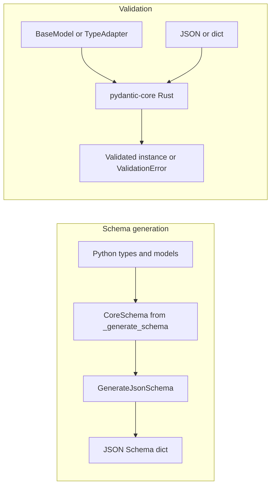
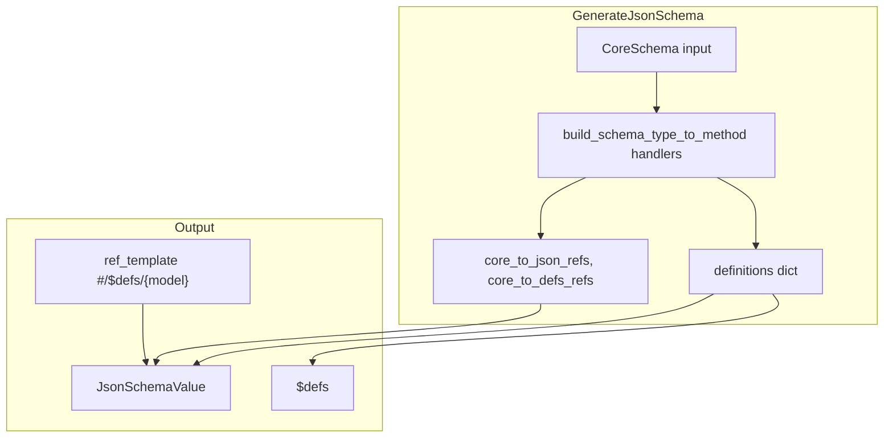

# Pydantic — Research report

## Metadata

- **Library name**: Pydantic
- **Repo URL**: https://github.com/pydantic/pydantic
- **Clone path**: `research/repos/python/pydantic-pydantic/`
- **Language**: Python
- **License**: MIT (pyproject.toml)

## Summary

Pydantic is a data validation library using Python type hints. It generates JSON Schema from Python models and types (reverse direction: types → schema) via `BaseModel.model_json_schema()` and `TypeAdapter.json_schema()`. Pydantic does **not** generate code from JSON Schema (no schema → codegen). Validation is model-based: Pydantic validates data against Python models, not against a raw JSON Schema. Generated schemas comply with JSON Schema Draft 2020-12 and OpenAPI v3.1.0. Core validation logic lives in `pydantic-core` (Rust).

## JSON Schema support

- **Drafts**: Draft 2020-12. The `GenerateJsonSchema` class uses `schema_dialect = 'https://json-schema.org/draft/2020-12/schema'` (pydantic/json_schema.py).
- **Scope**: Reverse generation only (types → schema). No schema → code; no direct schema + JSON → validation errors API.
- **Subset**: Pydantic emits many Draft 2020-12 keywords when generating schemas from types. It does not emit `$anchor`, `$vocabulary`, `if`/`then`/`else`, `contains`, `dependentRequired`, `dependentSchemas`, `unevaluatedProperties`, `unevaluatedItems`, or `contentEncoding`. For the `Json` type it emits `contentMediaType` and `contentSchema`.

## Keyword support table

Keyword list derived from vendored draft 2020-12 meta-schemas (`specs/json-schema.org/draft/2020-12/meta/*.json`). Implementation evidence from `pydantic/json_schema.py` (GenerateJsonSchema, ValidationsMapping, schema handlers).

| Keyword | Implemented | Notes |
|---------|-------------|-------|
| $anchor | no | Not emitted in generated schemas. |
| $comment | no | Meta-data; not emitted by default. |
| $defs | yes | Used for nested models and reusable definitions; `definitions` dict, `DEFAULT_REF_TEMPLATE = '#/$defs/{model}'`. |
| $dynamicAnchor | no | Not emitted. |
| $dynamicRef | no | Not emitted. |
| $id | no | Not emitted; `GenerateJsonSchema.generate()` comment notes `$schema` can be added by override. |
| $ref | yes | References to `$defs` entries; `core_to_json_refs`, `JsonRef`. |
| $schema | partial | `schema_dialect` set but not added to output by default; can be added via override. |
| $vocabulary | no | Not emitted. |
| additionalProperties | yes | `typed_dict_schema`; `extra_behavior` forbid/allow; dict schemas. |
| allOf | yes | Via `get_union_of_schemas` and model composition. |
| anyOf | yes | Union types; `union_schema`, `get_union_of_schemas`. |
| const | yes | `literal_schema`; single-value literal → `const`. |
| contains | no | Not emitted; no CoreSchema equivalent. |
| contentEncoding | no | Not emitted. |
| contentMediaType | yes | Emitted for `Json` type: `contentMediaType: 'application/json'` with `contentSchema`. |
| contentSchema | yes | Emitted for `Json` type alongside `contentMediaType`. |
| default | yes | From Field defaults, model fields; `_get_default_for_json_schema`. |
| dependentRequired | no | Not emitted. |
| dependentSchemas | no | Not emitted. |
| deprecated | yes | From `__deprecated__` on types; `json_schema['deprecated'] = True`. |
| description | yes | From docstrings, Field(description=...). |
| else | no | if/then/else not supported. |
| enum | yes | `enum_schema`; Enum types; multi-value literal → `enum`. |
| examples | yes | `Examples` class; `pydantic_js_extra`; can be added to schemas. |
| exclusiveMaximum | yes | `ValidationsMapping.numeric`: `lt` → `exclusiveMaximum`. |
| exclusiveMinimum | yes | `ValidationsMapping.numeric`: `gt` → `exclusiveMinimum`. |
| format | yes | date, date-time, time, uuid, uri, etc.; `str_schema`, `url_schema`, `uuid_schema`, etc. |
| if | no | Not supported. |
| items | yes | List, tuple schemas; `list_schema`, `tuple_schema`. |
| maxContains | no | Not emitted. |
| maximum | yes | `ValidationsMapping.numeric`: `le` → `maximum`. |
| maxItems | yes | `ValidationsMapping.array`: `max_length` → `maxItems`; tuple fixed length. |
| maxLength | yes | `ValidationsMapping.string`/`bytes`: `max_length` → `maxLength`. |
| maxProperties | yes | `ValidationsMapping.object`: `max_length` → `maxProperties`. |
| minContains | no | Not emitted. |
| minimum | yes | `ValidationsMapping.numeric`: `ge` → `minimum`. |
| minItems | yes | `ValidationsMapping.array`: `min_length` → `minItems`. |
| minLength | yes | `ValidationsMapping.string`/`bytes`: `min_length` → `minLength`. |
| minProperties | yes | `ValidationsMapping.object`: `min_length` → `minProperties`. |
| multipleOf | yes | `ValidationsMapping.numeric`: `multiple_of` → `multipleOf`. |
| not | no | No CoreSchema equivalent; not emitted. |
| oneOf | yes | Discriminated unions; `tagged_union_schema`. |
| pattern | yes | `ValidationsMapping.string`: `pattern` → `pattern`. |
| patternProperties | yes | Dict schemas with key schema; `dict_schema`. |
| prefixItems | yes | Tuple schemas; `tuple_schema` emits `prefixItems` with `minItems`/`maxItems`. |
| properties | yes | TypedDict, model schemas; `typed_dict_schema`, `model_schema`. |
| propertyNames | yes | Dict key schema; `dict_schema` emits `propertyNames`. |
| readOnly | yes | Computed fields, serialization-only; `pydantic_js_updates={'readOnly': True}`. |
| required | yes | From TypedDict/model required fields; `typed_dict_schema`. |
| then | no | if/then/else not supported. |
| title | yes | Model/type names; ConfigDict(title=...); Field(title=...). |
| type | yes | All primitive and composite types; `int_schema`, `str_schema`, etc. |
| unevaluatedItems | no | Not emitted. |
| unevaluatedProperties | no | Not emitted. |
| uniqueItems | yes | Set/frozenset; `set_schema` emits `uniqueItems: True`. |
| writeOnly | yes | SecretStr, SecretBytes, etc.; `pydantic_js_updates` with `writeOnly`. |

## Constraints

Pydantic enforces constraints at **runtime** during validation of Python data against models. Validation keywords (minimum, maximum, minLength, maxLength, pattern, etc.) are emitted in the generated JSON Schema to document the validation rules. The schema is an output of the model; validation is performed by `pydantic-core` against the internal CoreSchema, not against the JSON Schema itself. So constraints are enforced by the model, and the schema reflects those constraints.

## High-level architecture

Pipeline: **Python types/models** (BaseModel, TypeAdapter, TypedDict, etc.) → **CoreSchema** (internal representation from `_internal/_generate_schema.py`) → **GenerateJsonSchema** (pydantic/json_schema.py) → **JSON Schema dict** (JsonSchemaValue). Validation path: **Model** + **data** (dict/JSON) → **TypeAdapter.validate_python** / **BaseModel.model_validate** → **pydantic-core** (Rust) → validated instance or ValidationError. No schema → code generation.

## Medium-level architecture

- **GenerateJsonSchema** (pydantic/json_schema.py): Main class for schema generation. Holds `definitions`, `core_to_json_refs`, `core_to_defs_refs`; `generate(schema)` and `generate_definitions(inputs)` produce JSON Schema from CoreSchema. Uses `build_schema_type_to_method()` to map core schema types (e.g. `int_schema`, `str_schema`, `enum_schema`, `typed_dict_schema`) to handler methods. `ref_template` (default `#/$defs/{model}`) controls reference format. `union_format` supports `any_of` or `primitive_type_array`.
- **Ref and defs handling**: `CoreRef`, `DefsRef`, `JsonRef` types. Definitions collected in `self.definitions`; `populate_defs` adds schemas to definitions when a `ref` is present. `_DefinitionsRemapping` simplifies def names for readability. `_prioritized_defsref_choices` used for deduplication and naming.
- **JsonSchemaMode**: `validation` or `serialization`; affects which fields appear (e.g. computed fields only in serialization).
- **model_json_schema** / **TypeAdapter.json_schema**: Entry points that delegate to `GenerateJsonSchema` with the model/type CoreSchema.

## Low-level details

- **ValidationsMapping**: Maps CoreSchema attribute names to JSON Schema keywords: `numeric` (multipleOf, le→maximum, ge→minimum, lt→exclusiveMaximum, gt→exclusiveMinimum), `string` (min_length→minLength, max_length→maxLength, pattern→pattern), `array` (min_length→minItems, max_length→maxItems), `object` (min_length→minProperties, max_length→maxProperties).
- **Sorting**: `sort()` recursively alphabetically sorts keys except `properties` and `default` to preserve field order; produces deterministic output.

## Output and integration

- **Vendored vs build-dir**: Schema generation returns a dict (JsonSchemaValue); no vendored output. Caller serializes with `json.dumps()` or uses in OpenAPI tooling.
- **API vs CLI**: API only. `BaseModel.model_json_schema()`, `TypeAdapter.json_schema()`, `models_json_schema()` for multiple models. No CLI for schema generation; Pydantic is a library.
- **Writer model**: Returns dict; caller writes to file or string as needed.

## Configuration

- **Schema generation**: `by_alias`, `ref_template`, `union_format` (`any_of` or `primitive_type_array`). Passed via `model_json_schema(by_alias=..., ref_template=...)` or custom `GenerateJsonSchema` subclass.
- **Model config**: `ConfigDict` for ser_json_bytes, ser_json_timedelta, etc., affecting schema output (e.g. bytes as base64 vs binary).
- **Field-level**: `Field(description=..., title=..., deprecated=...)`; `WithJsonSchema`, `Examples` for custom schema snippets.

## Pros/cons

- **Pros**: Mature, widely used; Draft 2020-12 compliant schemas; OpenAPI 3.1 compatible; `validation` vs `serialization` modes; extensible via `GetJsonSchemaHandler`, `pydantic_js_updates`, custom `GenerateJsonSchema` subclasses; fast validation via pydantic-core (Rust); supports BaseModel, TypeAdapter, TypedDict, dataclasses, Literal, Enum.
- **Cons**: No schema → codegen; no direct schema + JSON → errors validation (validation is model-based); does not emit if/then/else, contains, dependentRequired, dependentSchemas, unevaluatedProperties, unevaluatedItems, $anchor, $dynamicRef/$dynamicAnchor.

## Testability

- **Framework**: pytest; pytest-benchmark for performance.
- **Running tests**: From repo root, `pytest` or `uv run pytest`. Tests in `tests/`; JSON Schema tests in `tests/test_json_schema.py`.
- **Fixtures**: Test models and assertions on `model_json_schema()` and `TypeAdapter(...).json_schema()` output. `tests/benchmarks/` for validation/serialization benchmarks.
- **Entry point for external fixtures**: `TypeAdapter(SomeType).json_schema()` or `SomeModel.model_json_schema()` can be called with any Pydantic-compatible type; no CLI to run against arbitrary schemas (Pydantic consumes types, not schemas).

## Performance

- **Benchmarks**: `tests/benchmarks/`; `test_north_star.py` (validation, serialization), `test_validators_build.py`, `test_regex.py`. Use `pytest-benchmark`; run with `pytest tests/benchmarks/ -v`.
- **Measurement**: Wall time via pytest-benchmark.
- **Entry points**: `TypeAdapter(T).validate_python(data)`, `TypeAdapter(T).validate_json(json_str)`, `model.model_validate(data)` for validation; `model.model_json_schema()` for schema generation. No schema-input validation to benchmark.

## Determinism and idempotency

- **Sorting**: `GenerateJsonSchema.sort()` recursively sorts dict keys alphabetically except `properties` and `default`, producing deterministic output for the same model and config.
- **Definitions**: Def names from `ref_template` and model/type names; `_DefinitionsRemapping` and `_prioritized_defsref_choices` produce stable def names when no collisions. Repeated calls with same model yield identical schema.

## Enum handling

- **Duplicate entries**: `enum_schema` uses `schema['members']` and `to_jsonable_python(v.value)`; Python Enum members are unique by definition. For `Literal` with duplicates, `literal_schema` uses `expected = [to_jsonable_python(v.value if isinstance(v, Enum) else v) for v in schema['expected']]`; duplicates would appear in the enum array. No explicit deduplication in schema emission.
- **Namespace/case collisions**: Python Enum member names must be unique; values can duplicate. Schema emits `enum` with values. For Literal, multiple values become `enum` list; type can be inferred. No special handling for "a" vs "A" in schema; both are valid JSON strings if in the enum.

## Reverse generation (Schema from types)

- **Yes**. Pydantic's primary JSON Schema feature. `BaseModel.model_json_schema()` and `TypeAdapter.json_schema()` generate JSON Schema from Python models, TypedDicts, dataclasses, Literal, Enum, and other annotated types. `models_json_schema()` generates schemas for multiple models with shared `$defs`. Supports `mode='validation'` or `mode='serialization'` for different field sets (e.g. computed fields). Customization via `WithJsonSchema`, `Examples`, `GetJsonSchemaHandler`, and `GenerateJsonSchema` subclasses.

## Multi-language output

- **Python only**. Pydantic generates JSON Schema (a JSON-serializable dict), not code. The schema can be consumed by any JSON Schema–aware tool (OpenAPI, code generators, validators). Pydantic itself does not emit TypeScript, Go, or other language code.

## Model deduplication and $ref/$defs

- **$ref / $defs**: When the same model or referenced type appears multiple times, `GenerateJsonSchema` assigns it a single `DefsRef` and emits one definition in `$defs`. All references use `$ref` to that definition. `core_to_defs_refs` and `core_to_json_refs` map CoreRef to defs; `populate_defs` ensures each referenced schema is stored once.
- **Identical inline shapes**: Types that share the same CoreSchema ref (e.g. same BaseModel subclass) are deduplicated. Structurally identical but distinct Python types (e.g. two different TypedDicts with same shape) may get separate defs if they have different CoreRefs. Deduplication is by ref identity, not structural equality.

## Validation (schema + JSON → errors)

- **No** dedicated API. Pydantic validates data against Python models (or TypeAdapter types), not against a raw JSON Schema. The flow is: define model → validate with `model.model_validate(json_data)` or `TypeAdapter(T).validate_json(json_str)` → get validated instance or `ValidationError`. To validate arbitrary JSON against a schema, use a separate library (e.g. `jsonschema`) with the schema produced by `model_json_schema()`. Pydantic does not provide schema + JSON → errors directly.
