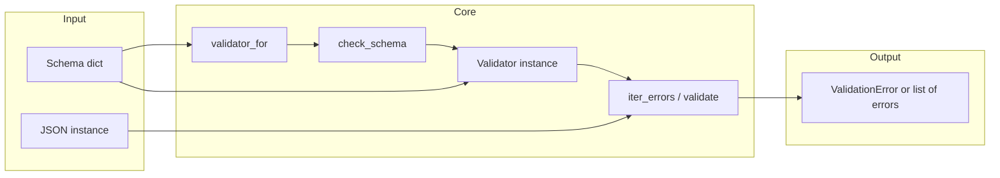
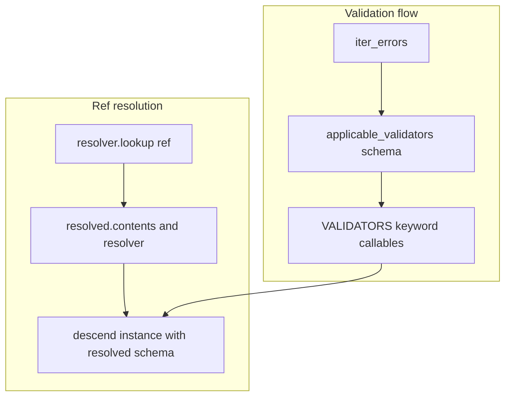

# jsonschema — Research report

## Metadata

- **Library name**: jsonschema
- **Repo URL**: https://github.com/python-jsonschema/jsonschema
- **Clone path**: `research/repos/python/python-jsonschema-jsonschema/`
- **Language**: Python
- **License**: MIT (see pyproject.toml, COPYING)

## Summary

jsonschema is the reference implementation of JSON Schema for Python. It is a **validator only**: given a schema and a JSON instance, it reports whether the instance is valid and can yield one or all validation errors. It does not generate code from schemas. The library supports Draft 3, Draft 4, Draft 6, Draft 7, Draft 2019-09, and Draft 2020-12. Validators are registered by meta-schema URI; `validator_for(schema)` selects the validator from the schema’s `$schema` keyword. Reference resolution is delegated to the `referencing` library (with a deprecated legacy `RefResolver`). Validation is lazy and can report all errors via `iter_errors()`; the main entry point is `validate(instance, schema)` or a concrete validator class (e.g. `Draft202012Validator`).

## JSON Schema support

- **Drafts**: Draft 3, Draft 4, Draft 6, Draft 7, Draft 2019-09, Draft 2020-12. Declared in README and in `jsonschema/__init__.py` (Draft3Validator through Draft202012Validator). Meta-schemas come from the `jsonschema_specifications` package; validators are registered via `validates(version)` and keyed by meta-schema ID in `_META_SCHEMAS`.
- **Scope**: Validation only. No code generation.
- **Subset**: For Draft 2020-12, the library implements the core applicator and validation keywords used in validation. Meta-data keywords (`$comment`, `description`, `title`, `default`, `examples`, `deprecated`, `readOnly`, `writeOnly`) are not enforced as validators. Content vocabulary (`contentEncoding`, `contentMediaType`, `contentSchema`) is not implemented. `$schema` and `$id` are used for validator selection and reference resolution, not as validation keywords. `$anchor` and `$dynamicAnchor` are used during reference resolution (e.g. in legacy `_RefResolver.resolve_fragment`).

## Keyword support table

Keyword list derived from vendored draft 2020-12 meta-schemas (`specs/json-schema.org/draft/2020-12/meta/`). Implementation evidence from `jsonschema/validators.py` (Draft202012Validator, Draft201909Validator, etc.), `jsonschema/_keywords.py`, and `jsonschema/_legacy_keywords.py`.

| Keyword | Implemented | Notes |
|---------|-------------|-------|
| $anchor | partial | Used in ref resolution (e.g. _RefResolver.resolve_fragment); not a validation keyword. |
| $comment | no | Meta-data; accepted in schema but not validated. |
| $defs | no | Structure only; no dedicated validator; $ref can target definitions. |
| $dynamicAnchor | partial | Used in resolution (resolve_fragment); Draft 2020-12 dynamic refs via referencing. |
| $dynamicRef | yes | Draft202012Validator; _keywords.dynamicRef delegates to _validate_reference. |
| $id | partial | Used for resolution scope and validator selection; not validated. |
| $ref | yes | All drafts; _keywords.ref, _validate_reference; resolution via referencing or legacy RefResolver. |
| $schema | partial | Used by validator_for() to select validator class; not validated. |
| $vocabulary | no | Not implemented. |
| additionalProperties | yes | _keywords.additionalProperties. |
| allOf | yes | _keywords.allOf. |
| anyOf | yes | _keywords.anyOf. |
| const | yes | _keywords.const (Draft 6+). |
| contains | yes | _keywords.contains; minContains/maxContains handled in same validator. |
| contentEncoding | no | Not implemented. |
| contentMediaType | no | Not implemented. |
| contentSchema | no | Not implemented. |
| default | no | Meta-data; not validated. |
| dependentRequired | yes | _keywords.dependentRequired (Draft 2019-09+). |
| dependentSchemas | yes | _keywords.dependentSchemas (Draft 2019-09+). |
| deprecated | no | Not implemented. |
| description | no | Meta-data; not validated. |
| else | yes | Handled inside _keywords.if_ when "else" in schema. |
| enum | yes | _keywords.enum; instance must equal one of the values. |
| examples | no | Not implemented. |
| exclusiveMaximum | yes | _keywords.exclusiveMaximum (Draft 6+; separate keyword). |
| exclusiveMinimum | yes | _keywords.exclusiveMinimum (Draft 6+; separate keyword). |
| format | yes | _keywords.format; delegates to FormatChecker (optional, configurable). |
| if | yes | _keywords.if_; then/else applied when present. |
| items | yes | _keywords.items (2020-12); prefixItems + items for additional items. |
| maxContains | yes | Used in _keywords.contains. |
| maximum | yes | _keywords.maximum. |
| maxItems | yes | _keywords.maxItems. |
| maxLength | yes | _keywords.maxLength. |
| maxProperties | yes | _keywords.maxProperties. |
| minContains | yes | Used in _keywords.contains. |
| minimum | yes | _keywords.minimum. |
| minItems | yes | _keywords.minItems. |
| minLength | yes | _keywords.minLength. |
| minProperties | yes | _keywords.minProperties. |
| multipleOf | yes | _keywords.multipleOf. |
| not | yes | _keywords.not_. |
| oneOf | yes | _keywords.oneOf. |
| pattern | yes | _keywords.pattern. |
| patternProperties | yes | _keywords.patternProperties. |
| prefixItems | yes | _keywords.prefixItems (Draft 2020-12). |
| properties | yes | _keywords.properties. |
| propertyNames | yes | _keywords.propertyNames (Draft 6+). |
| readOnly | no | Not implemented. |
| required | yes | _keywords.required. |
| then | yes | Handled inside _keywords.if_ when "then" in schema. |
| title | no | Meta-data; not validated. |
| type | yes | _keywords.type; TypeChecker per draft. |
| unevaluatedItems | yes | _keywords.unevaluatedItems (Draft 2019-09+). |
| unevaluatedProperties | yes | _keywords.unevaluatedProperties (Draft 2019-09+). |
| uniqueItems | yes | _keywords.uniqueItems. |
| writeOnly | no | Not implemented. |

## Constraints

All validation keywords are enforced at runtime when validating an instance. There is no code generation; constraints (minLength, minimum, pattern, etc.) are applied during validation. The library yields `ValidationError` exceptions (or error objects when using `iter_errors`). Format checks are optional and configurable via `FormatChecker`; validators have a default format checker per draft but it can be set to `None` to disable format validation.

## High-level architecture

Pipeline: **Schema** (dict or bool) → **validator_for(schema)** (selects validator class from `$schema`) → **Validator.check_schema(schema)** (validates schema against meta-schema) → **Validator(schema, ...)** (creates validator instance; resolver from `referencing` or legacy RefResolver) → **validator.validate(instance)** or **validator.iter_errors(instance)** (descend through schema, apply keyword validators, resolve $ref via resolver). No code emission; output is validity plus optional list of errors.

## Medium-level architecture

- **Entry**: `validate(instance, schema, cls=None)` in validators.py: if `cls` is None, `cls = validator_for(schema)`; then `cls.check_schema(schema)`, build validator with `cls(schema, *args, **kwargs)`, then `best_match(validator.iter_errors(instance))` and raise if non-None. Alternatively, use a concrete class (e.g. `Draft202012Validator(schema).validate(instance)`).
- **Validator creation**: `create(meta_schema, validators=dict, type_checker, format_checker, id_of, applicable_validators)` builds an attrs-based Validator class. Each draft validator (Draft3Validator through Draft202012Validator) is created with the appropriate meta_schema from `jsonschema_specifications.REGISTRY`, a validators dict mapping keyword names to callables (from _keywords and _legacy_keywords), and draft-specific type_checker and format_checker.
- **Reference resolution**: Validator holds `_resolver` (from `referencing`: `registry.resolver_with_root(resource)`) or legacy `_ref_resolver` (RefResolver). `_validate_reference(ref, instance)` calls `self._resolver.lookup(ref)` (or legacy resolve/push_scope/pop_scope), then `self.descend(instance, resolved.contents, resolver=resolved.resolver)`.
- **Validation loop**: `iter_errors(instance, _schema=None)` uses `_schema` and `_validators` (list of (callable, keyword, value) for applicable keywords). For each validator, it calls the callable; callables yield `ValidationError` or nothing. Errors are augmented with path, schema_path, validator name, etc. `descend()` is used to recurse into subschemas (e.g. properties, items, allOf).

## Low-level details

- **FormatChecker**: `_format.py` defines FormatChecker with a registry of format names to (check_callable, raises). Per-draft format checkers (draft3_format_checker through draft202012_format_checker) register formats (date-time, email, hostname, etc.). Custom formats can be added via `FormatChecker.checks(format)(func)`.
- **TypeChecker**: `_types.py` defines TypeChecker with type names to checker callables. Draft-specific checkers (e.g. draft202012_type_checker) support type strings (string, number, integer, boolean, null, object, array).
- **Error representation**: `exceptions.ValidationError` has message, path (instance path), schema_path, validator, validator_value, instance, schema, context (nested errors). `best_match()` in exceptions picks a single representative error from a list. ErrorTree builds a tree of errors by path.

## Output and integration

- **Vendored vs build-dir**: N/A (no code generation). Validation is in-memory; no file output.
- **API vs CLI**: Library API: `validate(instance, schema)`, `Validator(schema).validate(instance)`, `Validator(schema).iter_errors(instance)`. CLI in `jsonschema/cli.py` (deprecated in favor of check-jsonschema): `python -m jsonschema <schema> [-i instance...]`, optional `--validator`, `--base-uri`, `--output plain|pretty`.
- **Writer model**: N/A. Validation results are returned as exceptions or iterables of ValidationError.

## Configuration

- **Draft / validator**: Implicit via `$schema` in schema (validator_for) or explicit validator class. Optional `validator_for(schema, default=...)` for fallback.
- **Reference resolution**: Validator accepts `registry` (referencing.Registry) and `resolver`; default uses SPECIFICATIONS plus optional remote retrieval (deprecated). Legacy: RefResolver(base_uri, referrer, store, cache_remote, handlers).
- **Format checking**: Per-validator `FormatChecker` (e.g. Draft202012Validator.FORMAT_CHECKER). Pass `format_checker=None` to disable. Extras: `[format]`, `[format-nongpl]` for additional format checkers.
- **Type checking**: Per-validator `TypeChecker`; custom validators can be created with `create(..., type_checker=...)` or extended with `extend()`.

## Pros/cons

- **Pros**: Multiple draft support (3 through 2020-12); lazy validation with iter_errors for all errors; programmatic error inspection (path, schema_path, context); optional format validation; reference resolution via referencing library; extensible (create/extend validators, custom formats); well-documented and widely used.
- **Cons**: No code generation; CLI deprecated in favor of check-jsonschema; content vocabulary not implemented; meta-data keywords not validated; legacy RefResolver deprecated.

## Testability

- **How to run tests**: From repo root, `nox` runs the default sessions (e.g. tests). Tests session is parametrized by Python version and installable (no-extras, format, format-nongpl). Alternatively install deps and run the test runner (e.g. `virtue` or pytest) on `jsonschema/tests`. noxfile sets `JSON_SCHEMA_TEST_SUITE` to `ROOT/json` for JSON Schema Test Suite.
- **Unit tests**: Under `jsonschema/tests/` (test_validators.py, test_format.py, test_exceptions.py, test_types.py, test_cli.py, etc.). test_validators.py exercises keyword behavior per draft, ref resolution, enum, contains/minContains/maxContains, error paths.
- **Fixtures**: Tests use inline schemas and instances. JSON Schema Test Suite can be used when `json` directory is present (see nox env JSON_SCHEMA_TEST_SUITE). Entry point for external benchmarking: `Validator(schema).validate(instance)` or `list(Validator(schema).iter_errors(instance))`.

## Performance

- **Benchmarks**: In `jsonschema/benchmarks/` (validator_creation.py, nested_schemas.py, contains.py, json_schema_test_suite.py, etc.). Run via nox or directly; they measure validator creation and validation time.
- **Entry points**: For benchmarking validation: instantiate validator once with `Validator(schema)` then call `validator.validate(instance)` or `list(validator.iter_errors(instance))`; for schema validation, `Validator.check_schema(schema)`.

## Determinism and idempotency

- **Validation result**: For the same schema and instance, validation outcome (valid/invalid and the set of errors) is deterministic. Error order from `iter_errors` follows the order of keyword application and recursion (schema-defined order of properties, items, etc.).
- **Idempotency**: N/A (no generated output). Repeated validation with the same inputs yields the same result.

## Enum handling

- **Implementation**: `_keywords.enum` checks that the instance is equal to one of the values in the enum array using `_utils.equal`. No deduplication or normalization of the schema enum array.
- **Duplicate entries**: Draft 6+ allows non-unique enum items in the schema (test_enum_allows_non_unique_items); check_schema passes for `{"enum": [12, 12]}`. Validation only requires instance to match one of the values; duplicates do not change behavior.
- **Namespace/case collisions**: Enum values are compared by value (equal); distinct values such as `"a"` and `"A"` are both allowed and validated independently. No name mangling (this is validation, not codegen).

## Reverse generation (Schema from types)

No. The library only validates JSON instances against JSON Schema. There is no facility to generate JSON Schema from Python types or classes.

## Multi-language output

N/A. The library does not generate code; it only validates. Output is validation result (and errors) in Python.

## Model deduplication and $ref/$defs

N/A for code generation. For validation: **$ref** and **$defs** are used only for resolution. The `referencing` library (or legacy RefResolver) resolves URIs and fragments; the validator recurses into the resolved schema. Each $ref is resolved once per validation path; the same definition can be applied multiple times to different instance locations. There is no “model” to deduplicate; resolution is by URI/fragment and does not merge or deduplicate schema objects beyond what the schema author defined with $ref.

## Validation (schema + JSON → errors)

Yes. This is the library’s primary function.

- **Inputs**: Schema (dict or bool) and instance (JSON-like Python data). Optional: validator class, format_checker, registry/resolver.
- **API**: `validate(instance, schema)` raises `ValidationError` on first error (via `best_match`). `Validator(schema).validate(instance)` same. `Validator(schema).iter_errors(instance)` yields all validation errors. `Validator(schema).is_valid(instance)` returns bool.
- **Output**: `ValidationError` with message, path (instance path), schema_path, validator, validator_value, instance, schema, context (sub-errors). `exceptions.best_match(errors)` returns one representative error. ErrorTree in exceptions can organize errors by path.
- **CLI**: Deprecated CLI in `jsonschema/cli.py`: schema file and optional instance file(s); outputs success or error messages (plain or pretty). Users are directed to check-jsonschema for CLI use.
