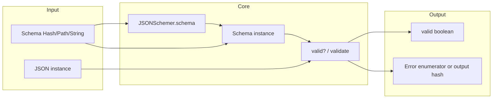
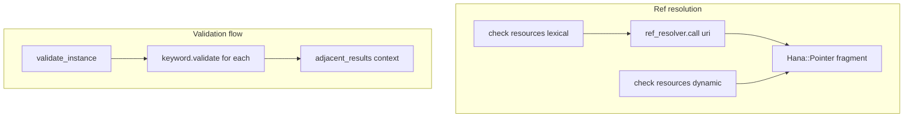

# json_schemer — Research report

## Metadata

- **Library name**: json_schemer
- **Repo URL**: https://github.com/davishmcclurg/json_schemer
- **Clone path**: `research/repos/ruby/davishmcclurg-json_schemer/`
- **Language**: Ruby
- **License**: MIT (see json_schemer.gemspec, LICENSE.txt)

## Summary

json_schemer is a JSON Schema validator for Ruby. It is **validation only**: given a schema and a JSON instance, it reports whether the instance is valid and yields validation errors. It does not generate code from schemas. The library supports Draft 4, Draft 6, Draft 7, Draft 2019-09, Draft 2020-12, OpenAPI 3.0, and OpenAPI 3.1. Validators are selected via `$schema` or the `meta_schema` option. Reference resolution uses a configurable `ref_resolver` (default raises on unknown refs; `'net/http'` or custom procs supported). Validation is lazy and can report all errors; the main entry point is `JSONSchemer.schema(schema)` returning a `Schema` instance, then `schemer.valid?(instance)` or `schemer.validate(instance)`, which returns an enumerator of errors or an output structure (classic, flag, basic, detailed, verbose).

## JSON Schema support

- **Drafts**: Draft 4, Draft 6, Draft 7, Draft 2019-09, Draft 2020-12, OpenAPI 3.0, OpenAPI 3.1. Declared in README and `lib/json_schemer.rb` (`JSONSchemer.draft4`, `draft6`, `draft7`, `draft201909`, `draft202012`, `openapi30`, `openapi31`). Vocabularies are registered in `VOCABULARIES` and keyed by meta-schema ID; `meta_schema` is inferred from `$schema` in the schema.
- **Scope**: Validation only. No code generation.
- **Subset**: For Draft 2020-12, the library implements core, applicator, unevaluated, validation, format-annotation, format-assertion, content, and meta-data vocabularies. Meta-data keywords `title`, `description`, `default`, `deprecated`, `examples` are accepted in schemas but not validated as assertion keywords; `readOnly` and `writeOnly` are implemented and validated when `access_mode` is set. `$schema`, `$id`, `$anchor`, `$dynamicAnchor` are used for meta-schema selection, reference resolution, and lexical/dynamic scope; `$vocabulary` selects keyword vocabularies. Format can be annotation or assertion (configurable per meta-schema).

## Keyword support table

Keyword list derived from vendored draft 2020-12 meta-schemas (`specs/json-schema.org/draft/2020-12/meta/`). Implementation evidence from `lib/json_schemer/draft202012/vocab.rb`, `vocab/core.rb`, `vocab/applicator.rb`, `vocab/validation.rb`, `vocab/unevaluated.rb`, `vocab/format_annotation.rb`, `vocab/format_assertion.rb`, `vocab/content.rb`, `vocab/meta_data.rb`.

| Keyword | Implemented | Notes |
|---------|-------------|-------|
| $anchor | yes | Core::Anchor; registers lexical scope for ref resolution. |
| $comment | yes | Core::Comment; no-op (accepted, not validated). |
| $defs | yes | Core::Defs; parses subschemas; $ref can target definitions. |
| $dynamicAnchor | yes | Core::DynamicAnchor; registers dynamic scope. |
| $dynamicRef | yes | Core::DynamicRef; resolves via dynamic scope. |
| $id | yes | Core::Id; sets base URI and lexical scope. |
| $ref | yes | Core::Ref; resolves via root.resolve_ref. |
| $schema | yes | Core::Schema; selects meta-schema and vocabularies. |
| $vocabulary | yes | Core::Vocabulary; selects keyword vocabularies. |
| additionalProperties | yes | Applicator::AdditionalProperties. |
| allOf | yes | Applicator::AllOf. |
| anyOf | yes | Applicator::AnyOf. |
| const | yes | Validation::Const. |
| contains | yes | Applicator::Contains; minContains/maxContains in Validation. |
| contentEncoding | yes | Content::ContentEncoding; base64 default; custom via content_encodings. |
| contentMediaType | yes | Content::ContentMediaType; application/json default; custom via content_media_types. |
| contentSchema | yes | Content::ContentSchema; validates decoded content. |
| default | partial | MetaData::Default commented out; used by insert_property_defaults only (reads schema default, inserts into instance). |
| dependentRequired | yes | Validation::DependentRequired. |
| dependentSchemas | yes | Applicator::DependentSchemas. |
| deprecated | no | In meta-data vocab; not implemented (commented out in vocab). |
| description | no | Meta-data; accepted but not validated. |
| else | yes | Applicator::Else; conditional with if/then. |
| enum | yes | Validation::Enum; instance must be in array. |
| examples | no | Meta-data; not implemented. |
| exclusiveMaximum | yes | Validation::ExclusiveMaximum. |
| exclusiveMinimum | yes | Validation::ExclusiveMinimum. |
| format | yes | FormatAnnotation::Format or FormatAssertion::Format; configurable, extensible. |
| if | yes | Applicator::If; conditional. |
| items | yes | Applicator::Items; Draft 2020-12 with prefixItems. |
| maxContains | yes | Validation::MaxContains. |
| maximum | yes | Validation::Maximum. |
| maxItems | yes | Validation::MaxItems. |
| maxLength | yes | Validation::MaxLength. |
| maxProperties | yes | Validation::MaxProperties. |
| minContains | yes | Validation::MinContains. |
| minimum | yes | Validation::Minimum. |
| minItems | yes | Validation::MinItems. |
| minLength | yes | Validation::MinLength. |
| minProperties | yes | Validation::MinProperties. |
| multipleOf | yes | Validation::MultipleOf. |
| not | yes | Applicator::Not. |
| oneOf | yes | Applicator::OneOf. |
| pattern | yes | Validation::Pattern; regexp via regexp_resolver (Ruby or ECMA). |
| patternProperties | yes | Applicator::PatternProperties. |
| prefixItems | yes | Applicator::PrefixItems. |
| properties | yes | Applicator::Properties. |
| propertyNames | yes | Applicator::PropertyNames. |
| readOnly | yes | MetaData::ReadOnly; validated when access_mode is set. |
| required | yes | Validation::Required. |
| then | yes | Applicator::Then; conditional with if/else. |
| title | no | Meta-data; accepted but not validated. |
| type | yes | Validation::Type. |
| unevaluatedItems | yes | Unevaluated::UnevaluatedItems. |
| unevaluatedProperties | yes | Unevaluated::UnevaluatedProperties. |
| uniqueItems | yes | Validation::UniqueItems. |
| writeOnly | yes | MetaData::WriteOnly; validated when access_mode is set. |

## Constraints

All validation keywords are enforced at runtime when validating an instance. There is no code generation; constraints (minLength, minimum, pattern, etc.) are applied during validation. The library yields error hashes (or output units) via `validate` enumerator or structured output (classic, flag, basic, detailed, verbose). Format checks are optional and configurable via `format` and `formats`; validators have default format checkers per draft but can disable or extend them.

## High-level architecture

Pipeline: **Schema** (Hash, Pathname, or JSON string) → **JSONSchemer.schema(schema, options)** (resolves input, creates Schema) → **Schema.new(value, ...)** (parses keywords from meta-schema vocabularies) → **Schema#valid?(instance)** or **Schema#validate(instance)** (descends through schema, applies keyword validators, resolves $ref) → **validity boolean** or **error enumerator / output structure**. No code emission; output is validity plus optional errors.

## Medium-level architecture

- **Entry**: `JSONSchemer.schema(schema, **options)` in `json_schemer.rb`: resolves schema (Pathname → file read + CachedResolver for refs; String → JSON.parse; Hash → passthrough), then `Schema.new(schema, **options)`. `meta_schema` is inferred from `$schema` or defaults to draft 2020-12.
- **Schema creation**: `Schema` in `schema.rb` parses value with `parse` (builds keyword instances from vocabulary). Each vocabulary (core, applicator, validation, etc.) maps keyword names to Keyword subclasses. Keywords are applied in vocabulary order.
- **Reference resolution**: `resolve_ref(uri)` in schema.rb: checks `resources[:lexical]` and `resources[:dynamic]`; if missing and URI has no fragment, calls `ref_resolver.call(uri)` to fetch remote schema, wraps in Schema, stores in lexical resources. Fragment pointers resolved via Hana::Pointer. `CachedResolver` wraps resolver procs for caching.
- **Validation loop**: `validate_instance` iterates over parsed keywords, calls each `keyword_instance.validate(...)`, aggregates results. `adjacent_results` passed for keywords that depend on others (e.g. additionalProperties uses properties/patternProperties annotations; unevaluatedItems/unevaluatedProperties use evaluated sets).

## Low-level details

- **Format checkers**: `lib/json_schemer/format.rb` defines procs for date-time, date, time, duration, email, idn-email, hostname, idn-hostname, ipv4, ipv6, uri, uri-reference, iri, iri-reference, uuid, uri-template, json-pointer, relative-json-pointer, regex. Custom formats via `formats` option. Format modules in `format/` (duration, hostname, email, etc.).
- **Content**: `ContentEncoding::BASE64` and `ContentMediaType::JSON` built-in; custom via `content_encodings` and `content_media_types`. ContentSchema validates decoded instance.
- **Regex**: `regexp_resolver` defaults to `'ruby'` (Regexp.new); `'ecma'` uses `EcmaRegexp.ruby_equivalent` for JSON Schema regex compatibility.
- **Error representation**: `Result` struct in result.rb; output formats classic (data_pointer, schema_pointer, type, error), flag (valid), basic (keywordLocation, instanceLocation, errors/annotations), detailed, verbose. Custom errors via `x-error` keyword or I18n.

## Output and integration

- **Vendored vs build-dir**: N/A (no code generation). Validation is in-memory; no file output.
- **API vs CLI**: Library API: `JSONSchemer.schema(schema).valid?(instance)`, `JSONSchemer.schema(schema).validate(instance)`. CLI in `exe/json_schemer`: schema file and data file(s); `--errors MAX`; `-` for stdin.
- **Writer model**: N/A. Validation results returned as hashes or output structures.

## Configuration

- **meta_schema**: Inferred from `$schema` or passed explicitly. Default draft 2020-12.
- **ref_resolver**: Proc or `'net/http'` (cached). Default raises UnknownRef.
- **regexp_resolver**: `'ruby'` or `'ecma'` or proc. Default `'ruby'`.
- **format**: true/false to enable format validation. Default true.
- **formats**: Hash of format name => proc or false (disable).
- **content_encodings**, **content_media_types**: Custom encodings/media types.
- **insert_property_defaults**: true/false/:symbol. Inserts schema `default` into instance.
- **property_default_resolver**: Custom resolver for defaults.
- **before_property_validation**, **after_property_validation**: Hooks.
- **output_format**: classic, flag, basic, detailed, verbose.
- **access_mode**: `'read'` or `'write'` to validate readOnly/writeOnly.
- **resolve_enumerators**: Whether to fully resolve output enumerators.
- **Global config**: `JSONSchemer.configuration` and `JSONSchemer.configure`.

## Pros/cons

- **Pros**: Multiple draft support (4 through 2020-12); OpenAPI 3.0 and 3.1; full vocabulary model with $vocabulary; unevaluatedProperties/unevaluatedItems; content vocabulary (contentEncoding, contentMediaType, contentSchema); format annotation and assertion; readOnly/writeOnly with access_mode; insert_property_defaults; x-error and I18n for custom errors; ECMA regex support; schema bundling; subschema validation via ref; rich output formats; CachedResolver for refs.
- **Cons**: No code generation; meta-data keywords (title, description, deprecated, examples) not validated; default keyword not validated (only used for insert_property_defaults).

## Testability

- **How to run tests**: From repo root, `rake test` or `bin/rake test`. Test files under `test/**/*_test.rb`.
- **Unit tests**: `test/json_schemer_test.rb`, `test/ref_test.rb`, `test/format_test.rb`, `test/output_format_test.rb`, `test/open_api_test.rb`, `test/errors_test.rb`, `test/configuration_test.rb`, `test/pretty_errors_test.rb`, `test/hooks_test.rb`, `test/pointers_test.rb`, etc.
- **Fixtures**: `test/fixtures/draft4.json`, `draft6.json`, `draft7.json`, `draft2019-09.json`, `draft2020-12.json`. JSON-Schema-Test-Suite vendored for compliance.
- **Entry point**: `JSONSchemer.schema(schema).validate(instance)` or `valid?(instance)`.

## Performance

- **Benchmarks**: In `test/performance/benchmark.rb` (benchmark-ips). Compares json_schemer to jschema, json-schema, json_schema, json_validation, rj_schema. Measures initialized vs uninitialized, valid vs invalid, basic vs classic output, to_a resolution.
- **Profile**: `test/performance/profile.rb`.
- **JSON Schema Test Suite benchmark**: `test/performance/benchmark_json_schema_test_suite.rb`.
- **Entry points**: `JSONSchemer.schema(schema)` (one-time) then `schemer.validate(instance)` or `schemer.valid?(instance)`.

## Determinism and idempotency

- **Validation result**: For the same schema and instance, validation outcome is deterministic. Error order follows keyword application order.
- **Idempotency**: N/A (no generated output). Repeated validation with same inputs yields same result.

## Enum handling

- **Implementation**: `Validation::Enum` checks `value.include?(instance)`. No deduplication of schema enum array.
- **Duplicate entries**: Schema can contain duplicate enum values; validation only requires instance to match one.
- **Namespace/case collisions**: Enum values compared by value; distinct values like `"a"` and `"A"` are both allowed. No name mangling (validation only).

## Reverse generation (Schema from types)

No. The library only validates JSON instances against JSON Schema. There is no facility to generate JSON Schema from Ruby types or classes.

## Multi-language output

N/A. The library does not generate code; it only validates. Output is validation result (and errors) in Ruby.

## Model deduplication and $ref/$defs

N/A for code generation. For validation: **$ref** and **$defs** are used for resolution. `resolve_ref` looks up lexical and dynamic resources, fetches remote schemas via ref_resolver when needed, and resolves fragments via Hana::Pointer. Each $ref resolves to a Schema; the same definition can be applied to multiple instance locations. No model deduplication; resolution is by URI/fragment. Schema bundling (`Schema#bundle`) inlines $ref targets into $defs.

## Validation (schema + JSON → errors)

Yes. This is the library's primary function.

- **Inputs**: Schema (Hash, Pathname, or JSON string) and instance (JSON-like Ruby data). Options: meta_schema, ref_resolver, regexp_resolver, format, formats, output_format, access_mode, etc.
- **API**: `JSONSchemer.schema(schema).valid?(instance)` returns boolean. `JSONSchemer.schema(schema).validate(instance)` returns enumerator (classic) or output hash (basic/detailed/verbose). `JSONSchemer.valid_schema?(schema)`, `JSONSchemer.validate_schema(schema)` for schema validation.
- **Output**: Classic: `data`, `data_pointer`, `schema`, `schema_pointer`, `root_schema`, `type`, `error`. Basic: `valid`, `keywordLocation`, `instanceLocation`, `errors`/`annotations`. Custom errors via x-error or I18n.
- **CLI**: `json_schemer <schema> <data>...`; outputs errors as JSON lines; `--errors MAX`; exits non-zero on failure.
