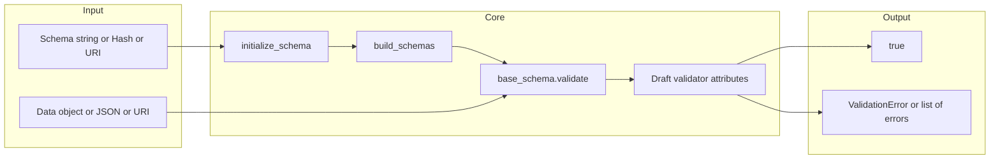

# json-schema (voxpupuli) — Research report

## Metadata

- **Library name**: json-schema (Ruby JSON Schema Validator)
- **Repo URL**: https://github.com/voxpupuli/json-schema
- **Clone path**: `research/repos/ruby/voxpupuli-json-schema/`
- **Language**: Ruby
- **License**: MIT (see LICENSE.md, json-schema.gemspec)

## Summary

voxpupuli/json-schema is a Ruby library that validates JSON-like data (Ruby hashes, arrays, primitives) against a JSON Schema. It does **not** generate code from schemas. The library supports JSON Schema Draft 1 through Draft 6; Draft 4 is the default. Validation is the only concern: given a schema and data, it returns a boolean, raises a `JSON::Schema::ValidationError`, or returns a list of error messages/objects via `JSON::Validator.validate`, `validate!`, and `fully_validate`. Schema and data can be provided as Ruby objects, JSON strings, or file/URI paths. Optional features include schema validation (against the draft meta-schema), fragment validation, insert defaults, and configurable schema reading for `$ref` resolution.

## JSON Schema support

- **Drafts**: Draft 1, Draft 2, Draft 3, Draft 4, Draft 6. Declared in README and implemented as separate validator classes in `lib/json-schema/validators/` (Draft1 through Draft6). Draft 4 is the default (registered as default validator in `validators/draft4.rb`).
- **Scope**: Validation only; no code generation.
- **Draft selection**: The schema’s `$schema` keyword selects the validator via `JSON::Validator.validator_for_uri`; otherwise the `:version` option (e.g. `:draft1`, `:draft2`) or the default validator is used. Meta-schemas live in `resources/` (e.g. `draft-04.json`, `draft-06.json`).
- **Subset**: Applicator and validation keywords are implemented per draft. Meta-data keywords (`title`, `description`, `default`, `examples`) are not validated. Draft-06 `contains` is not implemented. Draft-06 `$id` is not used for scope (only `id` from earlier drafts is used in `schema.rb` for URI resolution).

## Keyword support table

Keyword list derived from vendored draft-04 and draft-06 meta-schemas in this repo (`specs/json-schema.org/draft-04/schema.json`, `specs/json-schema.org/draft-06/schema.json`). Implementation evidence from `lib/json-schema/validators/draft4.rb`, `draft6.rb`, `draft3.rb`, and `lib/json-schema/attributes/`.

| Keyword | Implemented | Notes |
|---------|-------------|-------|
| $id | no | Draft-06; not used. Only `id` (draft-04 style) is used for URI scope in schema.rb. |
| $ref | yes | RefAttribute; resolution via JSON::Validator.schema_for_uri and fragment resolution. |
| $schema | partial | Used to select validator (validator_for_uri); not validated. |
| additionalItems | yes | AdditionalItemsAttribute. |
| additionalProperties | yes | AdditionalPropertiesAttribute. |
| allOf | yes | AllOfAttribute. |
| anyOf | yes | AnyOfAttribute. |
| const | yes | ConstAttribute (Draft 6 only). |
| contains | no | Not in Draft6 validator attributes. |
| default | no | Meta-data; not validated. |
| definitions | no | Container for definitions; no dedicated validator; $ref can target definitions. |
| dependencies | yes | DependenciesV4Attribute (draft4/6), DependenciesAttribute (draft3). |
| description | no | Meta-data; not validated. |
| enum | yes | EnumAttribute; instance must match one of the values (ArraySet for lookup). |
| examples | no | Meta-data; not validated. |
| exclusiveMaximum | yes | Handled inside MaximumAttribute (schema['exclusiveMaximum']). |
| exclusiveMinimum | yes | Handled inside MinimumAttribute (schema['exclusiveMinimum']). |
| format | yes | FormatAttribute; built-in formats (date-time, uri, ipv4, ipv6, etc.); register_format_validator for custom. |
| id | partial | Used in schema.rb for schema URI scope and resolution; not validated. |
| items | yes | ItemsAttribute. |
| maximum | yes | MaximumAttribute. |
| maxItems | yes | MaxItemsAttribute. |
| maxLength | yes | MaxLengthAttribute. |
| maxProperties | yes | MaxPropertiesAttribute. |
| minimum | yes | MinimumAttribute. |
| minItems | yes | MinItemsAttribute. |
| minLength | yes | MinLengthAttribute. |
| minProperties | yes | MinPropertiesAttribute. |
| multipleOf | yes | MultipleOfAttribute (draft4/6); DivisibleByAttribute in draft2. |
| not | yes | NotAttribute. |
| oneOf | yes | OneOfAttribute. |
| pattern | yes | PatternAttribute. |
| patternProperties | yes | PatternPropertiesAttribute. |
| properties | yes | PropertiesV4Attribute (draft4/6); PropertiesAttribute (draft3); PropertiesOptionalAttribute (draft1/2). |
| propertyNames | yes | PropertyNames (Draft 6 only). |
| required | yes | RequiredAttribute. |
| title | no | Meta-data; not validated. |
| type | yes | TypeV4Attribute (draft3–6); TypeAttribute (draft1/2). |
| uniqueItems | yes | UniqueItemsAttribute. |

## Constraints

All validation keywords are enforced at runtime when validating an instance. There is no code generation; constraints (minLength, minimum, pattern, maxItems, etc.) are applied during validation. The validator iterates over the schema’s attributes and invokes the corresponding attribute class (e.g. MinLengthAttribute, PatternAttribute). Format checks are applied when the `format` keyword is present; built-in and custom format validators can be registered. Options such as `:strict` (all properties required, no additional properties) and `:allPropertiesRequired` / `:noAdditionalProperties` further constrain object validation.

## High-level architecture

Pipeline: **Schema** (string, Hash, or path/URI) and **Data** (Ruby object, JSON string, or path/URI) → **JSON::Validator.new(schema, opts)** (parse schema via initialize_schema, build_schemas to load $refs and register schemas with IDs) → **validator.validate(data)** (base_schema.validate(data, fragments, error_recorder, validation_options)) → **Validator** (draft-specific) iterates schema attributes and runs each attribute’s validate → result is **true** or **validation_error** (raise or recorded). Optional: validate_schema option validates the schema against the draft meta-schema first; fragment option validates only a JSON Pointer fragment of the schema.

## Medium-level architecture

- **Entry**: `JSON::Validator.validate(schema, data, opts)` returns boolean (rescues validation errors); `JSON::Validator.validate!(schema, data, opts)` raises on failure; `JSON::Validator.fully_validate(schema, data, opts)` uses `record_errors: true` and returns an array of error strings (or hashes with `errors_as_objects: true`). Each method builds a new `JSON::Validator` with `new(schema, opts)` and calls `validator.validate(data)`.
- **Schema initialization**: `initialize_schema(schema_data, default_validator)` accepts a String (parsed as JSON or treated as path/URI and read via schema_reader), or a Hash. Schemas are wrapped in `JSON::Schema.new(schema, uri, validator)`; `id` on the schema sets the schema’s URI for resolution. Schemas with an `id` are registered via `JSON::Validator.add_schema(schema)`; the key is the normalized URI (with trailing `#`).
- **build_schemas**: Walks the schema and for each `$ref`, `extends`, union types (type/disallow arrays), definitions, properties, patternProperties, additionalProperties, additionalItems, dependencies, extends, allOf, anyOf, oneOf, not, and items, either loads remote schemas via `load_ref_schema` (which uses `schema_reader.read(schema_uri)` and adds the schema) or creates local `JSON::Schema` instances and recursively builds. This populates the global schema cache used by $ref resolution.
- **Validation loop**: `Schema::Validator#validate(current_schema, data, fragments, processor, options)` iterates `current_schema.schema.each` and for each key that exists in the validator’s `@attributes` hash, calls the attribute’s `.validate(current_schema, data, fragments, processor, validator, options)`. Attributes raise `JSON::Schema::ValidationError` or call `validation_error(processor, ...)` when `record_errors` is set.
- **$ref resolution**: `RefAttribute.get_referenced_uri_and_schema` normalizes the ref with `JSON::Util::URI.normalize_ref`, takes the scheme+host+path (plus `#`) as the schema key, retrieves the referenced schema from `JSON::Validator.schema_for_uri(schema_key)`, then resolves the fragment (JSON Pointer style) on that schema’s hash to get the target subschema, and returns a new `JSON::Schema` for that subschema. Resolution is thus by pre-loaded schemas (and schema_reader for loading from file/URI).

```mermaid
flowchart TB
  subgraph refResolution [Ref resolution]
    NormalizeRef[normalize_ref ref with base URI]
    SchemaKey[schema_key base + fragment]
    SchemaForUri[schema_for_uri from cache]
    FragmentResolve[Resolve fragment on schema hash]
    NewSchema[JSON::Schema.new target]
    NormalizeRef --> SchemaKey
    SchemaKey --> SchemaForUri
    SchemaForUri --> FragmentResolve
    FragmentResolve --> NewSchema
  end
  subgraph validationFlow [Validation flow]
    ValidateEntry[validate data]
    EachAttr[current_schema.schema.each]
    AttrDispatch[attributes attr_name validate]
    ValidateEntry --> EachAttr
    EachAttr --> AttrDispatch
  end
```

## Low-level details

- **Numeric limits**: `MaximumAttribute` and `MinimumAttribute` extend `NumericLimitAttribute` and use `exclusive?(schema)` for `exclusiveMaximum` / `exclusiveMinimum`. Draft 1/2 use `MaximumInclusiveAttribute` / `MinimumInclusiveAttribute` and `MaxDecimalAttribute` / `DivisibleByAttribute` where applicable.
- **Enum**: Stored as `ArraySet` (subclass of Array with Set-backed lookup) in `build_schemas` for faster `include?` during validation. EnumAttribute checks `enum.include?(data)`.
- **Error recording**: When `record_errors: true`, the validator is wrapped in `ErrorRecorder` (SimpleDelegator); attribute validators call `validation_error(processor, message, fragments, current_schema, self, options[:record_errors])`, which pushes a `ValidationError` onto the recorder. `fully_validate` returns `error_recorder.validation_errors` as strings or hashes (`to_hash` gives schema, fragment, message, failed_attribute).

## Output and integration

- **Vendored vs build-dir**: Not applicable (no code generation). Validation is in-memory; no generated files.
- **API vs CLI**: Library only. No CLI in the repo. API: `JSON::Validator.validate`, `validate!`, `fully_validate`, and variants (`validate_json`, `validate_uri`, `fully_validate_schema`, etc.). Instantiate `JSON::Validator.new(schema, opts)` for repeated validation with the same schema.
- **Writer model**: Not applicable. Output is return value (true/false) or error list / raised exception.

## Configuration

- **Version / draft**: `:version` option (e.g. `:draft1`, `:draft2`, `:draft4`, `:draft6`) or `$schema` in the schema. Default validator is Draft 4.
- **Schema reader**: `:schema_reader` option or `JSON::Validator.schema_reader`; default is `JSON::Schema::Reader.new`. Reader supports `accept_uri` and `accept_file` (callables or booleans) to control loading of $ref targets from URIs or files.
- **Validation options**: `:list` (validate array of items each against schema), `:fragment` (JSON Pointer fragment of schema), `:validate_schema` (validate schema against meta-schema first), `:insert_defaults` (fill in default values from schema), `:strict` (all properties required, no additional properties), `:allPropertiesRequired`, `:noAdditionalProperties`, `:record_errors` (for fully_validate), `:errors_as_objects` (return hashes), `:clear_cache`, `:parse_data`, `:parse_integer`.
- **Formats**: Per-validator default formats (date-time, uri, ipv4, ipv6, etc.); `JSON::Validator.register_format_validator(format, proc, versions)` and `deregister_format_validator` / `restore_default_formats`.
- **JSON backend**: Optional MultiJson or built-in json/yajl for parsing (JSON::Validator.parse).

## Pros/cons

- **Pros**: Multiple draft support (1–6); simple API (validate, validate!, fully_validate); optional schema validation and fragment validation; configurable schema reader for $ref; insert defaults; strict mode; custom format validators; error messages with fragment paths and failed_attribute; optional error list as hashes for programmatic use.
- **Cons**: No code generation; no CLI; Draft 6 `contains` and `$id` not implemented; no Draft 2019-09 or 2020-12; meta-data keywords not validated; global schema cache (class variables) for ref resolution.

## Testability

- **Framework**: Minitest. Test setup in `test/support/test_helper.rb` (minitest/autorun, minitest/reporters, webmock/minitest).
- **Tests**: `test/*_test.rb` (e.g. draft4_test.rb, draft6_test.rb, ref_test.rb). Fixtures in `test/schemas/`, `test/data/`. Optional JSON Schema test suite via git submodule `test/test-suite` (see `test/common_test_suite_test.rb`); update with `rake update_common_tests`.
- **Run**: `bundle exec rake test` or `rake` (default task is `:test`). CI (`.github/workflows/test.yml`) runs `bundle exec rake` with matrix (e.g. rubocop, test).

## Performance

- **Benchmarks**: None found in the repo. No benchmark or Benchmark usage.
- **Entry points**: For future benchmarking: `JSON::Validator.new(schema, opts)` then `validator.validate(data)`; or one-shot `JSON::Validator.validate(schema, data)` / `JSON::Validator.fully_validate(schema, data, record_errors: true)`.

## Determinism and idempotency

- **Validation result**: For the same schema and data, validation outcome is deterministic. Error order from `fully_validate` depends on the order of attribute application and recursion (schema key order).
- **Idempotency**: Not applicable (no generated output). Repeated validation with the same inputs yields the same result.

## Enum handling

- **Implementation**: EnumAttribute validates that the instance equals one of the values in the schema’s `enum` array. The schema’s `enum` is replaced with an `ArraySet` in `build_schemas` for O(1) lookup; `ArraySet` uses a Set for membership and preserves array order for schema structure.
- **Duplicate entries**: The meta-schema requires unique enum items, but the library does not explicitly reject duplicate enum values in the schema. Duplicate values in the array would both match the same instance value; the Set inside ArraySet would deduplicate for lookup, so behavior is consistent. No explicit dedupe or error for duplicates in the report’s code/tests.
- **Namespace/case collisions**: Enum comparison is by value (e.g. `include?`). Distinct values such as `"a"` and `"A"` are both allowed and validated independently. No name mangling (validation only).

## Reverse generation (Schema from types)

No. The library only validates data against JSON Schema. There is no facility to generate JSON Schema from Ruby types or classes.

## Multi-language output

Not applicable. The library does not generate code; it only validates. Output is validation result (and errors) in Ruby.

## Model deduplication and $ref/$defs

Not applicable for code generation. For validation: **$ref** is resolved by URI (and fragment). Schemas are loaded and registered by normalized URI (scheme + host + path + `#`). Definitions are not merged or deduplicated; they are simply schemas keyed under `definitions` and referenced by $ref. The same resolved schema can be applied multiple times at different instance paths. There is no “model” to deduplicate; resolution is by cache lookup and fragment resolution.

## Validation (schema + JSON → errors)

Yes. This is the library’s primary function.

- **Inputs**: Schema (Ruby Hash, JSON string, or file/URI path) and data (Ruby object, JSON string, or file/URI path). Optional options hash (`:version`, `:schema_reader`, `:validate_schema`, `:fragment`, `:record_errors`, `:errors_as_objects`, etc.).
- **API**: `JSON::Validator.validate(schema, data, opts)` returns true/false (rescues errors). `JSON::Validator.validate!(schema, data, opts)` validates and raises `JSON::Schema::ValidationError` on first failure. `JSON::Validator.fully_validate(schema, data, opts)` returns an array of error strings (or hashes when `errors_as_objects: true`). Instance API: `JSON::Validator.new(schema, opts).validate(data)`.
- **Output**: `JSON::Schema::ValidationError` with message, fragments (path), schema, failed_attribute, sub_errors. `to_string` / `to_hash` for human-readable or structured output. Error message includes schema URI and fragment (e.g. `#/a`).
