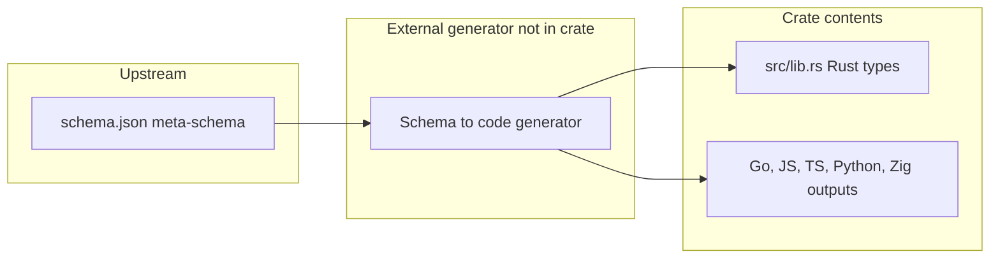
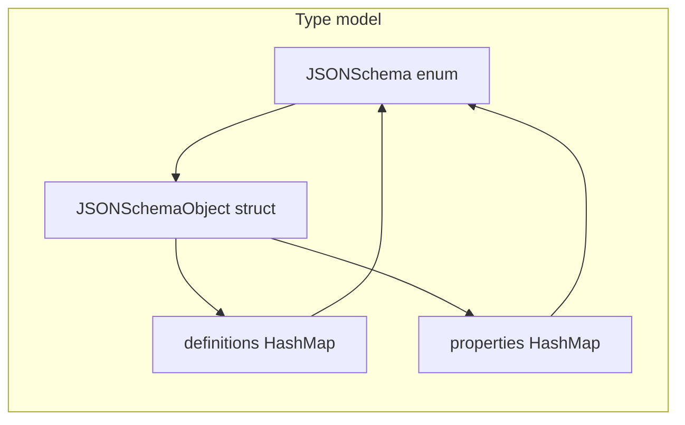

# json_schema — Research report

## Metadata

- **Library name**: json_schema
- **Repo URL**: https://crates.io/crates/json_schema (no public repository listed)
- **Clone path**: `research/repos/rust/BelfordZ-json-schema/`
- **Language**: Rust
- **License**: Apache-2.0

**Note**: The crate has no repository URL on crates.io. The clone path contains the published crate contents (crates.io tarball 1.8.0) extracted for analysis.

## Summary

The json_schema crate provides Rust types that model the JSON Schema meta-schema: it is the **generated artifact** of a schema-to-code pipeline rather than a codegen tool itself. The generator that produced this crate is not included in the package; the package contains the meta-schema (`schema.json`), the generated Rust library (`src/lib.rs`), and generated outputs for other languages (Go, JavaScript, TypeScript, Python, Zig) from the same upstream. Users consume the crate to parse, build, and serialize JSON Schema documents as Rust structs (e.g. `JSONSchemaObject`, `JSONSchema` enum) with serde and an optional builder (derive_builder). The crate does not accept an arbitrary user schema and generate types; it fixes a single meta-schema and exposes it as Rust types.

## JSON Schema support

- **Draft**: The bundled `schema.json` uses `$schema: "https://meta.json-schema.tools/"` and a draft-07–style structure: `definitions` (not `$defs`), and keywords such as `additionalItems`, `dependencies`, `patternProperties`, `propertyNames`, `if`/`then`/`else`, `contentMediaType`/`contentEncoding`. It does not target JSON Schema 2020-12 (no `$defs`, `prefixItems`, `unevaluatedProperties`/`unevaluatedItems`, etc.).
- **Scope**: Single meta-schema only. The Rust types in `src/lib.rs` mirror that meta-schema’s object shape: every keyword present in the meta-schema is represented as an optional field on `JSONSchemaObject` or a related type. There is no support for validating JSON instance data against a schema; the crate only represents schema documents in memory.

## Keyword support table

Keyword list derived from vendored draft 2020-12 meta-schemas under `specs/json-schema.org/draft/2020-12/meta/`. The crate implements a draft-07–style meta-schema; “Implemented” indicates whether the Rust type model includes that keyword (as a field or equivalent). Keywords not present in the crate’s schema or `JSONSchemaObject` are “no”.

| Keyword | Implemented | Notes |
|---------|-------------|-------|
| $anchor | no | Not in schema or struct. |
| $comment | yes | `comment: Option<Comment>` on `JSONSchemaObject`. |
| $defs | no | Crate uses draft-07 `definitions`; no `$defs` field. |
| $dynamicAnchor | no | Not in schema or struct. |
| $dynamicRef | no | Not in schema or struct. |
| $id | yes | `id: Option<Id>` (serde rename `$id`). |
| $ref | yes | `_ref: Option<Ref>` (serde rename `$ref`). |
| $schema | yes | `schema: Option<Schema>` (serde rename `$schema`). |
| $vocabulary | no | Not in schema or struct. |
| additionalProperties | yes | `additional_properties: Option<Box<JSONSchema>>`. |
| allOf | yes | `all_of: Option<SchemaArray>`. |
| anyOf | yes | `any_of: Option<SchemaArray>`. |
| const | yes | `_const: Option<serde_json::Value>`. |
| contains | yes | `contains: Option<Box<JSONSchema>>`. |
| contentEncoding | yes | `content_encoding: Option<ContentEncoding>`. |
| contentMediaType | yes | `content_media_type: Option<ContentMediaType>`. |
| contentSchema | no | Not in schema or struct. |
| default | yes | `_default: Option<serde_json::Value>`. |
| dependentRequired | no | Not in schema; crate has draft-07 `dependencies`. |
| dependentSchemas | no | Not in schema or struct. |
| deprecated | no | Not in schema or struct. |
| description | yes | `description: Option<Description>`. |
| else | yes | `_else: Option<Box<JSONSchema>>`. |
| enum | yes | `_enum: Option<Enum>`. |
| examples | yes | `examples: Option<Examples>`. |
| exclusiveMaximum | yes | `exclusive_maximum: Option<ExclusiveMaximum>`. |
| exclusiveMinimum | yes | `exclusive_minimum: Option<ExclusiveMinimum>`. |
| format | yes | `format: Option<Format>`. |
| if | yes | `_if: Option<Box<JSONSchema>>`. |
| items | yes | `items: Option<Items>` (single schema or array). |
| maxContains | no | Not in schema or struct. |
| maximum | yes | `maximum: Option<Maximum>`. |
| maxItems | yes | `max_items: Option<NonNegativeInteger>`. |
| maxLength | yes | `max_length: Option<NonNegativeInteger>`. |
| maxProperties | yes | `max_properties: Option<NonNegativeInteger>`. |
| minContains | no | Not in schema or struct. |
| minimum | yes | `minimum: Option<Minimum>`. |
| minItems | yes | `min_items: Option<NonNegativeIntegerDefaultZero>`. |
| minLength | yes | `min_length: Option<NonNegativeIntegerDefaultZero>`. |
| minProperties | yes | `min_properties: Option<NonNegativeIntegerDefaultZero>`. |
| multipleOf | yes | `multiple_of: Option<MultipleOf>`. |
| not | yes | `not: Option<Box<JSONSchema>>`. |
| oneOf | yes | `one_of: Option<SchemaArray>`. |
| pattern | yes | `pattern: Option<Pattern>`. Schema model only; no validator or codegen. *json-schema-rs* implements pattern in schema model, validator (regress), and codegen/reverse (attribute for round-trip). |
| patternProperties | yes | `pattern_properties: Option<PatternProperties>`. |
| prefixItems | no | Not in schema or struct (draft-07 uses `items` only). |
| properties | yes | `properties: Option<Properties>`. |
| propertyNames | yes | `property_names: Option<Box<JSONSchema>>`. |
| readOnly | yes | `read_only: Option<ReadOnly>`. |
| required | yes | `required: Option<StringArray>`. |
| then | yes | `then: Option<Box<JSONSchema>>`. |
| title | yes | `title: Option<Title>`. |
| type | yes | `_type: Option<Type>` (simple or array of simple types). |
| unevaluatedItems | no | Not in schema or struct. |
| unevaluatedProperties | no | Not in schema or struct. |
| uniqueItems | yes | `unique_items: Option<UniqueItems>`. |
| writeOnly | no | Not in schema or struct. |

## Constraints

The crate does not enforce any validation constraints. It only provides a data model for JSON Schema documents: users can deserialize a schema from JSON into `JSONSchemaObject` / `JSONSchema` or build one with `JSONSchemaObjectBuilder`. Keywords such as `minimum`, `maxLength`, or `pattern` are stored as optional fields; there is no runtime that checks a JSON instance against these constraints. Constraint semantics are not implemented.

## High-level architecture

The crate is a **consumable artifact** of an external codegen pipeline. The pipeline itself is not in this package.

- **Upstream**: A single JSON Schema meta-schema (draft-07 style) is maintained as `schema.json` (and in `src/schema.json`).
- **Generator**: A separate build process (not present in the extracted crate) takes that schema and emits typed code for multiple languages. The crate’s README references npm `@json-schema-tools/meta-schema` and Go `github.com/json-schema-tools/meta-schema`; the Rust crate is the Rust output of that same ecosystem.
- **Rust artifact**: Generated `src/lib.rs` defines types (`JSONSchema`, `JSONSchemaObject`, `JSONSchemaBoolean`, and supporting types) that mirror the meta-schema, with serde and derive_builder. No parsing of arbitrary user schemas or emission of new code happens inside the crate.

So within the crate there is no “parse schema → intermediate → emit code” pipeline; there is only the vendored generated code and the bundled schema.

## Medium-level architecture

- **Modules**: Single library crate; `src/lib.rs` holds all public types. No separate modules for ref resolution or expansion; the type system directly models the meta-schema.
- **Schema representation**: `JSONSchema` is an untagged enum: `JSONSchemaObject(JSONSchemaObject)` or `JSONSchemaBoolean(bool)`. `JSONSchemaObject` has optional fields for each keyword, with serde renames for `$id`, `$schema`, `$ref`, `$comment`, `default`, `readOnly`, and camelCase keywords. Nested schemas use `Box<JSONSchema>` or `Vec<JSONSchema>` (e.g. `SchemaArray` for `allOf`/`anyOf`/`oneOf`). `Definitions` and `Properties` are `HashMap<String, JSONSchema>`.
- **$ref / definitions**: Refs are not resolved by this crate. `$ref` is a string field (`_ref`); `definitions` is a map of name → schema. The crate does not resolve references or merge subschemas; it only stores and serializes them. No resolution diagram is needed—there is no resolution logic.

## Low-level details

- **Naming**: Rust fields use snake_case; serde renames map JSON keys (`$id` → `id`, `$ref` → `_ref`, `readOnly` → `read_only`, etc.). Reserved words use a leading underscore (`_type`, `_enum`, `_const`, `_default`, `_if`, `_else`).
- **Items**: Represented as `enum Items { JSONSchema(Box<JSONSchema>), SchemaArray(SchemaArray) }` for single-schema or array-of-schemas (draft-07 style).
- **Dependencies**: Draft-07 `dependencies` as `HashMap<String, DependenciesSet>` where `DependenciesSet` is either a schema or a string array (no 2020-12 `dependentRequired`/`dependentSchemas`).

## Output and integration

- **Vendored vs build-dir**: The Rust code is vendored in the crate (`src/lib.rs`). There is no build-time codegen in this crate (no `build.rs`). The generator that produced it runs elsewhere; this package is the published output.
- **API vs CLI**: Library only. Public API: `serde_json::from_str` / `from_slice` to deserialize a schema, `JSONSchemaObjectBuilder` to build one, `serde_json::to_string` to serialize. No CLI in this crate.
- **Writer model**: No custom writer. Serialization is via serde to string or bytes; the crate does not write files.

## Configuration

- **Cargo**: No optional features. Dependencies: `serde` (derive), `serde_json`, `derive_builder`.
- **Naming / map types**: Fixed. `Properties`, `Definitions`, `PatternProperties`, `Dependencies` are standard library `HashMap<String, …>`. No configuration for map type or naming conventions.
- **Optional deps**: None; the crate does not pull in uuid, chrono, or other format-specific crates.

## Pros/cons

- **Pros**: Simple, dependency-light way to work with JSON Schema documents in Rust; builder pattern for constructing schemas; serde round-trip; same meta-schema available in multiple languages from the same upstream.
- **Cons**: Not a general schema-to-code generator—only the one meta-schema is represented; no validation of instances; no ref resolution or expansion; draft-07 only (no 2020-12 `$defs`, `prefixItems`, unevaluated*, etc.); generator source and pipeline not in the crate.

## Testability

- **Tests**: `tests/integration_test.rs` contains integration tests: build and serialize a schema, deserialize from string, deserialize boolean schema, deserialize nested schema with properties. No unit tests in `src/`.
- **Running tests**: From the clone path, `cargo test`.
- **Fixtures**: Tests use inline JSON strings; no separate fixture files. The crate does not ship test schemas for arbitrary codegen; it tests the fixed meta-schema types only.

## Performance

No benchmarks or performance documentation in the crate. Entry point for any future benchmarking would be deserialize/serialize of schema JSON (e.g. `serde_json::from_str` / `to_string` on `JSONSchema`). The crate does not perform code generation.

## Determinism and idempotency

Not applicable. The crate does not generate code; it is a fixed, generated artifact. The determinism of the external generator that produced `lib.rs` cannot be inferred from the crate contents. Unknown.

## Enum handling

The crate does not generate Rust enums from a schema’s `enum` keyword. It exposes the `enum` keyword as a data field: `_enum: Option<Enum>` where `Enum = Vec<serde_json::Value>`. So duplicate enum entries (e.g. `["a", "a"]`) or case collisions (e.g. `"a"` and `"A"`) are representable as-is in the type; there is no codegen step that would dedupe or produce variant names. Enum handling for “duplicate entries” and “namespace/case collisions” is therefore N/A for codegen; the library simply stores the JSON array. Unknown with respect to a codegen-style enum strategy.

## Reverse generation (Schema from types)

No. The crate only provides types to parse and build JSON Schema documents. There is no API to generate a JSON Schema from Rust structs or other types.

## Multi-language output

The **package** includes generated outputs for multiple languages (Rust in `src/lib.rs`, Go in `json_schema.go`, JavaScript in `index.js`, TypeScript in `index.d.ts`, Python in `index.py`, Zig under `zig/`). These are all generated from the same meta-schema by the same external tooling. The Rust crate itself is the Rust slice of that multi-language release; it does not emit non-Rust code. So multi-language output is provided at the **upstream project** level (one schema → many language artifacts), not by this crate at runtime.

## Model deduplication and $ref/$defs

The crate does not deduplicate types or resolve `$ref`/`$defs`. It stores `$ref` as a string and `definitions` as a map; each use of a definition is just a `JSONSchema` value in the map or in nested structures. There is no “model” deduplication—the type system is the single `JSONSchemaObject` plus nested `JSONSchema` values. Reusing the same definition in multiple places is represented by multiple `JSONSchema` values that may be structurally equal; the crate does not merge or dedupe them. Not applicable (no codegen or ref resolution).

## Validation (schema + JSON → errors)

No. The crate does not validate a JSON payload against a JSON Schema. It only parses and serializes schema documents. There is no API that takes a schema and an instance and returns validation errors. Users can combine this crate with a separate validator if they need instance validation.
