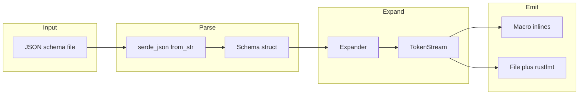
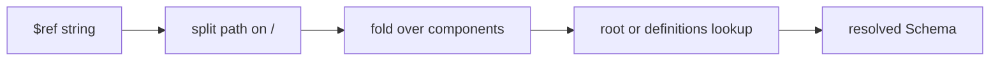
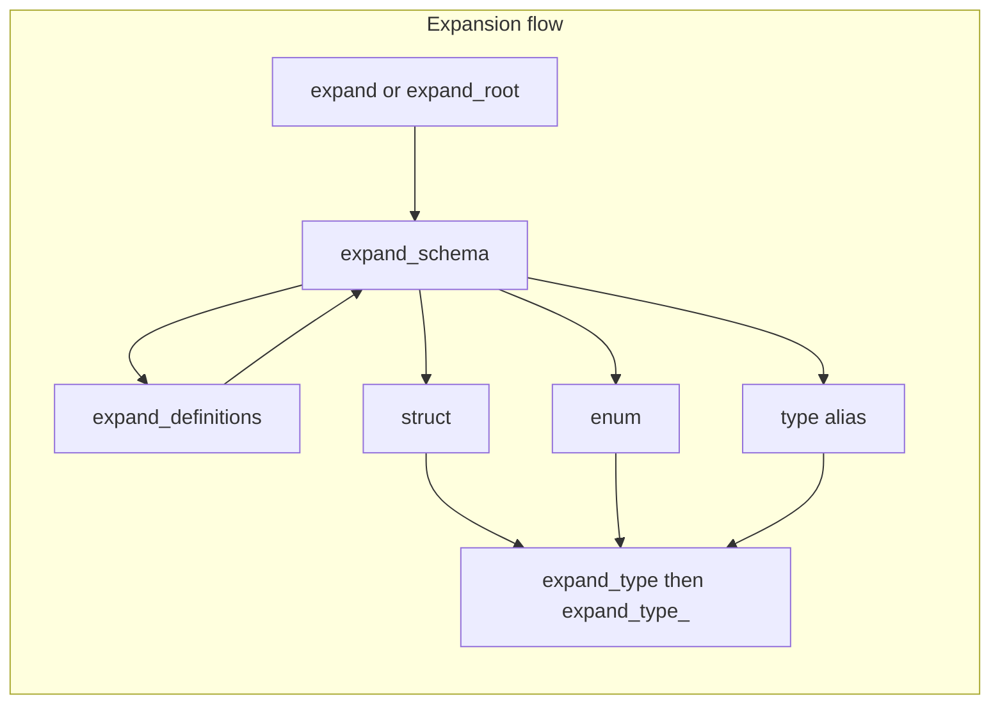

# schemafy — Research report

## Metadata

- **Library name**: schemafy
- **Repo URL**: https://github.com/Marwes/schemafy
- **Clone path**: `research/repos/rust/Marwes-schemafy/`
- **Language**: Rust
- **License**: MIT

## Summary

schemafy is a Rust crate that takes a JSON Schema (draft 4) and generates Rust types that are serializable with serde. Code generation is structure-only: it does not enforce validation keywords (e.g. minLength, minimum) in generated code or at runtime. The crate can be used at build time via a procedural macro or a builder API, and optionally via a CLI. Generated code is emitted as token streams and can be written to files or inlined by the macro. The library bootstraps itself by generating its own schema types from the JSON Schema meta-schema.

## JSON Schema support

- **Draft**: Draft 4 only (README and docs state "JSON schema (draft 4)").
- **Scope**: Structure-oriented subset. The schema is parsed into an internal `Schema` type (generated from the draft-04 meta-schema). References (`$ref`) and `definitions` are resolved; combinators (`allOf`, `anyOf`, `oneOf`) and structural keywords (`type`, `properties`, `items`, etc.) drive codegen. Validation keywords (e.g. `multipleOf`, `maxLength`, `minItems`) are not enforced in generated types. No support for draft 2019-09 or 2020-12.

## Keyword support table

Keyword list derived from vendored draft-04 meta-schema: `specs/json-schema.org/draft-04/schema.json` (properties keys). Note: schemafy also resolves `$ref` and uses `definitions` for reference resolution; `$ref` is not a property in the vendored draft-04 core meta-schema, so it is not listed as a row below.

| Keyword | Implemented | Notes |
|---------|-------------|-------|
| $schema | no | Parsed but not used for codegen. |
| additionalItems | no | Not used in expand/codegen. |
| additionalProperties | yes | Object with schema → `BTreeMap<String, T>`; `false` → struct with optional `#[serde(deny_unknown_fields)]`. |
| allOf | yes | Merged via `merge_all_of` (properties, required, description, ref_, type_). |
| anyOf | partial | Special case: two branches with one array of same item type → `Vec<T>` with one-or-many serde; otherwise → `serde_json::Value`. |
| default | partial | Used only for `#[serde(default)]` and `Default` derive when applicable (e.g. optional fields, empty object default); actual default value not emitted. |
| definitions | yes | Resolved via `schema_ref`; each definition expanded to a named type. |
| dependencies | no | Parsed but not used for codegen. |
| description | yes | Emitted as `///` doc comments on structs and fields. |
| enum | yes | Generates Rust enum with serde (and optionally `Serialize_repr`/`Deserialize_repr` for integer variants). Extension `enumNames` supported for variant names. |
| exclusiveMaximum | no | Not used for codegen. |
| exclusiveMinimum | no | Not used for codegen. |
| format | no | Not used for codegen. |
| id | yes | Used in oneOf variant naming when present. |
| items | yes | Array type → `Vec<T>`; first item schema used for element type. |
| maximum | no | Not used for codegen. |
| maxItems | no | Not used for codegen. |
| maxLength | no | Not used for codegen. |
| maxProperties | no | Not used for codegen. |
| minimum | no | Not used for codegen. |
| minItems | no | Not used for codegen. |
| minLength | no | Not used for codegen. |
| minProperties | no | Not used for codegen. |
| multipleOf | no | Not used for codegen. |
| not | no | Parsed but not used in expand. |
| oneOf | yes | Generates untagged enum of variant types; supports refs and inline schemas. |
| pattern | no | Not used for codegen. |
| patternProperties | partial | Only affects whether `#[serde(deny_unknown_fields)]` is emitted when combined with `additionalProperties: false`; no map-from-pattern codegen. |
| properties | yes | Drives struct fields; field names and optional/required handled. |
| required | yes | Non-required fields emitted as `Option<T>`; `skip_serializing_if="Option::is_none"` added. |
| title | no | Not used for codegen. |
| type | yes | Maps to Rust types (string, integer, boolean, number, object, array, null); multiple types and null handled. |
| uniqueItems | no | Not used for codegen. |

## Constraints

Validation keywords are not enforced. The README states: "No checking such as min_value are done but instead only the structure of the schema is followed as closely as possible." In the code, keywords such as `multipleOf`, `maximum`, `minimum`, `maxLength`, `minLength`, `maxItems`, `minItems`, `pattern`, `uniqueItems`, `dependencies`, etc. are not read when generating types. Generated Rust types rely on serde for (de)serialization only; there is no runtime validation layer.

## High-level architecture

- **Input**: JSON schema file (path provided to macro, builder, or CLI).
- **Parse**: Schema is read from disk and deserialized with `serde_json` into a `Schema` struct (generated from the draft-04 meta-schema in `schemafy_lib/src/schema.json` → `schemafy_lib/src/schema.rs`).
- **Expand**: `Expander` in `schemafy_lib` walks the schema, resolves references and `allOf`, and produces a list of type definitions as `proc_macro2::TokenStream`s.
- **Emit**: Token streams are either returned (macro, API) or written to a file and passed through `rustfmt` (builder `generate_to_file`, CLI).

Main components:

- **schemafy_core**: Minimal support crate (e.g. `one_or_many` for items that can be single value or array).
- **schemafy_lib**: Core codegen: `Schema` type, `Generator`/`GeneratorBuilder`, `Expander`; emits Rust code via `quote`.
- **schemafy (root crate)**: Proc macro `schemafy!` and optional CLI binary; depends on schemafy_lib and schemafy_core.
- **build.rs**: When feature `internal-regenerate` is set, generates `schemafy_lib/src/schema.rs` from `schemafy_lib/src/schema.json`.

## Medium-level architecture

- **Schema representation**: `Schema` in `schemafy_lib/src/schema.rs` mirrors the draft-04 meta-schema (properties, definitions, ref_, type_, enum_, all_of, any_of, one_of, items, etc.). It is deserialized from JSON; no separate IR.

- **$ref / definitions resolution**: `Expander::schema_ref` resolves a reference string by splitting on `/` and walking the root schema: empty or `#` → root; component `definitions` → stay on current schema; otherwise lookup in `schema.definitions`. Resolved schema is used for merging (allOf) or type expansion. Fragment-only refs (e.g. `#/definitions/Foo`) are supported; `type_ref` uses URI fragment or last path component for the Rust type name (with PascalCase and identifier sanitization).

- **Expansion flow**: `expand` (or `expand_root`) calls `expand_schema` for the root or iterates definitions. `expand_schema` first expands nested definitions, then either: (1) struct (from properties / additionalProperties: false), (2) enum (from enum), or (3) type alias. Field types come from `expand_type` → `expand_type_`, which handles ref_, anyOf (special one-or-many), oneOf, multi-type with null, and single type (string, integer, boolean, number, object, array). Recursive types get `Box<T>`. `allOf` is merged before this so that properties/required/type are combined into one schema view.

- **Naming**: Inflector used for PascalCase/snake_case; Rust keywords and invalid identifiers are escaped (e.g. trailing underscore, serde rename). Type names for inline objects use current type name + field name in PascalCase.

## Low-level details

- **one_or_many**: For `items` (and anyOf’s one-or-many case), schemafy uses a custom serde `one_or_many` (schemafy_core) so a single value deserializes as a one-element Vec; used for JSON Schema’s "single schema or array of schemas" style.
- **enum**: Supports string and integer enums; optional `enumNames` (non-standard) for variant names. Null in enum makes the generated type an `Option<InnerEnum>`.
- **Writer model**: Code is generated as `TokenStream`; `generate_to_file` writes `tokens.to_string()` to a path then runs `rustfmt` on it. No generic `Write` abstraction; the proc macro inlines the token stream into the crate.

## Output and integration

- **Vendored vs build-dir**: Generated code can be written to any path. The bootstrap output `schemafy_lib/src/schema.rs` is checked in. User projects typically generate at build time via the macro (no separate file) or via CLI/build script to a chosen path.
- **API vs CLI**: (1) **Proc macro** `schemafy!(root: Name "path/to/schema.json")` or `schemafy!("path/to/schema.json")` — expands at compile time and inlines types. (2) **Library API**: `schemafy_lib::Generator::builder().with_root_name_str(...).with_input_file(...).build().generate()` returns `TokenStream`; `.generate_to_file(path)` writes and runs rustfmt. (3) **CLI** (feature `tool`): `schemafy` binary with `--root`, `--output`, and schema path; writes formatted code to file or stdout.
- **Writer model**: File path or token stream only; no generic `Write` or `Vec<u8>`/`String` API. CLI uses temp file then rustfmt to stdout or a file.

## Configuration

- **Generator**: Root type name (optional), schema path, and `schemafy_path` (module path for schemafy_core, default `"::schemafy_core::"`).
- **Naming**: Inflector for PascalCase/snake_case; keyword and identifier sanitization; serde `rename` for non-identifiers.
- **Map types**: Objects with additionalProperties (schema or true) → `BTreeMap<String, T>` (or `serde_json::Value`); no HashMap or configurable map type.
- **Optional deps**: `anyhow`, `structopt`, `tempfile` for CLI; `serde_repr` for integer enums. No uuid/chrono/decimal in core.
- **Features**: `internal-regenerate` (build-time regeneration of schema.rs), `generate-tests`, `tool` (CLI). No runtime schema or validation features.

## Pros/cons

- **Pros**: Simple build-time integration (macro or one-shot file generation); bootstraps from the draft-04 meta-schema; supports refs, definitions, allOf, oneOf, and a useful anyOf pattern; serde-only with no extra runtime; MIT license.
- **Cons**: Draft-04 only; no validation in generated code; many validation keywords ignored; anyOf falls back to `serde_json::Value` except for the one-or-many case; patternProperties not fully modeled; no generic writer or in-memory string API; recursive types can panic (e.g. missing definition); some edge cases (e.g. optional in enum) require care.

## Testability

- **Unit tests**: `schemafy_lib` has tests for `Expander::type_ref` and embedded type names (multiple-property-types fixture). `schemafy_core` has tests for `one_or_many` (de)serialization.
- **Integration tests**: Root `tests/test.rs` uses the `schemafy!` macro with several fixtures (e.g. `schemafy_lib/src/schema.json`, `tests/debugserver-schema.json`, `tests/nested.json`, `tests/vega/vega.json`, `tests/option-type.json`, `tests/array-type.json`, `tests/one-of-types.json`, `tests/pattern-properties.json`, `tests/empty-struct.json`, `tests/enum-names-*.json`, `tests/any-properties.json`, `tests/recursive-types.json`, `tests/root-array.json`). Tests assert that generated types exist and that (de)serialization behaves as expected for a subset of cases.
- **Running tests**: From repo root, `cargo test --all`. Script `test.sh` runs `cargo build --features internal-regenerate`, `cargo run --bin generate-tests --features generate-tests`, `cargo fmt --all`, then `cargo test --all`.
- **Fixtures**: JSON schemas live under `tests/` and `schemafy_lib/tests/`; good candidates for running another generator against the same schemas for comparison.

## Performance

- No built-in benchmarks or criterion/tests dedicated to performance. No documentation on wall time or instruction counts. Performance is not a stated focus of the repo.
- **Entry points for future benchmarking**: CLI `schemafy --root NAME --output PATH schema.json` (feature `tool`); library `Generator::builder().with_input_file(...).build().generate_to_file(path)`; proc macro runs at compile time (harder to isolate for wall-time measurement). For fixture-based benchmarks, the CLI or builder `generate_to_file` are the natural entry points.

## Determinism and idempotency

TODO: Analyze whether generated output is deterministic and idempotent; note sorting of models/fields and diff behavior on small input changes.

## Enum handling

TODO: Analyze duplicate enum entries (e.g. `["a","a"]`) and namespace/case collisions (e.g. `"a"` vs `"A"`); note deduplication and distinct variant generation.

## Reverse generation (Schema from types)

TODO: Determine whether the library can generate JSON Schema from structs/classes/POJOs (code → schema).

## Multi-language output

TODO: Determine whether the library generates only Rust or can emit models in other languages.

## Model deduplication and $ref/$defs

TODO: Analyze whether structurally identical object definitions in different schema locations are deduped; note interaction with `$defs`/`$ref`.

## Validation (schema + JSON → errors)

TODO: Determine whether the library can validate a JSON payload against a JSON Schema and return an error report.
