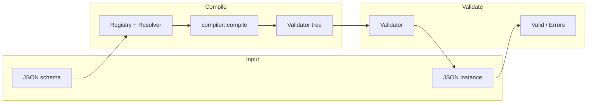
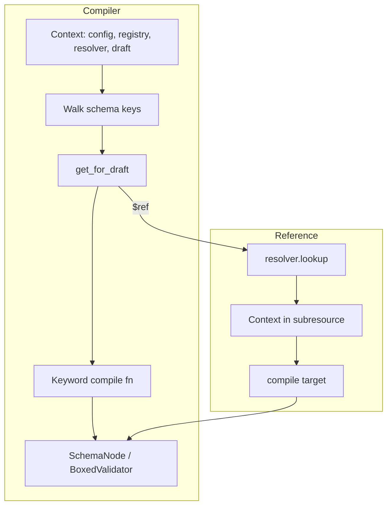

# jsonschema (Stranger6667) — Research report

## Metadata

- **Library name**: jsonschema
- **Repo URL**: https://github.com/Stranger6667/jsonschema
- **Clone path**: `research/repos/rust/Stranger6667-jsonschema-rs/`
- **Language**: Rust
- **License**: MIT

## Summary

jsonschema is a **JSON Schema validator** for Rust: it takes a schema and a JSON
instance and reports whether the instance is valid and, on failure, a list of
validation errors. It does not generate code. The library supports drafts 4, 6,
7, 2019-09, and 2020-12; it is used via a Rust API (`validator_for`, `validate`,
`iter_errors`, `evaluate`) and a CLI (`jsonschema-cli`). Validation is the
primary function: schema and instance go in, valid/errors and optional
structured output (JSON Schema Output v1) come out. Custom keywords and format
validators are supported; external references are resolved via the
`jsonschema-referencing` crate with blocking or async retrieval.

## JSON Schema support

- **Drafts**: README and docs list Draft 2020-12, 2019-09, 7, 6, and 4.
  Compliance is reported on the
  [Bowtie Report](https://bowtie.report/#/implementations/rust-jsonschema).
  Draft is inferred from `$schema` when not set explicitly; custom meta-schemas
  can be used via a registry.
- **Scope**: Full validation-oriented subset. Applicator, validation, format
  (annotation or assertion by option), content (encoding/media type; not
  `contentSchema`), and unevaluated keywords are implemented per draft. Core
  structural keywords (`$id`, `$schema`, `$defs`, `$ref`, `$anchor`,
  `$dynamicRef`, etc.) are used for resolution and compilation; meta-data
  keywords (e.g. `title`, `description`, `default`) are annotation-only and do
  not affect validation.

## Keyword support table

Keyword list from vendored draft 2020-12 meta-schemas under
`specs/json-schema.org/draft/2020-12/meta/`. "Implemented" indicates whether the
validator compiles and enforces the keyword for instance validation. Evidence
from `crates/jsonschema/src/keywords/mod.rs`, keyword modules, and
`keywords/legacy/`.

| Keyword               | Implemented | Notes                                                                |
| --------------------- | ----------- | -------------------------------------------------------------------- |
| $anchor               | no          | Used in referencing for resolution; no standalone validator.         |
| $comment              | no          | Annotation only; ignored for validation.                             |
| $defs                 | partial     | Not a validator; definitions resolved and used by `$ref`.            |
| $dynamicAnchor        | no          | Part of dynamic ref resolution; no separate keyword handler.         |
| $dynamicRef           | yes         | Draft 2020-12; `ref_::compile_dynamic_ref`.                          |
| $id                   | no          | Used for base URI and resolution; no validation effect.              |
| $ref                  | yes         | All drafts; `ref_::compile_ref`.                                     |
| $schema               | no          | Draft detection only; no validation effect.                          |
| $vocabulary           | no          | Meta-schema; used for vocabulary set during compile.                 |
| additionalProperties  | yes         | Applicator vocabulary; `additional_properties::compile`.             |
| allOf                 | yes         | `all_of::compile`.                                                   |
| anyOf                 | yes         | `any_of::compile`.                                                   |
| const                 | yes         | Draft 6+; `const_::compile`.                                         |
| contains              | yes         | Draft 6+; `contains::compile`; also handles minContains/maxContains. |
| contentEncoding       | yes         | Draft 6/7; `content::compile_content_encoding`.                      |
| contentMediaType      | yes         | Draft 6/7; `content::compile_media_type`.                            |
| contentSchema         | no          | Not implemented in jsonschema crate.                                 |
| default               | no          | Annotation only; not enforced.                                       |
| dependentRequired     | yes         | Draft 2019-09+; `dependencies::compile_dependent_required`.          |
| dependentSchemas      | yes         | Draft 2019-09+; `dependencies::compile_dependent_schemas`.           |
| deprecated            | no          | Annotation only.                                                     |
| description           | no          | Annotation only.                                                     |
| else                  | yes         | Via `if_::compile` (if/then/else).                                   |
| enum                  | yes         | `enum_::compile`; instance matched against allowed values.           |
| examples              | no          | Annotation only.                                                     |
| exclusiveMaximum      | yes         | Draft 6+; `minmax::compile_exclusive_maximum`.                       |
| exclusiveMinimum      | yes         | Draft 6+; `minmax::compile_exclusive_minimum`.                       |
| format                | yes         | Configurable annotation vs assertion; `format::compile`.             |
| if                    | yes         | Draft 7+; `if_::compile` with then/else.                             |
| items                 | yes         | `items::compile`; draft 4 uses legacy.                               |
| maxContains           | yes         | In `contains.rs` with contains/minContains.                          |
| maximum               | yes         | Draft 4 legacy + draft 6+ `minmax::compile_maximum`.                 |
| maxItems              | yes         | `max_items::compile`.                                                |
| maxLength             | yes         | `max_length::compile`.                                               |
| maxProperties         | yes         | `max_properties::compile`.                                           |
| minContains           | yes         | In `contains.rs` with contains/maxContains.                          |
| minimum               | yes         | Draft 4 legacy + draft 6+ `minmax::compile_minimum`.                 |
| minItems              | yes         | `min_items::compile`.                                                |
| minLength             | yes         | `min_length::compile`.                                               |
| minProperties         | yes         | `min_properties::compile`.                                           |
| multipleOf            | yes         | `multiple_of::compile`.                                              |
| not                   | yes         | `not::compile`.                                                      |
| oneOf                 | yes         | `one_of::compile`.                                                   |
| pattern               | yes         | `pattern::compile`.                                                  |
| patternProperties     | yes         | `pattern_properties::compile`.                                       |
| prefixItems           | yes         | Draft 2020-12; `prefix_items::compile`.                              |
| properties            | yes         | `properties::compile`.                                               |
| propertyNames         | yes         | Draft 6+; `property_names::compile`.                                 |
| readOnly              | no          | Annotation only.                                                     |
| required              | yes         | `required::compile`.                                                 |
| then                  | yes         | Via `if_::compile` (if/then/else).                                   |
| title                 | no          | Annotation only.                                                     |
| type                  | yes         | Draft 4 legacy + draft 6+ `type_::compile`.                          |
| unevaluatedItems      | yes         | Draft 2019-09/2020-12; `unevaluated_items::compile`.                 |
| unevaluatedProperties | yes         | Draft 2019-09/2020-12; `unevaluated_properties::compile`.            |
| uniqueItems           | yes         | `unique_items::compile`.                                             |
| writeOnly             | no          | Annotation only.                                                     |

Draft-4–specific behavior: `additionalItems`, `dependencies`,
`maximum`/`minimum`/`type` use modules under `keywords/legacy/`.

## Constraints

The validator enforces all implemented validation keywords at runtime. Type,
numeric (minimum, maximum, multipleOf, etc.), string (minLength, maxLength,
pattern), array (minItems, maxItems, uniqueItems, contains, minContains,
maxContains), object (properties, additionalProperties, patternProperties,
propertyNames, required, minProperties, maxProperties, dependentRequired,
dependentSchemas, unevaluatedProperties), and composition (allOf, anyOf, oneOf,
not, if/then/else) keywords produce validation errors when the instance does not
satisfy the schema. Format can be annotation-only or assertion (configurable).
Content encoding and media type are validated for string instances when the
keyword is present. Each keyword compiles to a validator that runs during
`validate` or `iter_errors` and contributes to the error list or structured
output.

## High-level architecture

Pipeline: **Schema** (JSON) → **Compile** (build validator) → **Validator**
(in-memory tree) → **Instance** (JSON) → **Result** (valid or list of errors /
structured output).

- **Input**: JSON schema (and optional base URI, resources, draft). Optionally
  schema is validated against a meta-schema before compilation.
- **Compile**: `build_validator` (or async variant) determines draft, builds a
  `Registry` with retriever and resources, creates a `Resolver`, and compiles
  the root schema via `compiler::compile` into a tree of validators
  (`SchemaNode` / `Box<dyn Validate>`). `$ref` and related references are
  resolved through the resolver; each keyword is compiled by the function
  registered in `keywords::get_for_draft`.
- **Validator**: The compiled tree is stored in a `Validator`; no code
  generation. Validation is synchronous (instance and schema are in memory).
- **Output**: `is_valid`, `validate` (first error), `iter_errors` (all errors),
  or `evaluate` (Output v1: flag, list, hierarchical, annotations).

## Medium-level architecture

- **Crates**: `jsonschema` (core compiler and validation),
  `jsonschema-referencing` (reference resolution, registry, retriever,
  draft/specification), `jsonschema-cli` (CLI binary).
- **Compilation**: `Context` holds config, registry, resolver, draft,
  vocabularies, and location. `compile(ctx, resource_ref)` walks the schema
  object; for each key it looks up a keyword handler via
  `keywords::get_for_draft`. Handlers return `Box<dyn Validate>`. Boolean
  schemas compile to `TrueValidator`/`FalseValidator`. `$ref` is resolved via
  `ctx.lookup(reference)`; the resolved resource is compiled in a new context
  and wrapped in `RefValidator` or `DirectRefValidator`. Recursive refs use
  placeholder nodes and late binding.
- **Reference resolution**: `jsonschema-referencing` provides `Registry`,
  `Resolver`, `Resource`, `ResourceRef`. The registry is built with a draft,
  retriever (default: HTTP/file), and optional preloaded resources.
  `resolver.lookup(uri)` resolves `$ref` to a `Resolved` resource; `$dynamicRef`
  and `$recursiveRef` use dynamic scope. Compiler calls `ctx.lookup()` and
  compiles the target schema, so `$defs` are used indirectly when referenced by
  `$ref`.
- **Evaluation**: Validators implement `Validate`: `is_valid`, `validate`,
  `iter_errors`, `evaluate`. Execution order is influenced by `keyword_priority`
  (e.g. type/const first, refs last). Errors carry instance path, schema path
  (keyword location), and message.

## Low-level details

- **Custom keywords**: Registered via `ValidationOptions` with a
  `KeywordFactory`; custom keywords are compiled and run at priority 80. See
  `keywords/custom.rs`.
- **Format registry**: Format names map to `Arc<dyn Format>`; default formats
  (e.g. date-time, email, ipv4) can be overridden or disabled. Format validation
  is optional (`should_validate_formats`); unknown formats can be ignored or
  cause errors.
- **Pattern engines**: Fancy-regex and standard regex; pattern options
  configurable. Patterns are translated from JSON Schema (ECMA) to Rust regex
  and cached in `Context`.

## Output and integration

- **Vendored vs build-dir**: Not applicable; no generated code. Validator is an
  in-memory tree built at runtime.
- **API vs CLI**: Both. **API**: `is_valid(schema, instance)`,
  `validate(schema, instance)`, `validator_for(schema)` /
  `options().build(schema)` returning `Validator` with `validate`,
  `iter_errors`, `evaluate`. Async: `async_validator_for` for building when
  external refs are fetched asynchronously. **CLI**: `jsonschema-cli` in
  `crates/jsonschema-cli`; takes schema file and instance file(s), supports
  `--draft`, `--assert-format` / `--no-assert-format`, `--output` (text, flag,
  list, hierarchical), `--errors-only`, timeouts for network.
- **Writer model**: Not applicable (no code emission). Errors and structured
  output are in-memory (e.g. `ValidationError`, `Evaluation`); CLI writes to
  stdout.

## Configuration

- **Compilation/validation**: `ValidationOptions` (and draft-specific
  `options()`): draft, base_uri, retriever, resources, registry, format
  validation on/off, ignore unknown formats, custom formats, custom keywords,
  pattern options, email options, content media type/encoding checks, schema
  validation on/off. TLS: default `aws-lc-rs`; optional `tls-ring` feature
  (README).
- **Draft**: Inferred from `$schema` or set via `with_draft`. Custom
  meta-schemas via registry resolve to draft/vocabularies automatically.

## Pros/cons

- **Pros**: High performance (README: up to 75–645x faster than some other Rust
  validators in benchmarks); multiple drafts (4–2020-12); custom keywords and
  formats; blocking and async ref resolution; structured Output v1; CLI;
  Python/Ruby bindings and WebAssembly; Bowtie-tested compliance; fail-fast
  ordering via keyword priority.
- **Cons**: `contentSchema` not implemented; meta-data keywords are
  annotation-only (no validation effect); MSRV 1.83; optional network/file and
  TLS dependencies for ref resolution.

## Testability

- **Tests**: `cargo test --all-features` (CONTRIBUTING). JSON Schema Test Suite
  is used as a git submodule at `crates/jsonschema/tests/suite/`; initialized
  with `git submodule init` and `git submodule update`. The `testsuite` crate
  and `#[suite]` / `#[output_suite]` attributes in
  `crates/jsonschema/tests/suite.rs` and `output_suite.rs` drive tests from the
  suite. Additional unit tests live in `crates/jsonschema/src/keywords/mod.rs`
  and other modules.
- **Fixtures**: Suite files under `crates/jsonschema/tests/suite/` (e.g.
  draft7); output tests under `crates/jsonschema/tests/suite/output-tests`.
  Retriever is customized in tests for local refs.

## Performance

- **Benchmarks**: In-repo benchmarks in `crates/jsonschema/benches/` (e.g.
  `jsonschema.rs`, `keywords.rs`, `metaschema.rs`, `unevaluated_properties.rs`,
  `unevaluated_items.rs`, `location.rs`, `errors.rs`). Comparison suite in
  `crates/benchmark-suite/`: compares jsonschema with valico, jsonschema_valid,
  boon (OpenAPI, Swagger, GeoJSON, CITM, Fast, FHIR, Recursive). Run with
  `cargo bench` from the benchmark-suite crate. `profiler/` contains profiling
  entry points (Justfile, main).
- **Entry points**: API: `Validator::validate(&instance)` or `iter_errors` for
  repeated validation; build once with `validator_for`/`options().build()`. CLI:
  `jsonschema-cli schema.json -i instance.json` for one-off runs.

## Determinism and idempotency

- **Error order**: Validators run in keyword priority order; within a schema
  object, order is deterministic. `iter_errors` collects from all branches;
  order depends on tree traversal and priority. No explicit guarantee of
  lexicographic or stable ordering is documented; implementation is
  deterministic for a given schema and instance.
- **Evaluation order**: Fixed by compile-time keyword priority and traversal;
  same inputs yield same validation result and error set. Idempotent for
  validation (no side effects on schema or instance).

## Enum handling

- **Duplicate entries**: The `enum` keyword stores the schema array as a
  `Vec<Value>` and checks the instance with
  `items.iter().any(|item| cmp::equal(instance, item))`. Duplicate values in the
  schema (e.g. `["a", "a"]`) are allowed; both are stored and matching is by
  equality. No deduplication or error for duplicates.
- **Namespace/case**: Instance is compared by JSON equality (e.g. `cmp::equal`).
  Values `"a"` and `"A"` are distinct; the validator produces distinct outcomes
  for each. No special handling for case or namespace; both can appear in the
  enum list and are matched correctly.

## Reverse generation (Schema from types)

Not applicable. jsonschema is a validator only; it does not generate JSON Schema
from Rust types or other code.

## Multi-language output

Not applicable for code generation. The library is Rust-only for validation. The
README mentions bindings: **jsonschema-py** and **jsonschema-rb** expose the
validator to Python and Ruby (validate from those languages); they do not emit
generated code in other languages.

## Model deduplication and $ref/$defs

Not applicable (no generated models). For validation, `$ref` and `$defs` are
resolved by `jsonschema-referencing`: the registry and resolver resolve URIs to
resources; the compiler compiles each referenced schema once and reuses the same
compiled validator node where appropriate (e.g. `DirectRefValidator` for
non-recursive refs). Shared `$defs` entries are compiled once per reference
target and referenced via ref validators; there is no “model” to deduplicate,
only a single compiled tree per root schema.

## Validation (schema + JSON → errors)

This is the primary function of the library.

- **Inputs**: (1) JSON schema (e.g. `serde_json::Value` or file), (2) JSON
  instance (e.g. `&Value`). Optional: base URI, preloaded resources, custom
  retriever, draft, format/keyword options.
- **Outputs**:
  - **Success**: `is_valid` returns `true`; `validate` returns `Ok(())`;
    `iter_errors` yields nothing; `evaluate` produces output with `valid: true`
    and optional annotations.
  - **Failure**: `is_valid` returns `false`; `validate` returns
    `Err(ValidationError)` (first error); `iter_errors` yields one or more
    `ValidationError`; `evaluate` includes errors in the output and annotations
    for successful branches.
- **APIs**:
  - One-off: `jsonschema::is_valid(schema, instance)`,
    `jsonschema::validate(schema, instance)`.
  - Reusable: `jsonschema::validator_for(schema)?` or
    `jsonschema::options().with_draft(...).should_validate_formats(true).build(schema)?`
    → `Validator`; then `validator.validate(instance)`,
    `validator.iter_errors(instance)`, `validator.evaluate(instance)`.
  - Async build: `jsonschema::async_validator_for(schema).await?` when schema or
    refs require async fetch; validation itself is synchronous.
  - Structured output: `validator.evaluate(instance)` returns an `Evaluation`;
    `.flag()`, `.list()`, `.hierarchical()` for JSON Schema Output v1 formats;
    `.iter_annotations()`, `.iter_errors()` for annotations and errors.
- **CLI**: `jsonschema-cli <schema> -i <instance> [ -i <instance2> ... ]` with
  options for draft, format assertion, output format (text, flag, list,
  hierarchical), errors-only, and timeouts. Exits with success/failure per
  instance; writes to stdout.

Errors include instance path, schema path (keyword location), and a
human-readable message; optional masking of instance values for sensitive data.
Validation is synchronous after the validator is built.
