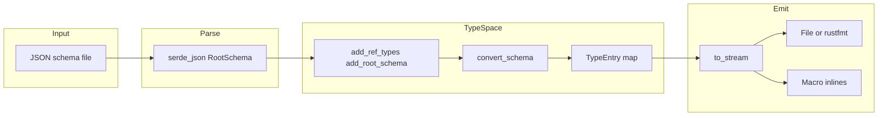
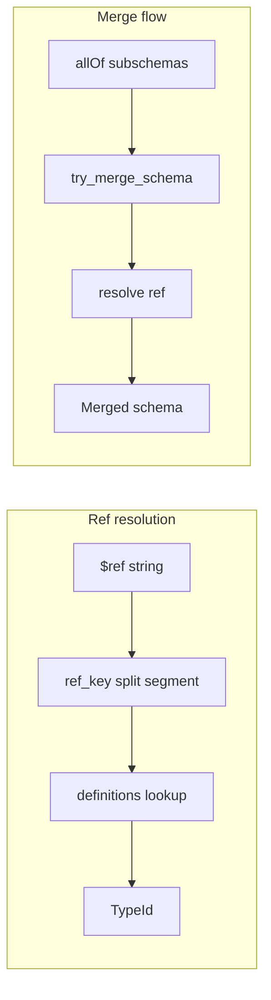

# Typify — Research report

## Metadata

- **Library name**: Typify
- **Repo URL**: https://github.com/oxidecomputer/typify
- **Clone path**: `research/repos/rust/oxidecomputer-typify/`
- **Language**: Rust
- **License**: Apache-2.0

## Summary

Typify compiles JSON Schema documents into idiomatic Rust types. It uses the schemars crate for schema representation and supports draft-07–style schemas (tests also use draft-04); it does not target JSON Schema 2020-12 explicitly. Code generation is structure-oriented: types are generated from `type`, `properties`, `items`, `oneOf`, `allOf`, `anyOf`, `$ref`, `definitions`, `format`, `enum`, `additionalProperties`, `required`, `default`, and related keywords. Validation keywords are used only for type selection (e.g. integer bounds for choosing `i8`/`u64`) or stored for optional runtime validation (e.g. string pattern); they are not enforced in the type system. Typify can be used via the `cargo typify` CLI, the `import_types!` macro, or a builder API in `build.rs` or xtask. Generated code is serde-serializable and can emit custom map types, format-based types (e.g. `uuid::Uuid`, `chrono::NaiveDate`), and an optional builder interface. The library supports the `x-rust-type` schema extension to reuse types from other crates.

## JSON Schema support

- **Draft**: No explicit draft stated in the README. The implementation uses **schemars** (0.8.22), which follows draft-07–style schemas (e.g. `definitions` rather than `$defs`). Test fixtures use both draft-04 and draft-07 `$schema` URLs.
- **Scope**: Structure-oriented subset. The schema is parsed via serde into schemars’ `RootSchema` / `Schema`. Fragment-only `$ref` and `definitions` are resolved. Combinators (`allOf`, `oneOf`, `anyOf`) and structural keywords (`type`, `properties`, `items`, `additionalProperties`, `required`, `enum`, `format`) drive codegen. Many validation keywords are read for type selection or metadata (e.g. `minimum`/`maximum` for integer type, `minLength`/`maxLength`/`pattern` for string newtypes) but are not enforced as value constraints in generated types. No support for `$id`/external refs, `if`/`then`/`else`, `dependentRequired`/`dependentSchemas`, `unevaluatedProperties`/`unevaluatedItems`, or `contentEncoding`/`contentMediaType`/`contentSchema`.

## Keyword support table

Keyword list derived from vendored draft 2020-12 meta-schemas under `specs/json-schema.org/draft/2020-12/meta/` (core, applicator, validation, meta-data, unevaluated, format-annotation, format-assertion, content). Typify consumes schemas via schemars (draft-07 style); `definitions` in schemars corresponds to `$defs` for reference resolution.

| Keyword | Implemented | Notes |
|---------|-------------|-------|
| $anchor | no | Not used. |
| $comment | no | Not used. |
| $defs | yes | Schemars exposes `definitions`; used as `schema.definitions` and `RefKey::Def` for reference resolution. |
| $dynamicAnchor | no | Not used. |
| $dynamicRef | no | Not used. |
| $id | no | Not used for resolution; external refs not supported. |
| $ref | yes | Fragment-only (`#/...`); resolved via `ref_key()` and `definitions` lookup. |
| $schema | no | Parsed by schemars but not used for codegen. |
| $vocabulary | no | Not used. |
| additionalProperties | yes | `false` → `#[serde(deny_unknown_fields)]`; schema → flattened map or map type; absent/true → ignore. |
| allOf | yes | Merged via `merge_all`; merged schema then converted to a single type. |
| anyOf | partial | Modeled as struct with optional, flattened members; README notes this is a weak area. |
| const | partial | `const_value` used in merge and validate; single-value enums generated from enum_values. |
| contains | no | Not used in codegen. |
| contentEncoding | no | Not used. |
| contentMediaType | no | Not used. |
| contentSchema | no | Not used. |
| default | yes | Emitted as `#[serde(default)]` and default functions in `defaults` module; default value used for validation. |
| dependentRequired | no | Not used. |
| dependentSchemas | no | Not used. |
| deprecated | no | Not used in codegen. |
| description | yes | Emitted as `///` doc comments. |
| else | no | Not used. |
| enum | yes | Rust enum (externally/internally/adjacently/untagged); string and typed enums. |
| examples | no | Not used. |
| exclusiveMaximum | partial | Used in integer type selection only; not enforced in generated code. |
| exclusiveMinimum | partial | Used in integer type selection only; not enforced in generated code. |
| format | yes | String: uuid, date, date-time, ip, ipv4, ipv6 → native Rust types; integer format → int8/uint8/… for type selection. |
| if | no | Not used. |
| items | yes | Single schema → `Vec<T>` or `HashSet<T>`; array of schemas + max_items → tuple. |
| maxContains | no | Not used. |
| maximum | partial | Used for integer type selection (e.g. i8..u64); not enforced in generated code. |
| maxItems | partial | Drives tuple length; TODO in code for enforcing size. |
| maxLength | partial | Stored in newtype string constraints; can drive validation. |
| maxProperties | no | Not used for codegen. |
| minContains | no | Not used. |
| minimum | partial | Used for integer type selection and NonZero choice; not enforced in generated code. |
| minItems | partial | Used with items array for tuple; TODO enforce. |
| minLength | partial | Stored in newtype string constraints. |
| minProperties | no | Not used for codegen. |
| multipleOf | partial | Considered in convert_integer but TODO in code; not enforced. |
| not | partial | Special cases: bool invert, empty object → false, enum deny list via `convert_not`. |
| oneOf | yes | Mapped to Rust enum (various serde representations). json-schema-rs: oneOf → union enum; validator enforces exactly one. |
| pattern | partial | Stored in `StringValidation`; regress crate used for validation in generated code where applicable. |
| patternProperties | partial | Single pattern + matching object shape → map; otherwise must be empty (merge asserts empty in some paths). |
| prefixItems | partial | Schemars uses `items` as array for tuple; same behavior as 2020-12 prefixItems for fixed-length arrays. |
| properties | yes | Drives struct fields; optional/required and naming. |
| propertyNames | no | Passed to make_map but not fully supported for codegen. |
| readOnly | no | Not used. |
| required | yes | Non-required → `Option<T>` or `#[serde(default)]`. |
| then | no | Not used. |
| title | yes | Used for type and variant naming. |
| type | yes | instance_type → Rust types; multiple types + null → Option or untagged enum. |
| unevaluatedItems | no | Not used. |
| unevaluatedProperties | no | Not used. |
| uniqueItems | yes | `true` → `HashSet<T>`, otherwise `Vec<T>`. |
| writeOnly | no | Not used. |

## Constraints

Validation keywords are used only for structure and type selection, not enforced as value constraints in the generated Rust types. The README states that bounded numbers (e.g. `minimum`/`maximum`) “won’t enforce those value constraints.” In the code: `minimum`/`maximum`/`exclusiveMinimum`/`exclusiveMaximum` are used to choose integer Rust types (e.g. i8, u64, NonZeroU64) and to validate default values; they are not emitted as runtime checks. For strings, `minLength`/`maxLength`/`pattern` are stored in newtype constraints and can be used for validation (e.g. via regress). *json-schema-rs* also uses regress for pattern but enforces in the central validator and emits `#[to_json_schema(pattern = "...")]` for round-trip; Typify validates pattern in generated code. Array `minItems`/`maxItems` are used for tuple length but marked TODO for enforcement. The `validate` module and `schema_value_validate` are used internally for merge/compatibility checks, not for user-facing validation of generated types.

## High-level architecture

- **Input**: JSON schema file (path from CLI, macro, or builder).
- **Parse**: File read and deserialized with serde into schemars’ `RootSchema` (schema + definitions).
- **TypeSpace**: `TypeSpace` holds definitions, `ref_to_id`, and type entries. `add_ref_types` / `add_root_schema` register definitions and root; `convert_schema` / `convert_schema_object` in typify-impl turn schemas into `TypeEntry` (struct, enum, newtype, array, set, tuple, reference, etc.).
- **Emit**: `TypeSpace::to_stream()` builds an `OutputSpace` from all type entries and produces a `proc_macro2::TokenStream`, which is written to a file (with optional rustfmt/prettyplease) or inlined by the macro.

Main crates: **typify** (public API, `TypeSpace`, `TypeSpaceSettings`), **typify-impl** (conversion, merge, structs, enums, output, defaults, rust_extension), **typify-macro** (`import_types!`), **cargo-typify** (CLI).

## Medium-level architecture

- **Schema representation**: Schemars’ `Schema` (Bool or Object), `SchemaObject` (metadata, instance_type, format, enum_values, number, string, array, object, reference, subschemas, extensions). No separate IR; conversion is schema → TypeEntry.
- **$ref / definitions resolution**: Fragment-only refs (`#` or `#/definitions/Name`). `util::ref_key(ref_name)` maps `#` → `RefKey::Root`, else last path segment (after `/`) → `RefKey::Def(name)`. Definitions come from `RootSchema.definitions` (draft-07 style). `TypeSpace::add_ref_types` registers each definition and root, then calls `convert_ref_type` for each; refs in schemas resolve via `ref_to_id.get(&ref_key)` to a `TypeId`. Merge uses `resolve(schema, definitions)` to follow a ref to the resolved schema when merging allOf/oneOf/anyOf.
- **Merge**: `merge.rs` implements `merge_all`, `try_merge_schema`, and helpers to merge objects (properties, required, additionalProperties), arrays (items, additional_items, min/max items), subschemas (allOf, oneOf, anyOf), and refs (resolve then merge). allOf is merged before conversion so one type is generated from the combined schema.

- **Conversion flow**: `convert_schema_object` dispatches on schema shape: rust extension (`x-rust-type`) → native type; reference → `convert_reference`; type + null → option; string + format → convert_string (uuid, date, etc.) or newtype with validation; integer/number + validation → convert_integer/convert_number; enum_values → convert_typed_enum or convert_unknown_enum; subschemas (allOf, oneOf, anyOf, not) → convert_all_of, convert_subschemas (oneOf/anyOf), convert_not; object → struct_members + make_map for additionalProperties; array → tuple or Vec/Set. Results are stored as TypeEntry and assigned a TypeId; references stay as TypeEntryDetails::Reference(type_id).

## Low-level details

- **Integer type selection**: `convert_integer` uses `NumberValidation` (minimum, maximum, exclusive_minimum, exclusive_maximum, multiple_of) and optional string format (int8, uint8, …) to choose Rust type (i8, u8, …, i64, u64, NonZero*). Bounds are not enforced in generated code; fallback is i64.
- **String format**: `convert_string` maps format "uuid" → `::uuid::Uuid`, "date" → `chrono::naive::NaiveDate`, "date-time" → `chrono::DateTime<Utc>`, "ip"/"ipv4"/"ipv6" → std net types; others fall back to String. Optional `StringValidation` (min_length, max_length, pattern) produces a newtype with constraints (regress for pattern).
- **x-rust-type**: `rust_extension.rs` reads extension `x-rust-type` (crate, version, path, parameters); if crate/version allowed by settings, emits a native type (path + type params) instead of generating from the schema.
- **Output**: `OutputSpace` collects token streams per module (Error, Crate, Builder, Defaults); `type_entry.output()` emits struct/enum/newtype/vec/set/tuple/reference; `into_stream()` assembles the final token stream. No generic `Write`; caller writes `to_stream().to_string()` or uses rustfmt-wrapper/prettyplease.

## Output and integration

- **Vendored vs build-dir**: Output path is configurable. CLI defaults to input path with `.rs` extension or stdout; macro inlines; builder writes to caller-chosen path. No fixed vendored output; examples generate at build time.
- **API vs CLI**: (1) **CLI** `cargo typify` (cargo-typify): `--input`, `--output`, `--builder`/`--no_builder`, `--additional-derive`, `--map-type`, `--crate`, `--unknown-crates`. (2) **Macro** `import_types!(schema = "…", derives = […], patch = {…}, replace = {…}, convert = {…}, struct_builder = true)`. (3) **Builder** `TypeSpace::new(settings)`, `add_root_schema(schema)` or `add_ref_types(definitions)`, `to_stream()`; used in build.rs or xtask.
- **Writer model**: No generic writer. CLI and builder produce a String (or write to file); macro expands to token stream. Formatting via rustfmt-wrapper or prettyplease (caller’s choice).

## Configuration

- **TypeSpaceSettings**: `with_map_type` (HashMap, BTreeMap, IndexMap, etc.), `with_unknown_crates` (Allow/Generate/Deny), `with_crate`/crates for x-rust-type; optional derives and attrs; struct_builder.
- **Naming**: heck for case conversion; sanitize for Rust identifiers; title and ref fragment used for type names.
- **Model name source**: Title and ref fragment used for type names; inline objects use parent + field name. Not configurable.
- **Optional dependencies**: Generated code may require `uuid`, `chrono`, `regress`, `serde_json`; TypeSpace reports `uses_uuid()`, `uses_chrono()`, etc. Conversion overrides (macro `convert`) allow substituting types for schema shapes (e.g. custom UUID type).
- **Patch/replace**: Macro `patch` for rename and extra derives per type; `replace` to use an existing type instead of generating one.

## Pros/cons

- **Pros**: Multiple entry points (CLI, macro, builder); rich schema support (allOf merge, oneOf enums, anyOf heuristic, not for special cases); format → native types (uuid, chrono, std net); configurable map type; x-rust-type for reusing types from other crates; optional builder interface and validation (string constraints); Apache-2.0.
- **Cons**: Fragment-only refs (no external $ref); validation keywords not enforced in types (bounded numbers, multipleOf, etc.); anyOf modeled as struct with optional flattened members (imprecise); patternProperties and propertyNames only partially supported; no if/then/else, unevaluated*, or content*; integer bounds use f64 in schemars (precision note in code).

## Testability

- **Unit tests**: typify-impl has tests in convert.rs (integer type output), structs.rs (validate_output for generated structs), enums.rs (oneOf/refs), value.rs (validation), merge.rs (merge and oneOf/allOf identity), util.rs (sanitize, ref_key). type_entry and defaults have tests.
- **Integration tests**: typify/tests/schemas.rs uses multiple JSON fixtures (e.g. simple-types, arrays-and-tuples, maps, merged-schemas, various-enums, id-or-name, x-rust-type) and compares generated .rs to expected. typify-impl/tests test_generation.rs and test_github.rs use large schemas (ega, github) and validate output. cargo-typify/tests/integration.rs runs CLI and compares output (builder, derive, custom_btree_map, etc.).
- **Running tests**: From repo root, `cargo test --all`. Fixtures under typify/tests/schemas/*.json and typify-impl/tests/*.json.
- **Fixtures**: Good candidates for cross-generator comparison: typify/tests/schemas/*.json, typify-impl/tests/vega.json, github.json.

## Performance

- No built-in benchmarks or criterion in the repo. No documented wall-time or instruction metrics.
- **Entry points for future benchmarking**: (1) CLI `cargo typify --input schema.json --output out.rs`. (2) Builder: `TypeSpace::new(settings); type_space.add_root_schema(schema); type_space.to_stream()`. (3) Macro runs at compile time (harder to isolate). For fixture-based benchmarks, the CLI or builder `add_root_schema` + `to_stream` are the natural entry points.

## Determinism and idempotency

Generated output is deterministic. In `typify-impl/src/output.rs`, `OutputSpace` stores items in a `BTreeMap<(OutputSpaceMod, String), TokenStream>` keyed by module and `order_hint` (the type name). Emission order is therefore sorted by type name within each module. In `typify-impl/src/structs.rs`, struct properties are explicitly sorted by name (`properties.sort_by(|a, b| a.name.cmp(&b.name))`) with a comment "to ensure a deterministic result." Enum variant order follows the schema’s enum array (input order). TypeSpace uses `BTreeMap` for `definitions`, `id_to_entry`, `name_to_id`, and `ref_to_id`; definition iteration order from `RootSchema.definitions` (schemars) may vary by map implementation, but the final emitted order is dominated by `OutputSpace`’s sorted keys, so types appear in stable alphabetical order by name. Repeated runs with the same input produce identical output; small schema changes produce localized diffs.

## Enum handling

The library does not deduplicate enum values; it panics when it cannot produce unique Rust variant names. In `typify-impl/src/type_entry.rs`, `TypeEntryEnum::from_metadata` sets each variant’s `ident_name` from `sanitize(&variant.raw_name, Case::Pascal)`. If variants are not unique after that (or after a second attempt that replaces non-identifier characters with `"X"`), the code panics with "Failed to make unique variant names for [raw names]". Duplicate entries (e.g. `["a", "a"]`) therefore yield two variants both with ident_name `"A"` and trigger this panic. Case collisions (e.g. `"a"` and `"A"`) both become `"A"` in PascalCase with no disambiguation (e.g. no `A` and `A_1`), so the code also panics. There is no deduplication of enum values before building variants in `convert_enum_string` (`typify-impl/src/convert.rs`). The `rust-collisions` fixture tests Rust keyword/type name conflicts, not enum value duplicates or case collisions.

## Reverse generation (Schema from types)

No. The library only generates Rust code from a JSON Schema. The public API (`TypeSpace::add_root_schema`, `add_ref_types`, `to_stream`) and CLI accept a schema (or path) and produce a `TokenStream` or file. There is no API to generate a JSON Schema from Rust types. The codebase uses `schemars::JsonSchema` in tests and in generated code (e.g. optional `derives = [schemars::JsonSchema]` on output) so that generated types can be serialized to a schema for testing or downstream use; that is not typify generating schema from arbitrary user types. The README and docs describe a single direction: schema → Rust types.

## Multi-language output

Rust only. The generator produces Rust code via `proc_macro2::TokenStream` and `quote` in typify-impl; `TypeSpace::to_stream()` builds an `OutputSpace` and returns a token stream written to a file or inlined by the macro. There is no option for another target language (no `--lang`, `--target`, or equivalent in the cargo-typify CLI or `TypeSpaceSettings`). Dependencies are Rust-centric (schemars, quote, heck, etc.). The README and CLI describe generating Rust types from a JSON schema.

## Model deduplication and $ref/$defs

**$ref / definitions**: Fragment-only `$ref` and `definitions` are resolved; each definition is assigned a `TypeId` and converted once; refs resolve via `ref_to_id.get(&ref_key)`. One definition yields one generated type reused wherever the ref appears.

**Inline object schemas**: Structurally identical object shapes defined inline in different locations are not deduped. (By contrast, json-schema-rs supports optional structural dedupe of identical inline shapes via DedupeMode Functional/Full.) Inline objects receive a type name from context (e.g. parent type + field name in `struct_members` / `struct_property`). In `assign_type` (`typify-impl/src/lib.rs`), types with a name use `name_to_id`; only one type per name is stored, so the same name reuses the same `TypeId`, but inline types in different properties or branches get different context-derived names (e.g. `RootStreetAddress` vs `RootBillingAddress`) and thus different type entries. The `type_to_id` path deduplicates only unnamed/built-in details (e.g. shared `String`, `Vec`), not user-defined struct shapes. Using `$ref` and definitions is the supported way to get a single shared type.

## Validation (schema + JSON → errors)

No. The library is codegen-only and does not provide an API to validate a JSON payload against a JSON Schema and return a list of errors. The `validate` module (`typify-impl/src/validate.rs`) implements `schema_value_validate`, which checks a single value against a schema (const_value, enum_values, instance_type); it is used internally for merge and compatibility checks, not as a user-facing (schema + JSON document) → error report API. There is no CLI or public function that takes a schema and a JSON file and prints validation errors. Generated types use serde for (de)serialization; optional validation (e.g. string pattern via regress) is embedded in generated code, not exposed as a standalone validator.
