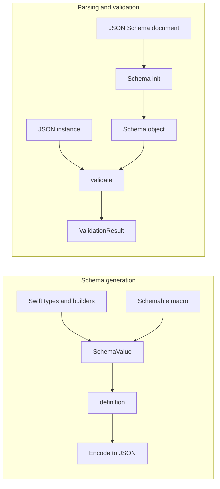
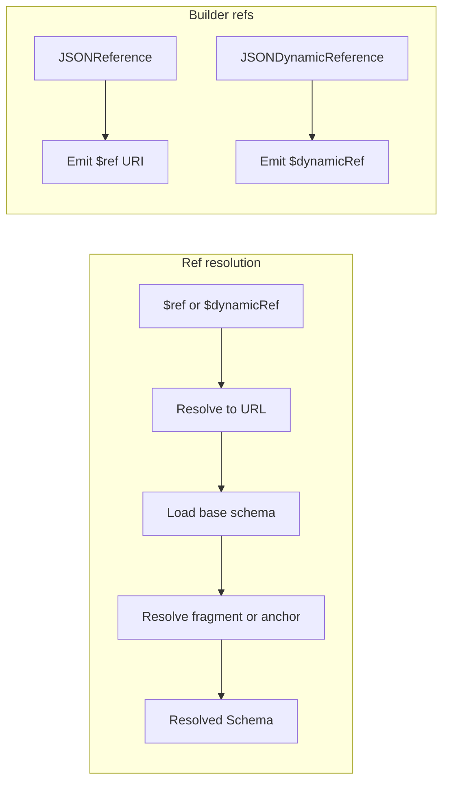

# Swift JSON Schema — Research report

## Metadata

- **Library name**: Swift JSON Schema
- **Repo URL**: https://github.com/ajevans99/swift-json-schema
- **Clone path**: `research/repos/swift/ajevans99-swift-json-schema/`
- **Language**: Swift
- **License**: MIT

## Summary

The Swift JSON Schema library provides type-safe schema generation (Swift → JSON Schema) and validation (JSON instance against a schema). Schema generation is done via a result-builder API (JSONSchemaBuilder) and the `@Schemable` macro: Swift types and builder expressions produce a `SchemaValue` that can be encoded to a JSON Schema document (Draft 2020-12). The same library parses JSON Schema documents into an internal representation and validates JSON instances against them, returning structured validation results with keyword and instance locations. Parsing of JSON instances into Swift types (with optional validation) is supported via the builder/macro `parse` and `parseAndValidate` APIs. The library does not generate Swift (or other) code from a JSON Schema; its codegen direction is reverse (types to schema).

## JSON Schema support

- **Draft**: Draft 2020-12. The README and Bowtie badges indicate Draft 2020-12 support. The JSONSchema target ships vendored meta-schemas under `Sources/JSONSchema/Resources/draft2020-12/` (schema.json and meta/*.json). `Dialect.draft2020_12` is used for validation and schema construction; `Context(dialect:)` and `definition(context:)` default to draft 2020-12.
- **Scope**: Full dialect for validation (parsed schemas). Schema generation (builder/macro) supports the keywords listed in the keyword table; builder APIs and macro expansion emit the corresponding JSON Schema keywords. External refs and remote schema loading are supported by the validator (ReferenceResolver); the builder emits `$ref`/`$dynamicRef` URIs and supports `$id`, `$anchor`, `$defs`, `$dynamicAnchor`.

## Keyword support table

Keyword list derived from vendored draft 2020-12 meta-schemas under `specs/json-schema.org/draft/2020-12/meta/` (core, applicator, validation, meta-data, unevaluated, format-annotation, format-assertion, content). The library implements both schema generation (builder/macro) and validation (JSONSchema core); the table reflects support in either or both.

| Keyword | Implemented | Notes |
|---------|-------------|-------|
| $anchor | yes | Builder: `anchor(_ name: String)` in JSONSchemaComponent+Identifiers. Validation: core supports anchors in ref resolution. |
| $comment | yes | Builder: `comment(_ value: String)` in JSONSchemaComponent+Annotations. |
| $defs | yes | Builder: SchemaReferenceURI.definition(named:location:) with .defs; JSONReference.definition(named:location:). Validation: Keywords+Identifier, ref resolution. |
| $dynamicAnchor | yes | Builder: `dynamicAnchor(_ name: String)`. Macro emits for recursive types. Validation: supported in ref resolution. |
| $dynamicRef | yes | Builder: JSONDynamicReference, `dynamicRef(_ uri: String)`. Validation: ReferenceResolver resolves $dynamicRef. |
| $id | yes | Builder: `id(_ value: String)`. Validation: Context, identifier registry, ref resolution. |
| $ref | yes | Builder: JSONReference(uri:), ref(uri:). Validation: Keywords+Reference, ReferenceResolver. |
| $schema | yes | Builder: `schema(_ uri: String)`. Validation: Keywords.SchemaKeyword, dialect selection. |
| $vocabulary | yes | Builder: `vocabulary(_ mapping: [String: Bool])`. Validation: Keywords.Vocabulary, validateVocabularies. |
| additionalProperties | yes | Builder: JSONObject.additionalProperties (closure or bool), JSONComponents.AdditionalProperties. Validation: applicator. |
| allOf | yes | Builder: JSONComposition.AllOf. Validation: applicator. |
| anyOf | yes | Builder: JSONComposition.AnyOf, OrNullModifier .unionAnyOf. Validation: applicator. |
| const | yes | Builder: `constant(_ value: JSONValue)`. Validation: Keywords+Assertion (Constant). |
| contains | yes | Builder: JSONArray.contains, minContains, maxContains. Validation: applicator. |
| contentEncoding | yes | Builder: `contentEncoding(_ value: String)` in JSONSchemaComponent+Content. Validation: content vocabulary. |
| contentMediaType | yes | Builder: `contentMediaType(_ value: String)`. Validation: content vocabulary. |
| contentSchema | partial | Validation: Keywords+Metadata.ContentSchema, Dialect keyword list. Builder: no API to set contentSchema. |
| default | yes | Builder: `default(_ value: JSONValue)` and closure overload in Annotations; macro supports default values. Validation: meta-data (annotation). |
| dependentRequired | yes | Builder: `dependentRequired(_ mapping: [String: [String]])` in JSONSchemaComponent+Conditionals. Validation: applicator. |
| dependentSchemas | yes | Builder: `dependentSchemas(_ mapping: [String: any JSONSchemaComponent])`. Validation: applicator. |
| deprecated | yes | Builder: `deprecated(_ value: Bool)` in Annotations. Validation: meta-data. |
| description | yes | Builder: `.description(_ value: String)`, macro uses docstrings. Validation: meta-data. |
| else | yes | Builder: ConditionalSchema with optional else; If(ifSchema, then:thenSchema, else:elseSchema). Validation: applicator. |
| enum | yes | Builder: `.enumValues(with: builder)` (JSONComponents.Enum). Validation: assertion. |
| examples | yes | Builder: `examples(_ values: JSONValue)` and closure overload. Validation: meta-data. |
| exclusiveMaximum | yes | Builder: JSONNumber.exclusiveMaximum; macro NumberOptions. Validation: validation vocabulary. |
| exclusiveMinimum | yes | Builder: JSONNumber.exclusiveMinimum; macro NumberOptions. Validation: validation vocabulary. |
| format | yes | Builder: JSONString.format; JSONSchemaConversion (e.g. UUID, Date, URL). Validation: format validators, FormatValidator. |
| if | yes | Builder: ConditionalSchema, If(ifSchema, then:thenSchema, else:?). Validation: applicator. |
| items | yes | Builder: JSONArray(items:). Validation: applicator. |
| maxContains | yes | Builder: JSONArray.maxContains; ArrayOptions. Validation: applicator. |
| maximum | yes | Builder: JSONNumber.maximum; macro NumberOptions. Validation: validation vocabulary. |
| maxItems | yes | Builder: JSONArray.maxItems; ArrayOptions. Validation: validation vocabulary. |
| maxLength | yes | Builder: JSONString.maxLength; StringOptions. Validation: validation vocabulary. |
| maxProperties | yes | Builder: JSONObject.maxProperties; ObjectOptions. Validation: validation vocabulary. |
| minContains | yes | Builder: JSONArray.minContains; ArrayOptions. Validation: applicator. |
| minimum | yes | Builder: JSONNumber.minimum; macro NumberOptions. Validation: validation vocabulary. |
| minItems | yes | Builder: JSONArray.minItems; ArrayOptions. Validation: validation vocabulary. |
| minLength | yes | Builder: JSONString.minLength; StringOptions. Validation: validation vocabulary. |
| minProperties | yes | Builder: JSONObject.minProperties; ObjectOptions. Validation: validation vocabulary. |
| multipleOf | yes | Builder: JSONNumber.multipleOf; NumberOptions. Validation: validation vocabulary. |
| not | yes | Builder: JSONComposition.Not. Validation: applicator. |
| oneOf | yes | Builder: JSONComposition.OneOf, OrNullModifier .oneOf. Validation: applicator. |
| pattern | yes | Builder: JSONString.pattern; StringOptions. Validation: validation vocabulary. |
| patternProperties | yes | Builder: JSONComponents.PatternProperties; macro SchemaOptions. Validation: applicator. |
| prefixItems | yes | Builder: JSONArray.prefixItems. Validation: applicator. |
| properties | yes | Builder: JSONObject with JSONProperty; macro generates properties from struct/enum. Validation: applicator. |
| propertyNames | yes | Builder: `.propertyNames(_ content:)` (PropertyNames modifier); ObjectOptions. Validation: applicator. |
| readOnly | yes | Builder: `readOnly(_ value: Bool)` in Annotations; macro SchemaOptions (diagnostics disallow readOnly+writeOnly). Validation: meta-data. |
| required | yes | Builder: JSONProperty.required(); macro marks non-optional as required. Validation: applicator. |
| then | yes | Builder: ConditionalSchema (then schema). Validation: applicator. |
| title | yes | Builder: `title(_ value: String)`; macro uses type names. Validation: meta-data. |
| type | yes | Builder: type implied by JSONString, JSONNumber, JSONInteger, JSONObject, JSONArray, JSONBoolean, JSONNull; JSONAnyValue. Validation: core. |
| unevaluatedItems | yes | Builder: JSONArray.unevaluatedItems; ArrayOptions. Validation: Keywords+Applicator. |
| unevaluatedProperties | yes | Builder: JSONObject.unevaluatedProperties; ObjectOptions. Validation: Keywords+Applicator. |
| uniqueItems | yes | Builder: JSONArray.uniqueItems(_ value: Bool). Validation: validation vocabulary. |
| writeOnly | yes | Builder: `writeOnly(_ value: Bool)` in Annotations. Validation: meta-data. |

## Constraints

Validation keywords are both emitted in generated schemas and enforced at runtime. When building a schema with the builder or macro, keywords such as `minimum`, `maxLength`, `pattern`, `minItems`, etc. are stored in `SchemaValue` and emitted in the JSON Schema output. The same schema is then used to validate instances: `Schema.validate(instance:)` (and the builder’s `definition().validate(value)`) run the full validation logic, so constraints are enforced. The Validation doc and README show validation failing when e.g. `minLength` is not satisfied, with errors that include keyword and instance locations. Format validation uses the dialect’s format validators (and optional custom validators). Parsing via builder/macro (`parse`) also applies the same constraints and returns `Parsed<Output, ParseIssue>` with errors when validation fails.

## High-level architecture

- **Schema generation**: Swift types and result builders (JSONSchemaBuilder) or the `@Schemable` macro produce a `JSONSchemaComponent` whose `schemaValue` is a `SchemaValue` (keyword → value). Calling `definition()` builds a `Schema` from `schemaValue.value` (JSONValue) for validation; encoding that value (or the `Schema` via Codable) yields the JSON Schema document.
- **Parsing**: A JSON Schema document (string or data) is decoded to `JSONValue` and passed to `Schema(instance:...)` or `Schema(rawSchema:context:...)`, which constructs an internal `ObjectSchema`/`BooleanSchema` and registers the document in the context for ref resolution.
- **Validation**: `Schema.validate(instance:at:)` (and the public `validate(instance:)` API) evaluates the instance against the schema and returns `ValidationResult` (isValid, keywordLocation, instanceLocation, errors, annotations).

## Medium-level architecture

- **Targets**: (1) **JSONSchema** – core types (`Schema`, `JSONValue`, `SchemaValue`-like internal representation), keywords (Keywords/*.swift), validation (ValidatableSchema, ObjectSchema, BooleanSchema, ValidationResult), ref resolution (ReferenceResolver), dialect and meta-schema loading. (2) **JSONSchemaBuilder** – result builders, JSONSchemaComponent protocol, type-specific components (JSONObject, JSONArray, JSONString, etc.), modifiers (AdditionalProperties, Conditional, Enum, OrNull, PropertyNames, PatternProperties), composition (AllOf, AnyOf, OneOf, Not), ConditionalSchema (if/then/else), JSONReference/JSONDynamicReference, SchemaValue and `definition()`. (3) **JSONSchemaMacro** – Schemable macro, schema and options generation from struct/enum/class, type-specific option macros. (4) **JSONSchemaConversion** – custom conversions (e.g. UUID, Date, URL) for parsing. (5) **JSONSchemaClient** – executable that uses the macro and builder.
- **Ref resolution**: ReferenceResolver resolves `$ref` and `$dynamicRef` relative to a base URI: convert reference to URL, load base schema (meta-schema, cache, identifier registry, remote storage), resolve fragment/anchor, return resolved Schema. See ReferenceResolver.md. Builder emits `$ref` via JSONReference (e.g. SchemaReferenceURI.definition(named:location:)) and `$dynamicRef` via JSONDynamicReference (anchor from type’s defaultAnchor); the macro emits dynamicAnchor for recursive types.

- **Schema construction**: Components compose via protocol `JSONSchemaComponent` (schemaValue, parse). SchemaValue is an enum (boolean or object of keyword → JSONValue); merging and encoding produce the final schema. No separate IR; the built structure is the schema.

## Low-level details

- **Format**: JSONString has `.format(_ value: String)`. JSONSchemaConversion provides UUID, Date, URL conversions for parsing/validation. Core uses FormatValidator and dialect-specific format validators.
- **Conditionals**: ConditionalSchema stores if/then/else schemas and emits the if/then/else keywords; the public API is `If(ifSchema, then:thenSchema, else:elseSchema)`.
- **Macro**: SchemableMacro expands struct/class/enum into a static `schema` property (result builder) and `Schemable` conformance; SchemaGenerator and SchemaOptionsGenerator produce the builder code; type-specific options (StringOptions, NumberOptions, ArrayOptions, ObjectOptions) map to keyword modifiers.

## Output and integration

- **Vendored vs build-dir**: Generated schema is not written to a fixed path by the library. Callers encode the result of `component.definition()` or `component.schemaValue.value` (or the Codable `Schema`) to Data/String and write or send it as needed. Example projects and tests encode and optionally snapshot the output.
- **API vs CLI**: Library API only. JSONSchemaClient is an example executable (macro + builder), not a general-purpose CLI. Entry points: (1) Builder: `@JSONSchemaBuilder` properties and `component.definition()` to get a `Schema`; encode to JSON. (2) Macro: `Type.schema.definition()` and encode. (3) Validation: `Schema(instance: schemaString)` then `schema.validate(instance: instanceString)` or use builder’s `definition().validate(value)`.
- **Writer model**: No generic writer abstraction. Schema output is produced as `SchemaValue.value` (JSONValue) or by encoding a `Schema` (Codable); callers use `JSONEncoder` and write the resulting Data or String.

## Configuration

- **Dialect**: `Context(dialect:)` and `definition(context:)` default to `.draft2020_12`. Schema can be built with a custom context.
- **Key encoding**: KeyEncodingStrategy (e.g. convertToSnakeCase, custom type) can be set per type; macro supports `keyEncodingStrategy:` and CodingKeys for property names.
- **Type-specific options**: StringOptions (minLength, maxLength, pattern, format, etc.), NumberOptions (minimum, maximum, multipleOf, etc.), ArrayOptions (minItems, maxItems, contains, minContains, maxContains, unevaluatedItems), ObjectOptions (additionalProperties, minProperties, maxProperties, propertyNames, unevaluatedProperties). SchemaOptions covers title, description, default, examples, readOnly, writeOnly, deprecated, comment; macro validates option combinations (e.g. conflicting min/max, readOnly+writeOnly).
- **Conversions**: JSONSchemaConversion adds UUID, Date, URL conversions; documentation describes schema-driven conversion for parsing and validation.

## Pros/cons

- **Pros**: Single library for both generating and validating JSON Schema (Draft 2020-12); type-safe builder and macro reduce boilerplate; validation returns structured errors with locations; supports refs and dynamic refs for reuse and recursion; conditional and composition keywords supported; optional parsing into Swift types with validation; DocC documentation; MIT license; Bowtie compliance badges.
- **Cons**: Schema generation is Swift-only (no schema→code). Builder does not expose `contentSchema`. Assembling a root document with `$defs` from multiple components is the caller’s responsibility when using refs. ReferenceResolver doc notes opportunities for cache management, async loading, and better error reporting.

## Testability

- **Test targets**: JSONSchemaTests (core, uses JSON-Schema-Test-Suite), JSONSchemaBuilderTests, JSONSchemaMacroTests (macro expansion, diagnostics), JSONSchemaIntegrationTests (snapshots, Codable, parsing, conditionals, enums, etc.), JSONSchemaConversionTests.
- **Resources**: JSONSchemaTests copies `JSON-Schema-Test-Suite`. Integration tests use Swift Testing and snapshot testing (swift-snapshot-testing, InlineSnapshotTesting).
- **Running tests**: From repo root, `swift test --enable-code-coverage` (per .github/workflows/ci.yml).
- **Fixtures**: JSON-Schema-Test-Suite in Tests/JSONSchemaTests; integration tests use inline schemas and snapshot comparisons; good candidates for cross-tool comparison are the same test-suite cases.

## Performance

- No built-in benchmarks or performance docs in the repo. ReferenceResolver.md suggests measuring critical paths (e.g. resolve/fetch time), cache hits/misses, and logging unresolved refs to guide optimization.
- **Entry points for future benchmarking**: (1) Schema generation: build a schema with builder or macro, call `definition()`, encode to Data. (2) Validation: `Schema(instance: schemaString)` then `schema.validate(instance: instanceString)` or validate with a builder-derived schema. (3) Parsing: `Type.schema.parse(value)` or `parseAndValidate`.

## Determinism and idempotency

- **Unknown**. SchemaValue is built from Swift dictionaries; encoding order of keys is not explicitly guaranteed in the report’s evidence. Repeated builds of the same builder expression should yield the same logical schema; key order in encoded JSON may depend on Swift dict ordering unless the encoder or a custom implementation enforces order. Not explicitly documented; tests use snapshot testing which would reveal key-order changes if snapshots are updated.

## Enum handling

- **Generation**: The builder’s `.enumValues(with: builder)` takes a `@JSONValueBuilder` closure and stores `Array(builder().value)` in the enum keyword; there is no explicit deduplication of enum values in the modifier. Duplicate entries (e.g. `["a", "a"]`) would both appear in the emitted schema.
- **Case/collisions**: BacktickEnumIntegrationTests show that Swift keywords and raw values are handled so that schema enum values use the intended strings (e.g. "default_value", "public", "normal") and backticked names are not emitted as literal backticks. The macro uses case names and raw values for enum values. No explicit handling documented for duplicate enum values or distinct schema names for colliding case names (e.g. "a" vs "A"); use "Unknown" for that behavior if not covered by tests.

## Reverse generation (Schema from types)

- **Yes**. This is the library’s primary codegen direction. (1) **Builder**: Result builders (e.g. `JSONObject { JSONProperty(key: "name") { JSONString().minLength(1) } }`) produce a `JSONSchemaComponent`; `definition()` returns a `Schema` and the schema can be encoded to JSON. (2) **Macro**: `@Schemable` on struct/class/enum generates a static `schema` property (result builder) and `Schemable` conformance; `Type.schema.definition()` yields the schema. The macro infers types (String, Int, Bool, optional, array, dictionary, nested Schemable types), applies options from `@SchemaOptions` and type-specific macros, and supports recursive types via `$dynamicRef`/`$dynamicAnchor`. Enums with associated values use oneOf/anyOf composition (configurable via `enumComposition:`).

## Multi-language output

- **No**. Schema generation produces JSON Schema documents (JSON); the implementation language is Swift only. There is no option to emit code (Swift or other languages) from a schema. Validation and parsing work on JSON and Swift types only.

## Model deduplication and $ref/$defs

- **Builder**: Reuse is achieved by emitting `$ref` (JSONReference) or `$dynamicRef` (JSONDynamicReference) to a definition name or anchor. The builder does not automatically collect inline schemas into `$defs`; the caller (or macro) must structure the schema so that shared definitions are referenced. SchemaReferenceURI.definition(named:location:) produces `#/$defs/Name` (or `#/definitions/Name`); the root schema’s `$defs` must be populated separately if refs point into it.
- **Macro**: For recursive or shared types, the macro emits `dynamicAnchor` and `JSONDynamicReference` so the same type is referenced by anchor; the generated builder tree references the type by name. Deduplication of structurally identical but distinct Swift types is not described; each Schemable type gets its own schema entry where referenced.
- **Validation**: Parsed schemas resolve `$ref`/`$dynamicRef` via ReferenceResolver; each resolved definition is used once per ref. Inline subschemas are not deduped by the validator; they are just part of the schema graph.

## Validation (schema + JSON → errors)

- **Yes**. The library validates a JSON instance against a JSON Schema and returns a structured result. (1) **From parsed schema**: `Schema(instance: schemaString)` (or rawSchema/context init) builds a Schema; `schema.validate(instance: instanceString)` (or validate with JSONValue) returns `ValidationResult` with `isValid`, `keywordLocation`, `instanceLocation`, `errors` (nested ValidationError with keyword, message, locations), and `annotations`. (2) **From builder/macro**: `component.definition()` returns a Schema; `definition().validate(value)` returns the same ValidationResult shape. README and Validation doc show examples where validation fails (e.g. minLength) and the result contains the failing keyword path and instance path. Errors are nested (e.g. properties → name → minLength).
