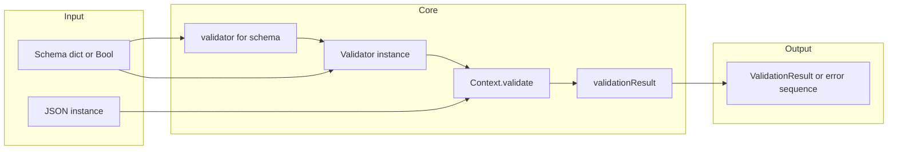
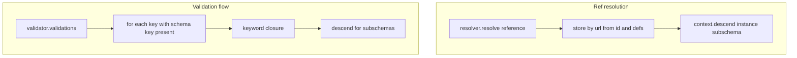

# JSONSchema.swift — Research report

## Metadata

- **Library name**: JSONSchema.swift
- **Repo URL**: https://github.com/kylef/JSONSchema.swift
- **Clone path**: `research/repos/swift/kylef-JSONSchema.swift/`
- **Language**: Swift
- **License**: BSD (see [LICENSE](research/repos/swift/kylef-JSONSchema.swift/LICENSE))

## Summary

JSONSchema.swift is a JSON Schema **validator** for Swift. Given a schema and a JSON-like instance, it reports whether the instance is valid and returns all validation errors. It does not generate code from schemas. The library supports Draft 4, Draft 6, Draft 7, Draft 2019-09, and Draft 2020-12. Draft selection is by the schema’s `$schema` keyword; if absent, Draft 2020-12 is used. Reference resolution is local only (no remote refs); `RefResolver` resolves `$ref` against a store built from the root schema’s `$id` and `$defs` (or draft-specific `id`/`definitions`). Validation is implemented via a `Validator` protocol and per-draft classes (e.g. `Draft202012Validator`) that register keyword handlers; `Context.validate(instance:schema:)` applies them and recurses for subschemas. README notes that 2019-09 and 2020-12 support are incomplete (e.g. `unevaluatedItems`/`unevaluatedProperties` are explicitly unsupported).

## JSON Schema support

- **Drafts**: Draft 4, Draft 6, Draft 7, Draft 2019-09, Draft 2020-12. Declared in [README.md](research/repos/swift/kylef-JSONSchema.swift/README.md) and in [Sources/JSONSchema.swift](research/repos/swift/kylef-JSONSchema.swift/Sources/JSONSchema.swift): `validator(for: schema)` branches on `$schema` (or `id` for Draft 4); default when `$schema` is absent is Draft 2020-12.
- **Scope**: Validation only. No code generation.
- **Subset**: For Draft 2020-12, core applicator and validation keywords are implemented. `unevaluatedItems` and `unevaluatedProperties` are registered but return an unsupported error (Draft201909Validator, Draft202012Validator). Content vocabulary (`contentEncoding`, `contentMediaType`, `contentSchema`) is not implemented. Meta-data keywords (`$comment`, `description`, `title`, `default`, `examples`, `deprecated`, `readOnly`, `writeOnly`) are not validated. `$dynamicRef`/`$dynamicAnchor` are not implemented; resolution is via `$ref` and a local store only. Remote referencing is not supported (README issue #9).

## Keyword support table

Keyword list derived from vendored draft 2020-12 meta-schemas (`specs/json-schema.org/draft/2020-12/meta/`). Implementation evidence from `Sources/Draft*Validator.swift`, `Sources/Applicators/`, `Sources/Validation/`, `Sources/Core/ref.swift`, `Sources/format.swift`, and `Sources/RefResolver.swift`.

| Keyword | Implemented | Notes |
|---------|-------------|-------|
| $anchor | partial | Used in RefResolver.storeDefinitions for building store URLs; not a validation keyword. |
| $comment | no | Accepted in schema; not validated. |
| $defs | no | Structure only; RefResolver uses defsField to load definitions into store; $ref can target them. |
| $dynamicAnchor | no | Not implemented; resolution is local $ref only. |
| $dynamicRef | no | Not implemented. |
| $id | partial | Used by RefResolver (idField) for resolution scope; not validated. |
| $ref | yes | Core/ref.swift; resolve then descend into resolved schema. |
| $schema | partial | Used by validator(for:) to select draft; not validated. |
| $vocabulary | no | Not implemented. |
| additionalProperties | yes | All drafts; Applicators/additionalProperties.swift. |
| allOf | yes | Applicators/allOf.swift. |
| anyOf | yes | Applicators/anyOf.swift. |
| const | yes | Validation/const.swift. |
| contains | yes | Applicators/contains.swift; minContains/maxContains handled therein. |
| contentEncoding | no | Not implemented. |
| contentMediaType | no | Not implemented. |
| contentSchema | no | Not implemented. |
| default | no | Meta-data; not validated. |
| dependentRequired | yes | Draft 2019-09 and 2020-12; Validation/dependentRequired.swift. |
| dependentSchemas | yes | Draft 2019-09 and 2020-12; Applicators/dependentSchemas.swift. |
| deprecated | no | Not implemented. |
| description | no | Meta-data; not validated. |
| else | yes | Handled inside Applicators/if.swift when "else" present in schema. |
| enum | yes | Validation/enum.swift; instance must match one value via isEqual. |
| examples | no | Not implemented. |
| exclusiveMaximum | yes | Draft 4: boolean alongside maximum; Draft 7+: separate keyword in Validation/minMaxNumber.swift. |
| exclusiveMinimum | yes | Draft 4: boolean alongside minimum; Draft 7+: separate keyword. |
| format | yes | format.swift; delegates to validator.formats; unknown format returns validation error. |
| if | yes | Applicators/if.swift; then/else applied when present. |
| items | yes | Applicators/items.swift; prefixItems used when present for 2020-12. |
| maxContains | yes | Used in Applicators/contains.swift. |
| maximum | yes | Validation/minMaxNumber.swift (Draft4 variant for boolean exclusive). |
| maxItems | yes | Validation/minMaxItems.swift. |
| maxLength | yes | Validation/minMaxLength.swift. |
| maxProperties | yes | Validation/minMaxProperties.swift. |
| minContains | yes | Used in Applicators/contains.swift (default 1). |
| minimum | yes | Validation/minMaxNumber.swift. |
| minItems | yes | Validation/minMaxItems.swift. |
| minLength | yes | Validation/minMaxLength.swift. |
| minProperties | yes | Validation/minMaxProperties.swift. |
| multipleOf | yes | Validation/multipleOf.swift. |
| not | yes | Applicators/not.swift. |
| oneOf | yes | Applicators/oneOf.swift. |
| pattern | yes | Validation/pattern.swift. |
| patternProperties | yes | Applicators/patternProperties.swift. |
| prefixItems | yes | Draft 2020-12; Applicators/prefixItems.swift; items applies to additional items. |
| properties | yes | Applicators/properties.swift. |
| propertyNames | yes | Applicators/propertyNames.swift. |
| readOnly | no | Not implemented. |
| required | yes | Validation/required.swift. |
| then | yes | Handled inside Applicators/if.swift when "then" in schema. |
| title | no | Meta-data; not validated. |
| type | yes | Validators.swift type(); isType per JSON Schema types. |
| unevaluatedItems | no | Explicitly unsupported in Draft201909Validator and Draft202012Validator (unsupported()). |
| unevaluatedProperties | no | Explicitly unsupported in Draft 2019-09 and 2020-12. |
| uniqueItems | yes | Validation/uniqueItems.swift. |
| writeOnly | no | Not implemented. |

## Constraints

All implemented validation keywords are enforced at runtime when validating an instance. There is no code generation; constraints (minLength, minimum, pattern, etc.) are applied during validation. The library returns `ValidationResult` (`.valid` or `.invalid([ValidationError])`) or a sequence of `ValidationError`. Format checks are performed when the format name is in the validator’s `formats` dictionary; unknown formats produce a validation error. Draft 4 uses boolean `exclusiveMinimum`/`exclusiveMaximum` alongside `minimum`/`maximum`; Draft 7+ use separate numeric keywords.

## High-level architecture

Pipeline: **Schema** (dictionary or Bool) → **validator(for: schema)** (selects validator class from `$schema`) → **Validator(schema)** (e.g. Draft202012Validator; builds RefResolver with meta-schemas and root) → **validator.validate(instance:)** → **Context(resolver, validator).validate(instance:schema)** → **ValidationResult** or **AnySequence&lt;ValidationError&gt;**. No code emission; output is validity and a list of errors.

## Medium-level architecture

- **Entry**: `validate(_ value: Any, schema: [String: Any])` or `validate(_ value: Any, schema: Bool)` in JSONSchema.swift returns `ValidationResult`. Alternatively `Schema(schema).validate(_ data: Any)` returns `ValidationResult` or `AnySequence<ValidationError>`. Both use `validator(for: schema)` then `validator.validate(instance: value)`.
- **Validator creation**: Each draft has a concrete class (Draft4Validator, Draft6Validator as typealias of Draft7Validator, Draft7Validator, Draft201909Validator, Draft202012Validator) with a `validations` dictionary mapping keyword names to `(Context, Any, Any, [String: Any]) throws -> AnySequence<ValidationError>`. RefResolver is built with schema, metaschmas, and draft-appropriate idField/defsField (Draft 4: "id"/"definitions"; Draft 7: defsField "definitions"; 2019-09/2020-12: "$id"/"$defs").
- **Reference resolution**: RefResolver stores the root by $id (or ""), loads definitions from defsField and stores them by joined URL (stack + $anchor or $id). resolve(reference:) joins reference to stack.last and resolves by URL or URL+fragment (JSONPointer). No remote fetching. ref.swift pushes scope when resolved doc has $id, then descend(instance, document), then pops.
- **Validation loop**: Context.validate(instance:schema) handles boolean schema (true = no errors, false = single error). For Draft 4/6, if schema has $ref alone, only the $ref validation is run. Otherwise, for each key in validator.validations for which schema[key] exists, keywordLocation is pushed, the validation closure is called, then popped; all resulting error sequences are joined. Subschema validation uses descend(instance, subschema) which calls validate(instance, subschema) again.

## Low-level details

- **Format registry**: Each validator exposes a `formats` dictionary: format name → `(Context, String) -> AnySequence<ValidationError>`. Draft 4: ipv4, ipv6, uri, date-time. Draft 7: adds json-pointer, regex, time, date. Draft 2019-09/2020-12: add uuid, duration. Unknown format yields a single ValidationError ("'format' validation of 'X' is not yet supported"). Implementations in format.swift and Format/*.swift (date-time, date, time, duration).
- **Type checking**: Validators.swift defines isType(_:instance) for string, number, integer, boolean, null, object, array; isInteger uses CFNumberIsFloatType (and NSNumber comparison on Linux); object = isDictionary (NSDictionary), string = isObject (Swift String).
- **Error representation**: ValidationError has description (String), instanceLocation (JSONPointer), keywordLocation (JSONPointer); Encodable with keys error, instanceLocation, keywordLocation. ValidationResult is .valid or .invalid([ValidationError]).

## Output and integration

- **Vendored vs build-dir**: N/A (no code generation). Validation is in-memory; no file output.
- **API vs CLI**: Library API only: `JSONSchema.validate(_:schema:)`, `Schema(schema).validate(_:)` (returns ValidationResult or AnySequence<ValidationError>). No CLI in the repo.
- **Writer model**: N/A. Validation results are returned as ValidationResult or a sequence of ValidationError.

## Configuration

- **Draft**: Implicit via `$schema` in schema (validator(for:) selects Draft4/6/7/2019-09/2020-12). Default when `$schema` absent is Draft 2020-12. Draft 4 uses "id" and "definitions"; later drafts use "$id" and "$defs" (Draft 7 still uses "definitions" for defsField).
- **Reference resolution**: RefResolver is built per validator with schema, metaschmas, and idField/defsField. No remote resolution; README states remote referencing is not supported.
- **Format checking**: Per-validator `formats` dictionary; unknown format fails validation with a clear error. No option to disable format validation; unsupported formats must be excluded from schema or accepted as failing.

## Pros/cons

- **Pros**: Multiple draft support (4, 6, 7, 2019-09, 2020-12); single API for validation and error sequence; JSONPointer for instance and keyword locations; optional formats (ipv4, ipv6, uri, uuid, date-time, date, time, duration, regex, json-pointer); then/else handled in if; minContains/maxContains in contains; prefixItems in 2020-12; dependentRequired/dependentSchemas in 2019-09/2020-12; Swift Package Manager and CocoaPods; uses JSON Schema Test Suite via submodule with exclusions for remote and optional tests.
- **Cons**: No code generation; no remote $ref; unevaluatedItems/unevaluatedProperties explicitly unsupported in 2019-09/2020-12; no $dynamicRef/$dynamicAnchor; content vocabulary not implemented; meta-data keywords not validated; 2019-09/2020-12 noted in README as incomplete.

## Testability

- **How to run tests**: From repo root, `swift test`. Tests depend on Spectre and PathKit (Package.swift). JSON Schema Test Suite is used via git submodule (`.gitmodules` points at json-schema/JSON-Schema-Test-Suite); tests in JSONSchemaCases.swift build cases from the suite with draft-specific exclusions (e.g. refRemote.json, optional/format files).
- **Unit tests**: Under Tests/JSONSchemaTests/: JSONSchemaTests.swift (Schema, validator selection by $schema), ValidationErrorTests.swift (ValidationError encoding), ValidationResultTests.swift, Validation/*.swift (e.g. TestRef, TestEnum, TestRequired), Format/TestDuration.swift, JSONPointerTests.swift, JSONSchemaCases (draft4, draft6, draft7, draft2019-09, draft2020-12 with exclusions).
- **Fixtures**: Inline schemas in tests; JSON Schema Test Suite used when submodule is present (buildTests in JSONSchemaCases.swift).

## Performance

- **Benchmarks**: No dedicated benchmark suite found in the cloned repo.
- **Entry points**: For validation, instantiate once with a validator (e.g. Draft202012Validator(schema: schema)) or use JSONSchema.validate(instance, schema: schema); repeated validation with same schema reuses the same validator/resolver setup.

## Determinism and idempotency

- **Validation result**: For the same schema and instance, validation outcome (valid/invalid and the set of errors) is deterministic. Error order follows the order of keyword application and recursion (validator.validations iteration and schema structure).
- **Idempotency**: N/A (no generated output). Repeated validation with the same inputs yields the same result.

## Enum handling

- **Implementation**: Validation/enum.swift: enum value must be an array; instance is compared to each element using isEqual(instance, $0) (Validators.swift isEqual for NSObject). No deduplication or normalization of the schema enum array.
- **Duplicate entries**: Enum array is not required to be unique; validation passes if instance matches any element; duplicates do not change behavior.
- **Namespace/case collisions**: Comparison is by value (isEqual); distinct values such as "a" and "A" are both allowed; no name mangling (validation only).

## Reverse generation (Schema from types)

No. The library only validates instances against JSON Schema. There is no facility to generate JSON Schema from Swift types.

## Multi-language output

N/A. The library does not generate code; it only validates. Output is validation result and errors in Swift.

## Model deduplication and $ref/$defs

N/A for code generation. For validation: **$ref** and **$defs** (or **definitions**) are used for resolution only. RefResolver builds a store from the root schema’s $id and defsField; resolve(reference:) looks up by URL/fragment (JSONPointer). The validator then descends into the resolved schema. Each $ref is resolved from the store; no remote refs; no $dynamicRef/$dynamicAnchor. There is no “model” to deduplicate; resolution is by URL/fragment as defined by the schema author.

## Validation (schema + JSON → errors)

Yes. This is the library’s primary function.

- **Inputs**: Schema ([String: Any] or Bool) and instance (Any, typically JSON-like). Draft is inferred from schema’s $schema (or default Draft 2020-12).
- **API**: `JSONSchema.validate(_ value: Any, schema: [String: Any]) throws -> ValidationResult`; `Schema(schema).validate(_ data: Any) throws -> ValidationResult` or `throws -> AnySequence<ValidationError>`. Validator protocol: `validate(instance:) throws -> ValidationResult` or `throws -> AnySequence<ValidationError>`.
- **Output**: ValidationResult is .valid or .invalid([ValidationError]). ValidationError has description, instanceLocation (JSONPointer path), keywordLocation (JSONPointer path). Encodable as JSON with keys error, instanceLocation, keywordLocation.
- **CLI**: None in the repo.
