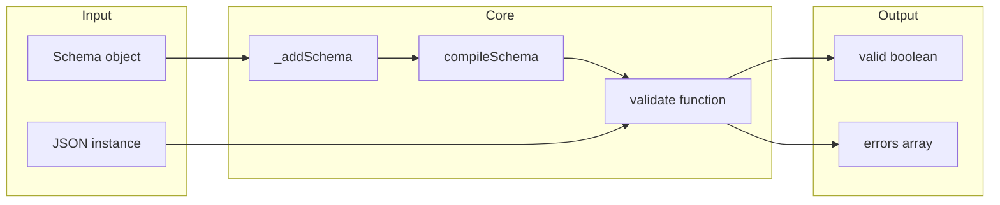
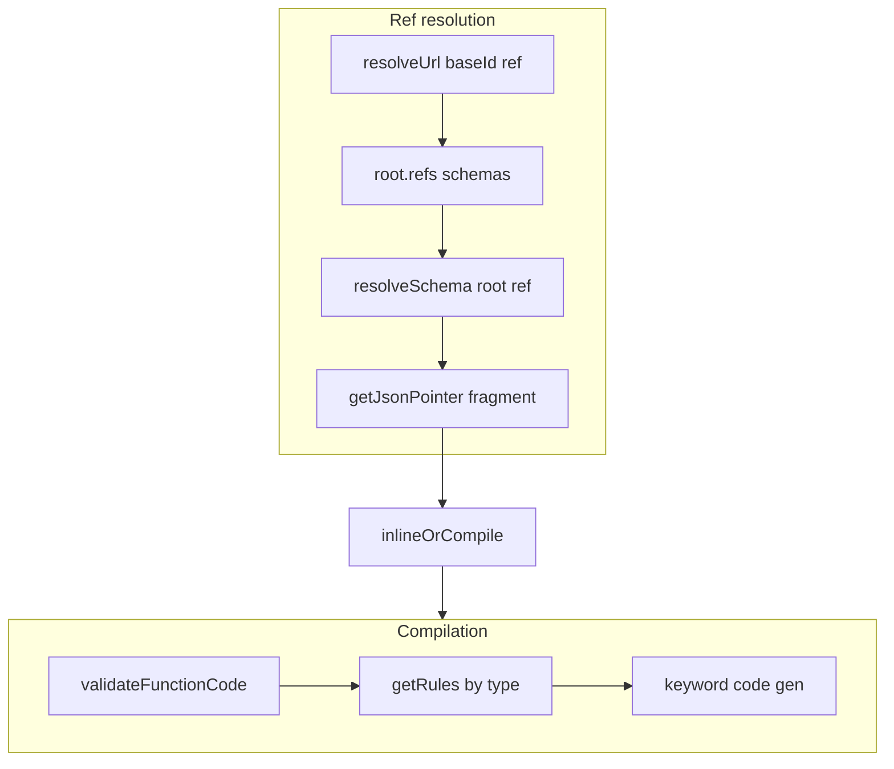

# Ajv — Research report

## Metadata

- **Library name**: Ajv
- **Repo URL**: https://github.com/ajv-validator/ajv
- **Clone path**: `research/repos/typescript/ajv-validator-ajv/`
- **Language**: TypeScript / JavaScript
- **License**: MIT (see package.json)

## Summary

Ajv is a fast JSON Schema validator for Node.js and the browser. It is **validator only**: given a schema and a JSON instance, it reports whether the instance is valid and can yield one or all validation errors. It does not generate application types or data models from schemas. The library compiles schemas into validation functions (code generation for the validator itself, not for user types). It supports JSON Schema draft-06, draft-07, draft 2019-09, and draft 2020-12, plus JSON Type Definition (JTD). Separate entry points (default Ajv, Ajv2019, Ajv2020) and bundles (ajv, ajv2019, ajv2020, ajvJTD) target different drafts. Reference resolution uses `$id` and URI resolution (configurable `uriResolver`); compilation resolves `$ref`, `$dynamicRef`, and supports remote schemas via `addSchema` or `compileAsync` with `loadSchema`.

## JSON Schema support

- **Drafts**: Draft 06, Draft 07, Draft 2019-09, Draft 2020-12. Draft-04 is documented as requiring the ajv-draft-04 package. Declared in README and in lib entry points: `lib/ajv.ts` (Draft 07), `lib/2019.ts` (2019-09), `lib/2020.ts` (2020-12). Meta-schemas and refs live under `lib/refs/` (e.g. json-schema-draft-06.json, json-schema-draft-07.json, json-schema-2019-09/, json-schema-2020-12/). JTD supported via `lib/jtd.ts` and refs/jtd-schema.ts.
- **Scope**: Validation only. No generation of types or models for application code.
- **Subset**: For Draft 2020-12, Ajv implements core, applicator, validation, dynamic refs, unevaluated, and format keywords. Meta-data keywords (`$comment`, `description`, `title`, `default`, `examples`, `deprecated`, `readOnly`, `writeOnly`) are in the vocabulary but accepted only (no validation of instance data). Content vocabulary (`contentEncoding`, `contentMediaType`, `contentSchema`) is registered in `vocabularies/metadata.ts` but has no validation implementation. `$schema` and `$id` drive meta-schema selection and reference resolution. `$anchor` and `$dynamicAnchor` are used during reference collection in `compile/resolve.ts` (getSchemaRefs).

## Keyword support table

Keyword list derived from vendored draft 2020-12 meta-schemas (`specs/json-schema.org/draft/2020-12/meta/`). Implementation evidence from `lib/vocabularies/` (core, applicator, validation, unevaluated, dynamic, next, format, metadata), `lib/compile/`, and `lib/refs/`.

| Keyword | Implemented | Notes |
|---------|-------------|-------|
| $anchor | partial | Used in ref resolution (getSchemaRefs, addAnchor); not a validation keyword. |
| $comment | no | Meta-data; accepted in schema but not validated. |
| $defs | no | Structure only; no dedicated validator; $ref can target definitions. |
| $dynamicAnchor | yes | vocabularies/dynamic/dynamicAnchor; Draft 2019-09+ with dynamicRef option. |
| $dynamicRef | yes | vocabularies/dynamic/dynamicRef; requires dynamicRef option. |
| $id | partial | Used for baseId and resolution scope (SchemaEnv, getSchemaRefs); not validated. |
| $ref | yes | vocabularies/core/ref.ts; resolveRef, compile/resolve.ts. |
| $schema | partial | Used for meta-schema selection and validation; not validated as data. |
| $vocabulary | no | In core vocabulary as keyword name only; no validator. |
| additionalProperties | yes | vocabularies/applicator/additionalProperties. |
| allOf | yes | vocabularies/applicator/allOf. |
| anyOf | yes | vocabularies/applicator/anyOf. |
| const | yes | vocabularies/validation/const. |
| contains | yes | vocabularies/applicator/contains; minContains/maxContains in same and limitContains. |
| contentEncoding | no | In contentVocabulary; accepted, not validated. |
| contentMediaType | no | In contentVocabulary; accepted, not validated. |
| contentSchema | no | In contentVocabulary; accepted, not validated. |
| default | no | Meta-data; accepted, not validated. |
| dependentRequired | yes | vocabularies/validation/dependentRequired (next vocabulary). |
| dependentSchemas | yes | vocabularies/applicator/dependentSchemas (next vocabulary). |
| deprecated | no | Meta-data; accepted, not validated. |
| description | no | Meta-data; accepted, not validated. |
| else | yes | vocabularies/applicator/thenElse (then/else with if). |
| enum | yes | vocabularies/validation/enum; instance must equal one of the values. |
| examples | no | Meta-data; accepted, not validated. |
| exclusiveMaximum | yes | vocabularies/validation/limitNumber. |
| exclusiveMinimum | yes | vocabularies/validation/limitNumber. |
| format | yes | vocabularies/format/format; optional, configurable via addFormat/formats option. |
| if | yes | vocabularies/applicator/if. |
| items | yes | vocabularies/applicator/items (draft-07) or items2020 (2020-12 with prefixItems). |
| maxContains | yes | Used in contains and limitContains (next). |
| maximum | yes | vocabularies/validation/limitNumber. |
| maxItems | yes | vocabularies/validation/limitItems. |
| maxLength | yes | vocabularies/validation/limitLength; unicode-aware via ucs2length by default. |
| maxProperties | yes | vocabularies/validation/limitProperties. |
| minContains | yes | Used in contains and limitContains. |
| minimum | yes | vocabularies/validation/limitNumber. |
| minItems | yes | vocabularies/validation/limitItems. |
| minLength | yes | vocabularies/validation/limitLength. |
| minProperties | yes | vocabularies/validation/limitProperties. |
| multipleOf | yes | vocabularies/validation/multipleOf. |
| not | yes | vocabularies/applicator/not. |
| oneOf | yes | vocabularies/applicator/oneOf. |
| pattern | yes | vocabularies/validation/pattern. |
| patternProperties | yes | vocabularies/applicator/patternProperties. |
| prefixItems | yes | vocabularies/applicator/prefixItems (Draft 2020-12). |
| properties | yes | vocabularies/applicator/properties. |
| propertyNames | yes | vocabularies/applicator/propertyNames. |
| readOnly | no | Meta-data; accepted, not validated. |
| required | yes | vocabularies/validation/required. |
| then | yes | vocabularies/applicator/thenElse. |
| title | no | Meta-data; accepted, not validated. |
| type | yes | vocabularies/validation (type + nullable); compile/validate/dataType. |
| unevaluatedItems | yes | vocabularies/unevaluated/unevaluatedItems (2019-09+ with unevaluated option). |
| unevaluatedProperties | yes | vocabularies/unevaluated/unevaluatedProperties. |
| uniqueItems | yes | vocabularies/validation/uniqueItems. |
| writeOnly | no | Meta-data; accepted, not validated. |

## Constraints

All validation keywords are enforced at runtime when validating an instance. The library compiles each schema into a validation function (codegen in `lib/compile/codegen/` and `lib/compile/validate/`); constraints (minLength, minimum, pattern, etc.) are applied by that generated code. No generation of user-facing types or serialization code. Format checks are optional and configurable via `addFormat` or the `formats` option; `validateFormats` can disable format validation.

## High-level architecture

Pipeline: **Schema** (object or boolean) → **addSchema / compile** (normalize ID, resolve refs, build SchemaEnv) → **compileSchema** (CodeGen, validateFunctionCode) → **validate function** (generated function; called with data) → **valid** (boolean) and **errors** (ErrorObject[] on the function or on the Ajv instance). Compilation is cached by schema object (Map in core.ts). Standalone validation code can be emitted (documented on the website) for use without the full Ajv runtime.

## Medium-level architecture

- **Entry**: `validate(schema, data)` or `compile(schema)` then `validate(data)`. `validate` compiles the schema if needed (via `_addSchema` then `_compileSchemaEnv`) or looks up by key/ref. `compile` returns a `ValidateFunction`; calling it runs the generated code and sets `ajv.errors` (or the function’s `errors`) when invalid. Async validation supported via `$async` and `compileAsync` when schemas reference remotely loaded schemas.
- **Compilation**: `compileSchema` in `lib/compile/index.ts` creates a CodeGen, builds a SchemaCxt, and calls `validateFunctionCode` (lib/compile/validate/index.ts), which applies rules from `lib/compile/rules.ts` by type and keyword. Keywords are registered in vocabularies (core, applicator, validation, etc.); each keyword can emit code (CodeKeywordDefinition) or provide a validate function. The generated function is built via `new Function(...)` from the emitted source string.
- **Reference resolution**: `resolveRef` (compile/index.ts) resolves a ref via `resolveUrl(uriResolver, baseId, ref)` and looks up `root.refs[ref]` or `resolveSchema(root, ref)`. `resolveSchema` in compile/index.ts uses `uriResolver.parse`, `getFullPath`, and `getJsonPointer` for fragment resolution. Local refs and anchors are collected in `getSchemaRefs` (compile/resolve.ts) by traversing the schema and registering `$id`, `$anchor`, `$dynamicAnchor`. Remote schemas must be added with `addSchema` or loaded via `loadSchema` in `compileAsync`.

## Low-level details

- **Format**: `lib/vocabularies/format/format.ts` and `lib/runtime/`; formats are stored in `this.formats`; optional ajv-formats package. Regex can use re2 (optional) or built-in RegExp; `unicodeRegExp` option controls Unicode mode.
- **Error shape**: `ErrorObject` in lib/types/index.ts has `keyword`, `instancePath`, `schemaPath`, `params`, optional `message`, `schema`, `parentSchema`, `data`. `ValidationError` (lib/runtime/validation_error.ts) extends Error and holds `errors: Partial<ErrorObject>[]`.
- **$id**: Handled in core vocabulary and resolve; schemaId option (`$id` or `id`) controls which property is used as the schema URI.

## Output and integration

- **Vendored vs build-dir**: N/A (no generation of user types or files). Compiled validation functions are in-memory. Standalone validation code can be generated (see docs) for use without Ajv.
- **API vs CLI**: Library API: `new Ajv()`, `ajv.validate(schema, data)`, `ajv.compile(schema)`, `ajv.addSchema(schema)`, `ajv.addFormat(name, format)`, `ajv.addKeyword(definition)`. CLI is a separate package (ajv-cli), documented on the website.
- **Writer model**: N/A. Validation returns boolean and attaches errors to the validate function or `ajv.errors`.

## Configuration

- **Draft / entry point**: Use default `Ajv` (Draft 07), `Ajv2019`, or `Ajv2020` from respective entry points; or bundle (ajv, ajv2019, ajv2020, ajvJTD). Options include `strict`, `strictSchema`, `strictNumbers`, `strictTypes`, `strictTuples`, `strictRequired`, `allErrors`, `validateFormats`, `formats`, `keywords`, `schemas`, `loadSchema`, `uriResolver`, `$data`, `unevaluated`, `dynamicRef`, `discriminator`, `removeAdditional`, `useDefaults`, `coerceTypes`, `code` (es5, source, process, regExp, optimize), etc.
- **Reference resolution**: `uriResolver` option (default from lib/runtime/uri); `addSchema` for preloaded schemas; `compileAsync` with `loadSchema` for async loading.
- **Format checking**: `addFormat(name, format)`, `formats` option, `validateFormats` to enable/disable.

## Pros/cons

- **Pros**: Multiple draft support (06, 07, 2019-09, 2020-12, JTD); compile-once validate-many model; optional allErrors; configurable formats and keywords; extensible (addKeyword, addFormat); standalone code emission; strict mode; good performance from generated validation code; TypeScript types; widely used.
- **Cons**: No generation of application types or DTOs; content vocabulary not implemented; meta-data keywords not validated; CLI in separate package.

## Testability

- **How to run tests**: From repo root, `npm test` runs `json-tests`, `prettier:check`, `eslint`, then `test-cov`. `npm run test-spec` runs Mocha with ts-node on `spec/**/*.spec.{ts,js}` (dot reporter). `npm run test-cov` uses nyc for coverage. `npm run json-tests` runs the JSON Schema test suite via scripts/jsontests.
- **Unit tests**: Under `spec/` (e.g. schema-tests.spec.ts, resolve.spec.ts, options/*.spec.ts, security.spec.ts). Tests use schemas in spec/tests/, spec/remotes/, spec/options/.
- **Fixtures**: spec/tests/schemas/, spec/tests/rules/, spec/tests/issues/, spec/remotes/. Entry points for external benchmarking: `ajv.compile(schema)(data)` or `ajv.validate(schema, data)`.

## Performance

- **Benchmarks**: README references external benchmarks (json-schema-benchmark, jsck, z-schema, themis). Repo has `benchmark/` with package.json and jtd.js; `npm run benchmark` runs from package root (build then benchmark/jtd). Package.json script: `npm i && npm run build && npm link && cd ./benchmark && npm link ajv && npm i && node ./jtd`.
- **Entry points**: For benchmarking validation: `const validate = ajv.compile(schema)` then `validate(instance)`; or `ajv.validate(schema, instance)`.

## Determinism and idempotency

- **Validation result**: For the same schema and instance, validation outcome (valid/invalid and the errors array) is deterministic. Compiled functions are cached by schema object reference, so repeated compile of the same schema returns the same function.
- **Idempotency**: N/A (no generated output files). Repeated validation with the same inputs yields the same result.

## Enum handling

- **Implementation**: `lib/vocabularies/validation/enum.ts` uses a code keyword that checks the instance against the schema enum array via `equal` (runtime/equal). For small enums it unrolls; for larger or `$data` it loops. No deduplication or normalization of the schema enum array.
- **Duplicate entries**: Schema is not normalized; duplicate enum values are allowed. Validation requires instance to match one of the values; duplicates do not change behavior.
- **Namespace/case collisions**: Comparison is by value (fast-deep-equal); distinct values such as `"a"` and `"A"` are both allowed and validated independently.

## Reverse generation (Schema from types)

No. The library only validates JSON instances against JSON Schema. There is no facility to generate JSON Schema from TypeScript/JavaScript types.

## Multi-language output

N/A. The library does not generate code for other languages; it only validates. Output is validation result (and errors) in JavaScript/TypeScript.

## Model deduplication and $ref/$defs

N/A for code generation. For validation: **$ref** and **$defs** are used for resolution only. `resolveRef` and `resolveSchema` resolve URIs and fragments; the compiled validator invokes the resolved schema’s validate function or inlines the schema when `inlineRef` allows. Each $ref is resolved at compile time; the same definition can be applied at multiple instance locations. There is no “model” to deduplicate; resolution is by URI/fragment and does not merge schema objects beyond what the schema author defined with $ref.

## Validation (schema + JSON → errors)

Yes. This is the library’s primary function.

- **Inputs**: Schema (object, boolean, or string key/ref) and instance (any JSON-like data). Optional: preloaded schemas via `addSchema`, formats via `addFormat`, options at Ajv construction.
- **API**: `ajv.validate(schema, data)` returns boolean and sets `ajv.errors` when invalid. `const validate = ajv.compile(schema)` returns a function; `validate(data)` returns boolean and sets `validate.errors`. `allErrors: true` collects all errors; otherwise reporting stops at the first failure.
- **Output**: `ErrorObject[]` with `keyword`, `instancePath`, `schemaPath`, `params`, optional `message`, `schema`, `parentSchema`, `data`. `ajv.errorsText(errors)` formats errors as a string. `ValidationError` wraps an array of errors for throw/catch.
- **CLI**: Separate package (ajv-cli), documented on the Ajv website.
