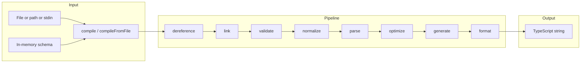
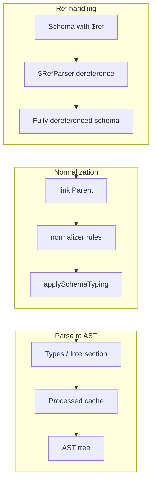

# json-schema-to-typescript — Research report

## Metadata

- **Library name**: json-schema-to-typescript
- **Repo URL**: https://github.com/bcherny/json-schema-to-typescript
- **Clone path**: `research/repos/typescript/bcherny-json-schema-to-typescript/`
- **Language**: TypeScript
- **License**: MIT (package.json)

## Summary

json-schema-to-typescript compiles JSON Schema to TypeScript typings. It reads JSON or YAML schema files (or in-memory schema objects), dereferences `$ref` via @apidevtools/json-schema-ref-parser, normalizes and links the schema, parses it into an internal AST, optimizes the AST, and emits TypeScript source (interfaces, type aliases, enums) with optional Prettier formatting. It supports CLI (`json2ts`) and programmatic API (`compile`, `compileFromFile`). Output is TypeScript only; the library does not validate JSON instances against the schema.

## JSON Schema support

- **Drafts**: No explicit draft detection in code; types use `JSONSchema4` from `@types/json-schema` (draft-04 style). Test fixtures and e2e snapshots use `$schema` URIs for draft-03, draft-04, draft-06, draft-07, 2019-09, and 2020-12; the library accepts these schemas but does not branch behavior on draft. Definitions are normalized to `$defs` and `id` to `$id`; tuple representation uses `items` array plus `minItems`/`maxItems` (draft-04/07 style), not `prefixItems` (2020-12).
- **Scope**: Code generation only (schema → TypeScript). No built-in JSON instance validation.
- **Subset**: Many draft 2020-12 keywords are not implemented. Supported structurally: type, properties, required, items, additionalItems, additionalProperties, patternProperties (partial), enum, const (normalized to enum), allOf, anyOf, oneOf (treated as anyOf), $ref, $defs/definitions, $id, title, description, default (for type inference only), deprecated, minItems/maxItems (tuples). Not supported or not expressible in output: $anchor, $vocabulary, $dynamicRef/$dynamicAnchor, if/then/else, contains, contentEncoding/contentMediaType/contentSchema, dependentRequired/dependentSchemas, unevaluatedProperties/unevaluatedItems, format, minimum/maximum/exclusiveMinimum/exclusiveMaximum, minLength/maxLength, pattern, minProperties/maxProperties, multipleOf, uniqueItems, not, propertyNames, readOnly, writeOnly, examples; prefixItems is not used (items array used for tuples).

## Keyword support table

Keyword list derived from vendored draft 2020-12 meta-schemas (`specs/json-schema.org/draft/2020-12/meta/*.json`). Implementation evidence from `src/parser.ts`, `src/generator.ts`, `src/normalizer.ts`, `src/typesOfSchema.ts`, `src/types/JSONSchema.ts`, `src/types/AST.ts`, and README.

| Keyword | Implemented | Notes |
|---------|-------------|-------|
| $anchor | no | Not referenced in code; no resolution or emission. |
| $comment | no | Not parsed or preserved in types/AST. |
| $defs | yes | Normalizer transforms `definitions` to `$defs`; parser uses `$defs` for definitions and unreachableDefinitions. |
| $dynamicAnchor | no | Not in types or resolution. |
| $dynamicRef | no | Not in types or resolution; $ref resolved via dereference only. |
| $id | yes | Normalizer maps `id` to `$id`; used for standalone names and dereferenced paths. |
| $ref | yes | Resolved by dereference() via @apidevtools/json-schema-ref-parser; in-document and remote. |
| $schema | partial | Passed through in schemas; not used for draft selection or behavior. |
| $vocabulary | no | Not parsed or used. |
| additionalProperties | yes | Default from options; parser emits index signature or forbids extras; boolean or schema. |
| allOf | yes | typesOfSchema ALL_OF; parser INTERSECTION; generator intersection types. |
| anyOf | yes | typesOfSchema ANY_OF; parser UNION. |
| const | yes | Normalizer transforms const to singleton enum; emitted as literal/union. |
| contains | no | Not in typesOfSchema or parser. |
| contentEncoding | no | Not supported. |
| contentMediaType | no | Not supported. |
| contentSchema | no | Not supported. |
| default | partial | Used in typesOfSchema for type inference when type missing; maybeStripDefault strips when mismatched; not emitted as default value in TypeScript. |
| dependentRequired | no | README lists dependencies as not expressible; not in parser. |
| dependentSchemas | no | Not in parser. |
| deprecated | yes | In JSONSchema type; parser passes to AST; generator emits @deprecated JSDoc. |
| description | yes | Parser comment; generator JSDoc. |
| else | no | if/then/else not supported. |
| enum | yes | NAMED_ENUM (with tsEnumNames) or UNNAMED_ENUM; parser/generator emit enum or union of literals. |
| examples | no | Not in parser or generator. |
| exclusiveMaximum | no | README: maximum/minimum not expressible in TypeScript. |
| exclusiveMinimum | no | Same as exclusiveMaximum. |
| format | no | README: format not expressible; not used for codegen. |
| if | no | if/then/else not supported. |
| items | yes | Single schema or array; normalizer builds tuple from items + minItems/maxItems; parser TYPED_ARRAY/UNTYPED_ARRAY, additionalItems. |
| maxContains | no | Not in schema types or parser. |
| maximum | no | README: not expressible in TypeScript. |
| maxItems | yes | Normalizer, parser TUPLE, validator; drives tuple unions or fallback to array. |
| maxLength | no | In BLACKLISTED_KEYS; not emitted in types. |
| maxProperties | no | README: not expressible. |
| minContains | no | Not implemented. |
| minimum | no | README: not expressible. |
| minItems | yes | Normalizer, parser TUPLE, validator. |
| minLength | no | In BLACKLISTED_KEYS; not emitted. |
| minProperties | no | README: not expressible. |
| multipleOf | no | README: not expressible. |
| not | no | LinkedJSONSchema has not; typesOfSchema has no matcher; README: not expressible. |
| oneOf | yes | Treated like anyOf; parser UNION. |
| pattern | no | README: not expressible. |
| patternProperties | partial | Parser supports single patternProperty when additionalProperties false; README "partial support". |
| prefixItems | no | Tuple handling uses items array + minItems/maxItems; prefixItems not referenced. |
| properties | yes | Parser SchemaSchema, TInterfaceParam; generator interface fields. |
| propertyNames | no | Not in parser or generator. |
| readOnly | no | Not in parser or generator. |
| required | yes | Normalizer default/transform; parser isRequired; generator optional vs required. |
| then | no | if/then/else not supported. |
| title | yes | Used for standalone name / interface name. |
| type | yes | typesOfSchema and parser drive STRING, NUMBER, BOOLEAN, NULL, OBJECT, ARRAY, UNION, etc. |
| unevaluatedItems | no | Not in types or parser. |
| unevaluatedProperties | no | Not in types or parser. |
| uniqueItems | no | README: not expressible. |
| writeOnly | no | Not in parser or generator. |

## Constraints

Validation keywords are used only for **structure** (types, optionality, tuple length). minimum, maximum, minLength, maxLength, pattern, multipleOf, minProperties, maxProperties, uniqueItems are listed in README as "Not expressible in TypeScript" and are not emitted as runtime checks or type refinements. minItems/maxItems affect tuple and array type shape (and optional JSDoc @minItems/@maxItems in normalizer). The library does not generate validation code; generated types are for static typing only.

## High-level architecture

Pipeline: **Schema input** (file, path, or in-memory JSONSchema4) → **dereference** (@apidevtools/json-schema-ref-parser, resolves $ref) → **link** (add Parent references to each node) → **validate** (internal rules: enum/tsEnumNames length, minItems/maxItems consistency, deprecated boolean) → **normalize** (rules: id→$id, definitions→$defs, const→enum, default additionalProperties, minItems/maxItems/items tuple handling, applySchemaTyping) → **parse** (NormalizedJSONSchema → AST) → **optimize** (dedupe union/intersection members, collapse to any/unknown) → **generate** (AST → TypeScript string) → **format** (Prettier) → **Output** (string or file).

## Medium-level architecture

- **resolver (dereference)**: Uses `$RefParser.dereference(cwd, schema, options)` to resolve all $ref (local files, HTTP). Returns dereferenced schema and WeakMap of schema node → original $ref path. No separate $id-based resolution; refs are inlined by the parser.
- **linker**: Recursive traversal attaching `Parent` symbol to each schema node for downstream normalizer/parser (e.g. root lookup, definitions).
- **normalizer**: Runs a list of rules over the linked schema (traverse): id→$id, definitions→$defs, const→enum, default additionalProperties, required default/transform, minItems/maxItems/items tuple normalization, extends array, JSDoc for minItems/maxItems, optional removal of minItems/maxItems per options. Final rule pre-calculates schema types via `applySchemaTyping` (sets Types and possibly Intersection on each node).
- **typesOfSchema / applySchemaTyping**: Duck-types each schema into SchemaType (ALL_OF, ANY_OF, ONE_OF, NAMED_SCHEMA, NAMED_ENUM, UNNAMED_ENUM, REFERENCE, TYPED_ARRAY, UNTYPED_ARRAY, etc.). Multi-type schemas get an ALL_OF intersection with the original schema as the sole member; Types and Intersection are attached for the parser.
- **parser**: Recursively builds AST from NormalizedJSONSchema using Types/Intersection; caches by (schema, type) to handle cycles. Produces TInterface, TUnion, TIntersection, TEnum, TTuple, TArray, literals, etc. References are already resolved (no REFERENCE in normal flow); definitions from $defs, patternProperties and additionalProperties drive interface params.
- **optimizer**: Deduplicates union/intersection members, collapses union containing any/unknown to single any/unknown, removes duplicate named type in unions.
- **generator**: Recursively emits TypeScript from AST: declareNamedTypes, declareNamedInterfaces, declareEnums; generateType for inline types (interface body, tuple, union, etc.). Uses standaloneName for references; Prettier in formatter.

## Low-level details

- **Name generation**: standaloneName from customName(schema, keyNameFromDefinition) || title || $id || keyNameFromDefinition; generateName() in utils produces safe TS identifiers and deduplicates via usedNames.
- **Extends**: Draft-04 style `extends` (array of schemas) is normalized and parsed as superTypes on TInterface; generator emits `extends Base1, Base2`.
- **additionalItems**: When items is array, parser sets TTuple.spreadParam from schema.additionalItems (true → any/unknown, schema → parsed type).

## Output and integration

- **Vendored vs build-dir**: Generated output is not vendored by the tool; user writes to file or stdout. Configurable via CLI `--output` / `-o` or API (caller writes compile() result).
- **API vs CLI**: Both. CLI: `json2ts` (bin in package.json), accepts `-i`/`--input`, `-o`/`--output`, glob or directory. API: `compile(schema, name, options)` and `compileFromFile(filename, options)` return Promise<string>. No macros.
- **Writer model**: compile() returns a string. CLI writes to stdout or files (writeFileSync). No generic Writer abstraction; string is the only output type.

## Configuration

- **Options** (index.ts, README): additionalProperties (default for when not set), bannerComment, customName (function for type names), cwd (for $ref), declareExternallyReferenced, enableConstEnums, inferStringEnumKeysFromValues, format (Prettier on/off), ignoreMinAndMaxItems, maxItems (cap for tuple unions, or -1 to ignore), strictIndexSignatures, style (Prettier config), unreachableDefinitions, unknownAny, $refOptions (passed to $RefParser).
- **Naming**: customName, title/$id/keyFromDefinition for standalone names; generateName for safe identifiers.
- **Map types**: additionalProperties boolean → no index signature or index signature; schema → index signature with that type. patternProperties → one or more pattern keys (partial; single pattern can be used as index signature).

## Pros/cons

- **Pros**: Simple pipeline; CLI and API; supports $ref (local and remote via $RefParser); allOf/anyOf/oneOf; enum and const; tuple via minItems/maxItems; optional Prettier; browser bundle; customName and tsType/tsEnumNames extensions; idempotence test; no input mutation.
- **Cons**: No draft-specific behavior; many validation keywords not expressible (format, min/max, pattern, etc.); patternProperties partial; oneOf treated as anyOf; no if/then/else, contains, unevaluated*, $anchor/$dynamicRef; no validation API; TypeScript only.

## Testability

- **Framework**: Ava. Tests run from compiled JS in `dist/test/test.js` (ava config in package.json).
- **Running tests**: `npm test` (runs pre-test: clean, format-check, build:server, then ava --timeout=300s --verbose). TDD: `npm run tdd` (watch + watch:test).
- **Fixtures**: test/resources/*.json (e.g. Person.json, Enum.json, ReferencedType.json, MultiSchema/), test/normalizer/, test/e2e/*.ts (expected output snapshots); test/__fixtures__/ (cached remote schemas). E2E loads modules from test/e2e/*.js (compiled), each exporting input schema and optional options; snapshot compared to compile() output.
- **Entry point for external fixtures**: CLI `json2ts -i <file> -o <file>` or `compile(schema, name, options)` / `compileFromFile(filename, options)`.

## Performance

- No dedicated benchmark suite in the repo. README FAQ: Prettier can be slow on large files; set `format: false` to improve performance. stresstest script runs `npm test` 10 times (seq 1 10 | xargs -I{} npm test). Entry points for benchmarking: `compile(schema, name, options)` or CLI with same inputs.

## Determinism and idempotency

- **Input mutation**: testIdempotence asserts compile() does not mutate input (cloneDeep compare before/after). compile() clones schema at start (cloneDeep) before dereference.
- **Idempotent output**: testIdempotence asserts two compile(Schema, 'A') calls return identical strings. No explicit sorting of properties or types; order follows traversal. Optimizer dedupes union/intersection members; parser uses Map/Set for processed and usedNames, so order can be insertion-dependent. Same input and options are expected to produce same output in practice; no documented guarantee of minimal diff on schema change.

## Enum handling

- **Duplicate entries**: Parser maps enum array to AST params (NAMED_ENUM: tsEnumNames[n] as keyName; UNNAMED_ENUM: literal per value). No explicit deduplication of enum values; duplicate values would yield duplicate keys in TS enum or duplicate union members. Generator uses keyName for enum member names; containsSpecialCharacters quotes key. Unknown whether duplicate values are deduped or cause duplicate identifiers.
- **Namespace/case collisions**: generateName (utils) is used for standalone names; enum member names come from tsEnumNames or from literal value. No explicit handling for "a" vs "A" collisions in enum; TypeScript enum keys must be distinct. Unknown.

## Reverse generation (Schema from types)

No. The library only compiles JSON Schema to TypeScript. There is no API or CLI to generate JSON Schema from existing TypeScript types or code.

## Multi-language output

TypeScript only. The library generates TypeScript typings (interfaces, type aliases, enums). No option or module to emit other languages (e.g. Kotlin, Go, Python).

## Model deduplication and $ref/$defs

- **$ref**: All $ref are resolved (dereferenced) before parsing; the parser sees inlined schemas. So each $ref target becomes part of the same document; repeated references to the same definition are the same schema object in memory. Names for those nodes come from $id/title/dereferenced path (normalizer) and keyNameFromDefinition when the schema is in $defs.
- **$defs**: Definitions are normalized to $defs; parser looks up getRootSchema(schema).$defs and findKey(definitions, _ === schema) for keyNameFromDefinition. When the same schema is referenced in multiple places (after dereference, it is the same object), the parser cache (processed Map by schema + type) returns the same AST node, so one type is emitted and referenced by name. Inline object shapes in different branches that are not in $defs and were not $ref targets are distinct schema objects and get distinct types (no structural deduplication).
- **Deduplication**: By object identity (same schema node = same AST = one named type). No structural deduplication of identical but distinct inline schemas.

## Validation (schema + JSON → errors)

No. The library does not provide an API to validate a JSON instance against a JSON Schema. It only compiles schema to TypeScript types. The internal validator (validator.ts) checks schema-internal consistency (enum/tsEnumNames length, minItems/maxItems rules, deprecated type), not instance validation. Generated types can be used with other tools for runtime validation, but the library itself does not report schema + JSON → errors.
