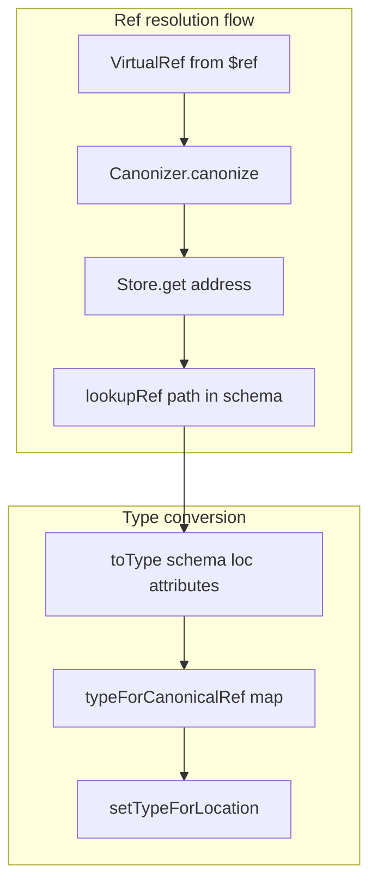

# quicktype — Research report

## Metadata

- **Library name**: quicktype
- **Repo URL**: https://github.com/glideapps/quicktype
- **Clone path**: `research/repos/typescript/glideapps-quicktype/`
- **Language**: TypeScript
- **License**: Apache-2.0 (see package.json)

## Summary

quicktype is a multi-language code generator that produces strongly-typed models and serializers from JSON, JSON Schema, TypeScript, and GraphQL. For JSON Schema input, it reads one or more schema sources (file or URL), resolves `$ref` and `$id`, builds an internal type graph (TypeBuilder), then runs rewrites (resolve intersections, flatten unions, infer maps, etc.) and emits code for a chosen target language. It supports many target languages (TypeScript, Swift, Go, Rust, C#, Python, Kotlin, Java, and others) and can also emit JSON Schema as output (reverse: types → schema). The implementation is TypeScript in a monorepo; schema handling lives in the `quicktype-core` package.

## JSON Schema support

- **Drafts**: No explicit draft validation on input. The library accepts common JSON Schema keywords and structure; refs use URI + JSON Pointer–style fragments. Output when generating JSON Schema uses `$schema: "http://json-schema.org/draft-06/schema#"` (see `packages/quicktype-core/src/language/JSONSchema/JSONSchemaRenderer.ts`). Input supports `definitions` (Draft 4 style) and `$id` for resolution scope; resolution is path-based so `$defs` can be used as a path segment.
- **Scope**: Code generation from schema (schema → types → emitted code). No schema validation (instance vs schema).
- **Subset**: Core applicator and validation keywords used for type shape: `type`, `properties`, `items` (array or tuple-style array), `required`, `additionalProperties`, `patternProperties` (only the `".*"` hack for additionalProperties), `$ref`, `allOf`, `oneOf`, `anyOf`, `enum`, `const`, `format` (for string subtypes), `title`, `description`, `minimum`/`maximum`, `minLength`/`maxLength`, `pattern`. Not supported in input: `not`, `if`/`then`/`else`, `prefixItems`, `unevaluatedItems`/`unevaluatedProperties`, `dependentRequired`/`dependentSchemas`, `content*`, `$dynamicRef`/`$dynamicAnchor`, `$vocabulary`; array constraints like `minItems`/`maxItems`/`uniqueItems` and number `multipleOf`/`exclusiveMinimum`/`exclusiveMaximum` are not read.

## Keyword support table

Keyword list derived from vendored draft 2020-12 meta-schemas (`specs/json-schema.org/draft/2020-12/meta/`). Implementation evidence from `packages/quicktype-core/src/input/JSONSchemaInput.ts`, `packages/quicktype-core/src/attributes/Constraints.ts`, `Description.ts`, `EnumValues.ts`, and related attribute producers.

| Keyword | Implemented | Notes |
|---------|-------------|-------|
| $anchor | no | Not used in input handling. |
| $comment | no | Not read or preserved. |
| $defs | partial | Resolved as path segment when $ref targets #/$defs/... ; no explicit $defs vs definitions branching. |
| $dynamicAnchor | no | Not implemented. |
| $dynamicRef | no | Not implemented. |
| $id | partial | Used for resolution scope (Location.updateWithID, Canonizer.addIDs); not validated. |
| $ref | yes | Ref.parse, Resolver.resolveVirtualRef; resolves against base, fetches remote via JSONSchemaStore. |
| $schema | partial | Not used to select draft on input; output schema uses draft-06. |
| $vocabulary | no | Not implemented. |
| additionalProperties | yes | Read in makeObjectType; true/undefined → any, false → forbid, object → schema for additional. |
| allOf | yes | makeTypesFromCases(schema.allOf, "allOf"); types combined in intersection. |
| anyOf | yes | convertOneOrAnyOf(schema.anyOf, "anyOf"); union of case types. |
| const | yes | Treated as single-value enum; type from typeof schema.const. |
| contains | no | Not implemented. |
| contentEncoding | no | Not implemented. |
| contentMediaType | no | Not implemented. |
| contentSchema | no | Not implemented. |
| default | no | Not read for codegen. |
| dependentRequired | no | Not implemented. |
| dependentSchemas | no | Not implemented. |
| deprecated | no | Not implemented. |
| description | yes | descriptionAttributeProducer; passed to type attributes and JSON Schema output. |
| else | no | Not implemented. |
| enum | yes | enumArray in convertToType; string cases → StringTypes.fromCases; attribute producer for qt-enum-values. |
| examples | no | Not implemented. |
| exclusiveMaximum | no | Not implemented. |
| exclusiveMinimum | no | Not implemented. |
| format | partial | typeKindForJSONSchemaFormat maps to TransformedStringTypeKind (e.g. date-time); only for string subtype. |
| if | no | Not implemented. |
| items | yes | Array or array of schemas; tuple-style → union of item types. |
| maxContains | no | Not implemented. |
| maximum | yes | minMaxAttributeProducer (Constraints.ts); min/max as type attributes. |
| maxItems | no | Not implemented. |
| maxLength | yes | minMaxLengthAttributeProducer. |
| maxProperties | no | Not implemented. |
| minContains | no | Not implemented. |
| minimum | yes | minMaxAttributeProducer. |
| minItems | no | Not implemented. |
| minLength | yes | minMaxLengthAttributeProducer. |
| minProperties | no | Not implemented. |
| multipleOf | no | Not implemented. |
| not | no | Not implemented. |
| oneOf | yes | convertOneOrAnyOf(schema.oneOf, "oneOf"); union. |
| pattern | yes | patternAttributeProducer; stored as type attribute, emitted in schema output. |
| patternProperties | partial | Only used when key ".*" exists to set additionalProperties (workaround for some generators). |
| prefixItems | no | Not implemented; only items (array or object) used. |
| properties | yes | checkJSONSchemaObject(schema.properties); each property → toType. |
| propertyNames | no | Not implemented. |
| readOnly | no | Not implemented. |
| required | yes | checkRequiredArray(schema.required); Draft 3 per-property required supported. |
| then | no | Not implemented. |
| title | yes | Used for type name (convertToType makeAttributes, definitionName, refsInSchemaForURI). |
| type | yes | checkTypeList; null, boolean, object, array, number, string, integer. |
| unevaluatedItems | no | Not implemented. |
| unevaluatedProperties | no | Not implemented. |
| uniqueItems | no | Not implemented. |
| writeOnly | no | Not implemented. |

## Constraints

Validation keywords that are read (`minimum`, `maximum`, `minLength`, `maxLength`, `pattern`) are stored as type attributes (MinMaxConstraint, PatternTypeAttributeKind) and can be emitted when the target is JSON Schema (e.g. `addToSchema` in Constraints.ts). They are not enforced at runtime by quicktype; generated code in other languages may or may not reflect them (e.g. comments or schema emission). No runtime validation of JSON instances against the schema is performed by quicktype.

## High-level architecture

Pipeline: **Schema source(s)** (file or URL, optional inline string) → **JSONSchemaStore** (fetch by address) → **JSONSchemaInput.addTypes** → **Canonizer** (collect $id mappings) → **Resolver** (resolve $ref to schema + Location) → **addTypesInSchema** (toType per ref, TypeBuilder) → **TypeGraph** → **Run.processGraph** (rewrites: resolve intersections, flatten unions, infer maps, etc.) → **TargetLanguage.render** → **Emitted files**.

```mermaid
flowchart LR
  subgraph input [Input]
    Sources[Schema sources file or URL]
  end
  subgraph fetch [Fetch]
    Store[JSONSchemaStore]
    Canonizer[Canonizer addIDs]
    Store --> Canonizer
  end
  subgraph build [Build types]
    Resolver[Resolver resolveVirtualRef]
    ToType[toType convertToType]
    TypeBuilder[TypeBuilder]
    Resolver --> ToType
    ToType --> TypeBuilder
  end
  subgraph process [Process]
    Graph[TypeGraph]
    Rewrites[resolveIntersections flattenUnions etc]
    Graph --> Rewrites
  end
  subgraph output [Output]
    Render[TargetLanguage render]
    Files[Emitted files]
    Render --> Files
  end
  Sources --> Store
  Canonizer --> Resolver
  TypeBuilder --> Graph
  Rewrites --> Render
```

## Medium-level architecture

- **Entry**: CLI in `src/index.ts`: `srcLang: "schema"` with `-s schema`; sources from `getSources` → `typeSourcesForURIs` with `{ kind: "schema", name, uris: [uri] }`. `makeInputData` creates `JSONSchemaInput(new FetchingJSONSchemaStore(httpHeaders), [], additionalSchemaAddresses)` and calls `inputData.addSource("schema", source, ...)`. API: `quicktype({ inputData, lang, ... })` in quicktype-core.
- **Schema ingestion**: `JSONSchemaInput.addSourceSync(JSONSchemaSourceData)`: normalizes URIs, optionally stores inline schema string in `_schemaInputs` keyed by URI, and appends to `_schemaSources`. When `addTypes` runs, it builds `InputJSONSchemaStore(_schemaInputs, _schemaStore)` so inline schemas are served first; then for each source URI it calls `refsInSchemaForURI(resolver, uri, name)` which resolves the top-level ref and either returns a single [name, ref] or a map of names to refs (when URI fragment ends with `/`, using schema’s top-level keys as type names).
- **Ref resolution**: `Ref.parse(schema.$ref)` parses URI and fragment path. `Location` holds `canonicalRef` and `virtualRef`; `updateWithID($id)` updates virtual ref for resolution. `Canonizer` walks schemas and records virtualRef → Location for every $id. `Resolver.resolveVirtualRef(base, virtualRef)` canonizes the ref, fetches schema by address via `JSONSchemaStore.get`, adds schema to canonizer if new, then looks up schema at path via `canonicalRef.lookupRef(schema)`. Remote refs trigger store fetch (file or HTTP via FetchingJSONSchemaStore).

## Low-level details

- **Type conversion**: `convertToType(schema, loc, typeAttributes)` handles boolean schema (true → any), then enum/const, type set, and attribute producers. Object: `required`, `properties`, `additionalProperties`, `patternProperties` (.* hack). Array: `items` as single schema or array of schemas (tuple → union). Union/intersection: `$ref` → resolve and toType(target, newLoc); `allOf` → makeTypesFromCases → intersection members; `oneOf`/`anyOf` → convertOneOrAnyOf → union. String enum/const → `typeBuilder.getStringType(attributes, StringTypes.fromCases(cases))`.
- **Attribute producers**: Default list includes description, accessorNames, enumValues (qt-enum-values), uriSchemaAttributes, minMax, minMaxLength, pattern. They run in `forEachProducedAttribute` and contribute to type attributes (forType, forObject, forString, forNumber, forUnion, forCases).
- **Definition naming**: `Ref.definitionName` returns the last path component when the second-to-last is `"definitions"` (Draft 4 style); used for type names when title is absent.

## Output and integration

- **Vendored vs build-dir**: Output is not vendored; CLI writes to a path given by `--out` or returns a Map of filename → serialized result. Configurable via options.
- **API vs CLI**: Both. CLI: `quicktype -s schema schema.json -o out.ts -l ts`. API: `quicktype({ inputData, lang, outputFilename, ... })` and `quicktypeMultiFile`; `JSONSchemaInput` + `InputData` + `FetchingJSONSchemaStore` or custom store.
- **Writer model**: Renderers produce strings; the driver writes to files or returns in-memory results (e.g. `SerializedRenderResult`).

## Configuration

- **Schema source**: File path or URL; optional inline schema string in `JSONSchemaSourceData.schema`. `additionalSchema` (CLI) adds extra schema addresses loaded into the store for resolution.
- **Target language**: `lang` (e.g. `ts`, `swift`, `go`). Per-language options in `rendererOptions`.
- **Type options**: `alphabetizeProperties`, `allPropertiesOptional`, `fixedTopLevels`; inference flags (e.g. inferMaps, inferEnums) when using JSON input.
- **Debug**: `debugPrintSchemaResolving`, `debugPrintTimes`, `debugPrintGraph`, etc., via `--debug` comma-separated.

## Pros/cons

- **Pros**: Multi-language output from one schema; supports $ref and $id and remote fetching; single type graph then many renderers; optional JSON Schema and TypeScript as input; reverse generation (types → JSON Schema); CLI and programmatic API; Draft 3 required-on-property supported.
- **Cons**: No validation (schema + JSON → errors); many 2020-12 keywords not implemented (not, if/then/else, prefixItems, unevaluated*, dependent*, content*, exclusiveMin/Max, multipleOf, minItems/maxItems/uniqueItems, etc.); patternProperties only as workaround for .*; no explicit draft selection on input.

## Testability

- **How to run tests**: From repo root, `npm test` runs `script/test`; tests are driven by fixtures and samples. Schema-related fixtures live under `test/inputs/schema/` (e.g. simple-ref, required, union, pattern, ref-remote).
- **Fixtures**: Each fixture provides samples; schema fixtures use `.schema` / `.json` pairs. Test driver runs fixture.runWithSample(sample, ...).
- **Entry for external benchmarking**: Programmatic: `quicktype({ inputData: inputDataWithJSONSchemaInput, lang, outputFilename, noRender: true })` to measure type-building + rewrites without render; or full pipeline with render. CLI: `quicktype -s schema <schema.json> -o out.<ext> -l <lang>`.

## Performance

- **Benchmarks**: No dedicated benchmark suite found in the clone. `debugPrintTimes` logs per-pass timings (e.g. "read input", "resolve intersections", "flatten unions"). `noRender` avoids render phase for timing type graph work.
- **Entry points**: As in Testability; wall time is the only measure observed in code.

## Determinism and idempotency

- **Type graph**: Types are deduplicated by identity (e.g. `getUniqueObjectType`, `getUniqueUnionType` use `addType`; object/union identity is by structure/attributes). Property order: `mapSortBy(properties, sortKey)` in makeObject (default sortKey: toLowerCase); `alphabetizeProperties` option sorts by key in TypeBuilder.modifyPropertiesIfNecessary. So for the same schema and options, property order is deterministic (alphabetical or schema order).
- **Output**: Renderers iterate over type graph and emit; order of types can depend on graph iteration. No explicit guarantee of idempotency documented; repeated runs with same input and options are expected to produce the same output in practice for schema input.

## Enum handling

- **Implementation**: `convertToType` uses `schema.enum` or `schema.const`. String enum values passed to `StringTypes.fromCases(cases)` (attributes/StringTypes.ts). `fromCases` builds a Map from case string to 1: `cases.map((s) => [s, 1])`, so duplicate entries in the schema enum array result in a single key per value (later duplicate overwrites in Map). Distinct values such as `"a"` and `"A"` are both kept as separate keys.
- **Duplicate entries**: Effectively deduped: only one entry per distinct value is kept in the string-type cases Map.
- **Namespace/case collisions**: `"a"` and `"A"` remain distinct in the Map and both are emitted as valid string cases; no name mangling.

## Reverse generation (Schema from types)

Yes. When the target language is JSON Schema (`-l schema`), quicktype emits a JSON Schema document. `packages/quicktype-core/src/language/JSONSchema/` implements `JSONSchemaRenderer`: objects → definitions with properties/required; unions → oneOf; enums → enum array; $ref to `#/definitions/<name>`. Output declares `$schema: "http://json-schema.org/draft-06/schema#"`. Input for this path is typically inferred types (e.g. from JSON samples) or other inputs, not necessarily a pre-existing schema.

## Multi-language output

Yes. quicktype-core defines many target languages in `packages/quicktype-core/src/language/` (All.ts): C#, C++, Crystal, Dart, Elixir, Elm, Go, Haskell, Java, JavaScript, Kotlin, Objective-C, Php, Pike, Python, Ruby, Rust, Scala3, Smithy4s, Swift, TypeScript/Flow, TypeScript (Zod, Effect Schema), and JSON Schema. A single schema (or JSON/GraphQL/TypeScript) run produces one target language per invocation; multiple languages require multiple runs or multiple `quicktype` calls.

## Model deduplication and $ref/$defs

- **Same shape in multiple places**: The type graph uses `typeForCanonicalRef` keyed by `Location.canonicalRef` so the same resolved schema location always maps to the same TypeRef. Thus $ref to the same definition yields one type. Inline object shapes that are structurally equal can still be unified by `getUniqueObjectType` / `getUnionType` (identity by attributes + properties + additionalProperties).
- **$ref/$defs**: Refs resolve to a schema fragment; that fragment’s canonical location gets a single type. So multiple $refs to `#/definitions/Foo` or `#/$defs/Foo` all reuse the same type. Definitions are not merged by name; resolution is by path. Top-level types are determined by source URI (and optional fragment ending with `/`) or by `title`; each top-level name is added with `addTopLevel(name, ref)`.

## Validation (schema + JSON → errors)

No. quicktype does not validate a JSON instance against a JSON Schema. It only generates code (and optionally JSON Schema) from schema (or from JSON/GraphQL/TypeScript). There is no API or CLI that takes a schema and a JSON payload and returns validation errors.
