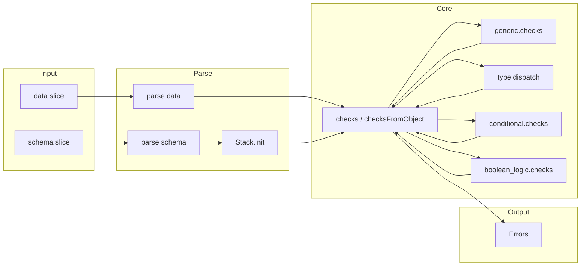
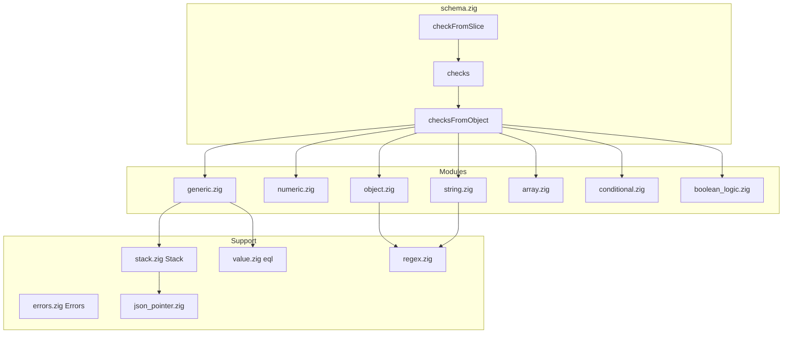

# json-schema-validator (pascalPost) — Research report

## Metadata

- **Library name**: json-schema-validator
- **Repo URL**: https://github.com/pascalPost/json-schema-validator
- **Clone path**: `research/repos/zig/pascalPost-json-schema-validator/`
- **Language**: Zig
- **License**: MIT (see [LICENSE](research/repos/zig/pascalPost-json-schema-validator/LICENSE))

## Summary

json-schema-validator is a JSON Schema **validator** for Zig. It follows the [Two-Argument Validation](https://json-schema.org/implementers/interfaces#two-argument-validation) interface: given a schema and a JSON instance, it reports whether the instance is valid and can collect a list of validation errors. It does not generate code from schemas. The library supports Draft 07 only. Validation is implemented by parsing schema and instance, then dispatching to modular checks (generic, numeric, object, string, array, conditional, boolean logic). Reference resolution uses a stack that holds the root schema and resolves `$ref` via JSON Pointer; the README notes that definitions and ref test files are not yet passing. Pattern matching uses a C++ regex implementation, requiring linkage against the C++ standard library.

## JSON Schema support

- **Drafts**: Draft 07 only. Stated in [README.md](research/repos/zig/pascalPost-json-schema-validator/README.md) and exercised by [src/test_suite.zig](research/repos/zig/pascalPost-json-schema-validator/src/test_suite.zig) (draft7 test files).
- **Scope**: Validation only. No code generation.
- **Subset**: Core applicator and validation keywords are implemented. README checklist marks as not done: definitions.json, ref.json, refRemote.json, infinite-loop-detection.json. `$ref` is implemented in code (generic.zig, stack.value) for in-document JSON Pointer resolution, but the official ref/definitions test suite is not yet enabled. Format keyword is not implemented (no format validation in source). Meta-data keywords ($comment, title, description, default, examples, readOnly, writeOnly) are not validated. contentEncoding and contentMediaType are not implemented.

## Keyword support table

Keyword list derived from vendored draft-07 meta-schema ([specs/json-schema.org/draft-07/schema.json](specs/json-schema.org/draft-07/schema.json)). Implementation evidence from src/generic.zig, src/numeric.zig, src/object.zig, src/string.zig, src/array.zig, src/conditional.zig, src/boolean_logic.zig, src/schema.zig, and [README.md](research/repos/zig/pascalPost-json-schema-validator/README.md).

| Keyword | Implemented | Notes |
|---------|-------------|-------|
| $comment | no | Accepted in schema; not validated. |
| $id | no | Not used for resolution in code. |
| $ref | partial | generic.zig: resolves via stack.value(ref_path) (JSON Pointer from root). README lists ref.json as not done; definitions scope not wired. |
| $schema | no | Not used for draft selection. |
| additionalItems | yes | array.zig: applies schema to items beyond tuple length when items is array. |
| additionalProperties | yes | object.zig: boolean or schema; rejects or validates extra properties. |
| allOf | yes | boolean_logic.zig: all subschemas must pass. |
| anyOf | yes | boolean_logic.zig: at least one subschema must pass. |
| const | yes | generic.zig: value equality via value.zig eql. |
| contains | yes | array.zig: at least one array element must match schema. |
| contentEncoding | no | Not implemented. |
| contentMediaType | no | Not implemented. |
| default | no | Meta-data; not validated or applied. |
| definitions | no | Not loaded or used; README lists definitions.json as not done. |
| dependencies | yes | object.zig: property presence implies required keys or schema validation. |
| description | no | Meta-data; not validated. |
| else | yes | conditional.zig: applied when "if" fails. |
| enum | yes | generic.zig: instance must match one of array values (eql); no schema-side uniqueness check. |
| examples | no | Not implemented. |
| exclusiveMaximum | yes | numeric.zig: value must be &lt; exclusiveMaximum. |
| exclusiveMinimum | yes | numeric.zig: value must be &gt; exclusiveMinimum. |
| format | no | No format keyword handling in source; format.json in test suite but format not validated. |
| if | yes | conditional.zig: when present, then/else applied by condition. |
| items | yes | array.zig: single schema or array of schemas (tuple). |
| maximum | yes | numeric.zig. |
| maxItems | yes | array.zig. |
| maxLength | yes | string.zig: UTF-8 codepoint count. |
| maxProperties | yes | object.zig. |
| minimum | yes | numeric.zig. |
| minItems | yes | array.zig. |
| minLength | yes | string.zig: UTF-8 codepoint count. |
| minProperties | yes | object.zig. |
| multipleOf | yes | numeric.zig. |
| not | yes | boolean_logic.zig: instance must not validate against schema. |
| oneOf | yes | boolean_logic.zig: exactly one subschema must pass. |
| pattern | yes | string.zig: Regex (C++ backend). |
| patternProperties | yes | object.zig: regex match on property names, schema on values. |
| properties | yes | object.zig: validates known properties. |
| propertyNames | yes | object.zig: schema applied to each property name (as string). |
| readOnly | no | Not implemented. |
| required | yes | object.zig: listed keys must be present. |
| then | yes | conditional.zig: applied when "if" passes. |
| title | no | Meta-data; not validated. |
| type | yes | generic.zig: string or array of types; integer matches number with zero fractional part. |
| uniqueItems | yes | array.zig: pairwise eql check. |
| writeOnly | no | Not implemented. |

## Constraints

All implemented validation keywords are enforced at runtime when validating an instance. There is no code generation; constraints (minLength, minimum, pattern, multipleOf, etc.) are applied during validation. Type checks include integer (including float with zero fractional part), number, string, array, object, boolean, null. String length uses UTF-8 codepoint count. Pattern is enforced via C++ regex.

## High-level architecture

Pipeline: **Schema** (JSON slice) and **Instance** (JSON slice) → **checkFromSlice(allocator, schema, data)** → parse both with std.json → **Stack.init(allocator, root_schema, capacity)** → **checks(schema_value, data_value, &stack, &errors)** → recursive dispatch by schema (boolean vs object) and by instance type (generic, numeric, string, object, array) and then conditional and boolean_logic → **Errors** (list of path + msg). No code emission; output is validity and an optional collection of errors.

## Medium-level architecture

- **Entry**: `checkFromSlice(allocator, schema: []const u8, data: []const u8) !Errors` in schema.zig parses schema and data, creates a Stack with root schema and capacity 100, initializes Errors, calls `checks(schema_value, data_value, &stack, &errors)` and returns errors. Lower-level `checks(schema, data, stack, collect_errors)` and `checksFromObject(schema_object, data, stack, collect_errors)` allow early-exit (collect_errors == null) or collect-all-errors mode.
- **Stack**: stack.zig holds root schema, path_buffer (segment names), and data (path_len or index). Used to build JSON Pointer-style paths for errors and to resolve **$ref**: `stack.value(abs_path)` (json_pointer.zig PathDecoderUnmanaged) resolves a path (e.g. "#/definitions/foo") against the root. So $ref is in-document only; no remote refs, no preloading of definitions from a separate structure.
- **Dispatch order in checksFromObject**: generic.checks first ($ref, type, enum, const), then type-specific: numeric (integer/float), string, object, array. Then conditional.checks (if/then/else), then boolean_logic.checks (allOf, anyOf, oneOf, not).
- **Modules**: generic.zig (type, enum, const, $ref), numeric.zig (maximum, minimum, exclusiveMaximum, exclusiveMinimum, multipleOf), string.zig (maxLength, minLength, pattern), object.zig (properties, additionalProperties, patternProperties, required, propertyNames, dependencies, minProperties, maxProperties), array.zig (items, additionalItems, minItems, maxItems, uniqueItems, contains), conditional.zig (if, then, else), boolean_logic.zig (allOf, anyOf, oneOf, not). Errors hold path + msg per error; path built via stack.constructPath (JSON Pointer style with # prefix).

## Low-level details

- **Regex**: Pattern and patternProperties use [src/regex.zig](research/repos/zig/pascalPost-json-schema-validator/src/regex.zig) backed by [src/regex.cpp](research/repos/zig/pascalPost-json-schema-validator/src/regex.cpp). build.zig links the static library with C++ (addCSourceFile regex.cpp, linkLibCpp).
- **Error shape**: Each error has `path` (JSON Pointer-style string with leading '#') and `msg` (string). Errors struct uses an arena and an ArrayListUnmanaged of Error; empty() reports no errors.
- **Integer vs number**: generic.zig checkType treats "integer" as matching .integer or .float with zero fractional part (numeric.floatToInteger).

## Output and integration

- **Vendored vs build-dir**: N/A. No generated output; library only validates.
- **API vs CLI**: Library only. Public API: `checkFromSlice(allocator, schema_slice, data_slice) !Errors`, and (for reuse) `checks` / `checksFromObject` with Stack and optional Errors. No CLI in the clone.
- **Writer model**: N/A. Validation result is in-memory (bool or Errors).

## Configuration

- Allocator must be provided by the caller (checkFromSlice, Stack.init, Errors.init). No configuration options for validation behavior (e.g. strict format) in the code. collect_errors: null means early exit on first failure; non-null collects all errors. Stack capacity (e.g. 100 in checkFromSlice) is fixed in schema.zig.

## Pros/cons

- **Pros**: Clear Two-Argument Validation interface; modular Zig layout; draft-07 test suite wired (with submodule); supports both early-exit and collect-all-errors; UTF-8-aware string length; JSON Pointer path in errors.
- **Cons**: Draft 07 only; C++ dependency for regex; definitions and ref test files not passing per README; no format validation; no remote $ref; no CLI.

## Testability

- **Unit tests**: In-tree tests in schema.zig (basic example, complex object), stack.zig (stack path and value resolution). [src/tests.zig](research/repos/zig/pascalPost-json-schema-validator/src/tests.zig) runs all tests via `_ = @import(...)` for schema, stack, regex, test_suite, json_pointer.
- **Test suite**: [src/test_suite.zig](research/repos/zig/pascalPost-json-schema-validator/src/test_suite.zig) runs JSON-Schema-Test-Suite draft-07 tests from path `JSON-Schema-Test-Suite/tests/draft7` (submodule [.gitmodules](research/repos/zig/pascalPost-json-schema-validator/.gitmodules)). For each listed JSON file, it parses cases and runs each test in two modes: early return (collect_errors = null) and collect all errors; runTest compares expected valid vs actual. ref.json is commented out in the file list.
- **How to run**: `zig build test`. CI ([.github/workflows/zig.yml](research/repos/zig/pascalPost-json-schema-validator/.github/workflows/zig.yml)) checks out with submodules and runs `zig build test`.

## Performance

- No dedicated benchmark suite in the clone. Entry point for benchmarking: `checkFromSlice(allocator, schema_slice, data_slice)` (and optionally repeated with the same parsed schema if adding a lower-level API that accepts parsed values). Regex is a likely cost for pattern and patternProperties.

## Determinism and idempotency

- **Validation result**: For the same schema and instance, validation outcome (valid/invalid and the set of errors) is deterministic. Error order follows the order of keyword application and recursion (generic, type dispatch, conditional, boolean_logic).
- **Idempotency**: N/A (no generated output). Repeated validation with the same inputs yields the same result.

## Enum handling

- **Implementation**: generic.zig: enum value must be an array; instance is compared to each element using value.zig eql. No deduplication or uniqueness check on the schema enum array (comment in code: "we do not check if items.len > 0 and that elements are unique").
- **Duplicate entries**: Duplicate values in the enum array are allowed; validation passes if instance matches any element; duplicates do not change behavior.
- **Namespace/case collisions**: Comparison is by value (eql); distinct values such as "a" and "A" are both allowed; no name mangling (validation only).

## Reverse generation (Schema from types)

No. The library only validates instances against JSON Schema. There is no facility to generate JSON Schema from Zig types.

## Multi-language output

N/A. The library does not generate code; it only validates. Output is validation result and errors in Zig (Errors struct).

## Model deduplication and $ref/$defs

N/A for code generation. For validation: **$ref** is resolved in generic.zig via stack.value(ref_path), where ref_path is the value of the $ref keyword (e.g. "#/definitions/foo"). The Stack holds the root schema; value() uses JSON Pointer semantics (path decoder in json_pointer.zig) to resolve against the root. **definitions** (draft-07) are not explicitly loaded or indexed; resolution works only if the ref path exists in the root document (e.g. #/definitions/MyType). README states definitions.json and ref.json are not done, so the test suite coverage for ref/definitions is incomplete (e.g. scope or $id-relative refs may be missing). No remote refs; no $dynamicRef/$dynamicAnchor (draft-07 does not define them).

## Validation (schema + JSON → errors)

Yes. This is the library’s primary function.

- **Inputs**: Schema and instance as JSON slices ([]const u8), or at lower level parsed std.json.Value with Stack and optional Errors.
- **API**: `checkFromSlice(allocator, schema, data) !Errors` returns an Errors instance; `errors.empty()` is true when valid. With `checks(..., collect_errors = null)` the result is a boolean (early exit). With `checks(..., collect_errors = &errors)` all errors are collected.
- **Output**: Errors contains zero or more entries; each has `path` (JSON Pointer-style with '#') and `msg` (string). Caller must call errors.deinit().
- **CLI**: None in the repo.
