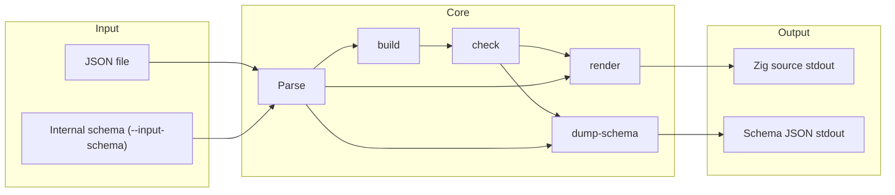
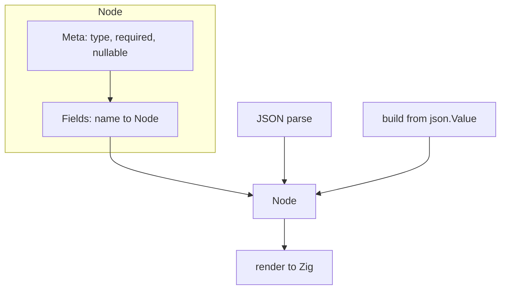

# json-schema-gen — Research report

## Metadata

- **Library name**: json-schema-gen
- **Repo URL**: https://github.com/travisstaloch/json-schema-gen
- **Clone path**: `research/repos/zig/travisstaloch-json-schema-gen/`
- **Language**: Zig
- **License**: MIT (see LICENSE, Copyright (c) 2024 travisstaloch)

## Summary

json-schema-gen is a Zig tool that takes sample JSON as input and emits Zig code defining types that can parse that JSON via `std.json.parseFromTokenSource`. The primary flow is JSON sample → inferred internal schema → generated Zig (structs, unions, optionals, arrays). It does not accept standard JSON Schema (draft-04, 2019-09, 2020-12) as input. Optionally, it can round-trip its own internal schema format: `--dump-schema` writes the inferred schema as JSON, and `--input-schema` reads that format back and skips the build phase. Motivation (per README): using concrete generated types is typically faster and uses less memory than parsing into `std.json.Value`, and gives cleaner access (e.g. `parsed.value.items[0].commits_url` instead of chained `.object.get`/`.array.items`). Output is Zig only; there is no validation (schema + JSON → errors).

## JSON Schema support

The library does **not** target any JSON Schema draft. It does not read or validate standard JSON Schema documents. Input is either (1) arbitrary JSON, from which it infers an internal schema (a tree of nodes with type, required, nullable, and child fields), or (2) its own dumped schema format (the serialized internal `Node` structure with `__meta__`, `type`, `required`, `nullable`, and `__fields__`). The README phrase "Generate a zig schema from a json schema" refers to this internal format (dump from JSON then re-feed with `--input-schema`), not to draft-04/2019-09/2020-12.

## Keyword support table

Keyword list derived from vendored draft 2020-12 meta-schemas (`specs/json-schema.org/draft/2020-12/meta/`). The library does not parse standard JSON Schema; implementation status reflects that. The internal format only has concepts that loosely map to type, required, and nullable (inferred from sample JSON or from the dumped schema).

| Keyword | Implemented | Notes |
|---------|-------------|-------|
| $anchor | no | Not applicable; no standard schema input. |
| $comment | no | Not applicable. |
| $defs | no | Not applicable. |
| $dynamicAnchor | no | Not applicable. |
| $dynamicRef | no | Not applicable. |
| $id | no | Not applicable. |
| $ref | no | Not applicable. |
| $schema | no | Not applicable. |
| $vocabulary | no | Not applicable. |
| additionalProperties | no | Not applicable. |
| allOf | no | Not applicable. |
| anyOf | no | Not applicable. |
| const | no | Not applicable. |
| contains | no | Not applicable. |
| contentEncoding | no | Not applicable. |
| contentMediaType | no | Not applicable. |
| contentSchema | no | Not applicable. |
| default | no | Not applicable. |
| dependentRequired | no | Not applicable. |
| dependentSchemas | no | Not applicable. |
| deprecated | no | Not applicable. |
| description | no | Not applicable. |
| else | no | Not applicable. |
| enum | no | Not applicable; mixed inferred types become std.json.Value. |
| examples | no | Not applicable. |
| exclusiveMaximum | no | Not applicable. |
| exclusiveMinimum | no | Not applicable. |
| format | no | Not applicable. |
| if | no | Not applicable. |
| items | no | Not applicable; array element shape inferred and merged in build(). |
| maxContains | no | Not applicable. |
| maximum | no | Not applicable. |
| maxItems | no | Not applicable. |
| maxLength | no | Not applicable. |
| maxProperties | no | Not applicable. |
| minContains | no | Not applicable. |
| minimum | no | Not applicable. |
| minItems | no | Not applicable. |
| minLength | no | Not applicable. |
| minProperties | no | Not applicable. |
| multipleOf | no | Not applicable. |
| not | no | Not applicable. |
| oneOf | no | Not applicable. |
| pattern | no | Not applicable. |
| patternProperties | no | Not applicable. |
| prefixItems | no | Not applicable. |
| properties | no | Not applicable; object keys inferred from sample JSON. |
| propertyNames | no | Not applicable. |
| readOnly | no | Not applicable. |
| required | partial | Concept only: internal Meta.required (field present in all samples) maps to optional vs required in Zig; not JSON Schema keyword. |
| then | no | Not applicable. |
| title | no | Not applicable. |
| type | partial | Concept only: internal Meta.type (set of JSON value tags) drives Zig type; not JSON Schema type keyword. |
| unevaluatedItems | no | Not applicable. |
| unevaluatedProperties | no | Not applicable. |
| uniqueItems | no | Not applicable. |
| writeOnly | no | Not applicable. |

## Constraints

Generated Zig code does not enforce any validation keywords. The tool generates types for **parsing** only; there is no runtime validation of minLength, minimum, pattern, etc. Constraints are not reflected in the generated code.

## High-level architecture

Pipeline: **JSON file** (or internal schema with `--input-schema`) → **parse** (as `std.json.Value` or as `Node`) → **build** (only when not `--input-schema`: traverse JSON, merge types and fields into a `Node` tree) → **check** (only when not `--input-schema`: set `required` to false for fields not present in every object, normalize null into nullable) → **render** (walk `Node`, emit Zig source to writer) or **dump-schema** (print Node as JSON). Output is written to stdout (or captured by the build system). The build system can run the generator, capture stdout as a Zig module, and pass that module to a consumer (e.g. parse-json-with-gen-schema or tests).

## Medium-level architecture

- **Entry**: `main()` in `json-to-zig-schema.zig` parses CLI args (path, `--debug-json`, `--dump-schema`, `--input-schema`, `--include-test`), opens the file, and calls `parseBuildRender(alloc, reader, writer, opts)`.
- **parseBuildRender**: If `opts.input_schema`, parses token source as `Node` (internal schema), then either dumps that node or calls `node.render(writer, opts)`. Otherwise, parses as `json.Value`, builds a fresh `Node` via `node.build(alloc, value)`, runs `node.check(value)`, then dump or render.
- **Node**: Tree of nodes; each has `meta: Meta` (type set, required, nullable) and `fields: Fields` (StringArrayHashMapUnmanaged of name → Node). Reserved keys `__meta__` and `__fields__` cannot be used as JSON object keys. Array elements are merged into the same Node (build visits each element and merges).
- **Meta**: `type` is an EnumSet of `std.json.Value` tags (object, array, string, integer, float, bool, null); `required` and `nullable` are booleans.
- **Ref resolution**: None. There is no `$ref` or `$defs`; the internal format is a single tree.

## Low-level details

- **Union vs struct**: When `max_field_count == 1` and `node.fields.count() > 1`, the renderer emits `union(enum)` (one variant per field); otherwise it emits `struct` (one field per key). This handles arrays of objects with disjoint key sets (e.g. `[{"a":1},{"b":"c"}]`).
- **Nullable/optional**: If a node has exactly two types including null, `check()` sets `nullable = true` and removes null from the type set. In render, `nullable` or `!required` yields optional (`?`) or `= null` for struct fields.
- **Mixed types**: When type set has more than two possibilities (or two that are not null + other), render emits `std.json.Value` (see renderImpl branch "TODO avoid using std.json.Value for more types when possible").
- **Reserved names**: Object keys `__meta__` and `__fields__` conflict with internal schema and cause `error.NameConflict` during build.

## Output and integration

- **Vendored vs build-dir**: Generated Zig is not checked in. The build system runs the generator and captures stdout (e.g. into `.zig-cache`); that path is used as a module. User can redirect stdout to a file (e.g. `zig build json -- examples/1.json > /my/project/src/json-schema.zig`).
- **API vs CLI**: CLI only. Entry points: `zig build gen` (run json-to-zig-schema with args; stdout is generated Zig), `zig build json -- <path> [options]` (generate from JSON then run parse-json-with-gen-schema to verify). The generator is also exposed as a library for the WASM build: `parseBuildRender` in `json-to-zig-schema.zig` is called from `wasm.zig` with a buffer and options.
- **Writer model**: Generic writer: `parseBuildRender(alloc, reader, writer, opts)` writes to any writer (e.g. stdout, ArrayList(u8) for WASM).

## Configuration

- **Options** (all CLI flags): `--debug-json` (add a jsonParse helper that prints field names), `--dump-schema` (emit internal schema JSON instead of Zig), `--input-schema` (treat input as internal schema and skip build), `--include-test` (add a test skeleton with placeholders in the generated Zig).
- No config for naming convention, map types, or optional dependencies; output uses fixed Zig types (e.g. `[]const u8`, `i64`, `f64`, `bool`, `std.json.Value`).

## Pros/cons

- **Pros**: Simple pipeline (JSON → Zig); no external schema format to maintain; generated code works with `std.json`; optional round-trip of internal schema; CLI and WASM entry points; tests cover multiple example shapes including unions and optionals.
- **Cons**: Does not accept standard JSON Schema; schema is inferred from sample data only (so optional/required and types depend on what appears in the sample); mixed types fall back to `std.json.Value`; no validation of JSON against a schema; reserved keys `__meta__`/`__fields__` limit use of those names in JSON.

## Testability

Tests live in `src/tests.zig`. Run with `zig build test` (with no extra args; build system passes paths and generated modules via build-options). For each `examples/*.json` (1–8), the build runs the generator, captures the generated Zig as a module (`gen_1` … `gen_8`), and the test parses the corresponding example JSON with that module and checks round-trip stringify matches the expected format. Additional tests assert exact generated Zig for examples 6, 7, 8 (unions, optional instead of union with null, optional root). New examples require adding entries to `example_mods`, `example_fmts`, and (for path/schema_path) the build step that iterates `examples/`. No separate unit tests for the generator in isolation; coverage is integration (generate + parse + stringify).

## Performance

No built-in benchmarks in the repo. Entry points useful for future benchmarking: CLI `zig build gen -- <json-path>` (or `zig-out/bin/json-to-zig-schema <json-path>`) for generation; `zig build json -- <json-path>` for generate-then-parse. WASM export `parseBuildRender` could be benchmarked from the web (see README link to travisstaloch.github.io).

## Determinism and idempotency

Output order of object fields follows iteration over `Fields` (StringArrayHashMapUnmanaged), which preserves insertion order. Keys are inserted during build in the order encountered when traversing the JSON (object key order from the parser). So repeated runs on the same input should produce the same Zig; reordering keys in the input could change field order in the output. No explicit sorting (e.g. alphabetical) is applied. Idempotency: same input → same output for a given Zig version; small input changes (e.g. one extra optional field) cause localized diff in generated code.

## Enum handling

The library does not implement JSON Schema `enum`. It infers types from sample JSON; if a value could be multiple JSON types, the internal type set has multiple tags and may end up as `std.json.Value` or a union. Duplicate enum values or case collisions are not a separate concept—everything is structure inference. Unknown for explicit enum keyword behavior (not applicable).

## Reverse generation (Schema from types)

No. The library does not generate JSON Schema from Zig types. It can dump its internal schema (with `--dump-schema`) which is a custom format, not standard JSON Schema.

## Multi-language output

Zig only. Generated code is Zig (structs, unions, optionals, arrays, `std.json.Value`). No option to emit TypeScript, Go, or other languages.

## Model deduplication and $ref/$defs

There is no `$ref` or `$defs`; the tool does not read standard JSON Schema. Deduplication is structural: in `build()`, array elements are merged into a single Node (all elements contribute to the same type set and same field map). So identical object shapes in multiple array elements become one structural type. Inline object shapes in different branches (e.g. two different object types in the same array) are merged by key: same key names share one child Node; different keys create union or struct depending on `max_field_count`. No named definitions or reuse by reference.

## Validation (schema + JSON → errors)

No. The library only generates Zig types for parsing. It does not provide an API or CLI to validate a JSON payload against a schema and report validation errors. Input is either sample JSON (to infer schema and emit code) or the internal schema format (to emit code). There is no separate validation step.
